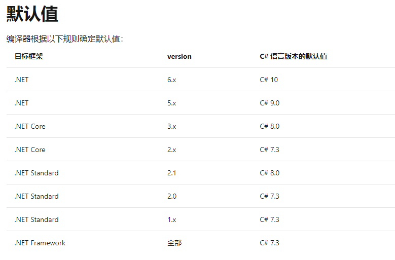
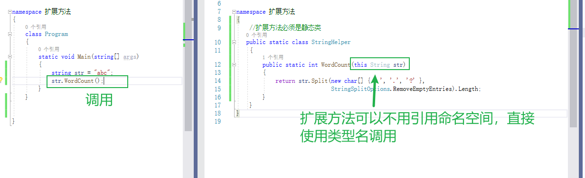

# C#最新语法

## c#语法与NET版本关系

  版本大于NET 5 >，可以使用 C# 9。

 版本大于NET 6 >，可以使用 C# 10。



## C# 发展历史

[C# 发展历史](https://docs.microsoft.com/zh-cn/dotnet/csharp/whats-new/csharp-version-history)

## **C#6语法** 

### 1.只读自动属性 ：只读属性的两种赋值方法

只读属性的两种赋值方法：1.在声明时对属性赋值 2.在构造函数为属性赋值

```
public class Student
{
  //【知识点4】对只读属性可以通过构造函数对其初始化值
    public Student(string firstName, string lastName)
    {
        FirstName = firstName;
        LastName = lastName;
    }
     
    public string FirstName { get; }
    public string LastName { get; }
    //【知识点3】方法内部也可以使用lamda表达式进行声明
    public override string ToString()=> $"{FirstName}-{LastName}";
    //【知识点2】使用lamda表达式给属性赋值
    public string FullName => $"{FirstName}-{LastName}";  //goes to
    
    //【知识点1】自动属性初始化表达式：可以在声明时对它赋值
   public ICollection<double> Grades { get; } = new List<double>();
```

   Main方法中进行引用

```
             
                Student student = new Student("Richard", "Richard01");
                string fullName = student.ToString();
                string fullName1 = student.FullName;
```


### 2.using static ：简化静态方法的引用

在代码顶部引用静态命名空间，可以不通过类名引用方法（感觉这种方式降低了代码的可读性，不提倡使用）

```
namespace SharpGrammarInfo.SharpSixInfoTest
{
    public class StaticClass
    {
        //静态方法
        public static void Next()
        {
            Console.WriteLine("Next");
        }
     }
}
```

引用静态命名空间的方式调用Next方法

```
//引用静态命名空间类
using static SharpGrammarInfo.SharpSixInfoTest.StaticClass;
 
     //引用前调用方式（旧的调用方式）
      StaticClass.Next();
      //现在允许的调用方式
      Next();
      
```

引用后通过类名.方法名调用，与直接调用方法名称，这两种调用方式都是支持的

### 3.Null 条件运算符 :?与??

```
            Student student = null;
            //如果student为null  未将对象引用至对象的实例
            Console.WriteLine(student.FirstName);
            //旧的判断方式
            if (student!=null)
            {
               string fullName = student.FullName;
            }
   //【知识点】通过?判断，如果student等于空，直接返回Null,student不为空，那么返回FullName
            string fullName = student?.FullName; //得到的结果一定是要支持null
   //【知识点2】通过？？判断，如果TestName等于空那么返回“朝夕教育”，否则返回TestName
       string testName = student?.TestName ?? "朝夕教育";
```

### 3.字符串内插 ：$与Format

```
            string firstName = "朝夕";
            string lastName = "教育";
            var strs = $"{{{firstName}}}-{lastName}-{firstName}-{firstName};{firstName}";
```

### 4.异常筛选器 :cath when

```c#
        try
        {
            throw new Exception("朝夕教育");
        }
        //【知识点】把异常的消息过滤，符合我的条件我才处理，不然我不会进入catch中进行throw抛给上级
        catch (Exception ex) when (ex.Message.Contains("朝夕教育"))  
        {

            throw;
        } 
```

### 5.nameof 表达式 ：获取类型名称

```
            //【知识点】通过nameof获取类型的字符串小写名称
            string className = nameof(StaticClass);
            Console.WriteLine(className);
```

### 6.使用索引器初始化关联集合

```c#
            //声明方法1
            Dictionary<int, string> messages = new Dictionary<int, string>
            {
                { 404, "Page not Found"},
                { 302, "Page moved, but left a forwarding address."},
                { 500, "The web server can't come out to play today."}
            };
            //声明方法2
            Dictionary<int, string> webErrors = new Dictionary<int, string>
                {
                    [404] = "Page not Found",
                    [302] = "Page moved, but left a forwarding address.",
                    [500] = "The web server can't come out to play today."
                };
```

## **C#7语法** 

### 1.out 变量 

```c#
            //【知识点】直接使用out int result,不需要提前声明int result;
            string input = Console.ReadLine();
            int.TryParse(input, out int result);
            Console.WriteLine(result);
```

### 2.元组 ：临时使用对象

```c#
           //【知识点1】声明临时的对象元组1
            (string Alpha, string Beta) namedLetters = ("a", "b");
            namedLetters.Alpha = "aa";
            namedLetters.Beta = "bb";
            Console.WriteLine($"{namedLetters.Alpha}, {namedLetters.Beta}");
          //【知识点2】声明临时的对象元组2
            var alphabetStart = (Alpha: "a", Beta: "b");
            alphabetStart.Beta = "B+B";
            alphabetStart.Alpha = "A+A";
            Console.WriteLine($"{alphabetStart.Alpha}, {alphabetStart.Beta}");
          //【知识点3】使用元组对象接收返回值为元组的方法
             (int max, int min) = Range();
             Console.WriteLine(max);
             Console.WriteLine(min);
            private static (int max, int min) Range()
            {
                return (123, 234);
            }
          //【知识点4】使用元组对象给构造函数赋值
            var p = new Point(12, 13);
            Console.WriteLine(p.X);
            Console.WriteLine(p.Y);
           //类的构造函数
            public Point(double x, double y)
                => (X, Y) = (x, y);
  
          //【知识点4】使用元组对象入参，给方法赋值
              p.Deconstruct(out double xx, out double yy);
                Console.WriteLine(xx);
                Console.WriteLine(yy);
           //使用元组对象给本地参数x,y赋值
           public void Deconstruct(out double x, out double y) =>
            (x, y) = (X, Y);

```

### 3.弃元 ：用_忽略不需要的方法入参

```
      //【知识点2】调用时，使用_代表我不需要这个参数的返回值，可以节省资源
     var (_, _, _, pop1, _, pop2) = QueryCityDataForYears("New York City", 1960, 2010);
      //【知识点3】也可以接收全部的元组对象        
    (string, double, int, int, int, int) result = QueryCityDataForYears("New York City", 1960, 2010);
   //方法返回一个元组对象
   private static (string, double, int, int, int, int) QueryCityDataForYears(string name, int year1, int year2)
    {
        int population1 = 0, population2 = 0;
        double area = 0;

        if (name == "New York City")
        {
            area = 468.48;
            if (year1 == 1960)
            {
                population1 = 7781984;
            }
            if (year2 == 2010)
            {
                population2 = 8175133;
            }
            return (name, area, year1, population1, year2, population2);
        }
        
        //这里的return是为了不异常
        return ("", 0, 0, 0, 0, 0);
    }
```

### 4.模式匹配 ：is,switch判断对象类型

```c#
           //【知识点2】模式匹配1
           int input = 123;
            int sum = 234;
            //判断input是不是int类型，如果是那么把input的值赋值给count
            if (input is int count)
                sum += count;
          //【知识点1】模式匹配2，这个IEnumerable<object>数组与模式匹配知识点无关
          IEnumerable<object> enumerablelist = new List<object>()
                {
                    0,
                    new List<int>(){ 0,1,2,3,4,5,6 },
                    100,
                    null
                };
       int iResult = SumPositiveNumbers(enumerablelist);
       //【知识点3】模式匹配1,这个是C#8.0语法，Net Standard 2.0 用不了（相对于Net Core 2.0）

    int publishStatus = 6;
    int publishStatus = 0;
    string PublishMsg = publishStatus switch { 0 => "草稿状态", 2 => "全部推送成功", 3 => "全部推送成功", 4 => "全部推送成功",  _ => "未知状态" };
      Console.WriteLine(PublishMsg);  //6 未知状态 0 草稿状态

        /// <summary>
        /// 模式switch
        /// </summary>
        /// <param name="sequence"></param>
        /// <returns></returns>
        public static int SumPositiveNumbers(IEnumerable<object> sequence)
        {
            int sum = 0;
            foreach (var i in sequence)
            {
               //【知识点1】通过switch判断对象的类型，而且支持判断null
                switch (i)
                {
                    case 0:
                        break;
                    case IEnumerable<int> childSequence:
                        {
                            foreach (var item in childSequence)
                                sum += (item > 0) ? item : 0;
                            break;
                        }
                    case int n when n > 0:
                        sum += n;
                        break;
                      // 【知识点1】支持判断null
                    case null:
                        throw new NullReferenceException("Null found in sequence");
                    default:
                        throw new InvalidOperationException("Unrecognized type");
                }
            }
            return sum;
        }
```

### 5.ref 局部变量和返回结果


### 6.本地函数 ：方法中声明方法

```
    public static string LocalFunction(string name)
    {
       //【知识点】调动方法中声明的方法
        return ZhxiToString(name);

        string ZhxiToString(string name)
        {
            return name;
        }
    }
```

### 7.更多的 expression-bodied 成员 

### 8.throw 表达式 

### 9.通用的异步返回类型 

```c#
            ValueTask<int> task = Func();
            //通过await循环遍历task的参数
            await foreach (var item in task)
            {

            }
           //声明一个async的方法
           public static async ValueTask<int> Func()
            {
                await Task.Delay(100);
                return 5;
            }
```

### 10.数字文本语法改进："_ "分隔符

```c#
   //数字分隔符_可以在int,long, decimal、float 和 double 类型中使用
        //整数类型
        long BillionsAndBillions = 100_000_000_000;
        Console.WriteLine(BillionsAndBillions);
        //double类型
        double AvogadroConstant = 6.022_140_857_747_474e23;
        Console.WriteLine(AvogadroConstant);
```

### 11.增强的泛型约束：枚举Enum,非引用类型unmanaged

```
        //【知识点1】枚举做基类约束
        GerenicInfo<EnumInfo> info = new GerenicInfo<EnumInfo>();
        info.Show(EnumInfo.ONE);
        
        //声明类，注意T:Enum
        public class GerenicInfo<T> where T : Enum
        {
            public void Show(T t)
            {

            }
        }
        //约束不能为空，unmanaged约束代表T的类型不能为NULL ，如果这里放string就会异常
        GerenicInfoUnmanaged<int> gerenicInfoUnmanaged = new GerenicInfoUnmanaged<int>();
        
       //【知识点2】声明类，注意T:unmanaged
        public class GerenicInfoUnmanaged<T> where T : unmanaged
        {
            public void Show(T t)
            {

            }
        }
```

### 12.命名实参

```c#
     //【知识点1】通过使用默认位置参数用正常的方式调用。
    PrintOrderDetails("Gift Shop", 31, "Red Mug");

     //【知识点2】通过提供方法的参数名称，不按照默认的位置参数进行调用
    PrintOrderDetails(orderNum: 31, productName: "Red Mug", sellerName: "Gift Shop");
    PrintOrderDetails(productName: "Red Mug", sellerName: "Gift Shop", orderNum: 31);
   
   //声明一个方法
   public static void PrintOrderDetails(string sellerName, int orderNum, string productName)
    {
        if (string.IsNullOrWhiteSpace(sellerName))
        {
            throw new ArgumentException(message: "Seller name cannot be null or empty.", paramName: nameof(sellerName));
        }

        Console.WriteLine($"Seller: {sellerName}, Order #: {orderNum}, Product: {productName}");
    }
```

## **C#8语法** 

- [Readonly 成员](https://docs.microsoft.com/zh-cn/dotnet/csharp/whats-new/csharp-8#readonly-members)
- [默认接口方法](https://docs.microsoft.com/zh-cn/dotnet/csharp/whats-new/csharp-8#default-interface-methods)
- 模式匹配增强功能：
  - [Switch 表达式](https://docs.microsoft.com/zh-cn/dotnet/csharp/whats-new/csharp-8#switch-expressions)
  - [属性模式](https://docs.microsoft.com/zh-cn/dotnet/csharp/whats-new/csharp-8#property-patterns)
  - [元组模式](https://docs.microsoft.com/zh-cn/dotnet/csharp/whats-new/csharp-8#tuple-patterns)
  - [位置模式](https://docs.microsoft.com/zh-cn/dotnet/csharp/whats-new/csharp-8#positional-patterns)
- [Using 声明](https://docs.microsoft.com/zh-cn/dotnet/csharp/whats-new/csharp-8#using-declarations)
- [静态本地函数](https://docs.microsoft.com/zh-cn/dotnet/csharp/whats-new/csharp-8#static-local-functions)
- [可处置的 ref 结构](https://docs.microsoft.com/zh-cn/dotnet/csharp/whats-new/csharp-8#disposable-ref-structs)
- [可为空引用类型](https://docs.microsoft.com/zh-cn/dotnet/csharp/whats-new/csharp-8#nullable-reference-types)
- [异步流](https://docs.microsoft.com/zh-cn/dotnet/csharp/whats-new/csharp-8#asynchronous-streams)
- [异步可释放](https://docs.microsoft.com/zh-cn/dotnet/csharp/whats-new/csharp-8#asynchronous-disposable)
- [索引和范围](https://docs.microsoft.com/zh-cn/dotnet/csharp/whats-new/csharp-8#indices-and-ranges)
- [Null 合并赋值](https://docs.microsoft.com/zh-cn/dotnet/csharp/whats-new/csharp-8#null-coalescing-assignment)
- [非托管构造类型](https://docs.microsoft.com/zh-cn/dotnet/csharp/whats-new/csharp-8#unmanaged-constructed-types)
- [嵌套表达式中的 Stackalloc](https://docs.microsoft.com/zh-cn/dotnet/csharp/whats-new/csharp-8#stackalloc-in-nested-expressions)
- [内插逐字字符串的增强功能](https://docs.microsoft.com/zh-cn/dotnet/csharp/whats-new/csharp-8#enhancement-of-interpolated-verbatim-strings)

“.NET Core 3.x”和“.NET Standard 2.1”支持 C# 8.0 。 有关详细信息，请参阅 [C# 语言版本控制](https://docs.microsoft.com/zh-cn/dotnet/csharp/language-reference/configure-language-version)。

## **C#9语法** 

- [记录](https://docs.microsoft.com/zh-cn/dotnet/csharp/whats-new/csharp-9#record-types)
- [仅限 Init 的资源库](https://docs.microsoft.com/zh-cn/dotnet/csharp/whats-new/csharp-9#init-only-setters)
- [顶级语句](https://docs.microsoft.com/zh-cn/dotnet/csharp/whats-new/csharp-9#top-level-statements)
- [模式匹配增强功能](https://docs.microsoft.com/zh-cn/dotnet/csharp/whats-new/csharp-9#pattern-matching-enhancements)
- 性能和互操作性
  - [本机大小的整数](https://docs.microsoft.com/zh-cn/dotnet/csharp/language-reference/proposals/csharp-9.0/native-integers)
  - [函数指针](https://docs.microsoft.com/zh-cn/dotnet/csharp/language-reference/proposals/csharp-9.0/function-pointers)
  - [禁止发出 localsinit 标志](https://docs.microsoft.com/zh-cn/dotnet/csharp/language-reference/proposals/csharp-9.0/skip-localsinit)
- 调整和完成功能
  - [目标类型的 `new` 表达式](https://docs.microsoft.com/zh-cn/dotnet/csharp/language-reference/proposals/csharp-9.0/target-typed-new)
  - [`static` 匿名函数](https://docs.microsoft.com/zh-cn/dotnet/csharp/language-reference/proposals/csharp-9.0/static-anonymous-functions)
  - [目标类型的条件表达式](https://docs.microsoft.com/zh-cn/dotnet/csharp/language-reference/proposals/csharp-9.0/target-typed-conditional-expression)
  - [协变返回类型](https://docs.microsoft.com/zh-cn/dotnet/csharp/language-reference/proposals/csharp-9.0/covariant-returns)
  - [扩展 `GetEnumerator` 支持 `foreach` 循环](https://docs.microsoft.com/zh-cn/dotnet/csharp/language-reference/proposals/csharp-9.0/extension-getenumerator)
  - [Lambda 弃元参数](https://docs.microsoft.com/zh-cn/dotnet/csharp/language-reference/proposals/csharp-9.0/lambda-discard-parameters)
  - [本地函数的属性](https://docs.microsoft.com/zh-cn/dotnet/csharp/language-reference/proposals/csharp-9.0/local-function-attributes)
- 支持代码生成器
  - [模块初始值设定项](https://docs.microsoft.com/zh-cn/dotnet/csharp/language-reference/proposals/csharp-9.0/module-initializers)
  - [分部方法的新功能](https://docs.microsoft.com/zh-cn/dotnet/csharp/language-reference/proposals/csharp-9.0/extending-partial-methods)

.NET 5 支持 C# 9.0。 有关详细信息，请参阅 [C# 语言版本控制](https://docs.microsoft.com/zh-cn/dotnet/csharp/language-reference/configure-language-version)。

## C#10语法

- [记录结构](https://docs.microsoft.com/zh-cn/dotnet/csharp/whats-new/csharp-10#record-structs)
- [结构类型的改进](https://docs.microsoft.com/zh-cn/dotnet/csharp/whats-new/csharp-10#improvements-of-structure-types)
- [内插字符串处理程序](https://docs.microsoft.com/zh-cn/dotnet/csharp/whats-new/csharp-10#interpolated-string-handler)
- [`global using` 指令](https://docs.microsoft.com/zh-cn/dotnet/csharp/whats-new/csharp-10#global-using-directives)
- [文件范围的命名空间声明](https://docs.microsoft.com/zh-cn/dotnet/csharp/whats-new/csharp-10#file-scoped-namespace-declaration)
- [扩展属性模式](https://docs.microsoft.com/zh-cn/dotnet/csharp/whats-new/csharp-10#extended-property-patterns)
- [对 Lambda 表达式的改进](https://docs.microsoft.com/zh-cn/dotnet/csharp/whats-new/csharp-10#lambda-expression-improvements)
- [可使用 `const` 内插字符串](https://docs.microsoft.com/zh-cn/dotnet/csharp/whats-new/csharp-10#constant-interpolated-strings)
- [记录类型可密封 `ToString()`](https://docs.microsoft.com/zh-cn/dotnet/csharp/whats-new/csharp-10#record-types-can-seal-tostring)
- [改进型明确赋值](https://docs.microsoft.com/zh-cn/dotnet/csharp/whats-new/csharp-10#improved-definite-assignment)
- [在同一析构中可同时进行赋值和声明](https://docs.microsoft.com/zh-cn/dotnet/csharp/whats-new/csharp-10#assignment-and-declaration-in-same-deconstruction)
- [可在方法上使用 `AsyncMethodBuilder` 属性](https://docs.microsoft.com/zh-cn/dotnet/csharp/whats-new/csharp-10#allow-asyncmethodbuilder-attribute-on-methods)
- [CallerArgumentExpression 属性](https://docs.microsoft.com/zh-cn/dotnet/csharp/whats-new/csharp-10#callerargumentexpression-attribute-diagnostics)
- [增强的 `#line` pragma](https://docs.microsoft.com/zh-cn/dotnet/csharp/whats-new/csharp-10#enhanced-line-pragma)

.NET 6 支持 C# 10。 有关详细信息，请参阅 [C# 语言版本控制](https://docs.microsoft.com/zh-cn/dotnet/csharp/language-reference/configure-language-version)。

## C# 3.0 版

### 扩展方法



