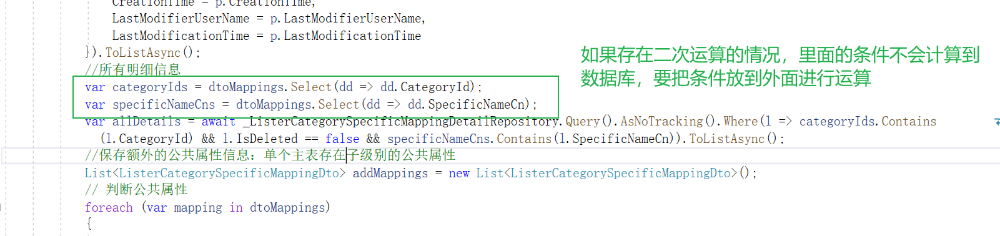

 

# Efcore

### EFCore中的运算逻辑



### EFCore中的左连接

[EFCore中的左连接](https://www.cnblogs.com/turingguo/p/9018062.html)

###  实践


### DbFirst

EF：用面向对象的思想来操作数据库

**DbFirst ：先有数据库再有实体，通过数据库的结构，生成实体**

1.NuGet先引用两个类库，

2.建立数据库表

3.通过命令行映射数据库自动生成DbContext

4.DbContext 获取数据库请求的对象

### Code First

**CodeFirst：先有实体代码，再有数据库，通过实体代码进行生成数据库**

1.新建实体类代码

2.新建DbContext类,完善好DbContext的增删改查内容

3.NuGet引用EfCode 引用

4.通过代码生成数据库与表结构

### 数据迁移Migration

1.可以通过EfCore常用的API来完成代码的迁移

2.Nuget引用EfCore迁移类库

3.工具→Nuget包管理-Nuget管理工具包命令行→输入命令进行执行

4.新增了字段，或者减少了字段，通过Nuget管理工具包命令行进行自动生成迁移类库文件，可以再通过命令行执行后动态更新到数据库，也可以当做执行记录的一个备份，可以通过命令执行历时迁移文件进行回滚到历史数据库结构。

5.也可以在cmd窗口使用dotnet命令，cd到项目根目录，使用dotnet命令做到Nuget管理工具包命令行的功能。


### EFCore执行的语句跟踪

#### 通过Logging组件跟踪

1.Nuget中引用Efcore日志跟踪组件Logging：

```
Microsoft.Extensions.Logging.Console
```

2.在Dbcontext中新增代码：

```
protected override void OnConfiguring(DbContextOptionsBuilder optionsBuilder) 

​       {  

​           ///通过日志输出Sql语句 
    optionsBuilder.UseLoggerFactory(LoggerFactory.Create(builder => 

​           { 

​               builder.AddConsole(); 

​           })); 

​       } 

 
```


#### sql server profilter跟踪

通过sql server profilter跟踪，这个我很熟

### EFCore LinqQuery

以下是常用的EFCore与Linq语句

```c#
        
        using (ZhaoxiDbContext dbContext = new ZhaoxiDbContext())
        {
            {
                var idlist = new int[] { 1, 2, 3, 5, 7, 8, 9, 10, 11, 12, 14, 17 };//in查询 
                //通过条件进行查询,Where的入参是一个表达式树
                var list = dbContext.SysUsers.Where(u => idlist.Contains(u.Id));//in查询 
                foreach (var user in list)
                {
                    Console.WriteLine(user.Name);
                }
            }
            {
                //Linq的写法与上面的功能没有任何差别，只有写法上的不同
                var list = from u in dbContext.SysUsers
                           where new int[] { 1, 2, 3, 5, 7, 8, 9, 10, 11, 12, 14 }.Contains(u.Id)
                           select u;

                foreach (var user in list)
                {
                    Console.WriteLine(user.Name);
                }
            }
            {
                var list = dbContext.SysUsers.Where(u => new int[] { 1, 2, 3, 5, 7, 8, 9, 10, 11, 12, 14, 18, 19, 20, 21, 22, 23 }.Contains(u.Id))
                                          .OrderBy(u => u.Id)
                                          .Select(u => new
                                          {
                                              Name = u.Name,
                                              Pwd = u.Password
                                          }).Skip(3).Take(5);
                foreach (var user in list)
                {
                    Console.WriteLine(user.Pwd);
                }
            }
            {
                var list = (from u in dbContext.SysUsers
                            where new int[] { 1, 2, 3, 5, 7, 8, 9, 10, 11, 12, 14 }.Contains(u.Id)
                            orderby u.Id
                            select new
                            {
                                Name = u.Name,
                                Pwd = u.Password
                            }).Skip(3).Take(5);

                foreach (var user in list)
                {
                    Console.WriteLine(user.Name);
                }
            }

            {
                var list = dbContext.SysUsers.Where(u => u.Name.StartsWith("小")
                                           && u.Name.EndsWith("村长"))
                                           .Where(u => u.Name.EndsWith("长"))
                                           .Where(u => u.Name.Contains("名村"))
                                           .Where(u => u.Name.Length < 5)
                                           .OrderBy(u => u.Id);

                foreach (var user in list)
                {
                    Console.WriteLine(user.Name);
                }

                var list1 = from u in dbContext.SysUsers
                            where u.Name.StartsWith("小")
                             && u.Name.EndsWith("村长")
                            where u.Name.EndsWith("长")
                            select new { Name = u.Name, pwd = u.Password };

                foreach (var user in list1)
                {
                    Console.WriteLine(user.Name);
                }
            }
            {

                //dbContext.SysUsers.Join() 
                var list = (from u in dbContext.SysUsers
                            join c in dbContext.SysUserRoleMappings on u.Id equals c.SysUserId //条件不能写等号，要使用equals关键字
                            where new int[] { 1, 2, 3, 4, 6, 7, 10 }.Contains(u.Id)
                            select new
                            {
                                Name = u.Name,
                                Pwd = u.Password,
                                RoleId = c.SysRoleId.ToString(),
                                UserId = u.Id
                            }).OrderBy(u => u.UserId).Skip(3).Take(5);

                foreach (var user in list)
                {
                    Console.WriteLine("{0} {1}", user.Name, user.Pwd);
                }
            }
            {
                Console.WriteLine("**********************Linq左连接****************************");
                //Linq左连接： 
                {
                    //Linq中只有左连接
                    {
                        var list = from u in dbContext.SysUsers
                                   join c in dbContext.SysUserRoleMappings on u.Id equals c.SysUserId
                                   into ucList
                                   from uc in ucList.DefaultIfEmpty()
                                   where new int[] { 1, 2, 3, 4, 6, 7, 10 }.Contains(u.Id)
                                   select new
                                   {
                                       Account = u.Name,
                                       Pwd = u.Password,
                                       UserId = u.Id
                                   };
                        foreach (var user in list)
                        {
                            Console.WriteLine("{0} {1}", user.Account, user.Pwd);
                        }
                    }
                    {

                //没有右链接的话，需要右连接可以把对象放在前面就行
                        var list = from c in dbContext.SysUserRoleMappings
                                   join u in dbContext.SysUsers on c.SysUserId equals u.Id
                                   into ucList
                                   from uc in ucList.DefaultIfEmpty()
                                   where new int[] { 1, 2, 3, 4, 6, 7, 10 }.Contains(c.Id)
                                   select new
                                   {
                                       Account = uc.Name,
                                       Pwd = uc.Password,
                                       Id = uc.Id.ToString()
                                   };
                        foreach (var user in list)
                        {
                            Console.WriteLine("{0} {1}", user.Account, user.Pwd);
                        }

                    }
                }

            }
        }

        //如果遇到非常复杂的查询----建议直接写Sql语句；
        using (ZhaoxiDbContext dbContext = new ZhaoxiDbContext())
        {
            {
                try
                {
                    string selectSql = "select * from  JD_Commodity_001 where id<@Id";
                    SqlParameter parameter1 = new SqlParameter("@Id", 500);
                    var query = dbContext.JdCommodity001s.FromSqlRaw<JdCommodity001>(selectSql, parameter1);

                    foreach (var jd in query)
                    {
                        Console.WriteLine(jd.Title);
                    }
                }
                catch (Exception ex)
                {
                    Console.WriteLine(ex.Message);
                }

            }
            {
                string sql = "Update [JD_Commodity_001] Set Title='小新20201225' WHERE Id=@Id";
                SqlParameter parameter1 = new SqlParameter("@Id", 500);
                int flg = dbContext.Database.ExecuteSqlRaw(sql, parameter1);
            }
        }
```

### EFCore 状态跟踪

**查询：**会跟踪查询出来的实体

```c#
//查询状态：Unchanged 实体被上下文跟踪
JdCommodity001 jdCommodity002 = context.JdCommodity001s.OrderByDescending(j => j.Id).FirstOrDefault(); 
```

**新增：** 新增对象时不会跟踪，添加到键值对中会跟踪

```c#
//这时候不会被跟踪， Detached
JdCommodity001 addjd = new JdCommodity001()
        {
            CategoryId = 123,
            ImageUrl = "ImgageUrl",
            Price = 234,
            ProductId = 345,
            Title = "测试数据",
            Url = "Url"
        };
//添加后状态：Added  实体被上下文跟踪，但在数据库中还不存在
context.JdCommodity001s.Add(addjd);
//保存后状态：Unchanged
  context.SaveChanges();
```

**修改：** 查询出来的对象就会跟踪

```c#
//查询状态：Unchanged
Unchanged
JdCommodity001 jdCommodity002 = context.JdCommodity001s.OrderByDescending(j => j.Id).FirstOrDefault(); 
//修改状态：Modified 有属性被改动
 jdCommodity002.Title = "测试数据+1";
//Unchanged 跟踪状态
 context.SaveChanges();
```

**删除：**查询出来的时候被跟踪，

```c#
 //被上下文跟踪 Unchanged
JdCommodity001 jdCommodity003 = context.JdCommodity001s.OrderByDescending(j => j.Id).FirstOrDefault();
//Deleted 已经标记为即将从数据库删除，但是还没有删除
 context.Remove(jdCommodity003);
 //Detached 删除后取消跟踪状态
  context.SaveChanges();
```

**实体跟踪的状态**

```c#
//摘要:一个实体被上下文跟踪的状态。
// Context.Entry<JdCommodity001>(addjd).State
public enum EntityState
{

//实体没有被上下文跟踪。
Detached= 0,

//实体被上下文跟踪，并且存在于数据库中。其值与数据库中的值相比没有改变。
Unchanged= 1,

//实体被上下文跟踪，并且存在于数据库中。它有从数据库中删除。
Deleted= 2,

//实体被上下文跟踪，并且存在于数据库中。有属性值被修改。
//
Modified= 3,
 
//实体被上下文跟踪，但在数据库中还不存在。
Added= 4
}
```

### EfCore 事务

#### SaveChange事务

就是一个提交事务，对于多个对数据库的操作，从第一个对数据库的操作，会自动开始**begin tran** ，中间的对数据库的操作中都包裹在事务当中，context.SaveChange()就是**commit tran** 提交事务，发生异常会自动roll back。

#### BeginTransaction事务

```c#
        using (ZhaoxiDbContext context = new ZhaoxiDbContext())
        {
            //开启一个事务，要么都成功，要么都失败；
            using (IDbContextTransaction transaction = context.Database.BeginTransaction())
            { 
                try
                {
                    var add01 = new JdCommodity001()
                    {
                        CategoryId = 1,
                        Price = 234,
                    };
                    context.JdCommodity001s.Add(add01);
                    var add02 = new JdCommodity001()
                    {
                        CategoryId = 2,
                        Price = 234,
                    };
                            context.JdCommodity001s.Add(add02);
             //提交事务
                    transaction.Commit();
                }
                catch (Exception ex)
                {
                    //事务回滚
                    transaction.Rollback();
                    throw;
                }
         };//开始一个事务
             
        }
```

   

### EFCore性能调优

三个调优小技巧：

- 使用**延迟加载**

```c#
    ///EFCore默认延迟执行---在需要结果的是才去按照需求加载数据到内存中；而不是把所有的数据都加载到内存中来；----提供性能的方法
  //使用Where,FirstOrDefault等查询条件不会触发语句，如果使用ToList会马上触发语句，因为操作了结果
    var jdQuery = context.JdCommodity001s.Where(j => j.Id < 30);
                foreach (var jd in jdQuery)
                {
                    Console.WriteLine(jd.Title);
                }
  //使用ToList后马上会向数据触发查询语句
                var jdList = context.JdCommodity001s.Where(j => j.Id < 30).ToList();
```

- 使用**Find查询缓存**

```c#
  //使用Linq第一次查询
  JdCommodity001 jd1 = context.JdCommodity001s.FirstOrDefault(j => j.Id == 3);
  //使用Linq相同条件查询第二次也不会有缓存
 JdCommodity001 jd2 = context.JdCommodity001s.FirstOrDefault(j => j.Id == 3);
//使用EfCore Find 方法查询带有缓存机制；先回去内存中查找数据，如果内存中没有数据，才回去数据库中去获取数据；
  JdCommodity001 jd3 = context.JdCommodity001s.Find(3);
```

- 使用**去除状态跟踪AsNoTracking()**

```c#
            //状态跟踪（损耗性能）：实体对象对应的有一个副本在内存中，我们操作了这个实体对象以后，EFCore会自动和内存中的副本做比较；任何一次操作都会去同步更新内存中的副本；
            //如果我很明确，查询出来的数据，根本不需要做增删改；其实这个状态跟踪对我们来说就没有意义了；可以考虑使用AsNoTracking；去掉状态跟踪---提高性能；

               
                var jd3 = context.JdCommodity001s.FirstOrDefault(j => j.Id == 3);
                 //Unchanged 实体被上下文跟踪
                var state = context.Entry<JdCommodity001>(jd3).State; 
                   //AsNoTracking()可以去掉状态的跟踪---提高性能； 
                var list = context.JdCommodity001s.Where(j => j.Id < 10).AsNoTracking().ToList();
              //Detached 没有被上下文跟踪
                var state1= context.Entry<JdCommodity001>(list[0]).State;
```

### EFCore整合_依赖注入

Startup.ConfigureServices服务的生命周期：

```c#
    public void ConfigureServices(IServiceCollection services)
    { 
        //注册抽象与细节的关系：接口与细节
        services.AddTransient<IJDCommodityService, JDCommodityService>();
        //注册抽象与细节的关系：父类与子类
        services.AddTransient<DbContext, ZhaoxiDbContext>();
    }
```


# ORM框架

## EfCore

### DbFirst

1.Nuget引用程序包

2.在程序包管理控制台运行生成代码

### 数据迁移Migration

默认以ID为主键，可以标记Key特性，指定主键


可以使用数据迁移代码,生成数据库结构，生成更新数据库结构的代码（新增表属性，减少表属性，更改表的名称），针对于改动的内容有UP（新增）,Down（还原）两个方法，可以根据迁移文件很方便的回滚对于数据库结构的改变。


**线上版本的更新**是不是需要在CMD命令窗口，运行dotnet命令，调用迁移文件进行更新数据库结构？

### EfCore Linq操作


**关键字查询：**select（投影） ,OrderBy，Where,Contains,Skip（跳过几条）,Take（获取几条），EndsWith（ 模糊查询尾部字符）,StartsWith（模糊查询开头字符）

### EfCore 导航属性

**导航属性：**正常设置主键，外键为导航属性，一般是实体或者实体的集合

```
///导航属性：集合，virtual是为了设置延迟加载
public virtual ICollection<SysUser> SysUsers{get;set}
///导航属性：实体，virtual是为了设置延迟加载
public  virtual SysUser SysUser{get;set}
```

EfCore中默认不加载导航属性，使用Include属性（贪婪加载）可以加载：

**设置主键用特性 ：key** 

```
    [Key]
    public int Id { get; set; }
```

后台代码也可以设置主键：

```
 modelBuilder.Entity<Company>().HasKey(a => a.Id);
```


**设置外键用特性：ForeIgnKey**

```
	[ForeIgnKey]
    public int? CreatorId { get; set; }
```

**设置表与表一对一的关系**：

**设置表与表一对多的关系**：

**设置表与表多对多的关系**：

**将实体表拆分成多个实体对象：**

**多对多的关系可以使用第三方关系表：**

```
/// <summary>
/// 多对多的关系---第三方关系表
/// </summary>
public partial class SysUserRoleMapping
{
    public int SysUserId { get; set; }
    public int SysRoleId { get; set; }

    public virtual SysUser SysUser { get; set; }

    public virtual SysRole SysRole { get; set; }
}
```

**补充知识**

实体的Context里面可以设置属性的索引，可以设置实际映射的数据库表名称，

可以设置[NoMap]特性设置属性不进行数据库映射关系。

## Ef Core 第二课

DbContext 依赖注入，使用IServiceCollection注册服务


### 三层架构的建立顺序

1. 建立Model层：根据数据库建立实体类
2. 建立BLL层：新建BaseService，IBaseService访问数据库的基础支撑
3. 建立DAL层：新建ModelNameServiceContext，IStudentService，分别继承BaseService，IBaseService
4. 建立Interface接口层：抽象DAL层与BLL层的抽象，比如IBaseService与IStudentService的抽象层
5. 建立Common层：通用访问，比如转换字符，IO操作，缓存操作类
6. 建立UI层：最终的访问层


### 主从同步

**主从同步：**读写分离，提高性能，通过sql server的订阅发布实现。可以是1个是主库，负责写，三个从库负责读。写的（增，删，改）需求全部从主库，读（查）的需求全部到从库。

### 主从读写分离

一般使用单个Context的负责读写分离后多个库的操作 ，实际场景中百分之二十的操作是增删改，百分之八十的操作是读，增删改操作主库，读操作从库。通过更改BaseService中的Update,Delete,Insert方法中的默认链接为主库链接，更改find的方法中的内容为从库链接（也可以通过枚举主动选择查询主库，配置需要实时返回更改结果的内容）

1. 第一步：新建主数据库的发布表内容，然后从数据库进行订阅发布表内容，如果需要多少个从库就订阅多少个
2. 第二步：在WebUI层中appSetting.json中配置主库与从库的配置，在startup服务中进行注入多个数据库链接：（需要先创建DBConnectionOptions类定义两个属性，保存主库链接，保存从库List的多个链接内容，属性名需要与配置的名称一致）

```
   //注入多个链接
   services.Configure<DBConnectionOption>(Configuration.GetSection("ConnectionStrings"));
```

  3.**第三步：**建立工厂方法（让StudentService依赖于工厂的实现，不依赖于具体EfCoreContext），

  4.**第四步：**建立工厂扩展内容类，在内部把父类进行转换成子类，进行更改子类的Context的数据库链接，需要新建connString属性，**自动更新配置：**  changeConn后不会自动执行OnConfigure，要Context.find，Delete，Update等方法执行才会触发OnConfigure，将自动执行EfCoreContext中的OnConfigure方法更新数据库链接 


 


### 分布式事务

 分布式事务，先写入A库，再删除B库，通过TransactionScope实现分布式事务(EFCore里面用不了，后面应该会支持)，EFCore可以用IDbContextTransaction对象进行实现：

```c#
        //TransactionScope 在EFCore 里面 用不了。。。 框架现在还不支持。。后续应该会支持。。。
        using (EFCoreContext dbContext = new EFCoreContext())
        {
            {
                IDbContextTransaction trans = null;
                try
                {
                    trans = dbContext.Database.BeginTransaction();
                    string sql = "Update dbo.SysUser Set Password='Ricahrd老师-小王子' WHERE Id=@Id";
                    SqlParameter parameter = new SqlParameter("@Id", 10);
                    dbContext.Database.ExecuteSqlRaw(sql, parameter);
                    trans.Commit();
                }
                catch (Exception ex)
                {
                    if (trans != null)
                        trans.Rollback();
                    throw ex;
                }
                finally
                {
                    trans.Dispose();
                }
            }
        }
```

# 