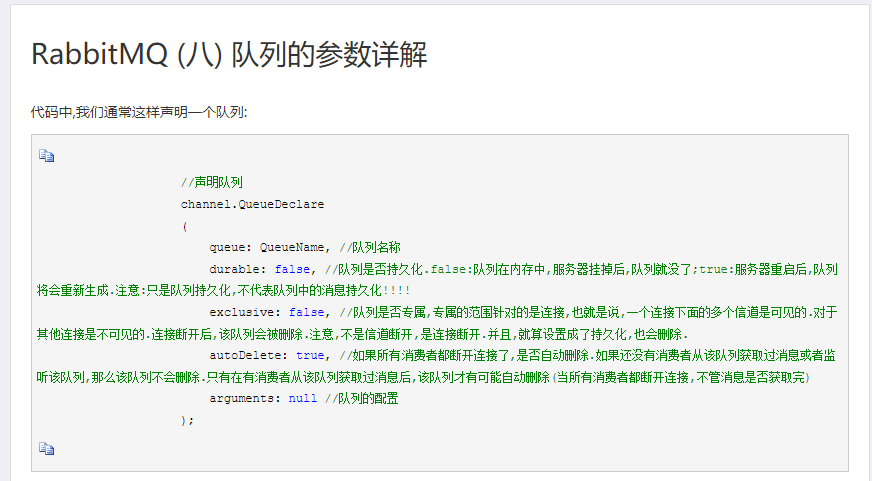
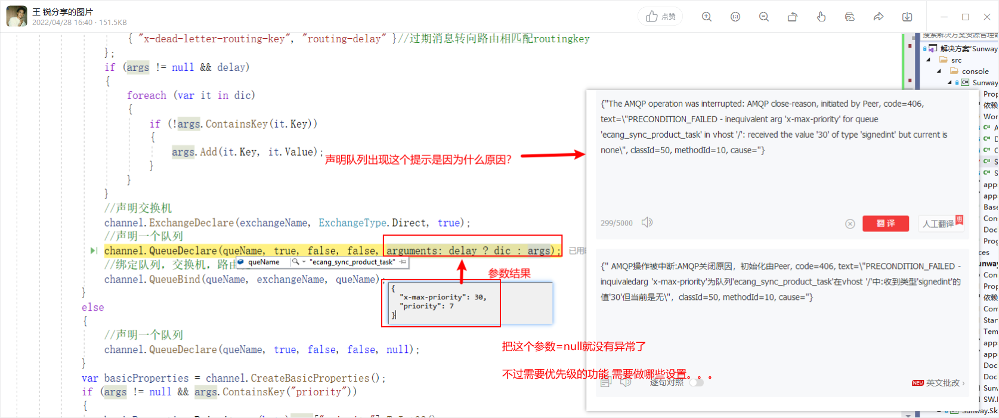
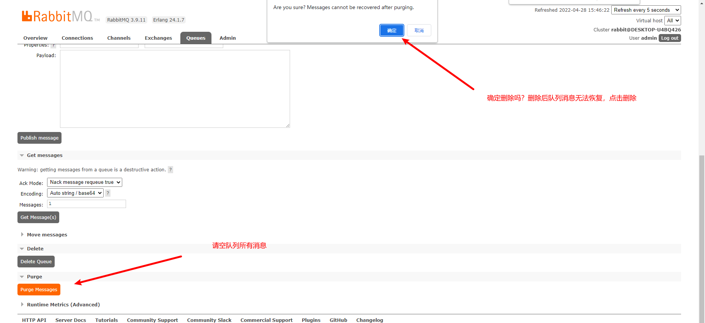
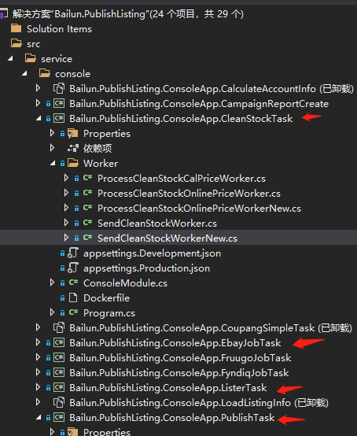
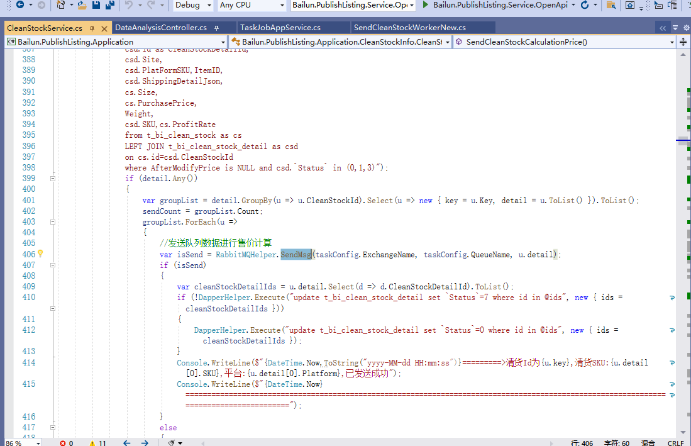
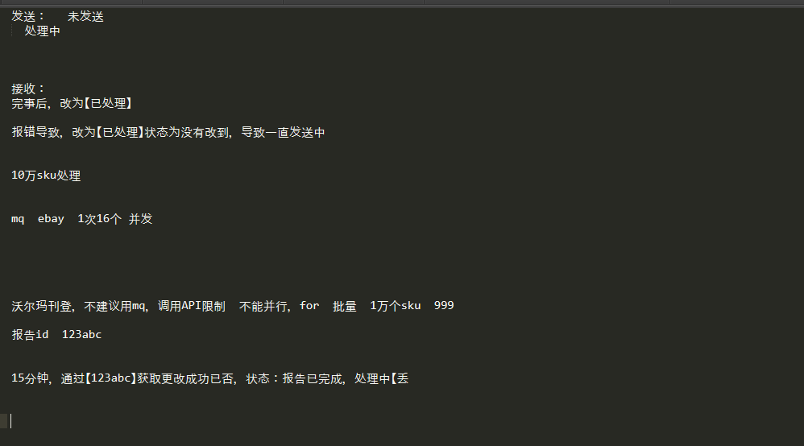

# RabbitMQ学习

- **管道，交换机，队列基本含义**:管道是数据传输的通道，交换机是大脑，决定数据进入哪个管道输送到哪个队列，决定数据从哪个队列从哪个管道出来进行消费

- **管道，交换机，队列绑定关系**:一个管道只可以绑定一个交换机，但是一个交换机可以被多个管道绑定，注意Direct,Topic这两种交换机发送消息的时候不是根据队列进行发送的，它是根据路由key（routingKey）进行发送的，队列中绑定了对应的routingKey就会接收到交换机中的消息

- **一个管道可以创建/绑定多个队列**

- **队列中可以绑定多个routingKey**:一个队列可以绑定多个routingKey，只有在Direct（直连），Topic（主题）  这两种交换机中才可以使用routingKey

- **队列是一个表，可以被多个交换机共享**:队列是动态的可以共享的，并不是说队列A绑定给了Direct交换机A，就不能被Topic交换机B绑定到，一个队列中可以保存着Headers交换机中的数据，可以保存到Direct，Topic交换机中用routingkey，与交换机区分的数据，他们之间是不冲突的，队列就好像是一个表，各个交换机都可以往这个表里面保存数据

**经验：**

1.**枚举交换机类型**： channel.ExchangeDeclare(exchange: "chat_fanout", type: ExchangeType.Fanout, durable: true);    ，创建交换机的时候可以使用枚举声明交换机的类型：ExchangeType.Fanout

2.**routingKey空值**：虽然只有Direct，Topic交换机支持routingKey 路由key，但是Headers,Fanout交换机绑定的时候还是需要绑定空的routingKey， channel.QueueBind(queue: "room1", exchange: "chat_fanout", routingKey: "");

3.**不同的交换机案例基本是头部不同** ：不同的交换机的案例代码中，基本都是 channel.ExchangeDeclare(exchange: "chat_direct", type: "direct", durable: true, autoDelete: false, arguments: null);，声明中的ExchangeType 交换机类型不同，其他的消费者创建，使用基本都是相同的，只有两点例外：1.只有Direct，Topic交换机可以使用routingKey路由key 2.还有Headers交换机中的arguments参数中的headers参数特殊 其他的基本都是一致的：1.创建交换机 2.创建队列 3.绑定队列到交换机 4.发送消息 （指定交换机发送到哪个队列），消费者那边一样，只是第四步发送消息变成了消费消息（根据交换机发送到哪个队列， 然后消费的方式是手动确认，还是自动确认）

## 1.创建生产者

```c#
 
using RabbitMQ.Client;
using RabbitMQ.Client.Events;
using System.Text;

namespace RabbitMQSSS
{
    internal class Program
    {
        static void Main(string[] args)
        {
            var factory = new ConnectionFactory()
            {
                HostName = "192.168.226.128",
                Port = 5672,
                UserName = "admin",
                Password = "123",
                VirtualHost = "my_vhost" // RabbitMQ 虚拟主机的名称
            };

            using (var connection = factory.CreateConnection())
            using (var channel = connection.CreateModel())
            {
 // 创建名为 "chat_direct" 的持久化 Direct 交换机,autoDelete: false 如果所有的队列解除绑定后，不用自动删除
                channel.ExchangeDeclare(exchange: "chat_direct", type: "direct", durable: true, autoDelete: false, arguments: null);

                channel.QueueDeclare(queue: "hello",
                                     durable: true, // 持久化
                                     exclusive: false,
                                     autoDelete: false,
                                     arguments: new Dictionary<string, object> { { "x-max-priority", 10 } } //优先级
                                     );
                //【单个队列也可以绑定多个routingKey】，比如再加一行channel.QueueBind(queue: "room1", exchange: "chat_direct", routingKey: "room1_2");  ，然后消费者那里也绑定两个routingKey就可以了
                channel.QueueBind(queue: "hello", exchange: "chat_direct", routingKey: "room1");
                for (int i = 0; i < 100; i++)
                {

                    var properties = channel.CreateBasicProperties();
                    properties.Persistent = true; //设置消息持久化
                    properties.Priority = (byte)new Random().Next(0, 10);
                    string message = $"Hello World{i} Priority {properties.Priority}!";
                    var body = Encoding.UTF8.GetBytes(message);
                    channel.BasicPublish(exchange: "chat_direct", routingKey: "hello", basicProperties: properties, body: body);

                    Console.WriteLine(" [x] Sent {0}", message);
                    Thread.Sleep(1000);
                }

                Console.WriteLine(" Press [enter] to exit.");
                Console.ReadLine();
            }
        }
    }
}
```

## 2.创建消费者

```c#
using RabbitMQ.Client;
using RabbitMQ.Client.Events;
using System.Text;

namespace RabbitMQSSS
{
    internal class Program
    {
        static void Main(string[] args)
        { 
			var factory = new ConnectionFactory()
			{
				HostName = "192.168.226.128",
				Port = 5672,
				UserName = "admin",
				Password = "123",
				VirtualHost = "my_vhost" // RabbitMQ 虚拟主机的名称
			};
			using (var connection = factory.CreateConnection())
			using (var channel = connection.CreateModel())
			{
                channel.ExchangeDeclare(exchange: "chat_direct", type: "direct", durable: true, autoDelete: false, arguments: null);
                channel.QueueDeclare(queue: "hello",
                                     durable: true, // 持久化
                                     exclusive: false,
                                     autoDelete: false,
                                     arguments: new Dictionary<string, object> { { "x-max-priority", 10 } } //优先级
                                     );
                channel.QueueBind(queue: "hello", exchange: "chat_direct", routingKey: "room1");
                
                // 每次从队列中预取1条消息进行处理，也可以设置10条，100条，看内部的逻辑是如何的
                channel.BasicQos(0, 1, false);
				var consumer = new EventingBasicConsumer(channel);
				consumer.Received += (model, ea) =>
				{
					var body = ea.Body.ToArray();
					var message = Encoding.UTF8.GetString(body);
					Console.WriteLine("Received message with priority {0}: {1}", ea.BasicProperties.Priority, message);
					Thread.Sleep(1000);
                        // 模拟消息处理过程中出现异常
                    if (DateTime.Now.Second % 5 == 0)
                    {
                        Console.WriteLine($"Message {message} failed to process, requeueing...");

                        // 拒绝这条消息并重新投递到队列中，requeue: 等于true代表是拒绝消息，重新投入到队列
                        channel.BasicNack(deliveryTag: ea.DeliveryTag, multiple: false, requeue: true);
                    }
                    else
                    {
                        Console.WriteLine($"Message {message} processed successfully.");

                        // 确认处理成功的消息，手动签收消息
                        channel.BasicAck(deliveryTag: ea.DeliveryTag, multiple: false);
                    }

				};
                // autoAck: false 代表不自动消费，一般由channel.BasicAck进行手动消费
				channel.BasicConsume(queue: "hello", autoAck: false, consumer: consumer);
			 
				Console.WriteLine(" Press [enter] to exit.");
				Console.ReadLine();

			}
        }
    }
}
```

## 3.交换机的模式

### **Direct 交换机（直连交换机）**

默认的交换机格式，使用Routing Key 路由进行转换到对应的队列中，使用灵活，RabbitMQ有一个默认为空的交换机，一个默认为空的Routing Key 。

```c#
// 生产者
using RabbitMQ.Client;
using RabbitMQ.Client.Events;
using System.Text;

namespace RabbitMQSSS
{
    internal class Program
    {
        static void Main(string[] args)
        {
            var factory = new ConnectionFactory()
            {
                HostName = "192.168.226.128",
                Port = 5672,
                UserName = "admin",
                Password = "123",
                VirtualHost = "my_vhost" // RabbitMQ 虚拟主机的名称
            };

            using (var connection = factory.CreateConnection())
            using (var channel = connection.CreateModel())
            {

                 // 创建名为 "chat_direct" 的持久化 Direct 交换机,autoDelete: false 如果所有的队列解除绑定后，不用自动删除
                channel.ExchangeDeclare(exchange: "chat_direct", type: "direct", durable: true, autoDelete: false, arguments: null);

                // 将队列 "room1" 绑定到 Direct 交换机，匹配 Routing Key 为 "room1" 的消息
                channel.QueueDeclare(queue: "room1", durable: true, exclusive: false, autoDelete: false, arguments: null);
                //【单个队列也可以绑定多个routingKey】，比如再加一行channel.QueueBind(queue: "room1", exchange: "chat_direct", routingKey: "room1_2");  ，然后消费者那里也绑定两个routingKey就可以了
                channel.QueueBind(queue: "room1", exchange: "chat_direct", routingKey: "room1");
                

                // 将队列 "room2" 绑定到 Direct 交换机，匹配 Routing Key 为 "room2" 的消息，exclusive: false 等于false代表我可以被其他进程访问
                channel.QueueDeclare(queue: "room2", durable: true, exclusive: false, autoDelete: false, arguments: null);
                channel.QueueBind(queue: "room2", exchange: "chat_direct", routingKey: "room2");


                // 模拟用户发送聊天消息到聊天室 "room1"
                var message1 = "Hello, room1!";
                var body1 = Encoding.UTF8.GetBytes(message1);
                channel.BasicPublish(exchange: "chat_direct", routingKey: "room1", basicProperties: null, body: body1);

                // 模拟用户发送聊天消息到聊天室 "room2"
                var message2 = "Hello, room2!";
                var body2 = Encoding.UTF8.GetBytes(message2);
                channel.BasicPublish(exchange: "chat_direct", routingKey: "room2", basicProperties: null, body: body2);

                Console.WriteLine("Sent messages.");
            }
        }
    }
}

//消费者
using RabbitMQ.Client;
using RabbitMQ.Client.Events;
using System.Text;

namespace RabbitMQSSS
{
    internal class Program
    {
        static void Main(string[] args)
        {
            var factory = new ConnectionFactory()
            {
                HostName = "192.168.226.128",
                Port = 5672,
                UserName = "admin",
                Password = "123",
                VirtualHost = "my_vhost" // RabbitMQ 虚拟主机的名称
            };

            using (var connection = factory.CreateConnection())
            using (var channel = connection.CreateModel())
            {

                // 创建名为 "chat_direct" 的 Direct 交换机
                channel.ExchangeDeclare(exchange: "chat_direct", type: "direct", durable: true, autoDelete: false, arguments: null);
                // 创建名为 "room1" 和 "room2" 的队列
                channel.QueueDeclare(queue: "room1", durable: true, exclusive: false, autoDelete: false, arguments: null);
                channel.QueueDeclare(queue: "room2", durable: true, exclusive: false, autoDelete: false, arguments: null);

                // 将队列 "room1" 绑定到 Direct 交换机上，绑定的 routingKey 为 "room1"
                channel.QueueBind(queue: "room1", exchange: "chat_direct", routingKey: "room1");

                // 将队列 "room2" 绑定到 Direct 交换机上，绑定的 routingKey 为 "room2"
                channel.QueueBind(queue: "room2", exchange: "chat_direct", routingKey: "room2");

                Console.WriteLine(" [*] Waiting for messages. To exit press CTRL+C");

                // 创建消费者
                var consumer = new EventingBasicConsumer(channel);
                consumer.Received += (model, ea) =>
                {
                    var body = ea.Body.ToArray();
                    var message = Encoding.UTF8.GetString(body);
                    Console.WriteLine(" [x] Received '{0}':'{1}'", ea.RoutingKey, message);
                };

                // 开始消费 "room1" 队列中的消息
                channel.BasicConsume(queue: "room1", autoAck: true, consumer: consumer);

                // 开始消费 "room2" 队列中的消息
                channel.BasicConsume(queue: "room2", autoAck: true, consumer: consumer);

                Console.ReadLine();
            }
        }
    }
}
```


### **Topic 交换机（主题交换机）**

可以使用通配符，进行复杂的路由转换逻辑，功能与Direct一样，就是路由匹配模式有区别，支持通配符的匹配

```c#
//生产者
using RabbitMQ.Client;
using RabbitMQ.Client.Events;
using System.Text;

namespace RabbitMQSSS
{
    internal class Program
    {
        static void Main(string[] args)
        {
            var factory = new ConnectionFactory()
            {
                HostName = "192.168.226.128",
                Port = 5672,
                UserName = "admin",
                Password = "123",
                VirtualHost = "my_vhost" // RabbitMQ 虚拟主机的名称
            };

            using (var connection = factory.CreateConnection())
            using (var channel = connection.CreateModel())
            {

                // 创建名为 "chat_topic" 的 Topic 交换机
                channel.ExchangeDeclare(exchange: "chat_topic", type: "topic", durable: true);

                // 创建名为 "room1" 和 "room2" 的队列
                channel.QueueDeclare(queue: "room1", durable: true, exclusive: false, autoDelete: false, arguments: null);
                channel.QueueDeclare(queue: "room2", durable: true, exclusive: false, autoDelete: false, arguments: null);

                // 将队列 "room1" 绑定到 Topic 交换机上，绑定的 routingKey 为 "chat.room1.*"
                channel.QueueBind(queue: "room1", exchange: "chat_topic", routingKey: "chat.room1.*");

                // 将队列 "room2" 绑定到 Topic 交换机上，绑定的 routingKey 为 "chat.#"
                channel.QueueBind(queue: "room2", exchange: "chat_topic", routingKey: "chat.#");

                //【这三条消息：chat.room1.receive，chat.room1.send会发送到room1的队列中，chat.room1.send，chat.room1.receive，chat.room2.send这三条消息会发送到队列2当中】 
                // 发送消息到 Topic 交换机上，消息的 routingKey 为 "chat.room1.send"
                var message1 = "Hello, this is a message for room1.";
                var body1 = Encoding.UTF8.GetBytes(message1);
                channel.BasicPublish(exchange: "chat_topic", routingKey: "chat.room1.send", basicProperties: null, body: body1);

                // 发送消息到 Topic 交换机上，消息的 routingKey 为 "chat.room1.receive"
                var message2 = "Hello, this is a message for room1.";
                var body2 = Encoding.UTF8.GetBytes(message2);
                channel.BasicPublish(exchange: "chat_topic", routingKey: "chat.room1.receive", basicProperties: null, body: body2);

                // 发送消息到 Topic 交换机上，消息的 routingKey 为 "chat.room2.send"
                var message3 = "Hello, this is a message for room2.";
                var body3 = Encoding.UTF8.GetBytes(message3);
                channel.BasicPublish(exchange: "chat_topic", routingKey: "chat.room2.send", basicProperties: null, body: body3);

                Console.WriteLine("Sent messages.");
            }
        }
    }
}

//消费者
using RabbitMQ.Client;
using RabbitMQ.Client.Events;
using System.Text;

namespace RabbitMQSSS
{
    internal class Program
    {
        static void Main(string[] args)
        {
            var factory = new ConnectionFactory()
            {
                HostName = "192.168.226.128",
                Port = 5672,
                UserName = "admin",
                Password = "123",
                VirtualHost = "my_vhost" // RabbitMQ 虚拟主机的名称
            };

            using (var connection = factory.CreateConnection())
            using (var channel = connection.CreateModel())
            {

                // 创建名为 "chat_topic" 的 Topic 交换机
                channel.ExchangeDeclare(exchange: "chat_topic", type: "topic", durable: true);

                // 创建名为 "room1" 和 "room2" 的队列
                channel.QueueDeclare(queue: "room1", durable: true, exclusive: false, autoDelete: false, arguments: null);
                channel.QueueDeclare(queue: "room2", durable: true, exclusive: false, autoDelete: false, arguments: null);

                // 将队列 "room1" 绑定到 Topic 交换机上，绑定的 routingKey 为 "chat.room1.*"
                channel.QueueBind(queue: "room1", exchange: "chat_topic", routingKey: "chat.room1.*");

                // 将队列 "room2" 绑定到 Topic 交换机上，绑定的 routingKey 为 "chat.#"
                channel.QueueBind(queue: "room2", exchange: "chat_topic", routingKey: "chat.#");

                Console.WriteLine(" [*] Waiting for messages. To exit press CTRL+C");

                // 创建消费者1，用于消费队列 "room1" 中的消息
                //【消费两条】
                var consumer1 = new EventingBasicConsumer(channel);
                consumer1.Received += (model, ea) =>
                {
                    var body = ea.Body.ToArray();
                    var message = Encoding.UTF8.GetString(body);
                    var routingKey = ea.RoutingKey;
                    Console.WriteLine(" [x] Received '{0}':'{1}' {3} in room1", ea.RoutingKey, message, routingKey);
                };
                channel.BasicConsume(queue: "room1", autoAck: true, consumer: consumer1);
                //【消费三条】
                // 创建消费者2，用于消费队列 "room2" 中的消息
                var consumer2 = new EventingBasicConsumer(channel);
                consumer2.Received += (model, ea) =>
                {
                    var body = ea.Body.ToArray();
                    var message = Encoding.UTF8.GetString(body);
                    var routingKey = ea.RoutingKey;

                    Console.WriteLine(" [x] Received '{0}':'{1}' {3} in room2", ea.RoutingKey, message, routingKey);
                };
                channel.BasicConsume(queue: "room2", autoAck: true, consumer: consumer2);

                Console.WriteLine(" Press [enter] to exit.");
                Console.ReadLine();
            }
        }
    }
}
 
```


### **Headers 交换机（头部交换机）**

根据交换机的头部属性进行匹配到对应属性的队列，比如电商公司有不同重量的包裹，有宽度：大，中，小，重量：大，中，小的两种情况，宽度是：大，重量是：大 是一个属性发送到一个队列，这种情况下有9种队列进行管理，如果用直连交换机的话就是宽度大重量大，这样进行标志Routing Key也是九个队列，这是两个属性的情况，如果是20个属性呢，直连交换机就很棘手了，但是头部交换机只是在原有的基础上新增属性进行管理队列，后续运维也很方便。**头部交换机的队列是组合属性的方式进行分发的，各个属性之间很灵活，但是直连交换机是写死路由key的，扩展起来也很麻烦，简单的业务场景可以用直连交换机，如果复杂的业务场景下，用直连交换机不太好管理，还是头部交换机更好用**

```c#
//生产者
using RabbitMQ.Client;
using RabbitMQ.Client.Events;
using System.Text;

namespace RabbitMQSSS
{
    internal class Program
    {
        static void Main(string[] args)
        {
            var factory = new ConnectionFactory()
            {
                HostName = "192.168.226.128",
                Port = 5672,
                UserName = "admin",
                Password = "123",
                VirtualHost = "my_vhost" // RabbitMQ 虚拟主机的名称
            };

            using (var connection = factory.CreateConnection())
            using (var channel = connection.CreateModel())
            {

                // 创建名为 "chat_headers" 的 Headers 交换机
                channel.ExchangeDeclare(exchange: "chat_headers", type: "headers", durable: true);

                // 创建名为 "room1" 的队列，并将其绑定到 Headers 交换机上，指定一组匹配规则
                var queueArgs1 = new Dictionary<string, object>
            {
                { "x-match", "all" },
                { "weight", 100 },
                { "price", 50.0 }
            };
                channel.QueueDeclare(queue: "room1", durable: true, exclusive: false, autoDelete: false, arguments: queueArgs1);
                channel.QueueBind(queue: "room1", exchange: "chat_headers", routingKey: "", arguments: queueArgs1);

                // 创建名为 "room2" 的队列，并将其绑定到 Headers 交换机上，指定一组匹配规则
                var queueArgs2 = new Dictionary<string, object>
            {
                { "x-match", "all" },
                { "weight", 200 },
                { "price", 80.0 }
            };
                channel.QueueDeclare(queue: "room2", durable: true, exclusive: false, autoDelete: false, arguments: queueArgs2);
                channel.QueueBind(queue: "room2", exchange: "chat_headers", routingKey: "", arguments: queueArgs2);

                // 发送消息到 Headers 交换机上，并指定一组匹配规则，即 "weight:100,price:50.0"
                var message1 = "Hello, this is a message for room1.";
                var body1 = Encoding.UTF8.GetBytes(message1);
                var headers1 = new Dictionary<string, object>
            {
                { "weight", 100 },
                { "price", 50.0 }
            };
                var properties1 = channel.CreateBasicProperties();
                properties1.Headers = headers1;
                channel.BasicPublish(exchange: "chat_headers", routingKey: "", basicProperties: properties1, body: body1);

                // 发送消息到 Headers 交换机上，并指定一组匹配规则，即 "weight:200,price:80.0"
                var message2 = "Hello, this is a message for room2.";
                var body2 = Encoding.UTF8.GetBytes(message2);
                var headers2 = new Dictionary<string, object>
            {
                { "weight", 200 },
                { "price", 80.0 }
            };
                var properties2 = channel.CreateBasicProperties();
                properties2.Headers = headers2;
                channel.BasicPublish(exchange: "chat_headers", routingKey: "", basicProperties: properties2, body: body2);

                Console.WriteLine("Sent messages.");
            }
        }
    }
}
//消费者
using RabbitMQ.Client;
using RabbitMQ.Client.Events;
using System.Text;

namespace RabbitMQSSS
{
    internal class Program
    {
        static void Main(string[] args)
        {
            var factory = new ConnectionFactory()
            {
                HostName = "192.168.226.128",
                Port = 5672,
                UserName = "admin",
                Password = "123",
                VirtualHost = "my_vhost" // RabbitMQ 虚拟主机的名称
            };

            using (var connection = factory.CreateConnection())
            using (var channel = connection.CreateModel())
            {

                // 创建名为 "chat_headers" 的 Headers 交换机
                channel.ExchangeDeclare(exchange: "chat_headers", type: "headers", durable: true);

                // 创建名为 "room1" 的队列，并将其绑定到 Headers 交换机上，指定一组匹配规则
                var queueArgs1 = new Dictionary<string, object>
    {
        { "x-match", "all" },
        { "weight", 2 },
        { "unit_price", 5.5 }
    };
                channel.QueueDeclare(queue: "room1", durable: true, exclusive: false, autoDelete: false, arguments: queueArgs1);
                channel.QueueBind(queue: "room1", exchange: "chat_headers", routingKey: "", arguments: queueArgs1);

                // 创建名为 "room2" 的队列，并将其绑定到 Headers 交换机上，指定一组匹配规则
                var queueArgs2 = new Dictionary<string, object>
    {
        { "x-match", "any" },
        { "weight", 5 },
        { "unit_price", 10 }
    };
                channel.QueueDeclare(queue: "room2", durable: true, exclusive: false, autoDelete: false, arguments: queueArgs2);
                channel.QueueBind(queue: "room2", exchange: "chat_headers", routingKey: "", arguments: queueArgs2);

                // 消费队列 "room1" 中的消息
                var consumer1 = new EventingBasicConsumer(channel);
                consumer1.Received += (model, ea) =>
                {
                    var body = ea.Body.ToArray();
                    var message = Encoding.UTF8.GetString(body);
                    Console.WriteLine("Received message for room1: {0}", message);
                };
                channel.BasicConsume(queue: "room1", autoAck: true, consumer: consumer1);

                // 消费队列 "room2" 中的消息
                var consumer2 = new EventingBasicConsumer(channel);
                consumer2.Received += (model, ea) =>
                {
                    var body = ea.Body.ToArray();
                    var message = Encoding.UTF8.GetString(body);
                    Console.WriteLine("Received message for room2: {0}", message);
                };
                channel.BasicConsume(queue: "room2", autoAck: true, consumer: consumer2);

                Console.WriteLine("Press [enter] to exit the consumer.");
                Console.ReadLine();
            }
        }
    }
}
```


### **Fanout交换机（扇形交换机）**

用来发布消息到所有的队列的，比如微信公众号中发布一个消息，算是一个交换机，那么所有的订阅方就是队列，当交换机收到消息后，订阅这个交换机的所有的队列都会收到这个消息，再用一个**日志收集**的场景举出一个例子，比如生产系统生产了一条日志，发送到了Fanout交换机（扇形交换机），那么扇形交换机会发送这条日志到三个不同的队列：队列1：负责保存日志到数据库的服务 队列2：负责保存日志到文本的服务  队列3：负责保存日志到ES数据库的服务，这样同一条消息但是每个队列都有不同的任务

以下是关于交换机的一些问题：

- **Direct交换机还可以实现一对多的场景 ，那这样的话Fanout交换机 有什么优势？这种Direct交换机可以实现一对多的场景，有什么优点，缺点**

   Fanout交换机就是简单粗暴，直接一对多广播的场景（日志，订阅服务），不需要配置，我生来就是做这个事情的，Direct交换机虽然也可以实现，但是它需要额外的配置，不过它的粒度更加细微

```c#
//生产者
using RabbitMQ.Client;
using RabbitMQ.Client.Events;
using System.Text;

namespace RabbitMQSSS
{
    internal class Program
    {
        static void Main(string[] args)
        {
            var factory = new ConnectionFactory()
            {
                HostName = "192.168.226.128",
                Port = 5672,
                UserName = "admin",
                Password = "123",
                VirtualHost = "my_vhost" // RabbitMQ 虚拟主机的名称
            };

            using (var connection = factory.CreateConnection())
            using (var channel = connection.CreateModel())
            {

                // 创建名为 "chat_fanout" 的 Fanout 交换机
                channel.ExchangeDeclare(exchange: "chat_fanout", type: ExchangeType.Fanout, durable: true);

                // 创建名为 "room1" 的队列，并将其绑定到 Fanout 交换机上
                channel.QueueDeclare(queue: "room1", durable: true, exclusive: false, autoDelete: false, arguments: null);
                channel.QueueBind(queue: "room1", exchange: "chat_fanout", routingKey: "");

                // 创建名为 "room2" 的队列，并将其绑定到 Fanout 交换机上
                channel.QueueDeclare(queue: "room2", durable: true, exclusive: false, autoDelete: false, arguments: null);
                channel.QueueBind(queue: "room2", exchange: "chat_fanout", routingKey: "");

                // 发送消息到 Fanout 交换机上，所有绑定的队列都会收到消息
                var message = "Hello, this is a message for all rooms.";
                var body = Encoding.UTF8.GetBytes(message);
                channel.BasicPublish(exchange: "chat_fanout", routingKey: "", basicProperties: null, body: body);

                Console.WriteLine("Sent messages.");
            }
        }
    }
}

//消费者
using RabbitMQ.Client;
using RabbitMQ.Client.Events;
using System.Text;

namespace RabbitMQSSS
{
    internal class Program
    {
        static void Main(string[] args)
        {
            var factory = new ConnectionFactory()
            {
                HostName = "192.168.226.128",
                Port = 5672,
                UserName = "admin",
                Password = "123",
                VirtualHost = "my_vhost" // RabbitMQ 虚拟主机的名称
            };

            using (var connection = factory.CreateConnection())
            using (var channel = connection.CreateModel())
            {

                // 创建名为 "chat_fanout" 的 Fanout 交换机
                channel.ExchangeDeclare(exchange: "chat_fanout", type: "fanout", durable: true);

                // 创建名为 "room1" 的队列，并将其绑定到 Fanout 交换机上
                channel.QueueDeclare(queue: "room1", durable: true, exclusive: false, autoDelete: false, arguments: null);
                channel.QueueBind(queue: "room1", exchange: "chat_fanout", routingKey: "");

                // 创建名为 "room2" 的队列，并将其绑定到 Fanout 交换机上
                channel.QueueDeclare(queue: "room2", durable: true, exclusive: false, autoDelete: false, arguments: null);
                channel.QueueBind(queue: "room2", exchange: "chat_fanout", routingKey: "");

                // 同时消费 "room1" 和 "room2" 队列中的消息
                var consumer = new EventingBasicConsumer(channel);
                consumer.Received += (model, ea) =>
                {
                    var body = ea.Body.ToArray();
                    var message = Encoding.UTF8.GetString(body);
                    Console.WriteLine(" [x] Received {0}", message);
                };
                channel.BasicConsume(queue: "room1", autoAck: true, consumer: consumer);
                channel.BasicConsume(queue: "room2", autoAck: true, consumer: consumer);

                Console.WriteLine(" Press [enter] to exit.");
                Console.ReadLine();
            }
        }
    }
}
```

## 4.消息持久性

```c#
//注意几个点：
//1.设置交换机，队列，消息的持久化，三者都需要持久化
//2.消息消费失败后，可以拒收，然后消息会重新回到队列中（拒收是马上回到，如果没有签收消息，但是也没有拒收，消息也是会回到队列中）
//3.消息拒收后需要配合最大重试次数与死信队列进行配合，才能更大的提高系统的稳定性

//生产者
using RabbitMQ.Client;
using RabbitMQ.Client.Events;
using System.Text;

namespace RabbitMQSSS
{
    internal class Program
    {
        static void Main(string[] args)
        {
            var factory = new ConnectionFactory()
            {
                HostName = "192.168.226.128",
                Port = 5672,
                UserName = "admin",
                Password = "123",
                VirtualHost = "my_vhost" // RabbitMQ 虚拟主机的名称
            };

            using (var connection = factory.CreateConnection())
            using (var channel = connection.CreateModel())
            {
 // 创建名为 "chat_direct" 的持久化 Direct 交换机,autoDelete: false 如果所有的队列解除绑定后，不用自动删除
                channel.ExchangeDeclare(exchange: "chat_direct", type: "direct", durable: true, autoDelete: false, arguments: null);

                channel.QueueDeclare(queue: "hello",
                                     durable: true, // 持久化
                                     exclusive: false,
                                     autoDelete: false,
                                     arguments: new Dictionary<string, object> { { "x-max-priority", 10 } } //优先级
                                     );
                //【单个队列也可以绑定多个routingKey】，比如再加一行channel.QueueBind(queue: "room1", exchange: "chat_direct", routingKey: "room1_2");  ，然后消费者那里也绑定两个routingKey就可以了
                channel.QueueBind(queue: "hello", exchange: "chat_direct", routingKey: "room1");
                for (int i = 0; i < 100; i++)
                {

                    var properties = channel.CreateBasicProperties();
                    properties.Persistent = true; //设置消息持久化，也可以是设置properties.DeliveryMode = 2; 两种都可以
                    properties.Priority = (byte)new Random().Next(0, 10);
                    string message = $"Hello World{i} Priority {properties.Priority}!";
                    var body = Encoding.UTF8.GetBytes(message);
                    channel.BasicPublish(exchange: "chat_direct", routingKey: "hello", basicProperties: properties, body: body);

                    Console.WriteLine(" [x] Sent {0}", message);
                    Thread.Sleep(1000);
                }

                Console.WriteLine(" Press [enter] to exit.");
                Console.ReadLine();
            }
        }
    }
}
//消费者
using RabbitMQ.Client;
using RabbitMQ.Client.Events;
using System.Text;

namespace RabbitMQSSS
{
    internal class Program
    {
        static void Main(string[] args)
        { 
			var factory = new ConnectionFactory()
			{
				HostName = "192.168.226.128",
				Port = 5672,
				UserName = "admin",
				Password = "123",
				VirtualHost = "my_vhost" // RabbitMQ 虚拟主机的名称
			};
			using (var connection = factory.CreateConnection())
			using (var channel = connection.CreateModel())
			{
                channel.ExchangeDeclare(exchange: "chat_direct", type: "direct", durable: true, autoDelete: false, arguments: null);
                channel.QueueDeclare(queue: "hello",
                                     durable: true, // 持久化
                                     exclusive: false,
                                     autoDelete: false,
                                     arguments: new Dictionary<string, object> { { "x-max-priority", 10 } } //优先级
                                     );
                channel.QueueBind(queue: "hello", exchange: "chat_direct", routingKey: "room1");
                
                // 每次从队列中预取1条消息进行处理，也可以设置10条，100条，看内部的逻辑是如何的
                channel.BasicQos(0, 1, false);
				var consumer = new EventingBasicConsumer(channel);
				consumer.Received += (model, ea) =>
				{
					var body = ea.Body.ToArray();
					var message = Encoding.UTF8.GetString(body);
					Console.WriteLine("Received message with priority {0}: {1}", ea.BasicProperties.Priority, message);
					Thread.Sleep(1000);
                        // 模拟消息处理过程中出现异常
                    if (DateTime.Now.Second % 5 == 0)
                    {
                        Console.WriteLine($"Message {message} failed to process, requeueing...");

                        // 拒绝这条消息并重新投递到队列中，requeue: 等于true代表是拒绝消息，重新投入到队列
                        channel.BasicNack(deliveryTag: ea.DeliveryTag, multiple: false, requeue: true);
                    }
                    else
                    {
                        Console.WriteLine($"Message {message} processed successfully.");

                        // 确认处理成功的消息，手动签收消息
                        channel.BasicAck(deliveryTag: ea.DeliveryTag, multiple: false);
                    }

				};
                // autoAck: false 代表不自动消费，一般由channel.BasicAck进行手动消费
				channel.BasicConsume(queue: "hello", autoAck: false, consumer: consumer);
			 
				Console.WriteLine(" Press [enter] to exit.");
				Console.ReadLine();

			}
        }
    }
}
```


## 5.稳定性死信队列与重试机制

这里面利用了消息过期时间，重试3次机制，过期与重试三次还是失败后进入死信队列消费

```c#
//生产者
using RabbitMQ.Client;
using RabbitMQ.Client.Events;
using System.Text;

namespace RabbitMQSSS
{
    internal class Program
    {
        static void Main(string[] args)
        {
            var factory = new ConnectionFactory()
            {
                HostName = "192.168.226.128",
                Port = 5672,
                UserName = "admin",
                Password = "123",
                VirtualHost = "my_vhost" // RabbitMQ 虚拟主机的名称
            };

            using (var connection = factory.CreateConnection())
            using (var channel = connection.CreateModel())
            {
 
                // 声明正常交换机
                channel.ExchangeDeclare(exchange: "example_exchange",
                                         type: ExchangeType.Direct,
                                         durable: true);

                // 定义正常队列参数
                var queueArgs = new Dictionary<string, object>();
                queueArgs.Add("x-dead-letter-exchange", "dead_letter_exchange"); // 死信交换机
                queueArgs.Add("x-dead-letter-routing-key", "dead_letter_routing_key"); // 死信路由键
                queueArgs.Add("x-message-ttl", 6000000); // 消息过期时间，单位毫秒

                // 声明正常队列
                channel.QueueDeclare(queue: "example_queue",
                                         durable: true,
                                         exclusive: false,
                                         autoDelete: false,
                                         arguments: queueArgs);

                // 绑定正常队列到正常交换机
                channel.QueueBind(queue: "example_queue",
                                          exchange: "example_exchange",
                                          routingKey: "example_routing_key");

                // 声明死信交换机
                channel.ExchangeDeclare(exchange: "dead_letter_exchange",
                                         type: ExchangeType.Direct,
                                         durable: true);

                // 声明死信队列
                channel.QueueDeclare(queue: "dead_letter_queue",
                                         durable: true,
                                         exclusive: false,
                                         autoDelete: false,
                                         arguments: null);

                // 绑定死信队列到死信交换机
                channel.QueueBind(queue: "dead_letter_queue",
                                          exchange: "dead_letter_exchange",
                                          routingKey: "dead_letter_routing_key");

                // 发布消息
                var properties = channel.CreateBasicProperties();
                properties.Persistent = true;

                var message = "Hello, RabbitMQ!";
                var body = Encoding.UTF8.GetBytes(message);
                properties.Headers = new Dictionary<string, object>();
                //重试次数
                properties.Headers.Add("retry-count", 0);

                channel.BasicPublish(exchange: "example_exchange",
                                         routingKey: "example_routing_key",
                                         basicProperties: properties,
                                         body: body);

                Console.WriteLine("Sent messages.");
            }
        }
    }
}
//消费者
using RabbitMQ.Client;
using RabbitMQ.Client.Events;
using System.Text;
using RabbitMQ.Client.Framing;
using System.Collections.Generic;

namespace RabbitMQSSS
{
    internal class Program
    {
        static void Main(string[] args)
        {
            var factory = new ConnectionFactory()
            {
                HostName = "192.168.226.128",
                Port = 5672,
                UserName = "admin",
                Password = "123",
                VirtualHost = "my_vhost" // RabbitMQ 虚拟主机的名称
            };

            using (var connection = factory.CreateConnection())
            using (var channel = connection.CreateModel())
            {

                // 声明正常交换机
                channel.ExchangeDeclare(exchange: "example_exchange",
                                         type: ExchangeType.Direct,
                                         durable: true);

                // 定义正常队列参数
                var queueArgs = new Dictionary<string, object>();
                queueArgs.Add("x-dead-letter-exchange", "dead_letter_exchange"); // 死信交换机
                queueArgs.Add("x-dead-letter-routing-key", "dead_letter_routing_key"); // 死信路由键
                queueArgs.Add("x-message-ttl", 6000000); // 消息过期时间，单位毫秒

                // 声明正常队列
                channel.QueueDeclare(queue: "example_queue",
                                         durable: true,
                                         exclusive: false,
                                         autoDelete: false,
                                         arguments: queueArgs);

                // 绑定正常队列到正常交换机
                channel.QueueBind(queue: "example_queue",
                                          exchange: "example_exchange",
                                          routingKey: "example_routing_key");

                // 声明死信交换机
                channel.ExchangeDeclare(exchange: "dead_letter_exchange",
                                         type: ExchangeType.Direct,
                                         durable: true);

                // 声明死信队列
                channel.QueueDeclare(queue: "dead_letter_queue",
                                         durable: true,
                                         exclusive: false,
                                         autoDelete: false,
                                         arguments: null);

                // 绑定死信队列到死信交换机
                channel.QueueBind(queue: "dead_letter_queue",
                                          exchange: "dead_letter_exchange",
                                          routingKey: "dead_letter_routing_key");

                // 控制同时处理的消息数量
                channel.BasicQos(0, 1, false);

                var consumer = new EventingBasicConsumer(channel);
                consumer.Received += (model, ea) =>
                {

                    var body = ea.Body.ToArray();
                    var message = Encoding.UTF8.GetString(body);
                    Console.WriteLine($"Received message: {message}");
                    int RetryInterval = 5;
                    int MaxRetryCount = 3;
                    var properties = ea.BasicProperties;

                    try
                    {
                        // 处理消息，如果出现异常，则抛出异常
                        // TODO: 处理消息的代码
                        //string str = null;
                        //str.ToString();
                        // 消息处理成功，确认消息
                        channel.BasicAck(deliveryTag: ea.DeliveryTag, multiple: false);
                    }
                    catch (Exception ex)
                    {
                        var retryCount = GetRetryCount(ea);
                        if (retryCount < MaxRetryCount)
                        {
                            channel.BasicAck(deliveryTag: ea.DeliveryTag, multiple: false);
                            // 重试处理消息
                            Console.WriteLine($"Error processing message: {ex.Message}. Retrying in {RetryInterval} seconds...");
                            SetRetryCount(ea, retryCount + 1, channel);
                            Thread.Sleep(RetryInterval * 1000); //等待多少秒后再进行重试
                           
                        }
                        else
                        {
                            // 重试超过最大次数，将消息发送到死信队列
                            Console.WriteLine($"Message processing failed after {MaxRetryCount} retries. Sending message to dead-letter queue...");
                            channel.BasicPublish(exchange: "dead_letter_exchange", routingKey: "dead_letter_routing_key", basicProperties: null, body: body);
                            channel.BasicAck(deliveryTag: ea.DeliveryTag, multiple: false);
                        }
                    }
                   
                };
                channel.BasicConsume(queue: "example_queue",
                                     autoAck: false,
                                     consumer: consumer);


                Console.WriteLine(" Press [enter] to exit.");
                Console.ReadLine();
            }
        }
        // 获取消息重试次数
        private static int GetRetryCount(BasicDeliverEventArgs ea)
        {
            var headers = ea.BasicProperties.Headers;
            if (headers != null && headers.TryGetValue("retry-count", out var value) )
            {
                return Convert.ToInt32(value);
            }
            return 0;
        }


        // 设置消息重试次数
        private static void SetRetryCount(BasicDeliverEventArgs ea, int count, IModel channel)
        {
            var properties = ea.BasicProperties;
            if (properties == null)
            {
                properties = channel.CreateBasicProperties();
            }
            if (properties.Headers == null)
            {
                properties.Headers = new Dictionary<string, object>();
            }
            properties.Headers["retry-count"] = count;
            channel.BasicPublish(exchange: ea.Exchange, routingKey: ea.RoutingKey, basicProperties: properties, body: ea.Body);
        }
    }

}
```


## 6.【删除队列与交换机】

```c#
using (var channel = connection.CreateModel())
{
                   try
                {
                    channel.ExchangeDelete("example_exchange");
                }
                catch  
                {
                      
                }
                try
                {
                    channel.QueueDelete("example_queue");
                }
                catch 
                {

                    
                }
}

```

## 7.在容器中部署消费者

```c
//消费者
using RabbitMQ.Client;
using RabbitMQ.Client.Events;
using System.Text;

namespace RabbitMQSSS
{
    internal class Program
    {
        static void Main(string[] args)
        { 
			var factory = new ConnectionFactory()
			{
				HostName = "192.168.226.128",
				Port = 5672,
				UserName = "admin",
				Password = "123",
				VirtualHost = "my_vhost" // RabbitMQ 虚拟主机的名称
			};
			using (var connection = factory.CreateConnection())
			using (var channel = connection.CreateModel())
			{
                channel.ExchangeDeclare(exchange: "chat_direct", type: "direct", durable: true, autoDelete: false, arguments: null);
                channel.QueueDeclare(queue: "hello",
                                     durable: true, // 持久化
                                     exclusive: false,
                                     autoDelete: false,
                                     arguments: new Dictionary<string, object> { { "x-max-priority", 10 } } //优先级
                                     );
                channel.QueueBind(queue: "hello", exchange: "chat_direct", routingKey: "room1");
                
                // 每次从队列中预取1条消息进行处理，也可以设置10条，100条，看内部的逻辑是如何的
                channel.BasicQos(0, 1, false);
				var consumer = new EventingBasicConsumer(channel);
				consumer.Received += (model, ea) =>
				{
					var body = ea.Body.ToArray();
					var message = Encoding.UTF8.GetString(body);
					Console.WriteLine("Received message with priority {0}: {1}", ea.BasicProperties.Priority, message);
					Thread.Sleep(1000);
                        // 模拟消息处理过程中出现异常
                    if (DateTime.Now.Second % 5 == 0)
                    {
                        Console.WriteLine($"Message {message} failed to process, requeueing...");

                        // 拒绝这条消息并重新投递到队列中，requeue: 等于true代表是拒绝消息，重新投入到队列
                        channel.BasicNack(deliveryTag: ea.DeliveryTag, multiple: false, requeue: true);
                    }
                    else
                    {
                        Console.WriteLine($"Message {message} processed successfully.");

                        // 确认处理成功的消息，手动签收消息
                        channel.BasicAck(deliveryTag: ea.DeliveryTag, multiple: false);
                    }

				};
                // autoAck: false 代表不自动消费，一般由channel.BasicAck进行手动消费
				channel.BasicConsume(queue: "hello", autoAck: false, consumer: consumer);
			 
				Console.WriteLine(" Press [enter] to exit.");
				//阻塞主线程
				ManualResetEvent manualResetEvent = new ManualResetEvent(false);
                manualResetEvent.WaitOne();

			}
        }
    }
}
//生产者
using RabbitMQ.Client;
using RabbitMQ.Client.Events;
using System.Text;

namespace RabbitMQSSS
{
    internal class Program
    {
        static void Main(string[] args)
        {
            var factory = new ConnectionFactory()
            {
                HostName = "192.168.226.128",
                Port = 5672,
                UserName = "admin",
                Password = "123",
                VirtualHost = "my_vhost" // RabbitMQ 虚拟主机的名称
            };

            using (var connection = factory.CreateConnection())
            using (var channel = connection.CreateModel())
            {
 // 创建名为 "chat_direct" 的持久化 Direct 交换机,autoDelete: false 如果所有的队列解除绑定后，不用自动删除
                channel.ExchangeDeclare(exchange: "chat_direct", type: "direct", durable: true, autoDelete: false, arguments: null);

                channel.QueueDeclare(queue: "hello",
                                     durable: true, // 持久化
                                     exclusive: false,
                                     autoDelete: false,
                                     arguments: new Dictionary<string, object> { { "x-max-priority", 10 } } //优先级
                                     );
                //【单个队列也可以绑定多个routingKey】，比如再加一行channel.QueueBind(queue: "room1", exchange: "chat_direct", routingKey: "room1_2");  ，然后消费者那里也绑定两个routingKey就可以了
                channel.QueueBind(queue: "hello", exchange: "chat_direct", routingKey: "room1");
                for (int i = 0; i < 100; i++)
                {

                    var properties = channel.CreateBasicProperties();
                    properties.Persistent = true; //设置消息持久化
                    properties.Priority = (byte)new Random().Next(0, 10);
                    string message = $"Hello World{i} Priority {properties.Priority}!";
                    var body = Encoding.UTF8.GetBytes(message);
                    channel.BasicPublish(exchange: "chat_direct", routingKey: "hello", basicProperties: properties, body: body);

                    Console.WriteLine(" [x] Sent {0}", message);
                    Thread.Sleep(1000);
                }

                Console.WriteLine(" Press [enter] to exit.");
                Console.ReadLine();
            }
        }
    }
}
```


## 8.集群中使用镜像队列

# RabbitMQ使用

## RabbitMQ (八) 队列的参数详解

这个博客这个人讲的挺好的



[RabbitMQ (八) 队列的参数详解](https://www.cnblogs.com/refuge/p/10354579.html)

## 创建队列的时候提示错误

AMQP操作被中断:AMQP关闭原因，初始化由Peer, code=406,

原因：手动在MQ创建的队列属性与MQ在后台创建的MQ属性不一致（但是他们的名称是一致的）

解决：把界面手动创建的MQ删除，让程序那边自动创建



## 使用这个命名空间下的获取配置

using ConfigManagerConf = Bailun.ServiceFabric.ConfigManagerConf;

```
     private static ConnectionFactory connectionFactory = new ConnectionFactory
        {
            HostName = ConfigManagerConf.GetValue("RabbitMQ:Host"),
            Port = string.IsNullOrEmpty(ConfigManagerConf.GetValue("RabbitMQ:Port")) ? 5672 : int.Parse(ConfigManagerConf.GetValue("RabbitMQ:Port")),
            UserName = ConfigManagerConf.GetValue("RabbitMQ:UserName"),
            Password = ConfigManagerConf.GetValue("RabbitMQ:Password")
        };
```


## 清空队列中所有的消息



## **项目位置**





## 使用过程出现的问题经验


**沃尔玛的刊登**:存在调用API的限制，不能进行并发刊登多个sku,同时只能调用一次接口，但是一次可以传1万个SKU批量进行刊登，间接实现并发刊登的共鞥。

**Ebay的刊登：**一次只能传16个SKU进行,但是支持并发，可以用MQ进行刊登，不过有时候MQ会有状态丢失的情况，一直在发送中。。。。


**一般刊登分为三个步骤：**

1. **发送：**发送需要刊登的SKU信息到平台
2. **接受：**消费完成后，平台需要去刊登这些信息，一般15分钟返回接口，需要主动调用平台的接口去获取SKU刊登的接口
3. **完成：**回写状态前，需要通过平台提供的接口去查询这个SKU的刊登状态，如果成功刊登，则回写状态到表中，如果刊登失败，有两种情况，结合实际进行分析：1.可能是平台暂时出现了性能瓶颈，15分钟没有返回接口，可能1至2天返回结果 2.可能是平台出现了异常，结果可能是成功，也可能是失败，需要人为去检查刊登的SKU的状态进行判断重新推送，或者在后台更改状态为成功刊登

**总结：** 不论是用MQ（平台不支持批量推送SKU），还是用定时作业的方式进行推送SKU的信息。回写状态的时候都不可避免会出现**状态丢失** 的情况，要么是我们使用MQ出现了阻塞问题，要么是平台那边出现阻塞问题，需要有错误处理的机制（比如错误了放到死信队列，随后重新刊登，或者记录日志）的机制进行判断。

用平台的批量推送SKU就是省事，不用管并发的处理，直接一股脑打包过去，不过平台返回结果给我们的时候，需要分析日志中的成功与失败的内容进行区分更新状态，失败的分析失败原因重新推送，还是人为干预，成功的更改成成功的。

MQ可能会繁琐一些，需要自己处理并发的逻辑，不过优点在于推送的时候如果网络有问题的话，MQ是会在网络恢复后重新帮我们推送的，如果是用for循环处理批量推送的时候，网络有问题，那么我们直接就失败了，不会重试的（如果是定时作业的话，那么会在下一个作业的启动时候，进行重新推送），处理了错误的情况，做好错误机制，与日志了解原因，**否则销售会很生气**




## RabbitMq的消息大小

在版本3.7中的[源码](https://so.csdn.net/so/search?q=源码&spm=1001.2101.3001.7020)，我们可以看到最大消息大小为2GiB。

客户端与RabbitMQ服务端的最大帧是128K，但消息大小却可支持数MB，这是可能是因为底层做了拆包组包的，目前我还未查看底层代码。


**消息大小不要超过4MB**

消息包大小由1K到10MB，当包大小达到4.5MB时，服务器的性能出现明显的异常，传输率尤其是每秒订阅消息的数量，出现波动，不稳定；同时有一部分订阅者的TCP连接出现断开的现象。可能是客户端底层或者RabbitMQ服务端在进行拆包，组包的时候，出现了明显的压力，而导致异常的发生。

[RabbitMQ（四）：RabbitMQ消息大小限制，队列长度限制](https://blog.csdn.net/cuibin1991/article/details/107930479)


# RabbitMQ 消息队列

生产者 Producer 

主机 Broker 

交换机 channel  

队列 queue

队列的数据库 Mnesia 

通道 Channel 

交换机 Exchange 

先进先出 FIFO 

消费者 Consumer 


## 消息队列概述与应用场景

### 消息队列的好处

- **应用解耦：**应用程序之间的解耦
- **去除语言限制：**应用通信可以去除语言限制，我们可以用NET开发语言作为生产者开发服务，JAVA语言作为消费者开发服务。
- 高并发环境下的**流量削峰**

消息队列中生产者与消费者不在同一个网络是没关系的，在互联网上就可以 

### 消息队列的缺点

- 做不到实时，高并发与分布式组件，绝对会有网络问题，这是无法避免的。


### 消息队列应用场景

- **用户注册：**通过消息中间件，发送邮件，发送短信
- **海量的日志存储**
- **电商秒杀场景**

只要是用于高并发的场景，消息中间件就一定会存在。比如海量的日志存储，用于大数据分析。

1）服务间异步通信 

2）顺序消费 

3）定时任务 ：比如延迟消费的消息，定时取消订单，定时备份

4）请求削峰

## Rabbit介绍与六种队列模式

### Rabbit介绍

RabbitMQ是开源的消息队列中间件，使用Erlang语言开发(高并发的语言)，诞生的目的就是为了应对高并发的场景，RabbitMQ是多线程的，针对每个请求都会开启新的连接


### Docker安装RabbitMQ

在linux下，通过docker，可以用一行代码安装（但是docker的安装挺麻烦，需要配置很多映射关系），

```
--通过docker安装
docker run -d  --name rabbitmq -e RABBITMQ_DEFAULT_USER=gerry -e RABBITMQ_DEFAULT_PASS=gerry -p 15672:15672 -p 5672:5672 rabbitmq:3-management
```

安装RabbitMQ后可以通过路径在浏览器进行访问，通过用户名密码进入图形化界面验证是否安装正确

### RabbitMQ六种队列模式

- **简单队列模式** ：一个生产者一个消费者
- **工作队列**：一个生产者，多个消费者
- **发布订阅**：一个生产者，多个队列，多个消费者
- **路由模式** ：直连队列模式
- **主题模式** ：在发布订阅模式技基础上，模糊匹配路由，可以对消息进行筛选进行判断接收
- **RPC模式**：老师没有讲

​    根据业务场景选择不同的消息队列模式进行使用


**交换机：**RabbitMQ会自动创建7个默认的交换机，默认用这个交换机：AMQP default，一个交换机可以绑定多个消息队列。

**丢消息**：如果向交换机里面的队列发送消息的时候，没有找到交换机里面的队列，消息就会丢失。

**C#连接RabbitMQ步骤**

**引用依赖**：需要导入依赖`RabbitMQ.Client`

**创建信道** ：好像Autofac的buider一样，一个容器，保存队列的容器

**创建队列**：保存消息的内容

**RabbitMQ交换机**：通过交换机发送消息

写入消息后在RabbitMQ图形化界面可以查询到发送过来的7条消息

#### 简单队列模式

> 最简单的工作队列（点对点模式）：消息生产者，消息消费者，消息队列 全部只有一个


 描述：一个生产者 P 发送消息到队列 Q，一个消费者 C 接收


#### 工作队列

> 工作队列（点对点模式）： 消息生产者与消息队列只有一个，消息消费者有多个


工作队列：用来将耗时的任务分发给多个消费者（工作者）


channel.BasicQos  设置能者多劳，能力大就消费多一些

开启同样的三个控制台，就是开启三个消费端，然后开启生产端生产30条数据，3个消费者消费后没有产生重复。关闭其中一个消费者后，重新用生产者控制台生产30条小时，两个消费者消费只有20条数据，还有10条数据丢**了**。重新生产30条数据，然后两个消费者消费每个消费15条，消息正常消费。

#### 发布订阅

> **发布/订阅模式：**一个消息生产者，一个交换器，多个消息队列，多个消费者。 
>
> 在应用中，只需要简单的将队列绑定到交换机上。一个发送到交换机的消息都会被转发到与该交换机绑定的所有队列上。很像子网广播，每台子网内的主机都获得了一份复制的消息。消费者去消费其中任何队列的信息都可以


声明交换机：扇形 channel

创建队列：3个队列，3个queue

绑定队列到交换机：单个交换机，可以绑定多个队列

发送消息到交换机中的队列


 


#### 路由模式

##### 直连队列模式

###### 生产者

声明交换机：直连

创建队列

绑定队列到交换机

通过交换机发送信息到队列，三个队列key ,red ,green分别重启程序发送三次

设置消费完后需要手动签收消息

###### 消费者

三个消费者，消费三种key的消息队列,key ,red ,green

#### 主题模式

在发布订阅模式技基础上，模糊匹配路由，可以对消息进行筛选进行判断接收


消费者消费的时候不需要创建队列（生产中已经创建了），只需要执行队列的名称进行消费


#### RPC模式

老师在后面讲

## Rabbit消息确认机制

### 事务方式

通过事务的方式进行确认消息有没有正确送达，如果事务正确执行，默认消息正确发送到队列当中，如果有问题，则回滚事务。

### 消息确认模式

开启消息确认模式，发送消息后，等待服务端给我们确认结果，如果等于true，则消息发送成功，如果返回的是false，则消息发送失败了

### 批量消息确认模式

发送大于1条的消息，比如发送10条后，等待服务器给我们返回结果，如果等于true，则消息发送成功，如果返回的是false，则消息发送失败了

### 异步回调方式

**定义三个回调事件**：1.成功返回的事件 2.失败返回的事件 3.没有发送成功的事件，比如交换机没有绑定到这个队列的情况(使用这个事件，消息队列的模式需要设置直连模式：Direct)

**消费端签收（推荐手动签收）**：如果是自动签收，代码还在处理业务逻辑的时候，已经自动签收了，如果业务逻辑处理到最后有问题，那么这个消息就会丢失

### 死信队列

没有消费的数据，过期，超出长度的数据放到这里面，用单独的消费者服务去消费。

**应用场景**

1. 消息被拒(basic.reject or basic.nack)并且没有重新入队(requeue=false)；
2. 当前队列中的消息数量已经超过最大长度。
3. 消息在队列中过期，即当前消息在队列中的存活时间已经超过了预先设置的TTL(Time To Live)时间；

**代码步骤：**

创建死信交换机

创建消息队列 

绑定消息队列到死信交换机

### 延迟队列

**应用场景：**比如电商中，30分钟后需要关闭订单，下单后自动把订单插入到一个延迟队列，然后由单独的消费者进行消费。与死信队列处理的方法一致。

延迟队列有问题在于，可能延迟的时间不准，或者延迟的消息，消费者消费不到，这个要看具体问题进行处理。

## RabbitMQ存储和队列结构

### 存储机制

默认是保存到内存中，内存中不够用后会自动保存到磁盘中。持久化保存的位置，看队列中的消息大小有没有超过默认的设置，如果没有超过那么保存到Index，如果超过了设置的大小那么保存到store（硬盘）


在Linux环境下我们可以通过命令查看到队列索引，可以看到索引行数，代表数据行数，数据内容（如果它是保存到index中的话）

### 队列结构

队列中的数据是流动的，取决于系统的负载状态

Q1→Q2 →Delta→Q3 →Q4

有如下4个状态：

1、**Alpha：**消息的内容和消息索引都在RAM中。Q1和Q4的状态。

2、**Beta：**消息的内容保存在DISK上，消息索引保存在RAM中。Q2和Q3的状态。

3、**Gamma：**消息内容保存在DISK上，消息索引在DISK和RAM都有。Q2和Q3的状态。

4、**Delta：**消息内容和索引都在DISK上。Delta的状态。

> 对于持久化的消息，消息内容和消息所有都必须先保存在DISK上，才会处于上述状态中的一种，而Gamma状态的消息是只有持久化的消息才会有的状态。

上面的这种数据流动的方式，是为了提高消息读取的效率（因为数据流动到内存中会比硬盘好读取，RabbitMQ内会帮我们进行判断）


**面试的时候搞懂这个流程就是一个竞争力**

## RabbitMQ集群和高可用集群构建落地

老师没有用docker容器安装，直接硬装，因为docker环境的安装比较复杂，需要配置很多映射（老师担心把我们搞晕了）。

**HAProxy：**做负载均衡

**KeepAlived：**做热备

**RabbitMQ：**下载RabbitMQ进行安装，安装后继续安装Erlang 框架环境

安装RabbitMQ环境完毕后，开始创建管理员用户，通过网页界面登录成功后，关闭其他从节点服务器，开始创建集群互相访问的Cookie，检查防火墙访问限制，更改host文件

### 普通集群

集群中不会同步队列数据，会同步原生数据（路由，队列名称，队列位置），当发起请求的时候，从附属集群上面找到保存数据的服务器位置，进行读取。

如果主的服务器挂了，从服务器也拿不到数据


### 镜像集群（常用）

**高可用：**每个节点上都会有保存一份队列的副本信息，称之为主节点的镜像

当我们去链接的时候还是会有根据地的一个概念，不管有没有镜像队列，如果写的时候是从节点上面写，从节点仍然会找主节点去写，除非主节点挂了，如果主节点挂了会从当前的从节点中选择一个根据地，选择后才会在从节点中去写。读的时候是可以读取任何一个主，从节点，写的时候是会写到主节点。但是没有保证负载均衡，如果主又启动回来了，根据地会保持当前的主节点，不会把主节点还回去。

**从普通集群到镜像集群只需要一行代码：**

```c#
rabbitmqctl set_policy ha-all "^" '{"ha-mode":"all"}'
```

启动RabbitMQ的时候是启动集群节点（如果有的话），不能只启动单个的节点服务

### 负载均衡

**HAProxy：** 做负载均衡，心跳监控，要与KeepAlived安装在同一台服务器（**因为KeepAlived要监测Haproxy状态**），HAProxy可以通过加权轮巡等机制进行负载均衡

一般是五台机器做主备，从备，负载均衡（1台只是单点故障），3台镜像集群。这样搭建的会高可用性，搭建镜像集群是数据的高可用，但是最大的性能没有发挥出来

在Linux配置好后（老师有完整的配置脚本），启动HAProxy，通过浏览器的图形化界面进行确认是否成功

通过编写代码访问HAProxy负载均衡的地址，通过测试用例进行访问（测试用例里面编写完后，可以直接运行，不用从程序的入口进行）

**为什么不选择Nginx？**

Nginx没有心跳监控，没有HAProxy速度快（HAProxy有心跳监控，比Nginx速度快）。Nginx有反向代理，负载均衡，如果只是需要这些可以选择Nginx，


### 热备切换

KeepAlived（ke p lei p d）：生成虚拟IP的功能，对外替换一个虚拟的IP，项目部署，迁移的过程中不需要去管IP的。一般弄两台服务器，主服务器，备服务器，主服务器挂了，虚拟IP会飘逸到备份服务器上面，**需要与HAProxy放到同一台服务器进行安装，因为KeepAlived需要通过脚本动态检测Haproxy的状态**。如果安装的rlang语言，就可以使用keepAlived命令。通过Keepalived.conf配置文件，进行配置心跳检查间隔时间，备用节点位置


如果同学们可以把这一套环境完整的部署到你们的本地环境上的话，那么可以直接拿到正式环境上去使用。**像性能比较好的服务器：4核，8G**，要部署到linux环境上，KeepAlived没有windows的版本。


## 开发常用问题分析与解决

### 消息可靠性分析和解决

#### 消息的可靠性分析

 

**RabbitMQ收发消息的时候，有几个主要环节和疑问**

1. 消息从生产者发送到Broker，生产者把消息发到Broker之后，怎么知道自己的消息是否被接收。
2. 消息从Exchange路由到Queue，Exchange是一个绑定列表，职责是分发消息。如果找不到队列或者找不到正确的对垒，怎么处理。
3. 消息在Queue中存储，队列有自己的数据库Mnesia，用来存储消息，如果没有被消费会一直存在，如何保证消息在队列中稳定地存储呢？
4. 消费者订阅Queue并消费消息，队列是FIFO的，被消费之后删库才投递下一条，Broker如何知道消费者已经接收了消息呢？

**1.1 消息发送到Broker** 主机

到了Broker不一定进了队列

运用事务提交，如果事务提交成功，默认消息发送到主机

**BasicReturn：**取消交换机中的绑定队列，造成消息丢失，然后写入本文，用新的消费者去消费文本中的内容

**1.2 消息从交换机到路由到队列**

声明备份的交换机，备份的队列，如果消息发送失败(**匹配不到路由，匹配不到队列**)，把消息放到备份的队列当中进行保存，然后用新的消费者服务进行消费（原来保存在文本中还需要消费者重新读出来然后再进行消费，没有直接保存到队列消费的这么方便）

**1.3 消息队列中存储**

消息持久化

**1.4 消息投递到消费者**

自动签收与手动签收（ACK：签收）

**1.5 消费者回调（根据业务来）**

redis

生产者提供回调API，消费者消费完毕后回调调用

生产者通过key去查找，回查模式

**1.6 补偿机制**

生产者没有收到消费者的回调或者没有被消费掉

可能是网络原因，可能是超时

微信:生产者不断的确认，确认3-5次，防止大量无效MQ消息堆积

支付宝：等一会儿。

### 幂等

幂等：重发的信息，增加时间戳，基于Redis来做

防止重复消费，下单两次，解决方案：

1.拿订单ID查询一次看看是不是存在

2.Redis每次是set，redis天然的幂等性（setnx set事务锁）

### 顺序消费

每个消费者一个队列，麻烦一些，吞吐量下降，消费者内部用多线程会好一些


一个队列，一个消费者，消费者内部用内存队列做排队

### 延迟队列

死信队列

## 消息队列选型

### 选型标准

> 1) 必须开源产品，有BUG能够自己修复
>
> 2) 必须近几年流行，社区活跃很高的,遇到BUG才能解决
>
> 3）与周边的生态兼容和集成程度较高
>
> 4) 消息传递可靠性 确保消息不丢失 支持集群 有良好的性能且满足大多数的业务场景
>
> 5）与团技术栈接轨
>
> - 开源，这样你就可以验证自身代码的质量，并有可能修补对应用非常关键的 bug。
> - 按照 MIT 和 BSD 等方式进行的授权，这样你的公司使用起来就不会遇到任何问题。要小心 GPL，因为它会让你不小心就将整个代码库都开源出去。
> - 成熟，比方说出来已经有一段时间了，并且功能集非常丰富。
> - 维护性强，新版本推出很密集。
> - 别的公司或者项目也使用，这个可以充当品质认证确保有行业支持，能持续维护下去

> **第一梯队** RabbitMQ(高并发要求) Kafka(高吞吐) 10W/S RocketMQ（响应速度飞快，可以解决延时，内置一套可靠型消息系统，无中心化设计,国产消息队列）10W/s
>
> **第二梯队**
>
> ActiveMQ ZeroMQ Plusar
>
> 对比队列各种优势根据业务进行选择 ===> 技术选型

