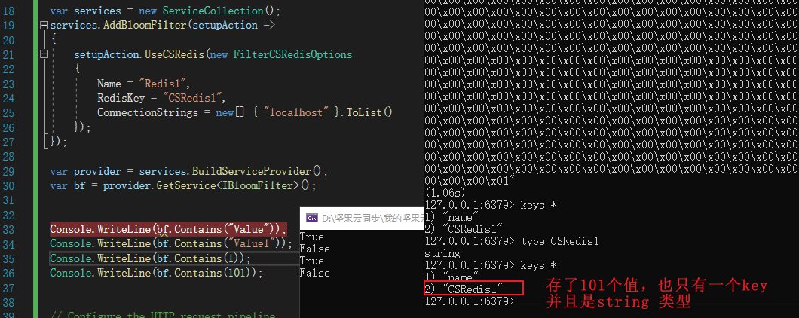
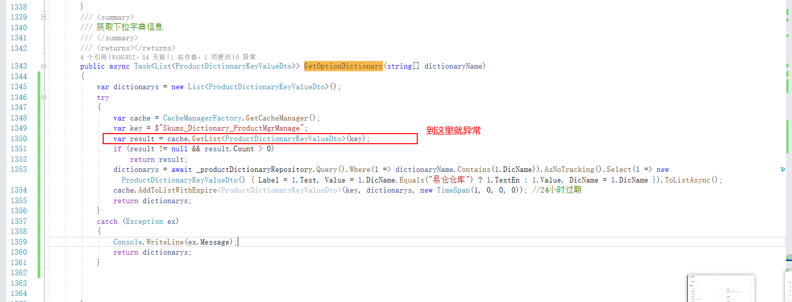
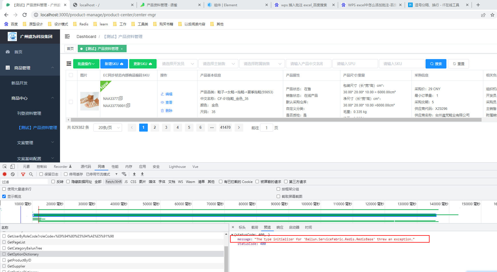

# Redis


## Redis中的持久化

一般的情况下使用默认的RDB持久化完全就够了，不要求数据持久化，追求极致的性能使用无持久化的方式（因为Redis不需要写入的IO,可能会提高一定的性能），如果对数据的安全性要求高，并且追溯更改过程，那么使用AOF的持久化，就是恢复数据的时候会慢一些，因为是一条一条的读，如果对数据的安全性要求高又看重恢复数据速度，那么使用AOF与RDB混合模式进行，缺点就是Redis写两份备份可能会降低一定的性能。

### RDB

RDB模式，默认Redis是使用这个模式，在配置中设置5分钟 100次键值的改动后进行持久化保存，或者10分钟保存1000次，我们可以在配置中设置多个规格，比如**redis.windows.conf**配置中：

```mysql
config get save   -- 空数组，则表示未开启RDB持久化模式；如果是非空数组，则表示开启了RDB持久化模式

save 900 1  -- 900秒中如果更改了一次，那么保存一次
save 300 10  -- 同上
save 60 10000
```

，同时我们也可以通过save,bgsave进行手动的RDB持久化，Save代表是在前台线程进行RDB持久化，持久化的时候不允许读写，Bgsave是从主线程切一个线程出来进行RDB持久化不会阻塞当前线程的持久化，持久化的文件保存在redis的根目录，名称为：**dump.rdb**

- **不过如果是BGSAVE后台线程进行持久化，比如持久化的数据是2g，持久化时间是20s，如果这20s里面数据存在写入的情况，redis是怎么保证数据的正常写入，不会丢数据的？**

**答：**不会丢数据，持久化的20s时间内，redis 4.0 后会把数据的写入操作放到AOF缓冲区的数据结构中，等持久化结束以后，再将AOF缓存区异步写入到磁盘中.

- **怎么判断现有的redis是什么持久化的方式？**

答：可以通过Redis配置文件中的"save"和"appendonly"选项来判断Redis当前的持久化方式。具体步骤如下：

```mysql
config get save   -- 空数组，则表示未开启RDB持久化模式；如果是非空数组，则表示开启了RDB持久化模式
config get appendonly  -- yes 开启了AOF持久化，no 没有开启AOF持久化

CONFIG SET appendonly yes -- 开启AOF持久化
BGSAVE  -- 马上生效

CONFIG GET appendfsync  -- 查看AOF持久化方式是appendfsync everysec（默认）,还是appendfsync always
CONFIG SET appendfsync always -- 设置持久化方式为appendfsync always
CONFIG SET appendfsync everysec -- 设置持久化方式为appendfsync everysec
```

### AOF

AOF持久化的意思是，redis会将用户的写入操作写入到一个文件中进行保存，有两种保存方式：**appendfsync always**（每次有写入都即时保存到AOF文件，持久化的程度更加的高）和**appendfsync everysec**(每秒保存一次，性能与持久化的程序都有保障，**默认是每秒保存一次这种方式持久化**)，当redis服务重启后，redis会从AOF的日志文件中加载数据到redis当中，这个耗时就会比较长，相对于RDB持久化的方式，但是它的数据更加安全。

- **AOF持久化的文件保存在哪个路径？**

  C:\Program Files\Redis\appendonly.aof，只要我们是用命令config set appendonly yes 开启了redis数据的持久化，那么redis的安装磁盘目录就会自动生成appendonly.aof文件，这个文件保存了目前redis里面保存的所有的数据，但是设置config set appendonly no后，这个appendonly.aof并不会自动删除

- **AOF中的值是什么含义：set$3abc$7wangrui**  

  set命令，$3代表键值是3个字节，$7代表值是7个字节，wangerui代表是值

- **AOF文件过大的时候，可以通过重写AOF文件达到缩小的目的**

重写AOF的原理是，用redis现在保存在内存中的所有的数据，重新在后台创建一个子进程，把现在有效的健值写入到AOF文件中，这个过程中会剔除那些已经失效，删除，存在更新的键值，因为AOF文件中记录的是键值对保存的所有的值，保存了键值对的整个生命周期，存在很多冗余，通过重写的话会缩减很多AOF文件的大小。**通过命令: BGREWRITEAOF 重写**

### RDB与AOF混合模式

这种模式是应用了RDB的快速的全量恢复，数据双重保障，AOF数据可追溯，数据持久化程度高的优点。这种模式的应用场景： 对数据持久化的要求很高，并且需要对数据的更新做到可追溯（AOF日志中可以看到键值的删除，更新，新增），数据双重保障（RDB文件没用了，还可以使用AOF文件进行恢复数据），不过缺点在于使用这两种持久化方式，可能对Redis的I0读写性能有一定的影响

混合模式的情况下，Redis会保存两份数据进行持久化，首先Redis会先把写入的数据写入到AOF日志中，然后满足触发条件后再写入到RDB文件中

```
CONFIG SET save "900 1"   --开启持久化
CONFIG SET save "300 10"
CONFIG SET save "60 10000" 
CONFIG SET appendonly yes -- 开启AOF持久化
CONFIG REWRITE  -- 写入配置中
```


### 无持久化模式

这种模式一般用于只做缓存的场景，并且并发的量也不高，数据丢就丢了，对业务没有任何影响，不需要数据持久化

```mysql
-- 开启无持久化数据的模式
config set save ""  -- 关闭RDB持久化
config set appendonly no  -- 关闭aof持久化

注意：如果线上的模式是RDB的持久化模式，那么本地会保存dump.rdb持久化的数据，这种情况即使我们关闭了RDB的持久化，但是Redis重启的时候还是会从dump.rdb文件中拿数据保存到内存当中,开启无持久化模式后，只有把AOF日志文件删除，dump.rdb文件删除后，再重启redis，才会起作用
```


## 布隆过滤器：高级数据结构


**布隆过滤器可以用于检索一个元素是否在一个集合中。它的优点是空间效率和查询时间都比一般的算法要好的多，缺点是有一定的误识别率和删除困难**


布隆过滤器一个很好的应用场景就是用来避免缓存穿透的情况，比如现在有一个场景，对手公司使用恶意爬虫去爬取我们数据库的商品信息，编号1~100是存在数据库的，当请求到101的时候，数据在缓存中找不到，在数据库也找不到，那么后续101至N都会经历这个过程，对数据库的并发压力是很大的，我们可以通过布隆过滤器初始化1~100的编号到布隆过滤器中，如果请求在布隆过滤器不存在那么，直接返回数据不存在的接口，不对Redis与Mysql进行请求。（如果是这样的话，为什么不直接用Redis中的Set集合初始化所有编号的值进行判断？答：**因为布隆过滤器的性能更加好，不需要遍历所有的值进行判断值是否存在，如果数据量小的话，直接使用Redis List集合进行判断，不需要使用布隆过滤器，省的维护布隆过滤器里面的数据也麻烦，只是数据量很大的话List集合遍历比对性能就拉胯了，就需要使用布隆过滤器**。）

布隆过滤器不是像普通的链表一个一个对集合中的值进行比较，然后判断值是否存在，它是通过算法计算，**能够判断某个值肯定不存在，或者某个值可能存在**，存在一定的概率性（可能会存在百分之1的误报），它这种方法比传统挨个对比判断的方法性能更加高效。


**布隆过滤器实操：**

**引用类库**:BloomFilter.CSRedis.NetCore

**学习到**：1.存了101个值也是只有一个key，并且是string类型 2.配置了redis自动就会把布隆过滤器里面的值存到redis里面

[布隆过滤器实现](https://juejin.cn/post/7118393906449874974)



[讲的真好，布隆过滤器](https://www.geekku.com/deve/2022-03-01/1407.html)

## 注入Redis的代码

  //redis

```c#
     //Startup.ConfigureServices
     var redisHost = configuration["redis:HostName"];
            var redisPass = configuration["redis:Password"];
            var redisPort = configuration["redis:Port"];
            services.AddRedis(options =>
            {
                options.HostName = redisHost;
                options.Password = redisPass;
                options.Port = redisPort;
                options.Defaultdatabase = 0;
            });
```


## 链接skums中的redis失败

**解决：**重启Redis服务（不能解决问题），并且我删除了key：Skums_Dictionary_ProductMgrManage,发现一重启数据会自动恢复，redis的持久化的魔力（删除的key，一重启还会回来）

**（按照这个走）解决问题的关键行为**

- 重启Redis服务
- 删除key:del Skums_Dictionary_ProductMgrManage
- 使用命令查看：smembers  Skums_Dictionary_ProductMgrManage 发现有数据，但是在后台读取的时候数据为空（注意这个时候异常消失了，数据读取为空）

**出现异常的代码：**



**问题提示：**



## Redis调整查询的数据库

Redis一共有**16**个数据库，索引值为0-15。默认存储的数据库为：**0**

**调整数据库**：select 1   --切换数据库到1

## Redis windows版本安装

不能超过最大48G内存的问题在于windows redis版本的问题，解决方案是从git上面下载官方的windows redis问题解决

[Windows 安装 Redis教程(.msi)](https://github.com/microsoftarchive/redis/releases/tag/win-3.2.100)

[Git直接下载链接](https://github.com/microsoftarchive/redis/releases/tag/win-3.2.100)

## ServiceStack.Redis使用体验

两个字：鸡肋


操作string对象都是key,value(string)类型的入参，代表如果需要保存实体的时候，要把实体序列化后进行保存

hash,set,zset,list这四个集合对象，都没有一次性插入集合的方法，几乎都是add(string key ,string zkey,string value)，利用的都是原生操作redis的方法，没有进行封装。如果我要一次保存一个集合，需要自己进行封装这个方法，循环集合，一条一条的进行插入，而且最新版本中ServiceStack.Redis不再开源，并对免费版本有所限制

目前公司（Bailun.ServiceFabric.Redis）是用：**StackExchange.Redis** 也是Redis官方推荐的Redis操作类之一，直接原生支持批量添加实体对象，Hash的操作设计出来就不是为了保存一个List集合的，是为了单独单独的保存，可以一次提取，不支持一次保存

```c#
//实例化对象，并保存list集合
 ConnectionMultiplexer c = new ConnectionMultiplexer();
 c.GetDatabase().SetAdd(key, list.ToArray(), 0);

```


裕文是使用：**CSRedisCore** 这个Redis的访问类，也是Redis官方推荐的Redis操作类中的其中一个，有兴趣可以看看怎么用[[基于CSRedisCore程序集调用redis各个功能详解](https://www.cnblogs.com/yaopengfei/p/14211883.html)]

```c#

//CSRedisCore类库中这个方法可以用来获取所有的值，但是写入的话，还是需要HSet方法一个一个写入
public static Dictionary<string, T> HGetAll<T>(string key);
```
而且可以很方便的决定使用哪个Redis数据库：

```c#
   //1.多个CSRedisClient实例
   var redis = new CSRedisClient[2]; //声明访问2个redis服务器的权限
   redis[a] = new CSRedisClient("119.45.174.249:6379,password=123456,defaultDatabase=1")
   redis[a] = new CSRedisClient("119.45.174.249:6379,password=123456,defaultDatabase=2")
   redis[1].Set("cs1", "111");
   redis[2].Set("cs1", "111");
 //2.第二种方式
  // 2.1先声明类
public class MyHelper1 : RedisHelper<MyHelper1>
    {
    }
 public class MyHelper2 : RedisHelper<MyHelper2>
    {
    }
   //2.2再使用
   MyHelper1.Initialization(new CSRedisClient("119.45.174.249:6379,password=123456,defaultDatabase=1"));
    MyHelper2.Initialization(new CSRedisClient("119.45.174.249:6379,password=123456,defaultDatabase=2"));

    MyHelper1.Set("cs2", "222");
    MyHelper2.Set("cs2", "222");
```

## 破解ServiceStack.Redis每小时6000次限制

[破解ServiceStack.Redis每小时6000次限制](https://blog.csdn.net/hwt0101/article/details/80545383)

## Key存不进去就存List

 存list读取会快很多，但是还是会有异常：

```
//异常信息
远程主机被迫关闭了一个链接
SocketFailure (ReadSocketError/ConnectionReset, last-recv: 4) on 127.0.0.1:6379/Interactive, Idle, last: SADD, origin: ReadFromPipe, outstanding: 1, last-read: 9s ago, last-write: 0s ago, unanswered-write: 9s ago, keep-alive: 60s, state: ConnectedEstablished, mgr: 8 of 10 available, in: 0, last-heartbeat: 0s ago, last-mbeat: 0s ago, global: 0s ago, v: 2.0.513.63329
```

**存List的代码**

```c#
  var cache = CacheManagerFactory.GetCacheManager();
            var key = $"Skums_AmazonCategoryAll_{siteCode}";
            var result = cache.GetList<AmazonCategory>(key);
            if (result != null && result.Count > 0)
                return result;
            var categorys = _amazonCategoryRepository.Query().AsNoTracking().Where(c => c.SiteCode == siteCode).ToList();
            cache.AddToListWithExpire<AmazonCategory>(key, categorys, new TimeSpan(1, 0, 0, 0)); //24小时过期
            return categorys;
```


## 查看所有的Key**：

keys *    --包含了五种数据类型的key

## 查看key的数据类型：

type key

## **删除当前数据库的Key**：

flushdb

## **删除所有数据库的Key：**

flushall

## **调整Redis使用的内存：**

先查看：info

```c#
//【先查看】查看目前使用的内存,找Key为：used_memory_human 的值就是，目前使用了多少内存

C:\Users\Administrator>redis-cli
127.0.0.1:6379> info Memory      //info 查看全部配置信息，info Memory查看内存使用情况
used_memory_human:25.68M   //这个是指所有15个数据库保存的数据量占的大小（这里大概10万左右数据）


```

再调整

```c#
 //先看看现在是怎么设置的
127.0.0.1:6379> config get maxmemory
1) "maxmemory"
2) "0"
127.0.0.1:6379> config set maxmemory 104857600  //这里是100MB，也可以写1G（不过低版本的windows不支持写MB，与G单位，只能字节）
OK
127.0.0.1:6379> config get maxmemory
1) "maxmemory"
2) "104857600"
127.0.0.1:6379>
```

由于Rdis一般占大内存，所以通常需要关闭系统的OOM，方法为将“/proc/sys/vm/overcommit_memory”的值设置为1（通常不建议设置为2），也可以使用命令sysctl设置，如：sysctl vm.overcommit_memory=1，但注意一定要同时修改文件/etc/sysctl.conf，以便得系统重启后仍然生效：

修改sysctl.conf后，需要执行“sysctl -p”以使生效。

## 五种数据类型最大保存大小

**Strings**：一个 String 类型的 value 最大可以存储512M
**Lists**：元素个数最多为 2^32-1 个，即 4,294,967,295 个**（42亿）**
**Sets**：元素个数最多为 2^32-1 个，即 4,294,967,295 个**（42亿）**
**Hashes**：键值对个数最多为 2^32-1 个，即 4,294,967,295 个**（42亿）**
**Sorted sets**类型（同 Sets）：元素个数最多为 2^32-1 个，即 4294967295 个**（42亿）**

## 【redis登录： redis-cli】

# 慕神：Redis教程

## 第1章 课程介绍

1-1 00-课程介绍 (01:17)


## 第2章 NoSQL概述


2-1 01-NoSQL的概述 (10:24)

#### 什么是NoSQL？

**Not ONLY SQL**：不仅仅是SQL（对标传统的关系型数据库）


#### NoSQL类别


为什么需要NoSQL？

**高并发：**比如微信的朋友圈，每秒几十万次的一次并发读写，传统的关系型数据库每秒几十万的读勉强可以支撑，如果是读写同时来，可能扛不住

**海量存储：**比如腾讯，微信的用户登录的信息表，一个表有几亿的数据，传统的关系型数据库是很难承载这么大的一个表的数据读写的

**便于扩展：**传统的关系型数据库扩展性不强，NOSQL可以应付数据种类不同，搭建数据库集群，如果要扩展库的容量的话，可能需要停库才能进行升级，这对于电商类的项目是致命的。

NoSQL的特点？

**NoSQL数据库的四大分类：**

- 键值（KEY-VALUE）存储：Redis的性能比较好，一般用来做缓存处理器，处理大量数据的高访问负载
- 列存储：
- 文档数据库：MongoDB
- 图形数据库：


#### NoSQL的特点：

- **灵活的数据模型**：表里面的属性不需要进行定义，不规范的表结构
- **高并发**：可以支持高并发的读写操作
- **高性能**：支持高并发的读写操作同时，性能还非常不错

## 第3章 Redis概述

什么是Redis和使用场景

**Redis（曰diss）：**

Redis是09年是意大利的研发人员由C语言开发完成的，09年进行开源。

官网给出的数据中可以每秒进行12万次的读，8万次的写入操作


**Redis使用场景：**

- 缓存：Redis用来做Web网站的缓存
- 在线统计人数：网站的在线统计人数是比较常用的一个功能了
- 任务队列：比如电商抢购的秒杀活动，名额有限，并且需要按先后顺序进行秒杀活动。
- 网站排行榜：比如本周销售量最好的销售是谁呢？这个有趣的功能可以让Redis进行实现


**缓存：**放到计算机内存中的数据称为缓存


## 第4章 Redis的安装和使用

 


使用vm虚拟机安装linux系统，Redis建议安装在linux系统下面

### [Windows环境下安装Redis ](https://www.cnblogs.com/skmobi/p/11696620.html)

 **连接redis**：打开另一个cmd窗口，客户端调用：redis-cli.exe -h 127.0.0.1 -p 6379

## 第5章 Jedis的入门

 

5-1 04-Jedis的入门 (14:08)

**Jedis:**通过Jedis链接Redis的Java Jar包，如果需要C#使用的可以进入redis官网进行https://redis.io/clients#c-sharp查看

## 第6章 【这里有命令】Redis的数据结构

五大数据结构的使用场景：

string：防止超卖

Hash：简单类的保存

set：set中有并集，交集，不交集，数据不会重复，我觉得这个是最常用的，具有很多集合运算的关键字

Zset: Zset中的数据自动排序，另外还可以用Sorted Sets来做带权重的队列，比如普通消息的score为1，重要消息的score为2，然后工作线程可以选择按score的倒序来获取工作任务。让重要的任务优先执行

List：适用消息队列，Insert的性能非常好，大数据的保存，左右两边删除数据，只读的功能适用：比如粉丝列表，关注列表


### 6-1 【常用命令：05-Redis的数据结构之字符串】 (10:36)


**增数据**：set name wangrui  

重复给字符串赋值的话，会已最后的那个值为主

**删数据**:   del name

**查数据**：get name

**先看再增:**gtset name wangrui  

**自增1：**incr num

**指定自增5:** incrby num 5

**自减1：**decr num

**指定自减5：**decrby  num 5

**追加字符串**—原值是数字3（返回目前字符串长度）：append num 5


【**获取所有Key**: keys *】


如果有hash，list集合的值的话也会展示出来

### 6-2 06-Redis的数据结构之哈希 (08:16)

哈希是不是可以理解为保存多个字符串的行

**增加哈希表中一行数据（单个key，重复对key赋值的时候会覆盖原值）： ** **hset** myhash name wangrui

**增加哈希表中一行数据（多个key）：** **hmset** myhase name wangrui age 26

**查询哈希表中一个key的数据：** **hget** myhash username 


**查询哈希表中所有的数据：  ** **hgetall** myhash


**删除哈希表单个key数据:**   **hdel** myhash name

**删除哈希表所有数据（删除哈希表）：** **del** myhash


**获取哈希表数据长度：** **hlen** myhash 


**查看哈希表所有的key：** **hkeys** myhash


**某个key是否存在哈希表:**  **hexists** myhash name 


### 6-3 07-Redis的数据结构之list (20:01)


添加List链表数据（往现有集合的左边添加数据）**：

- lpush mylist a b c
- lpush mylist 1 2 3
- lrange mylist 0 -1
- **结果:**3 2 1 c b a 

**添加List链表数据（往现有集合的右边添加数据）**：

- rpush mylist2 a b c
- rpush mylist2  1 2 3 
- lrange mylist2 0 -1
- **结果：**a b c 1 2 3


**查看List链表一个范围值：**lrange mylist2 0 -1

（0,-1（倒数第一） 代表从第一个到倒数第一,如果是0 ,-2 代表从第一个值到倒数第二个值，也可以是0,5 从索引0到索引5的值，这里面的值都是指代范围的值）


**弹出右边的第一个元素（弹出指代移除）**：rpop mylist2  	

**弹出左边的第一个元素（弹出指代移除）**：lpop mylist


**在链表前面左边新增一个值：** **lpushx** mylist x


**在集合后面右边新增一个值：**  **rpushx** mylist2  y


**在指定的索引插入值：**lset	mylist  3 mmm


**移除值LREM key count value（-2代表索引，1代表要移除的值）：** **lrem** mylist3 -2 1


**LREM key count value**

count为负数代表从尾巴开始，为正数代表从开头开始

根据参数 `count` 的值，移除列表中与参数 `value` 相等的元素。

`count` 的值可以是以下几种：

- `count > 0` : 从表头开始向表尾搜索，移除与 `value` 相等的元素，数量为 `count` 。
- `count < 0` : 从表尾开始向表头搜索，移除与 `value` 相等的元素，数量为 `count` 的绝对值。
- `count = 0` : 移除表中所有与 `value` 相等的值。

**查看List集合长度****： llen  mylist2


 **保留指定区间的数据，清空区间外数据：** ltrim myloglist 0 99


保留100条最新的日志，清空历史日志

### 6-4 08-【看这个】Redis的数据结构之set (12:38)

**新增数据（这个是lpush的作用）：**sadd myset a b c 


**查看数据：**smembers myset 


**移除数据**：srem myset  a b 


**判断元素是否存在**：sismember myset a


**两个Set相差的值**（已首列的mya1 set为基准，不存在myb1 set中的值有哪些）：sdiff mya1 myb1


**两个Set相差的值放到一个中间set**：sdiffstore my1 mya1 myb1


**两个set存在交集的值：** sinter mya2 myb2


**将存在交集的值放到一个中间set**: sinterstore my2 mya2 myb2


**两个set的并集运算**（有重复会去除重复的值）：sunion mya3 myb3


**将并集的结果存到一个中间set**: sunionstore my3 mya3 myb3


**查看Set的长度**：scart myset


**随机查看Set中的一个值**：srandmember myset 


### 6-5 09-Redis的数据结构之sorted-set (13:00)


**添加数据**（70,80,90是数据的分数，后面的zs,ls,ww是真实值）：zadd mysort 70 zs 80 ls 90 ww


**查询单个值的分数**：zscore mysort zs


**根据范围查询数据****：zrange mysort 0 -1


**查询长度：****zcard mysort


**删除数据（根据值value）**：zrem mysort tom ww


**删除数据**（根据范围,从索引0开始删除，删除到索引4位置）：zremrangebyrank mysort 0 4


**删除数据**（根据分数的范围）：zremrangebyscore mysort 80 100


**根据范围查询数据（加上展示分数）**：zrange mysord 0 -1 withscores


**根据范围查询数据（分数降序排序，默认是升序排序）**：zrevrange mysort 0 -1 withscores


**根据范围查询指定行数（索引0开始，查询两行）**：zrangebyscore mysort 0 100 withscores limit 0 2


**聚合count值，80至90分的数据行数****：zcount mysort 80 90


## 第7章 Redis的通用命令

7-1 10-Redis的Keys的通用操作 (04:28)

type Key(区分大小写) ：检查key的类型

### 大家在工作的时候最常用到redis的什么命令

incr 、decrby 、Incrby 、mset 、Type 、LPUSH、sunion 、append  、exists  、hset 、hget、Hexists 、hincrby 

## 第8章 Redis的事务

8-1 11-Redis的特性 (08:46)


## 第9章 Redis的持久化

9-1 12-Redis的持久化的概述 (02:45)

高性能是由于数据全部存储在内存中，存储后怎么保证数据不丢失，需要从内存中同步到硬盘上

### **（默认）RDB持久化**

默认支持，不需要进行配置，在我们指定的时间间隔内，比如3秒或者30秒时间内写入磁盘一次。每小时进行备份一次数据，或者每周，每月进行备份。**优势**灾难恢复，备份文件很小。如果数据集很大AOF启动比较慢，这种就很快启动数据库。**劣势**可能同步间隔内出现问题，服务器宕机出现后，可能这个间隔会出现数据丢失问题。同步的数据集如果同一时间非常大，数据库可能会停滞几百毫秒，甚至是1秒

可以主动调用:save ,Bgsave语法进行主动备份，save命令会阻塞主线程，数据不能进行读写，Bgsave开辟新的进程进行备份，不会阻塞线程，可以用定时任务调用这个语句，进行主动持久化数据。

- 15分钟 1条数据
- 5分钟 10条数据
- 1分钟 1W条数据


### **AOF持久化**

以日志的方式记录数据库中的每一项操作进行操作，启动时从物理日志中恢复数据情况

优势：更好数据安全性，三种同步方式：

- **每秒save（正式环境使用）**：everysec
- 有修改就save（效率最低，但是最安全）：alwayc
- Redis判断空闲的时候save：no

日志文件的写入是追加的模式，所以写入过程如果有宕机的情况也不会破坏已有的日志文件，如果写入一半系统崩溃，也可以通过redis的工具进行找回。	也可以凭借日志文件重建数据库文件


劣势：相同数据的数据集，AOF文件比RDB文件更大 。运行效率要比RDB低一些。

**AOF持久化默认关闭**：appendonly no  （更改后需要重新启动redis,更新配置直击动手改。。。）


或者不持久化**：这种情况一般把Redis当做缓存数据库使用


**PS:**（**线上环境使用**）开启AOF与RDB混合模式：

```
//redis.conf中开启混合模式
aof-use-rdb-preamble yes
```

混合模式下，当AOF日志文件达到一定大小，系统在加载的时候会将它看做一个RDB文件进行加载，解决加载缓慢的问题。


## 第10章 课程总结

10-1 15-Redis的课程总结 (01:27)


## Redis分布式锁

- lock进程锁，不能做分布式的锁
- 单独的ServiceStack.Redis类的方法锁，分布式锁，是阻塞的（加超时时间解决断电问题）
- 在ServiceStack.Redis类的方法锁上面进行改动，把框架的代码进行事务处理，增加redis，key 版本号事务判断，这样并发量大同时进入的话，也不会出现两个锁的情况（利用Redis锁的版本号）
- 单独的IsLock 在Redis中的变量，锁完移除，或者超时自动移除，非阻塞的，问题就是可能少卖
- lua脚本解决，直接在后台写代码处理，如果库存与订单都在Redis这个方法很好

## 多路复用模型

服务员一次处理一个

大唐经理一次处理多个

### select模型

系统内核负责轮训监听（比如1毫秒循环一次，10毫秒循环一次，问到你准备好了，才可以返回拷贝到用户进程）， 监听的ID由用户进程拷贝到内核进程中，处理完后再返回用户进程中。拷贝两次，而且需要轮训遍历所有文件句柄，性能不好，而且如果需求需要处理会有延迟（因为监听程序在轮训，还没有轮到你），并发量最高是：1024

### Epoll模型

解决Select模型的问题：双拷贝，轮训性能，延迟

轮训监听：回调事件解决轮训监听的问题

指针：回调事件解决双拷贝的问题

Epoll模型解决时间复杂度的问题（Poll模型最大的连接数也是65535，但是没有解决时间复杂度的问题，还是需要轮训监听），最高同时链接65535个客户端

### Redis单线程

Redis的单线程是指落地执行的时候是**单线程**的，但是**接收指令，返回执行结果这两个是可以用多线程**，默认的时候REedis是用单线程模式。

**解析语法/接收指令/干什么：**单独线程（多个，可配置）

**执行落地：**单线程

**应答，返回执行结果：**单独线程（多个，可配置）


**开启多线程**

可以在redis.conf中使用diamante开启多线程模式io-threads-do-reads **yes**，命令io-threads 4代表开启多少个线程，linux4核一般是2,3个，8核建议小于等于6核)


老师用1核的服务器，链接100个链接，同时并发1000做了例子，发现2至15个线程并发是4000,1个线程并发是20000

## 数据淘汰算法

LRU算法：如果最近被访问过，那么后面访问的可能性就高

LRU链表：最近访问的key放到链表的头部，移除链表尾部的Key


缺点：如果热点数据最近没有被访问，可能会被非热点数据替换


LFU算法：如果数据访问的频率高，那么后面被访问的频率也会很高

LRU链表：根据数据的访问频率进行排序，新增的时候剔除尾部的热点数据


缺点：如果热点数据是新增的，同时新增两个热点数据到尾部，先新增的会从链表中移除


上面LRU与LFU算法是内存占用满的情况下的淘汰策略，需要有内存预警的机制，在没满快慢的时候进行主动移除。


Redis每**10秒**会进行一次过期扫描。

- 随机取20个设置了过期策略的Key
- 检查20个里面过期的Key进行删除
- 如果20个里面超过5个过期，那么再重新进行扫描20个有过期策略的Key

**定时删除：**每隔一段时间进行扫描过期的KEY进行删除，会消耗CPU资源

**惰性删除：**访问的时候监测是不是过期了，过期就删除（已经过期没有）

**AOF和RDB的过期策略**

AOF(rewriteaof,bgrewriteaof)与RDB（save,bgsave）主动持久化的时候，会将过期未删除的Key从持久化的文件中剔除。

AOF模式下，如果Key过期了会发起Del命令删除AOF文件中的key


# 高级班级：Redis高并发

## 20210208Advancen14Course90Redis

`分布式缓存：`分布在多个服务器的缓存，但是可以集中到Redis数据库

本地缓存会有一定问题，反向代理，负载均衡，需要多个服务器缓存共享，三个服务器的数据互相共享

**练习：**Redis获取实时获取排行榜的功能

### 为什么需要分布式缓存：

初始的web1.0开始用户只能查看信息，看看新闻，web2.0时代除了查看数据用户还可以与数据产生交互，随着网站用户量的增长，传统的关系型数据库可能承载不了高并发的需求，NOSQL数据库的作用就体现出来了，可以具有分布式缓存，搭建集群的功能

### **Redis其实有八个数据类型：**

- String
- Hash
- Set
- Zset
- List
- **Geospatial 地理位置（GEO）**
- **Hyperloglog统计**
- **Bitmap 位图**

### Redis的特点

Redis是**基于内存进行管理数据**，**高性能，但是却是单线程**，基于传统的关系型数据库来看，传统的数据库在发出请求的时候，线程会进行阻塞进行等待结果返回后进行执行下面的代码，不过**Redis是基于事件驱动**，再发出请求后，线程不会等待结果（有点像异步请求），会继续运行下面的代码，等到请求将结果返回后，再进行接收

Redis在window上可以安装CS端的程序进行管理数据，默认端口：**6379**，默认端口可以在redis.conf配置中进行更改


**多线程：**线程安全问题，可以使用**lcok**+线程安全集合+数据分区处理。多线程操作集合的时候可能会出现中间值，比如商品秒杀会出现对商品的数量，多个线程同步的占用这个变量，导致出现超卖的情况（中间值）

**单线程：**Redis每个操作都是单线程操作，即使在Task多个商品秒杀的时候，使用string类型SPCount（商品个数），也不会出现商品超卖的情况，不会出现中间值的情况

 **如何使用Redis数据库管理缓存：**

- **ServiceStack（丝der(二声)k）.Redis帮助类：**从NeGet中安装ServiceStack.Redis（丝der(二声)k）（5.10.4）版本，利用Redis官方建议的数据库访问组件，编写基本的增删改查帮助类，使用Redis数据库帮助类（DBHelper）进行缓存的读写操作
- **Redis中间件**：Nuget中引用Microsoft.Extensions.Caching.Redis类，在Startup.cs中进行引入中间件，后面操作缓存可以通过这个中间件来进行引用，非常方便（有了中间件以后可以不用编写ServiceStack.Redis帮助类）


**缓存雪崩：**雪崩一般是清空的所有的Redis的缓存（比如缓存服务器重启或者大量缓存集中在某一个时间段失效），导致用户的数据请求直接请求的生产库（尤其如果在用户使用的高峰期间），这种流量可能会将数据库宕机，服务器崩溃，可以尝试通过以下**方式解决**：

- **管理过期时间**：设置Key的过期时间不要过于集中 
- **搭建集群**：提高缓存的高可用性，比如搭建Redis集群。
- **监控流量**：监控数据库请求的流量，做到提前预防雪崩事件的发生

## 20210209Advancen14Course91Redis2

介绍set，Zset的使用场景与实操环节

**练习：**2.分布式异步消息队列，生产者消费者模型

### **string应用场景**

Dictionary<key,value>类型，string类型原子性的操作，可以用来防止超卖，多线程也不会出现问题，默认是512Bit的字节

### **hash应用场景** 

**Hash用来存储实体对象**，优点在于占用的内容更少，相对于string类型来看，节约了序列化与反序列化的开销

Dictionary <key,<key,value>>类型，可以保存数据库表中的一行数据（后台实体类），这次的案例中通过hash保存Student实例的数据，行与行的属性个数是没有关系的，可以根据需要需要分配，保存临时型的数据，应对需求改变很方便，关系型数据库中这种情况是不可能的

### **set应用场景**

Dictionary <key,<key,value>>类型，与Hash类似（但是set中的key,value没有重复的数据）

跟踪唯一性的场景，比如**记录访问网站者的IP**,**限制投票场景**（一个人只能投票一次），**点赞**（一人只能点赞一次），**抢商品福利价格**（只能有一次）。 服务器端高效的聚合的操作，比如购买西瓜的客户，与购买葡萄的客户，我们可以查询两种购买水果客户的交集，看看哪些客户属于我们的重点客户，或者好友A与B的共同好友，这个是交集的例子，如果查看公司在各个电商平台所有的客户，那么可以用sunion获取不会重复的并集数据，Set适合**集合与集合之间交集，并集，不同值的运算场景**

set的数据中**不会产生重复**的数据，如果重复添加sadd相同的数据，不会出现异常，但是新的数据不会添加到表中

### **Zset应用场景**

Dictionary <key,<key,value>>类型，里面行的值自动根据分数值进行升序排序，Zet中也没有重复的值

**使用场景：**实时游戏的排名，实时工作绩效的排名，实时微博的热点排名，实时在线人数，实时股票数据

**sorted-set ：**zset与set的特性一样没有重复的值（分数可以重复），与set的区别默认有数字排序，体现在Zset有升序，降序排序的关键字，对于新添加的数据它会自动进行排序，score最小的在最上面，score最大的在最下面，默认升序排序（在数据库需要手动对数字赋值，在后台通过ServerStack.Redis保存会有默认9位数依次递增的升序排序值，就是最先添加的在最上面，当然也可以手动给数字赋值），由于有数字排序，所以我们查询中间的值也会很快

### **List应用场景（存储快）**

List中的Value，没有Key，只有Value

Dictionary <key,List<Value>>

一个key的Value之间内存不是连续存储，每个Value之间保存下面Value的位置信息，所以可以随机存储，存储速度很快，存入很频繁的功能可以使用，比如知乎的每天有100万提问，每分钟1600条提问，每天25至100的并发，关系型数据库压力很大，可以考虑把最新写入的问题保存到数据库的同时，也写入到一份到Redis中形成缓存，根据问题IDKEY读取redis中的问题的标题进行展示。List可以根据Key单个Value，单个Value进行添加，也可以根据List<string>批量进行添加，用ServiceStack.Redis一次添加集合中的所有值。


**为什么用Redis中的List做分布式异步消息（Task就是异步执行？）队列，不用非关系型数据中建立一个消息队列日志表来完成？**

## 20210218Advancen14Course92Redis3

**练习：**3.订阅发布：观察者模式 


### 生产者消费者模型

  优点：

1.性能好 

2.多线程并发的时候，是原子性操作，不会出现超卖现象，像string数据类型中

3.高可用：生产者消费者模型（生产者与消费者都可以有多个）：两个进程分别多线程并发**写入**（生产者）数据，两个进程分别多线程并发**读取**（消费者）数据，如果其中一个生产者，消费者崩溃了，也没有关系，还有其他的可以使用

4.低耦合：客户端→服务器→生产者→Redis数据库→消费者→数据库（生产库） ，如果改动消费者中的逻辑，那么生产者可以依然往Redis数据库中写入队列，我消费端的逻辑改动好后，再更新上去就可以，相对于传统的客户端→服务器→数据库来看对数据库与服务器的要求比较高，高并发的情况下可能会宕机

5.用用户等待的时间来获取系统稳定的处理性能


想生活场景中的买票的结果不是马上告诉你的，那就是生产者消费者模型，缺点就是用户获取操作结果的及时性降低了，而且系统的复杂度上升，对技术团队来说要求会比较高


### 订阅发布模型

`观察者模式`

事件有三个动作（订阅委托，发布委托，OnMessage委托），监听List中Key为ZhaoXi值的改动，如果List中Push KEY为ZhaoXi那么订阅端会去触发OnMessage方法。

传统的观察者模式与这个有什么区别