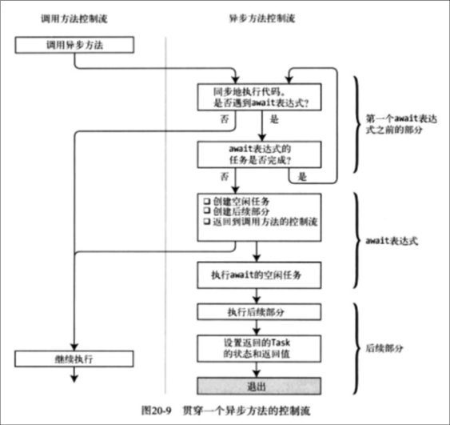

# 高级班级：多线程编程

## 20200803Advancen14Course12Async

### 系统自定义委托

`Func是有返回值`的委托，Action是没有返回值`的委托

#### Func：有返回值

- 有返回值：

  Func<bool> func = () =>
           {
               Console.WriteLine("这是有返回值的Func");
               return true;
           };
           bool str_return= func();

- 有返回值有参数委托：

  Func<string,bool> func=(a)=>

{

```
 Console.WriteLine("这是有返回值有参数的Func"+a);
            return true;
```

}

 

#### Action：无返回值

- 有参数Action：

Action<string> action =(ar)=>

{

  Console.WriteLine("输出参数"：+ar)

}

- 没有参数Action：

Action action=()=>

{

Console.WriteLine("没有参数")

}


单个线程操作5次消耗10秒钟，分为5个线程并发不一定就是五倍的效率，也就是一定是2秒钟可以解决，可能是接近五倍，比如3秒，2.5秒，因为线程的调度也是需要消耗资源，可能是无限接近5倍（看线程操作的场景）

**多线程资源换取时间：**多线程执行的时候需要使用很多CPU的资源，时间上是可以缩短，但是消耗更多的资源，以资源换取时间

异步方法无序性：同步方法按照循序执行，异步方法无序性，启动没有顺序，由操作系统进行调度决定，结束也没有顺序

### **异步输出执行进度：**

ProgressBar进度控件

##### 传统异步：BeginInvoke


##### C#5.0异步：Task＋async＋await

双异步输出（耗时也是多线程异步）：原来需要25秒输出的，耗时操作也是异步的话只需要5-8秒；


**异步的回调函数：**ContinueWith


**Abort线程终止：**线程无法从外部去终止，Thread.Abort() 从内部终止线程，从内部调用，调用后会出现异常，利用异常终止线程

**线程优先级：**每个线程都是有优先级的， 可以手动给线程赋值，设置最高的优先级不一定就会马上去执行它，设置优先级只是提高了它被优先执行的概率。

**变量作用域：**大括号{}中的变量是独立的，不同{}的变量命名可以重复

##### 让线程等待执行的三种方法

- Thread.Join（）  //等待线程内容执行完毕

- Thread.Join(500)  //等待500毫秒后，不管有没有执行完，都不等了

- While方法：while(如果线程状态不等于已结束){Thread.Sleep(1000);   //主线程休息一秒}

  

##### 前台线程（默认前台线程）

Thread线程默认是前台线程，即使主线程结束，或者主线程的进程被关闭，前台线程也会运行完所有操作再结束，前台线程即使主线程窗体被强制关闭，前台线程中的操作还是会执行完毕。如果主线程没有执行完毕，也会等待前台线程的执行

##### **后台线程**

主线程结束后，后台线程马上结束。后台线程中主线程窗体被强制关闭，后台线程会马上结束，后台线程随着主线程的结束而结束，即使后台线程没有执行完，主线程也不会等它。

## 20210803Advanced15Course13Task

### Task

Task创建的三种方式：

- 实例化对象创建：

  ```
  Task task = new Task(new Action(() =>
  {
      Console.WriteLine("输出1");
  }));
  task.Start();
  ```

  很消耗资源，如果对task对象有高度的控制需求使用，一般不推荐使用

- 静态方法创建（常用）：

  ```
  Task.Run(() =>
  
     {
  
     Console.WriteLine("输出2");
  
     });
  ```

  语法简洁推荐使用，Task.Run()并不是马上执行，代表从操作系统申请资源开启线程，有可能是马上执行，也有可能等待操作系统提供线程资源中，等接收到资源后再进行执行

- 工厂属性创建：

  ```
  TaskFactory factory = Task.Factory;
       factory.StartNew(() => { Console.WriteLine("输出3"); },TaskCreationOptions.LongRunning);
  ```

  TaskFactory优点是可以执行长时间的操作，线程池不会等待这个线程回收，并且比Task实例化对象有更多的安全参数


**PS:Task也有优先级**，TaskCreationOptions枚举，默认是TaskCreationOptions.None,设计PreferFairness第二个优先级的目的是，先申请的会优先执行

 **Task.Delay(3000)**：三秒后执行一个回调函数（不会卡顿界面），有点像定时三秒后执行一段业务逻辑，比如查询的时间超过了3秒，更改一下界面的提示：数据正在马不停蹄的查询中，请稍后。程序对用户的友好型更好

```
        Task task = new Task(new Action(() =>
        {
            for (int i = 0; i < 50000; i++)
            {
                Console.WriteLine(i);
            }
        }));
        task.Start();
        Task.Delay(3000).ContinueWith((a) => { Console.WriteLine("三秒后的一个回调函数，一段运算逻辑"); });
```

 **适用多线程的场景：**方法有多个行为的时候可以用多线程并发执行，或者行为可以拆分为多个，那么也可以使用多线程

#### Task.WaitAll

会阻塞线程，不支持回调函数，不支持委托的返回值。使用场景比如开启一个页面的时候，要加载拆书家分舵信息，拆书家实录信息，拆书家自我介绍信息，我们可以建立三个线程并发执行，用WaitAll等待所有线程执行完毕后，再把数据绑定到页面，再刷新页面

#### Task.WaitAny

会阻塞线程，不支持回调函数，不支持委托的返回值。使用场景比如首页面加载数据，加载的途径有三种：缓存，数据库，接口，三种途径都可以查询数据，这个时候我们可以开三个线程，并发查询三种情况，哪种情况先返回数据，就用哪个数据。传统方法查询的话可能是先去查询缓存，缓存有就用缓存，没有的话再查询数据库，数据库没有再查询接口，这种耗费的时间长一些，不过对资源的使用少一些，使用WaitAny对资源的要求多一些，客户的体验性会好很多

#### factory.ContinueWhenAny

不会阻塞线程，有回调函数，支持委托的返回值

像WaitAny的使用场景，加载页面数据，三种加载方式：缓存，数据库，接口取到其中一个值

#### factory.ContinueWhenAll

不会阻塞线程，有回调函数，支持委托的返回值

 像WaitAll的使用场景，等待页面数据加载完毕，拆书家分舵信息，拆书家实录信息，拆书家最近活动三种信息加载完毕后，再进行展示页面信息进行绑定。

#### Task.Wait

Task.Wait(2000),比如Task中出现了超时，异常的情况，那么是不需要等待了，主线程等待2秒过后就不等了（操作继续执行），主线程继续往下面执行,也可以设置token取消参数，超过了多长时间就取消不等待了。

## 线程池

#### Parallel（p（浒厂话泼水的泼）曰浪（三声））（替换ThreadPool（瘸得普ong）线程池）

作用控制线程Task的数量，方便创建的同时，不至于对创建线程会成为泛滥的状况。用于同时对多个对象要进行相同的一个行为，比如验证1000个类型对象取值的合法性，判断合法性就是一个行为，1000个对象的行为都是相同的。使用Parallel.Invoke()的时候，有可能是主线程，新线程调用，使用Task.Run变成异步，不会阻塞主线程，比起创建多个Task，语法上会更加简介，方便，但是没有单个创建，当个创建的Task灵活可以同事处理不同类型的任何，

##### Paraller.ForEach: 

根据集合的长度创建线程，线程创建中单个线程中是可以使用遍历集合中的变量参数，比如说处理1000个对象中的变量的值，需要判断是否合法，我们可以开始线程并发处理这1000个对象，但是线程的数量是需要进行控制的，因为计算机的资源是有限的，如果我们创建1000个线程去处理，对资源的索取太过于集中，可能会产生问题，我们可以通过ParallerOptions这个参数对并发的线程数量进行控制，达到单个操作限制使用系统资源的目的。

##### Parallel.For ：

一次创建指定int长度的线程，像for循环中配置int i=数量个数的参数


通过设置ParallelOptions的线程数的参数，设置开启的线程，如果上面四个方法，设置的是两个MaxDegreeOfParallelism那么代表会开启两个线程先执行两个委托，然后等执行的两个委托执行完毕再继续执行剩余的委托，如果设置的是4个，那就是单次可以同时并发四个委托进行执行，执行的时候可能主线程会参与运算，也可能是新的线程运算


```
        ParallelOptions options = new ParallelOptions();
        options.MaxDegreeOfParallelism = 2;
        Task.Run(()=> 
        {
            Parallel.Invoke(options, () =>
            {
                for (int i = 0; i < 2000; i++)
                {
                    Console.WriteLine($"{Thread.CurrentThread.ManagedThreadId},输出值：{i}");
                }
            }, () =>
            {
                for (int i = 0; i < 2000; i++)
                {
                    Console.WriteLine($"{Thread.CurrentThread.ManagedThreadId},输出值：{i}");
                }
            }, () =>
            {
                for (int i = 0; i < 2000; i++)
                {
                    Console.WriteLine($"{Thread.CurrentThread.ManagedThreadId},输出值：{i}");
                }
            });

        });  
        Console.WriteLine("在Task.Run异步环境中，这个是第一个输出");
        Console.Read();
```

在Task.Run异步环境中，主线程不会参与到Parallel.Invoke的委托执行中，执行委托的线程都是新创建的委托，使用Task调用不会阻塞线程，所以Thread.ID中没有1的索引
                "

#### ThreadPool（瘸得普ong）

- 重复使用Thread，节省系统资源
- 不需要程序员自己去管控线程的数量

## Task进阶： 

### async,await方法的执行顺序



### Task的返回值

```c#
       //如果不用await 那么可以用Task<int>
       Task<int> value =CalculateSumAsync(5, 6);  
       //如果用await那么需要用Int接收
       int value =await CalculateSumAsync(5, 6);

   //如果不用await 那么可以用Task<string>
   Task<string> excel = await GetContentAsync(path);
   //如果用await那么需要用string接收
   string excel = await GetContentAsync(path);
```


**Task不适合做大量的运算工作**，比如下面for循环中的并发计算，你会发现与同步的for循环100万次的时间差不了几秒（实测循环100万次，并发耗时107秒，同步计算117秒，不是想象中的三倍性能）。Task适合有等待，延迟的场景使用，比如读取设备信息，访问网络API,读取数据库数据，读取服务器文件信息这些行为都有延迟的场景使用异步，性能会更加好


### Task的并发使用（模拟）

```
          Stopwatch watch = new Stopwatch();
            watch.Start();
            Console.WriteLine($"***************Task并发执行开始************");
            Task task1 = Task.Run(() =>
              {
                  //模拟耗时，需要等待的操作
                  for (int i = 0; i < 100_00_00; i++)
                  {
                      Console.WriteLine(i);
                  }
              });
            Task task2 = Task.Run(() =>
            {
                //模拟耗时，需要等待的操作
                for (int i = 0; i < 100_00_00; i++)
                {
                    Console.WriteLine(i);
                }
            });
            Task task3 = Task.Run(() =>
            {
                //模拟耗时，需要等待的操作
                for (int i = 0; i < 100_00_00; i++)
                {
                    Console.WriteLine(i);
                }
            });
            Task[] task_array = new Task[] { task1, task2, task3 };
            Task.WaitAll(task_array);
            Console.WriteLine($"***************Task并发执行结束，总共耗时：{watch.ElapsedMilliseconds}************");
            Console.Read();
```


### 线程的异常

线程的异常在外部是捕获不到的，比如下面try catch是捕获不到异常的。

```
        try
        {
            Task.Run(() => {

                int i = 0;
                Console.WriteLine(1 / i);
            });
        }
        catch (Exception ex)
        {
            Console.WriteLine(ex.Message);
            
        }
        Console.Read();
```

把try,catch放到内部进行捕获可以捕获到异常：

```
        Task.Run(() => {

            int i = 0;
            try
            {
                Console.WriteLine(1 / i);
            }
            catch (Exception ex)
            {
                Console.WriteLine(ex.Message);
            }
            Console.WriteLine("出现了问题要停止，这段不执行");

        });
        Console.Read();
```

不过又有一个问题，外部怎么知道了有异常？

```
        Task task = Task.Run(() =>
        {

            int i = 0;
            Console.WriteLine(1 / i);
            Console.WriteLine("出现了问题要停止，这段不执行");
        });
        try
        {
        task.Wait();  //使用Wait，外界就可以捕获到异常
        }
        catch (Exception ex)
        {
            Console.WriteLine("看看捕获的异常"+ex.Message);
        }
        Console.Read();
```

五个线程并发，然后其中一个线程出现了异常被取消了，我作为主线程怎么取消这个行为呢

##### 内部异常捕获后，取消线程的三种方法：

- **Abort**：Thread的解决方法是Abort（）方法，抛出ThreadAbortException异常。
- **中间变量**：bool IsException=false中间变量,如果有异常那就变成true;
- **CancellationTokenSource（推荐使用）**：CancellationTokenSource  对象中的Cancel()方法被调用后（在线程内部的Exception异常捕获中调用），那么IsCancellationRequested属性等于true代表线程被主动取消,默认等于false代表线程正常运行（也可以主动调用CancellationTokenSource .Token.CancellationTokenSource()如果线程被取消则直接返回一个线程取消的异常），利用CancellationTokenSource.Token参数传播线程被取消的通知，让还没有开始的线程不要开启线程，Task.WaitAll方法，Task.Run方法中可以使用

问题的解决方案（待验证）：这种方式有缺陷，不能及时响应到线程的异常，因为我们要在线程出现异常的时候马上终止所有的线程，而不是等到WaitAll的时候再进行取消线程。当多线程发生异常被取消的时候有三种情况：

- 在取消操作之前，有线程已经执行完毕
- 在取消操作之前，有线程已经开始执行，但是没有执行完毕 ，线程被取消
- 在取消操作之前，有线程还没有开始执行 ，线程被取消

```
        try  
        {
           taskList.Add(task1);
           taskList.Add(task2);
           taskList.Add(task3);
           Task.WaitAll(taskList.ToArray()); //1 可以捕获到线程的异常
        }
        catch (AggregateException aex) //2 需要try-catch-AggregateException
        {
            foreach (var exception in aex.InnerExceptions)
            {
                Console.WriteLine(exception.Message);
            }
        }
        catch (Exception ex) //可以多catch  先具体再全部
        {
            Console.WriteLine(ex);
        }
```

##### 多线程抛出的异常类型：AggregateException

AggregateException异常类它是一个异常集合，他的作用是将多个异常集中到一个可抛出的异常中。
它有个InnerExceptions属性，是一个只读集合类，可通过遍历该集合查找集中的所有单个异常。

```
            List<Task> task_list = new List<Task>();

            Task task = Task.Run(() =>
            {

                int i = 0;
                Console.WriteLine(1 / i);
                Console.WriteLine("出现了问题要停止，这段不执行");
            });
            Task task2 = Task.Run(() =>
            {

                int i = 0;
                Console.WriteLine(1 / i);
                Console.WriteLine("出现了问题要停止，这段不执行");
            });
            Task task3 = Task.Run(() =>
            {

                int i = 0;
                Console.WriteLine(1 / i);
                Console.WriteLine("出现了问题要停止，这段不执行");
            });
            task_list.Add(task);
            task_list.Add(task2);
            task_list.Add(task2);
            try
            {
                Task.WaitAll(task_list.ToArray());  //使用Wait**，外界就可以捕获到异常
            }
            catch (AggregateException ex) 
            {
                //通过ex.InnerExceptions查看线程中产生的所有异常（这里有三个异常）
                foreach (var item in ex.InnerExceptions)
                {
                    Console.WriteLine("看看捕获的所有的异常" + item.ToString());
                }
            }
            catch (Exception ex)
            {
                Console.WriteLine("看看捕获的异常2" + ex.Message);
            }
            Console.Read();
```

### 线程安全

如果单线程的执行结果与多线程的执行结果是完全一致的，那这个线程就是线程安全的,如果线程中对变量只有读的操作可以说线程是安全的，如果线程中对变量有写的操作，一般需要操作**线程同步**问题。

下面是解决线程安全的三种方法：

- 使用Lock关键字，解决线程安全
- 使用分块分区，解决线程安全
- 使用线程安全对象，解决线程安全

#### Lock(Object)解决线程安全


**Lock（落k）**关键字可以解决线程安全问题。但是给变量加锁是反多线程的，加锁的话线程的运行效率会有所下降，因为加上锁的话当前线程会占用当前的变量，如果有另外的线程要操作这个变量内部的逻辑，就需要在当前线程后面进行排队。

```
    private readonly static object obj_lock = new object();
    static void Main(string[] args)
    {
        List<int> list_int = new List<int>();
       
        for (int i = 0; i < 100_00; i++)
        {
            Task.Run(() =>
            {
                //排他锁
                lock (obj_lock)
                {
                    list_int.Add(i);
                }
               
            });
        }
        Console.WriteLine(list_int.Count);
        Console.Read();
    }
```

- Lock{}作用域里面的数值是唯一的，只属于一个人，里面是属于一个人的操作，区分线程外面的值每个线程都有自己一条线程，自己的不同变量与变量的值。
- 看线程需要在哪里进行停顿，Lock（obj_LoCK）就锁在哪里，比如在双色球的案例中，我们锁住双色器的随机数取值后面，在Lock作用域里面进行是否重复的判断。（**有个技巧就是，加lock锁后，用逻辑推演一下运行的结果，然后进行取舍**）

**线程死锁：**List_task.WaitAll()死锁问题，主线程会负责给自己的lable控件的变量赋值，再主线程WaitAll()子线程运行完毕的时候，但是子线程在等待主线程给lable控件赋值。

**双色球案例：**

```
    //1.显示的方法是展示lable text中的值,点击的时候取消线程操作
    //2.label中的值使用Random随机取值
    //3.每个label的赋值都是单独的线程
    
    //取消类库
    CancellationTokenSource token = new CancellationTokenSource();
    List<Task> task_list = new List<Task>();
    private void button1_Click(object sender, EventArgs e)
    {
        token = new CancellationTokenSource();
        Task task_label1 = Task.Run(() =>
     {
         while (!token.IsCancellationRequested)
         {
             Thread.Sleep(1000);
             string sjs = new Random().Next(1, 38).ToString();
             Console.WriteLine($"{Thread.CurrentThread.ManagedThreadId},看看随机数：{sjs}");
             Action action = () =>
             {
                 label1.Text = sjs;
             };
             Invoke(action);
         }
     });
        Task task_label2 = Task.Run(() =>
        {
            while (!token.IsCancellationRequested)
            {
                Thread.Sleep(1000);
                string sjs = new Random().Next(1, 38).ToString();
                Console.WriteLine($"{Thread.CurrentThread.ManagedThreadId},看看随机数：{sjs}");
                Action action = () =>
                {
                    label2.Text=sjs;
                };
                Invoke(action);
            }
        });
        Task task_label3 = Task.Run(() =>
        {
            while (!token.IsCancellationRequested)
            {
                Thread.Sleep(1000);
                string sjs = new Random().Next(1, 38).ToString();
                Console.WriteLine($"{Thread.CurrentThread.ManagedThreadId},看看随机数：{sjs}");
                Action action = () =>
                {
                    label3.Text=sjs;
                };
                Invoke(action);
            }
        });
        Task task_label4 = Task.Run(() =>
        {
            while (!token.IsCancellationRequested)
            {
                Thread.Sleep(1000);
                string sjs = new Random().Next(1, 38).ToString();
                Console.WriteLine($"{Thread.CurrentThread.ManagedThreadId},看看随机数：{sjs}");
                Action action = () =>
                {
                    label4.Text=sjs;
                };
                Invoke(action);
            }
        });
        Task task_label5 = Task.Run(() =>
        {
            while (!token.IsCancellationRequested)
            {
                Thread.Sleep(1000);
                string sjs = new Random().Next(1, 38).ToString();
                Console.WriteLine($"{Thread.CurrentThread.ManagedThreadId},看看随机数：{sjs}");
                Action action = () =>
                {
                    label5.Text=sjs;
                };
                Invoke(action);
            }
        });
        Task task_label6 = Task.Run(() =>
        {
        
            while (!token.IsCancellationRequested)
            {
                Thread.Sleep(1000);
                string sjs = new Random().Next(1, 38).ToString();
                Console.WriteLine($"{Thread.CurrentThread.ManagedThreadId},看看随机数：{sjs}");
                Action action = () =>
                {
                    label6.Text=sjs;
                };
                Invoke(action);
            }
        });
        task_list.AddRange(new Task[] { task_label1, task_label2, task_label3, task_label4, task_label5,task_label6 } );
        //使用Task工厂方法调用有回调函数的ContinueWhenAll
        Task.Factory.ContinueWhenAll(task_list.ToArray(), (t)=> { Action a = () => { ShowSsq(); }; Invoke(a); });
    }

    private void button2_Click(object sender, EventArgs e)
    {
        token.Cancel(); // 取消线程
     
    }
    public void ShowSsq()
    {
        StringBuilder builder = new StringBuilder();
        builder.Append(label1.Text + "，");
        builder.Append(label2.Text + "，");
        builder.Append(label3.Text + "，");
        builder.Append(label4.Text + "，");
        builder.Append(label5.Text + "，");
        builder.Append(label6.Text);
        MessageBox.Show(builder.ToString());
    }
```

#### 分块分区解决线程安全（推荐使用）：

比如一个行为是Insert 10000条数据，那么可以把这个行为分成5个线程去Insert，每个线程负责2000条数据的入库，那么这五个线程就是单线程的

#### 使用线程安全对象，解决线程安全：

使用安全的数据结构，线程安全对象，List/ArrayList不是线程安全的对象，ConcurrentBag（坑克远t）<T>集合，BlockingCollection<T>集合是线程安全的

ConcurrentBag:线程安全的集合

```
ConcurrentBag<int> cb = new ConcurrentBag<int>();

List<Task> bagAddTasks = new List<Task>();
for (int i = 0; i < 500; i++)
{
var numberToAdd = i;
bagAddTasks.Add(Task.Run(() => cb.Add(numberToAdd)));
}
// Wait for all tasks to complete
Task.WaitAll(bagAddTasks.ToArray());
```


### 线程安全扩展中间变量：K与I

```
        for (int i = 0; i < 5; i++)
        {
            //中间值，循环多少次，创建多少个这个变量，而Thread线程中引用的都是当前{作用域中引用的}的K
            int k = i;
            new Thread(()=> 
            {
                Console.WriteLine($"{Thread.CurrentThread.ManagedThreadId},I的值{i},K的值{k}");
            }
            ).Start();
        }
       
        Console.Read();
```

### async(儿think)，await(儿wait)

#### 什么时候用Task.Run什么时候用async?

感觉async可以适用百分之99的场景，剩下的高并发，高性能，多个Task之间没有依赖的场景，交给Task.Run去做。


如果要用到返回的结果，那么用async:

- 读取文件
- 访问数据库
- 请求WebApi
- 访问设备

如果不用返回的结果，用Task.Run：

- 删除数据
- 上传数据

 写的时候问问自己当异步结束后要不要为这个方法负责？可以让它自身自灭。如果是Yes，那可以用Task.Run，如果是No，那么还需要为他产生的结果做处理，那么用async

 

 **Task.Run场景：**

- 多个行为并发执行，要求单个单个Task之间对互相没有依赖关系 ，对性能要求很高

 **async场景：**

   

- async可以使用很多NET框架的原生异步API，**调用方法简单，操作的粒度更小，同步执行能很好获取执行结果**，比如异步读取文件内容（）

  ```c#
         async  static Task Main(string[] args) //
          {
              string path = @"C:\Users\Administrator\Desktop\03品类属性映射导入模板-男装.xlsx";
              Console.WriteLine($"主方法开始读取文件,线程{Thread.CurrentThread.ManagedThreadId}");
  //1.主线程在碰到子线程中的await的时候，就释放掉了，后面的子方法与主方法中的线程都交给子线程3执行，主线程下面的for打印日志并不会马上执行
  //2.如果我们把await GetContentAsync(path);中的await去除，那么主线程会在碰到子线程中的await返回到主线程进行执行for循环打印日志，而且碰到子线程中的Thread.Sleep(3000)也不会阻塞主线程
  //3.使用await还变成不是异步方法的原因，就是【await后面的方法都需要等待他执行完后才能执行】，这个步骤里面主线程执行到异步方法里遇到await 相当于开启了另外一个线程开始执行，主线程和子线程在同时执行，main方法里边使用 await 相当于主线程要等子线程在这一步获取到执行结果后再去执行后边的逻辑
              string excel = await GetContentAsync(path);
              Console.WriteLine($"主方法读取文件结束？,线程{Thread.CurrentThread.ManagedThreadId}");
  
              for (int i = 0; i < 100; i++)
              {
                  Console.WriteLine(i);
              }
              Console.WriteLine($"主方法读取文件大小：{excel.Length},线程{Thread.CurrentThread.ManagedThreadId}");
              Console.Read();
  
          }
  
          //异步读取文件内容
          public async static Task<string> GetContentAsync(string filename)
          {
  
              FileStream fs = new FileStream(filename, FileMode.Open);
              var bytes = new byte[fs.Length];
              Console.WriteLine($"子方法开始读取文件,线程{Thread.CurrentThread.ManagedThreadId}");
              int len = await fs.ReadAsync(bytes, 0, bytes.Length);
              Console.WriteLine($"子方法读取文件结束,线程{Thread.CurrentThread.ManagedThreadId}");
              string result = Encoding.UTF8.GetString(bytes);
              return result;
          }
  //返回结果
  主方法开始读取文件,线程1
  子方法开始读取文件,线程1
  子方法读取文件结束,线程3
  主方法读取文件结束？,线程3
  0
  1
  ...中间略过
  99
  主方法读取文件大小：783246,线程3
  
  
  ```

- async可以更简单的操作异步，比如上面异步读取文件，不会阻塞主线程继续往下执行，而且async异步中的执行顺序是同步的，编程的程序员更好操作读取后面的文件内容。

- async可以让主线程放心干自己的事情，不用管它。比如说我需要异步里面的返回值来做一些操作（比如说把DataTable给DataGridView），如果传统的Task的Result方法就需要等待异步执行结束主线程才能执行接下来的。如果使用 async方法的话，就相当**把异步的返回值放到 async方法里面来做操作，而且主线程不用等待**，在winform中async方法中由于碰到await方法返回成主线程运行特性，也可以很好的操作页面控件

  ```
  private async void button1_Click(object sender, EventArgs e)
  {
     await SetData();
  
  }
  //使用async异步访问数据结果
  public async Task SetData()
  {
  
      DataTable dt= await Task.Run(()=> 
      {
        return  GetDataTable();
      });
      dataGridView1.DataSource = dt;
      MessageBox.Show("返回结果成功！");
  }
  ```

- async可以把激活方法进行并行执行，**注意是多个线程同步的并行（乌龟），并不是异步的并发**！，主线程叫醒它干活后，自己主体回到主线程中继续工作（就好像把自己的本体复制了一份），喊一个人起来干活，然后自己回到主线程继续工作，两边都不用闲着，而且不用管执行逻辑，因为是同步执行不会有什么问题

#### 使用async,await优点*

- **提高执行性能与Cpu的利用率**，提高线程的吞吐，同时主线程不会出现阻塞，提高程序性能，降低计算的时间

- **异步方式的并行编程**：下一个await方法需要等到上一个await方法执行完成后（可能下面的await方法需要上一个的结果），才会执行。

- **降低编程难度**：因为是同步执行，所以对于开发人员编码来说不会这么复杂，await下面的代码会等待上一个await方法结束后再开启线程执行。我们来看Task.Run是异步并行执行，有多个Task.Run在同一个作用域里面他们互相不会等待，这个时候如果下一个Task要用到上一个Task的返回值的时候，需要注意Task.Run的执行到了哪个环节，要通过Wait()，IsCompleted等于true,task.Result等待返回值 ，这种阻塞线程的方法获取返回值，继续下一步的执行。

  如果用同步编程的方式进行多线程的编程，比如Tack.Run.ContinueWith(Tack.Run.ContinueWidth(...))回调函数是可以实现的但是非常别扭。

- **降低了线程的数量，减少了CPU的负载**，同样CPU的资源下，可以使用async做更多的事情： async使用的线程比Task.Run要少一些，因为await方法使用的线程是由硬盘提供不需要CPU参与（NET 框架提供的Async API是硬盘DMA技术访问IO，一般耗时的操作都会有Async版本API） ，直接由硬盘进行线程读写操作，不需要CPU参与，等硬盘处理完了再把结果告诉CPU，CPU再接着处理。Task.Run()在线程里面执行操作没有结束的话，线程会一直保留不会释放（只有释放后可以给到下一个Task.Run()进行循环使用），会使用更多的线程与CPU的资源

- **await比Task.Run更加合理**

  ```
  SqlConnection conn = new SqlConnection();
  conn.Open();
  SqlDataAdapter adapter = new  SqlDataAdapter();
  Task task= Task.Run(() =>
  {
    adapter.Fill(set);
  });
  //刚刚异步执行，然后wait又会阻塞主线程，那么为什么要用异步？
  task.Wait();
  ```


#### Async使用的场景

- **请求WebAPI：**网络请求的时候一般都会有一定的延迟，这时候可以使用await关键字提高性能
- **文件读取，上传，删除：**文件读取/上传/删除的时候一般都会有一定的读取时间，文件越大，时间可能等待越久，这个时候也可以提高性能
- **数据库的打开：**一般数据库的打开会有一定的延迟，这个时候也可以提高性能
- **读取数据库信息：**对数据库进行数据的读取，也会有等待的时间，可以提高性能
- **设备连接：**与外界的设备进行连接的时候一般会有延迟，比如鼠标，身份证读卡器，


#### await执行顺序

 主线程先执行自己线程内的代码，然后主线程进入到执行async方法中，当碰到await关键字修饰的方法后，主线程会马上退出方法体，回到原来的方法体中，继续执行async方法下面的代码，同时await方法会新开线程同步执行方法中的内容，await方法中的后续的代码都要要等await异步执行的内容运行结束后才能继续执行（有点像回调方法ContinuWith），这个时候await方法下面的代码，有两种线程执行顺序：1.由执行await的子线程继续执行 2.主线程执行。一般情况下如果主线程返回后原来的方法体中没有代码需要继续执行，那可能主线程执行await方法后面的代码，否则可能await创建的子线程执行await后面的代码逻辑。有一种特殊情况一定是主线程执行await关键字后面的方法，那就是在在winform框架中，await关键字后面肯定是主线程继续执行代码，这个是winform框架的底层设计。


#### 深入普析async：ILPlay反编译:

async 创建新建一个**状态机**类 ，里面有Num保存状态机的状态，默认是-1，异常为-2，Num状态机的值从0开始（看await的数量有多少，0,1,2,3表示多个await的方法）通过 MoveNext() 返回到主线程，创建新线程返回到MoveNext(),拿到结果，进入到下一个await的MoveNext，里面return返回到主线程，然后通过ThreadPool创建新线程重新回到MoveNext获取到GetReturl的返回值，然后通过Goto I00_09标签进入到获取返回值逻辑，然后创建下一个await，里面return返回到主线程，通过ThreadPool创建新线程重新回到MoveNext获取到GetReturn的返回值。

#### 


#### 其他注意

- 开始await的线程是主线程开启，是子线程负责结束	

- await task ，await后面一定要接 task，我觉得task.Run其实是服务于async的	

- 四个await执行的效率比四个Task.Run()肯定是要慢的，因为第二个await会等待第一个await运行完毕后才会开启线程执行，但是Task.Run()是不会等待的，它是同步并发执行，不过Task会消耗更多的CPU资源。

- **引用被async修饰方法的方法体，需要使用async关键字修饰，不然方法不会等待**

- winform中await后面的内容一定是主线程执行的，这个是winform框架的设计，asp.net webapi，控制台中不会有这种情况，还是会出现线程无序性，await后面的内容可能是主线程执行，也可能是子线程执行

- Async与await关键字本质是语法糖，底层还有很多实现代码（**状态机**）

- Async版本可以降低CPU的负载

- **【重点】方法加了await关键字，返回值的类型请去除Task，返回返回的值本体，如果没有await关键字那就需要Task<返回值类型>。**

- 一个简单绑定窗体DataSource值的信息

  ```
  /// <summary>
  /// 获取数据库的信息
  /// </summary>
  /// <returns></returns>
  public async Task<DataTable> GetDataTable()
  {
      Console.WriteLine($"GetDataTable线程编号:{System.Threading.Thread.CurrentThread.ManagedThreadId}，Begin*****************");
      #region 获取方法信息
      DataSet set = new DataSet();
      DataTable dt = null;
      string connection = "Data Source=.; Initial Catalog=TakeApartBook ;User ID=sa; PassWord=123;";
      string sql = @"SELECT TOP 1000 [taged]
            ,[author]
            ,[image]
            ,[intro]
            ,[isbn]
            ,[pubdate]
            ,[publisher]
            ,[title]
            ,[translator]
            ,[url]
            ,[memCount]
            ,[tags]
            ,[id]
        FROM[TakeApartBook].[dbo].[t_Book] ";
      System.Data.SqlClient.SqlConnection conn = new System.Data.SqlClient.SqlConnection();
      conn.ConnectionString = connection;
      System.Data.SqlClient.SqlCommand comm = new System.Data.SqlClient.SqlCommand();
      comm.CommandText = sql;
      comm.Connection = conn;
      System.Data.SqlClient.SqlDataAdapter adapter = new System.Data.SqlClient.SqlDataAdapter();
      adapter.SelectCommand = comm;
      #endregion
      try
      {
    conn.Open();
      //用同步的方式，异步获取数据
      //await的作用在于：
      //1.我激活当前获取数据的线程，然后把主线程进行返回,保证主线程的正常运行
      //2.而且await下面的方法需要等待我执行结束了，才能继续执行（符合同步的思想）
      dt = await Task.Run(() =>
      {
          Console.WriteLine($"GetDataTable线程2编号:{Thread.CurrentThread.ManagedThreadId}，Begin*****************");
          adapter.Fill(set);
          if (set != null && set.Tables.Count > 0)
          {
              Console.WriteLine($"GetDataTable线程2编号:{Thread.CurrentThread.ManagedThreadId}，End*****************");
              Console.WriteLine("有值吗?" + set.Tables[0].Rows.Count);
              return set.Tables[0];
          }
          else
          {
              return null;
          }
          
      });
          
  }
  catch (Exception)
  {
          
      throw;
  }
  finally
  {
      conn.Dispose();
      comm.Dispose();
      adapter.Dispose();
  }
          
  Console.WriteLine($"GetDataTable线程编号:{System.Threading.Thread.CurrentThread.ManagedThreadId}，End*****************");
          
  return dt;
  }
  ```

  ​             

  ​    
  ​        private void button1_Click(object sender, EventArgs e)
  ​        {
  ​            Console.WriteLine($"button1_Click线程编号:{Thread.CurrentThread.ManagedThreadId}，Begin*****************");
  ​           
  ​            Task.Run(() => 
  ​            {
  ​                Task<DataTable> task_dt = GetDataTable();
  ​                Action action = () => 
  ​                {
  ​                    dataGridView1.DataSource = task_dt.Result;
  ​                };
  ​                Invoke(action);
  ​            });
  ​           

```
          Console.WriteLine($"button1_Click线程编号:{Thread.CurrentThread.ManagedThreadId}，End*****************");
      }
```

- 使用Task.Run执行获取数据库数据的异步：

  ```
  Task.Run(() =>
  {
  //获取数据库数据的异步
      return GetDataTable();
  }).ContinueWith((task)=> 
  {
      if (task.Result!=null&& task.Result.Rows.Count>0)
      {
          Action action = () =>
          {
              dataGridView1.DataSource = null;
              Thread.Sleep(1000);
              dataGridView1.DataSource = task.Result;
          };
          this.Invoke(action);
          MessageBox.Show("数据加载完毕");
      }
      else
      {
          MessageBox.Show("没有找到对应的数据");
     }
  ```

  });

  ​           

- 一个简单的async,await声明与引用的例子

  ```
  public async Task<int> GetNum()
  {
      //第一种写法：直接return task.run
      //return await Task.Run(() => { return 2; });
      //第二种写法：直接返回值 2 等同于返回 Task<int>,也就是上面那种
      int result=await Task.Run(() => { return 2; });
      return result;
    
  }
  public void ShowNum()
  {
    
      Task<int> i = GetNum();
      Console.WriteLine(i.Result);
  }
  ```

- Async也可以用到Lamda表达式中：

  ```
  public void Configure(IApplicationBuilder app, IWebHostEnvironment env)
  {
  //看这里的Async
  app.Use(async (context, next) =>
  {
  await context.Response.WriteAsync("Hello World Use1 <br/>");
  await next();//调用下一个中间件
  await context.Response.WriteAsync("Hello World Use1 End <br/>");
  });
  app.Use(async (context, next) =>
  {
  await context.Response.WriteAsync("Hello World Use2 Again <br/>");
  await next();
  });
  }
  ```

  

#### 打一些例子巩固：

**开双进程，检查Thread.ID是操作系统分配，还是单个进程分配**	

 **async方法的返回值Void也会返回Task返回值**

**用await ,task重新写数据库异步获取数据，加数据返回值异步获取数据进行绑定**

