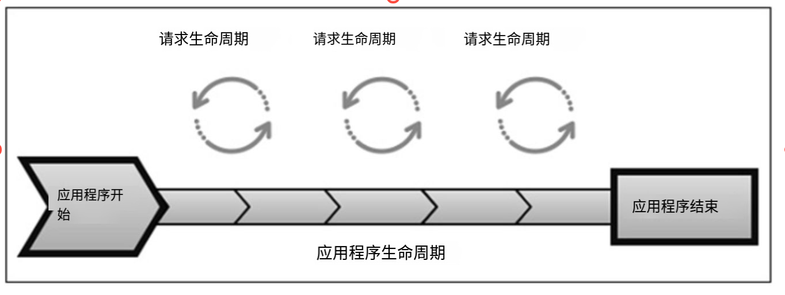
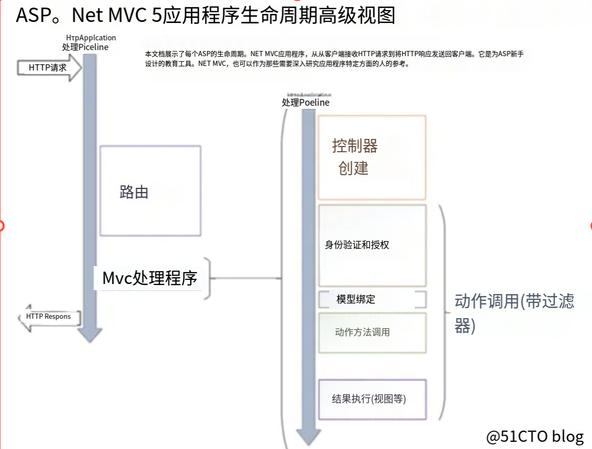

# 再厉害的代码也是为了更好的帮助我们解决问题

碰到难的技术点的时候不应该被它吓住，用问题去代入它，这个技术点是用来解决什么问题的?我要怎么重现它，使用这个技术点去解决它？

# 框架读音

- Polly:珀(琥珀的珀)莉（李）
- Harbor: hei （一声）bei(一声)
- Devops：得哇普丝
- Controller：ken（三声）chou（四声）  lei（一声）
- Increment (in ke（二声）rui（四声） ment)
- Interlocked (in ter 落ke（一声） 丝)
- Concurrent （啃 kuo（二声）run（三声）t）
- webpack:web 帕(一声)克
- parallel:pei（二声）rua(一声)lou(一声)
- Route:肉t
- Parse:破丝
- Thread ：丝越的
- Sourcetree （so(四声) 丝 three）
- Coravel ：（ke(一声) rui （二声）wo(三声)）
- explain :(衣 ke（二声） 丝 pu(一声) 累 in）
- Configure：（configure）：就是配置的读音
- MyISAM（埋(二声)S A M）：支持表级锁定，全文索引，不支持事务
- Memory(Man 摸 rui（一声）)：内存数据库，快速读写临时数据很快，重启后数据丢失
- **Compact**（坑 pei（四声）ke(一声) te (一声)）: **InnoDB引擎默认的行格式**，可变字节长度
- **Redundant**(rui(一声) down 等 te(一声))：行级压缩和存储外键
- **Compressed** （啃 p ruai(四声) 丝 te(一声)）: 压缩行格式，但读取写入的时候需要额外解压缩
- **Dynamic** (待 na（二声） 米 ke（一声）) :行级压缩和外键信息
- Newtonsoft（妞吨涩府t）.Json**：处理Json的类库，比如可以用来转换Json为对象，序列化反序列化Json
- **RabbitMQ（rua(二声) B MQ）：**消息队列
- IServiceProvider（泼(浒厂) 歪（二声） 的）：通过它在控制器中直接进行注入
- Invoke （inwo(三声)k）：使用窗体的Invoke方法，执行指定的委托
- **Redis（曰diss）**：数据库名称，一般用于用户缓存
- **ServiceStack（丝der(二声)k）**.Redis：Redis官方推荐的NET访问Redis数据库的类库；
- **bootstrap（布特丝拽普）**:前端开源工具包，用来开发响应式网站，不用担心网站的兼容性，它可以帮助我们很好的兼容手机端与网页端的样式
- **Nuget（妞get）**：VS开发工具下面的开源包管理工具，可以用它来引用第三方的工具包（Jquery，bootSharp）或类库（比如ServiceSstack.Redis，Newtonsoft）
- Log4Net（log four Net）：绝对不能没有任何监控的项目上线！
- Kestrel（k（二声） s 肿）：NET5执行网站的小型的服务器
- ServiceCollection（磕 l k 藓）：startup.ConfigureService中进行注入
- Inject（in jack t）：通过它在cshtml直接注入
- Autofac（o 凸 f儿（三声） k ）：是一个流行的第三方IOC容器
- Unity：第三方IOC容器
- Consul：kan sou  就是你脑子的这个音， 服务注册，负载均衡，动态伸缩
- Ocelot（阿丝l t）：网关，负责限流，缓存，超时
- Nginx（N 借 k s）：反向代理，负载均衡
- Token（偷 ken（一声） ）：鉴权的钥匙
- identityServer4（i den(二声) tei(一声) 体）：身份鉴权的框架
- Castle：AOP注入框架
- Sugar: su(二声)哥

# 前进目标

## 移动开发者-架构师

- 架构师是负责一个程序的架构，他必须方方面面都需要考虑到，比如设计模式，适合项目的快速开发框架，网站安全方面，数据库性能，网站缓存，服务器集群,微服务模块之间的分割。
- 普通的搬砖工程师，工资相对于架构师是低的，他们日常工作中事情多而且比较杂。而架构师专注于系统的架构与系统底层代码，系统关键难点的突破，他们在软件开发的道路上是成长最快，待遇相对于更好的一个选择。
- 目前的趋势移动开发是主流，用技术影响身边的人
- 分布式缓存
- 分布式配置
- 分布式系统

# 让我进步的问题

## 怎么解决脏读与脏写的问题？

我觉得这个是高并发的场景下面会真实出现的问题，有多个线程对同一条数据进行了操作，怎么在既保证性能的情况下又能保证正确的结果，MySql用设置事务隔离级别设置为串行化来解决这个问题，但是这种事务隔离级别，同一时间不允许两个事务执行，完全杜绝了并发，对性能的损耗太大，实际场景中不会有人进行设置。


**简单的读写操作，碰到多线程高并发的场景就会有问题！**搜索关键字：怎么解决脏读 脏写 处理 解决方案 解决思路 解决办法

**解决方案：加锁（加锁也不能完全解决，只要并发的密度够大（可能超过150的并发），存在极低的可能有多个线程同时抢到了锁，解决防范：用 redis 原生支持的 setnx 来保证只有一个线程抢到了锁，扩展链接：[如何使用Redis实现悲观锁解决高并发情况下读写带来的脏读问题](https://blog.keyboardman.fun/php/1053.html)）**
举例：
a线程修改内存数据，修改到一半，b线程读了数据，a撤销修改了，那么造成b读的数据是脏的，无效的。
因此解决办法，a线程先锁定内存数据块，等完全修改好了再放开锁，这样在A改的过程中b都不了。
windows平台的加锁技术基本就是一些线程同步的技术，比如临界区、事件、互斥等等，都是采用信号通知的模式。一个线程放一个信号表示这块东西我用了。其他线程要用这个东西就必须等待，等我用完了再把信号撤掉，其他线程可以用了。

# 【面试高频问题】

## Http中Get Post方法调用有什么区别？

HTTP（超文本传输协议）的GET和POST都是用于客户端和服务器之间传输数据的方法，但它们在使用及功能上有一些主要的区别：

1. **作用**：一般我们通过POST把数据从客户端传输到服务器，通过GET从服务器请求数据到客户端
2. **数据传输位置**：
   - GET将数据附加到URL中，在URL中可以看到传输的数据。例如，`http://example.com/api?param1=value1&param2=value2`。
   - POST将数据放在HTTP请求的主体（Body）中，不会在URL中显示。
3. **安全性**：
   - GET较不安全，因为发送的数据是URL的一部分，容易被人看到，也可能被缓存或保留在浏览器历史中。
   - POST较安全，因为数据不会显示在URL中，对于传送敏感数据更加合适。
4. **数据大小**：
   - GET请求受URL长度限制，因此能够发送的数据量有限。
   - POST请求没有限制，可以发送大量数据，适用于文件上传等场合。
5. **幂等性**：
   - GET是幂等的，意味着多次执行相同的GET请求，资源的状态不会改变。POST不是幂等的，每次请求都可能导致服务器上的状态改变。
6. **用于CRUD操作**：
   - GET通常用于读取（Retrieve）操作。
   - POST通常用于创建（Create）操作，但也可以用于更新（Update）和删除（Delete）操作，尤其当使用RESTful API时。

## 专业系统名

MES：

ERP:

## 数据库优化

## 多线程

## 高并发

拿秒杀场景来做一个例子，首先我会把秒杀的业务放到单独一个服务器部署，防止最坏的情况出现--业务系统崩溃

然后我会在网关那里做限流的操作，比如秒杀的场景有100个人进来，其实100人进来后我可以在Nginx里面直接返回一个秒杀已经结束的页面，防止后端的接口并发量过大

数据库方面我会采用Redis缓存，可以将一些热点数据提前放到缓存里面，同时我们可以把秒杀的页面设置成静态的页面，因为一般秒杀开始的话，用户会一直刷新，刷新，这个时候可以把页面设置成静态页面，并且利用到浏览器的缓存

还有可以利用k8s自动扩容的功能，达到动态的负载均衡，流量太大，可以自动新增新的consul新的容器节点

可以用压力测试工具做性能测试，比如ApacheBench工具

可以加入熔断，降级的服务，或者使用消息队列RabbitMQ异步返回用户的结果，这些都是可以的


**Hangfire的和Coravel分别在什么场景下使用？**

不可重复读

读已提交

读未提交

脏读

幻读


以下是使用Markdown语法重新组织的缓存雪崩、缓存穿透和缓存击穿问题描述以及解决方案：

## 缓存雪崩（Cache Avalanche）

**扩展阅读**：https://xiaolincoding.com/redis/cluster/cache_problem.html

**问题描述**： 缓存雪崩是指在某个时间点，大量缓存数据同时失效或者被清除，导致数据库或后端系统承受突然的大量请求压力。

**原因**： 通常是由于缓存中的多个数据项具有相同的过期时间，或者同时失效，导致大量的请求直接访问数据库或后端服务。

**解决方案**：

- 设置不同的缓存过期时间，避免同时失效,设置过期时间时，**给这些数据的过期时间加上一个随机数**，这样就保证数据不会在同一时间过期

- 设置缓存永久有效，通过后台任务通过间隔时间进行更新缓存，或者剔除无效的缓存

  

## 缓存穿透（Cache Penetration）

**问题描述**： 缓存穿透是指恶意或者不存在的请求不断地击穿缓存，直接访问数据库，导致数据库负载过大。

**原因**： 通常是由于恶意请求、无效请求或者无法命中缓存的请求不断发起。

**解决方案**：

- 使用布隆过滤器快速判断数据是否存在，避免通过查询数据库来判断数据是否存在

  我们可以在写入数据库数据时，使用布隆过滤器做个标记，然后在用户请求到来时，业务线程确认缓存失效后，可以通过查询布隆过滤器快速判断数据是否存在，如果不存在，就不用通过查询数据库来判断数据是否存在。	

  **查询布隆过滤器说数据存在，并不一定证明数据库中存在这个数据，但是查询到数据不存在，数据库中一定就不存在这个数据**。

- 缓存空值或者默认值

  当我们线上业务发现缓存穿透的现象时，可以针对查询的数据，在缓存中设置一个空值或者默认值，这样后续请求就可以从缓存中读取到空值或者默认值，返回给应用，而不会继续查询数据库。

  

## 缓存击穿（Cache Breakdown）

**问题描述**： 缓存击穿是指某个热点数据在缓存失效时，大量的请求同时访问该数据，这个是由于并发太高了导致。

**原因**： 通常是由于某个热点数据的缓存过期或失效，此时大量请求同时访问该数据。

**解决方案**：

- **使用互斥锁**对于同一个key，如果缓存未命中，那么不是所有请求都去数据库加载数据，而是使用分布式锁（或其他互斥机制）确保只有一个请求去查询数据库并加载数据到缓存。其他的请求则等待或者重试，直到缓存中有值

- **设置热点数据永不过期**不给热点数据设置过期时间，由后台异步更新缓存，或者在热点数据准备要过期前，提前通知后台线程更新缓存以及重新设置过期时间

- **双层缓存机制**：设置两个缓存层，第一层缓存正常设置过期时间，第二层缓存设置长一些的过期时间。当第一层缓存失效而第二层缓存有效时，可以先返回第二层的旧数据，然后异步更新第一层缓存数据

- **缓存降级** ：保存一个静态的默认值，或者上一次的缓存值到系统中，最后作为保险进行使用

  

## Mysql死锁

数据库的死锁是指两个或多个事务在执行过程中，因争夺资源而造成一种互相等待的现象

调用事务的时候可以做超时的逻辑，后台操作大批量数据数据分批次更新，千万级大表不做在线DDL

## 事务

## MVC

什么是MVC?

首先MVC是一种设计模式，是一种分层的设计思想，比如ASP NET MVC,ASP NET CORE MVC,SpringMVC，都是利用这种思想设计的编程框架，比如Asp net MVC,将软件架构分为:

- **Model**：数据库实体，DTO,数据访问层，业务逻辑层Service
- **View**: 视图层，展示层,用户操作的界面
- **Controller** ：接受视图层用户的请求，通过路由跳转到对应的方法，控制页面的跳转与交互逻辑

一般前后端分离项目中前端项目就是MVC中的V层了，一般这个时候后端是用Model,与Controller层，常规的Asp Net MVC与Asp Net Core Mvc层都是用的Razor页面开发cshtml代表View视图层

## MVCC

## 网络通信协议

- **传输控制协议 (TCP)**：TCP是一种面向连接的协议，意味着在数据包交换之前，必须在两个网络设备之间建立连接。TCP通过三次握手过程建立连接，并确保数据的顺序和可靠性。如果数据在传输过程中丢失或损坏，TCP会要求重传。TCP适用于需要高可靠性的应用场景，如网页浏览、文件传输和电子邮件。
- **用户数据报协议 (UDP)**：UDP是一种无连接协议，它发送数据之前不需要建立连接，因此它的开销和延迟比TCP更低。但UDP不保证数据的到达、顺序或完整性。如果需要更快的传输且可以容忍一定的数据丢失，例如在线游戏或语音/视频会议，UDP是一个好选择。
- **超文本传输协议 (HTTP)**：HTTP是一个基于客户端-服务器模型的协议，主要用于网页数据的传送。用户的浏览器（客户端）发送HTTP请求到服务器，然后服务器响应请求并发送回网页内容。HTTP是无状态的，意味着服务器不保留任何两个请求之间的状态信息。
- HTTPS (HTTP Secure)：HTTPS是HTTP的安全版本，它通过SSL/TLS协议为客户端和服务器之间的通信提供了端到端加密。这意味着所有传输的数据（如表单输入、登录信息）都是加密的，从而提供了保密性和数据完整性，防止中间人攻击。
- 文件传输协议 (FTP)：FTP是用于在网络中传输文件的一种协议，允许用户执行文件的上传和下载操作。FTP需要通过用户名和密码进行登录，也有一个匿名的FTP，用户可以不登录服务器或使用通用账户登录。
- 简单邮件传输协议 (SMTP)：SMTP是一个用于发送电子邮件的协议。它被用来在邮件服务器之间传输邮件，或者由客户端向邮件服务器发送邮件以便发送。通常，SMTP只负责发送邮件，而接收邮件则由POP3或IMAP协议处理。

- **WebSocket**：WebSocket是一种网络通信协议，提供了在单个TCP连接上进行全双工通信的能力。这意味着客户端和服务器可以在任何时候发送数据，不必像传统的HTTP请求那样一个接一个。WebSocket特别适合需要实时数据交换的应用，如在线游戏、实时交易平台和聊天应用。
- **MQTT (Message Queuing Telemetry Transport)**：MQTT是一个轻量级的消息协议，使用发布/订阅模式，非常适合低带宽、高延迟或不可靠的网络环境。它被广泛应用于物联网（IoT）场景中，设备可以作为发布者或订阅者，通过主题发布消息或订阅消息。MQTT设计简单易用，但同时提供了可靠性和某些级别的服务质量（QoS）。

## ES倒排索引是怎么实现的？

倒排索引是ES查询速度提升的重要原因，相对于MySQL关系型数据库的索引，是正排索引，是一对一的匹配，倒排索引可以看作部分词汇的匹配。比如有两个词汇：1.诸葛亮 2.诸葛孔明。正排索引搜索诸葛亮，就得到诸葛亮，不会得到诸葛孔明。如果是倒排索引，你搜索诸葛亮，它会把诸葛亮拆分成，诸葛+亮这两个词汇，如果再加入一个诸葛孔明词组，那么你搜索诸葛亮的时候，可能根据算法会匹配出诸葛亮与诸葛孔明这两个词汇。

正排索引，比如MySQL是使用B+树去实现的，拿上面那个例子来说，诸葛亮与诸葛孔明，会保存在B+树的叶子节点上面,当我们检索的时候，会直接扫描到诸葛亮，诸葛孔明的值，然后直接等值返回。

倒排索引，Es数据库保存的时候，会把诸葛亮，诸葛孔明，拆分成诸葛，亮，孔明，比如说这三个词汇保存成键，然后每个键对应的文档属于哪个文档（文档1：诸葛亮  文档2：诸葛孔明）（可以简单看作为字典表**Dictionary**）

| 键   | 文档ID      |
| ---- | ----------- |
| 诸葛 | 文档1,文档2 |
| 孔明 | 文档2       |
| 亮   | 文档1       |

如果我搜索诸葛，拿到诸葛 键，找到文档1，文档2，可能直接返回这个结果，如果查询诸葛孔明，对诸葛孔明进行分词，那么先找到键诸葛中的文档1，文档2，然后再找到键孔明中的文档2，文档ID取交集，得到：文档2：诸葛孔明

[扩展阅读：ES之倒排索引详解](https://blog.csdn.net/qq_31960623/article/details/118860928)


## Mvc生命周期

MVC有两个生命周期，一为应用程序生命周期，二为请求生命周期。

### 应用程序生命周期



应用程序生命周期是指在请求生命周期开始，IIS开始运行，请求生命周期将结果返回后，IIS停止的时间。

### HTTP请求生命周期

用户发起Http请求，用户请求的信息通过 HttpContext 对象传递，包含了请求的详细信息和用户需要的结果信息，然后根据用户请求的URL进行匹配相应的路由配置，获取到对应的路由规则后，通过反射创建对应的控制器（创建控制器前先执行鉴权filter,异常filter），实例化控制器成功后，再进行调用对应的方法，处理好结果后，然后再把结果通过视图引擎进行返回给客户端进行展示。



[原图地址](https://learn.microsoft.com/zh-cn/aspnet/mvc/overview/getting-started/lifecycle-of-an-aspnet-mvc-5-application/_static/lifecycle-of-an-aspnet-mvc-5-application1.pdf)

abp框架的内容

## vue的响应式布局是怎么实现的

 比如当Vue对象创建的时候，vue会去遍历data中的所有的属性，给他们加上get,set标记，当data中的响应式的属性被更改后，vue会通知到所有有关的依赖组件，会有一个监听改动的事件，一改动，那么更新引用到这个组件的所有实例，然后数据发生变动的时候，vue会创建一个虚拟的DOM与当前的DOM进行比较，VUE只会去局部更新不同的地方，而不会用新的虚拟的DOM替换原有的DOM

 [深入响应式原理](https://v2.cn.vuejs.org/v2/guide/reactivity.html)


net frameword迁移到 net5的经验

对架构的理解

## 筛选器/过滤器

**ASP.NET Core Filter的注册方式有哪些？**

- 方法注册：只对方法生效，只需要在方法的名字那里加入过滤器的特性，比如[MyActionFilter]，就可以了

  ```c#
      [MyActionFilter]
      public IActionResult Index()
      {
          return View();
      }
  ```

  

- 控制器注册：对控制器下面的所有的方法生效，也是加入过滤器的标志就可以了

  ```c#
  [MyActionFilter]
  public class HomeController : Controller
  {
      public IActionResult Index()
      {
      ...
  ```

  

- 全局注册：对整个项目的控制器生效,一般日志，授权鉴权，错误处理使用

  ```c#
  public void ConfigureServices(IServiceCollection services)
  {
      services.AddControllersWithViews(options =>
      {
          options.Filters.Add(new MyActionFilter()); // 添加全局过滤器
      });
  
  ```

  扩展TypeFilterAttribute 和 ServiceFilterAttribute 过滤器可以用来在过滤器中加入额外服务的场景

[筛选器](https://learn.microsoft.com/zh-cn/aspnet/core/mvc/controllers/filters?view=aspnetcore-7.0)

筛选器与中间件都是一种面向切面的方式，**一共有五种过滤器：**

- **Authorization Filters**： 授权鉴权过滤器，判断用户是否有访问接口的权限，比如根据HttpContext对象，验证Token是否合法，判断合法再让用户继续访问，否则不让用户继续访问，判断权限通过后，也可以继续判断用户的角色是管理员还是某个部门的普通员工等。（盛为现有系统的授权鉴权就是通过特性的方式做到的，但是我看到他是用Action Fiter过滤器进行实现的，询问了一下同学就是经过过滤管道的顺序不同（性能的损耗几乎不计，不知道对流量有没有影响，还有就是有些第三方的鉴权框架可能有功能鉴权功能在Authorization Filters里面不是在Action Filters），不过我们现在是针对于特定方法的特性，我们也可以把特性放到这个控制器中，或者放到整个应用程序中）
- **Resource  Fileters**：资源过滤器 ，这一步用来判断用户的请求是否可以命中缓存，是否是从官网进来的，还是从第三方进来的（防盗链检查）
- **Action Filters（常用）**: 方法过滤器 ，监控方法执行前，方法执行后的动态，可以用来记录调用的日志，比如调动时间，调用人，请求的参数 ，或者改动请求的参数日期格式（比如Elment的日期控件的年月日是不需要的，就可以过滤），大小写   -> Action Execution 行动的执行,Action Result Conversion 动作结果的转换
- **Exception Filters（常用）**: 异常过滤器，捕获全局没有处理的异常，获取易仓的调用堆栈，按照固定的实体规范进行记录错误日志，返回统一的错误结果，返回特定的错误页面
- **Result Filters**: 结果过滤器，可以对方法返回结果进行大小写转换，日期转换等通用的操作，也可以用做多语言的环境（中/英/法语言结果返回切换）


**Model Binding ：模型绑定，过程无实际过滤作用**

**Result Execution: 结果执行，过程无实际过滤作用**，

## Http管道

[管道](https://kb.cnblogs.com/page/559675/)

 

在 .NET Core 中，管道是由一系列中间件组成的，用于处理 HTTP 请求和响应。每个中间件执行特定的任务，如身份验证、路由、HTTP日志等。当浏览器发送请求时，用户请求的信息通过 HttpContext 对象传递，包含了请求的详细信息和用户需要的结果信息。用户的请求首先通过在 Startup 类中配置的中间件列表。每个中间件会处理请求，处理好后，会将处理结果传递给管道中的下一个中间件。除了这些中间件，请求还可能通过一系列过滤器，例如授权过滤器、异常过滤器和方法过滤器。最后，经过了这个过程的响应结果会返回给客户

 


HttpContext对象在网页开发中是很重要的，因为它带着用户请求的所有的信息，它会穿过所有的管道与中间件，然后到达我们请求的接口中

Server<--IServer:服务

Hosting environment <-- IWebhost :  托管环境

Middleware:中间件,注册到IApplicationBuilder中的中间件

Application **Pipeline (管道)**<-- IApplicationBuilder ：应用程序的管道

IApplicationBuilder：把它看做整个应用程序的一个容器，装了很多中间件


　**HttpRequest**

　　 在 ASP.NET Core 中HttpRequest 是一个抽象类（默认实现叫 DefaultHttpRequest），HttpRequest是封装浏览器对服务器的请求的各种数据， 看下面的表单可以知道，封装了请求的表单，请求的Headers,请求的Post参数与Get中的QuerString参数


　　**HttpResponse**

　　HttpResponse 也是一个抽象类（默认实现叫 DefaultHttpResponse），主要是是服务器接收到浏览器的请求后，处理返回结果常用的一个对象，比如用来重定向请求页面，将文件流刷新到Http返回结果中


### 管道如何处理Http请求

[精彩绝伦](https://www.cnblogs.com/artech/p/asp-net-core-pipeline.html)

[这个讲述.net core 3.1的启动流程。。写得真好阿](https://blog.csdn.net/kalvin_y_liu/article/details/122796793)

[朝夕好友推荐，管道](https://zhuanlan.zhihu.com/p/306501502)

# 公共知识

1.InnoDB引擎一般一页16kb,16384字节

#  秒杀

  秒杀场景的业务特点：

- 秒杀商品在指定时间开始，流量在瞬间突增
- 秒杀商品库存有限，请求中只有部分人能够抢购成功
- 秒杀商品库存有限，能接受少卖，不能接收超卖
- 秒杀商品不需要立即返回真实抢购结果给客户

**架构班有讲过**

1w个人同时下单 还是要操作数据库呀 缓存只能解决读的问题，然后把1w个人的订单放到消息队列里面，用多个消费者进行消费

并发的话一般案例中是针对于1个API进行并发的压力测试，实际的系统中是有很多的模块，比如淘宝的双11，我想他们的登录模块，商品浏览模块，交易模块，库存模块这些API都是需要单独进行测试，能否顶住百万的压力测试的。所以我们设计高并发的系统的时候，需要从业务上去分析哪些模块需要考虑高并发的场景，那些具有高并发的场景

- 需要使用消息队列，然后用消费者逐步的消化消息队列中的值，因为秒杀场景一般不需要即时的返回订单结果。

- 使用缓存顶住实体业务库的查询，

- 使用Nginx静态页面的缓存，访问到不了后台就在上层被访问（因为商品界面的展示都是相同的内容，上架后一般不会改变的）
- 用Ocelot（阿丝 l t ）网关做限流，如果我服务器本来只能处理1W的并发，1秒的时间内进来了2W的并发，那么我直接拦住那1W的内容，告诉他服务器忙碌，让他喝口水


**通过redis**：高性能，高并发（单机10W并发量，10台服务器就可以达到100W）

通过消息队列中间件

熔断器：熔断器打开，则拦截流量


## 超卖

分布式锁：

数据库锁：悲观锁，乐观锁

redis（独占锁）：分布式锁

## 高并发缓存问题

穿透：缓存与数据库没有，坏人

击穿：缓存没有，数据库有，高频热点缓存失效（秒杀）

雪崩：同一时间，缓存大量key失效

## 高并发缓存一致性

**简单缓存一致性**

删除缓存，再更新数据库，使用的时候读取数据库

**上亿访问量缓存一致性**

删除缓存，更新数据库后，再更新缓存  双重一致性

> 

### 


# MySql优化

**数据优化的本质：减少磁盘IO次数**


Sql Server有Linux版本（西南大学架构师老师说部署了也早晚都会迁移。。。），但是MySql比Sql Server更为适合，因为MySql是开源的，而且Linux比Windows更加安全，稳定，健壮，Redis,MongGO部署在Win上面性能不好，会极致下降，但是在Linux上面可以发挥极致性能

## **能作为索引的数据结构有哪些？**


### Hash（数组＋链表）


- hashcode不会重复，根据查询的值 转换hashcode，得到值在表中的位置，直接定位到数据，hasecode%10 重复后（位置重复），就会出现**hashcode碰撞**，这时候会把把新的值放到hasecode位置上（默认新值会更快被检索到），把旧值放到下面的位置，再把旧值保存的**位置指针**存到新值的位置。这种方式优点是**适合做单个的查询**，**不适合做范围查询功能**。

- Redis性能链接：为什么是16个库，因为16可以保存所有的哈希位置

- Hash表自动具有扩容机制，数据容量达到4/3时自动扩容

### 二叉树

用开始的数为基准，小的在左边，大的数在右边，支持范围查找，查找的速度会有提升


**为什么MySql没有选择二叉树作为索引？**因为大家数据库的ID一般会设置自增序列，那么二叉树会由二分序列变成单边链表，这时候这个二叉树退化成链表，性能会急剧降低


### AVL平衡查找树

AVL平衡查找树新增值的时候会左旋右旋，会平衡这课树，每个值下面的节点不会超过两个。比如查询7，只需要查询3次。支持返回查找，查找的速度也得到了提升。

**为什么不选择Mysql的索引？**如果数据量变大，树节点的深度达到500万，100万，那么我们搜索一次值，要查询100万次IO,性能远远达不到要求。


### 红黑树

红黑树只看黑色的点，比如下面0004,0006,0009 只看黑色的点也只有三个，红黑树会降低树的高度，但是树的深度还是很深，可以解决当下的难题，但是治标不治本，数据量一大还是不行，还是会出现平衡二叉树的问题。


### B Tree

**BTree树的思考**：加载1条数据，与1000条数据的速度是一样的。为什么不一次性加1000条数据（多加载数据到内存呢），一个根上面保存多个值。

多叉平衡查找树 ，3,4,5,6,7阶合，一节点下面保留多阶的值，7阶就是7个值换一个行，比如查询005 只需要查询两次，第一次定位到阶段，第二次定位到0005

数据量越大查询的磁盘IO越多，阶数越高，加载的时候消耗的数据越多，所以不是70阶，100阶就好	

数据放到硬盘上的时候，数据是放到哪里的：放到页（16kb=16384byte）里面的，这个值是可以调整的，调整的页kb越大单个阶点保存的数越多（单个阶段保存的数据最好是与页的大小一样，一个数据200至300b，这样就不会产生跨页查找），产生撕页现象。


如果找20至70的数据，出现范围查找的时候，磁盘IO增加，性能不高（先找50，再看20，再看70（返回来看是很消耗性能的））。3阶的B树最多保存100万的数据


### B+Tree（索引使用的数据结构）

Sql server与MySQL 默认的索引数据结构。使用数据引擎innDB或者myisam,也会影响使用哪种数据结构，当节点不存数据，存的是索引＋下一层值的指针，那么单个阶层保存的节点会变多（见下面的算法），同阶的保存容量会变多，B+树就比较短，IO检索的速度就会变高。

叶子节点：最底下那层，保存实际的值与主键值

非叶子节点：第一层与第二层，用来导航到第三个节点，保存一个键，一个值。键是一个范围键，分割键**（左小右大）**，值是指向下面叶子节点的指针


非叶子节点不显示数据，下面的链表是双向的，支持从左到右，从右到左


表中的字段可以无限制的建立索引吗？

建立一个索引形成一个B+树（昨天讲了，可以要视频）


# Net Frameword的优缺点

`优点：`

- 平台有大量的类库，可以降低开发的难度，提高开发效率
- CLR托管应用程序内存，不需要程序员手动释放内存

  

`缺点：`

- 只能够在windows平台进行使用，不能够跨平台

- 生态圈没有JAVA丰富

   PS:NET CORE与NET5不等同于Net Frameword 它们是不同的平台 ）

  **官方在22年4月26日停止更新4.5.2,4.6,4.6.1版本的.NET Framework**

  

# 深入理解面向对象：

- **封装：**隐藏内部的实现，比如属性，字段，方法都是封装在类里面，或者属性中的get，set选择器也是一种封装，因为他们可以隐藏获取时，赋值时的逻辑
- **继承：**复用程序的代码，父类中的方法，属性，字段可以被子类所使用，而且子类还可以重写或者隐藏父类中的方法，这种复用的方式还具有一定的灵活性
- **多态：**改变对象的行为，可以通过父类或者具有相同行为的接口进行创建对象的实例，就是运行的时候我才告诉这个对象属性的实例时哪个实例。

# 中间件

我理解的中间件就是第三方的类库，第三方的框架

查看百度百科后我的理解：中间件是用来负责分布式系统之间网络通信，资源管理，数据传输的桥梁


# 设计模式

`建筑商们从来不会想去给一个建筑是100层的楼房底部新加一个小型地下室，因为这样做风险极大，而且注定是会失败的。`

 

## `创建型模式`

​     前面讲过，社会化的分工越来越细，自然在软件设计方面也是如此，因此对象的创建和对象的使用分开也就成为了必然趋势。因为对象的创建会消耗掉系统的很多资源，所以单独对对象的创建进行研究，从而能够高效地创建对象就是创建型模式要探讨的问题。这里有6个具体的创建型模式可供研究，它们分别是：

- ### 简单工厂模式（Simple Factory）

简单工厂，工厂方法，抽象工厂都是把高层依赖的细节，放到下层去进行封装。

**简单工厂也称之为静态工厂**

依赖倒置原则：高层不依赖于底层的实现，要依赖于底层的抽象。依赖于抽象，不依赖于细节


1.**通过接口创建对象：**左边接口是抽象，右边是细节

2.**简单工厂：**把细节的获取封装到工厂静态方法中（这个就是一个抽象），通过入参的参数返回对象的细节

3.**工厂＋配置：**根据需要获得我想要的行为，比如控制程序是使用word导出，还是Excel导出

4.**工厂＋配置＋反射：**动态扩展DLL功能，甚至可以不编译源代码，增加新增的DLL进去就可以

**问题1：**工厂是很灵活，项目中有多个接口，每个接口都用一个工厂去实现吗

**问题2：**如果一个接口需要不同的实例呢

**解决方案：可以通过IOC+DI注入实现**

- ### 工厂方法模式（Factory Method）


简单工厂中是把多个对象的创建放到单个的工厂方法中，违背了单一的职责。

工厂方法使用单一职责，把每个类对象的创建，都单独交给一个工厂去实现，把单个对象的获取抽象成一个类

扩展性比简单工厂强，新增需求不用改动到原来的代码，直接新建对象，实现接口的行为

- ### 抽象工厂模式（Abstract Factory）

 每个工厂需要提供多个对象的抽象实现，我们可以把工厂的创建，

进行抽象对象返回的工厂。

- ### 创建者模式（Builder）

- ### 原型模式（Prototype）

- ### 单例模式（Singleton）

  说明：严格来说，简单工厂模式不是**GoF**（GoF是写设计模式这本书四个人，称为四人帮的称呼）总结出来的23种设计模式之一。

## `结构型模式`

​         关于类与类之间的关系，单个类没有任何意义，类中的属性，方法肯定是要与其他类进行交互才能产生价值。其中又有组合优于继承。

​         类与类之间的关系，横向关系平级之间的直接调用类的方法，纵向关系，父子之间的关系

  结构性设置模式中适配器模式与代理模式的实现方式都是包一层，要从解决业务问题进行划分，适配器模式解决的是对象适配问题（Redis适配Mysql增删改查），代理模块是对类本身功能的扩展，做日志，安全，缓存等通用功能

**依赖关系：**

**关联关系：**学生类与学生属性，字段的关系，比如姓名，年级

**聚合关系：**整体与部分的关系，整体和部分是可以分开的，车和发动机

**组合关系：**强关联的关闭，人和心脏

- ### 外观模式/门面模式（Facade门面模式）

- ### 适配器模式（Adapter）

  适配器模式属于补救模式，**解决对象适配问题（Redis与Mysql增删改查不同进行适配）**。不要在项目一开始就画蛇添足添加适配器模式

  电源适配器，美版/港版

  一个IDBHelper 接口（增删改查行为），一个访问mysql的MysqlDbHelper,，一个访问Oracle的OracleDbHelper,，一个访问sqlserver的SqlserverDbHelper，新增ServiceStack.Redis的引用类，先实现RedisHelper的第三方实现，然后有以下几种实现方式：

  **继承实现（类适配器，父子关系超强依赖）：**

   新建一个RedisHelperAdapter继承IDBHelper,在增删改查的实现里面包装第三方的实现，达到适配的功能

  子类继承父类的所有方法，父类的所有方法我都需要继承（即使子类它并不需要），而且类只能继承一个父类，是很珍贵

  **组合实现（对象适配器，平级关系）：**

   新建一个RedisHelperAdapter，在类里面新建RedisHelper的对象,在增删改查的实现里面调用RedisHelper实例的的实现，达到适配的功能

   组合优于继承，组合会更加灵活，没有多余的负担（继承产生的父类冗余方法与属性），而且创建的对象属性是可以依赖于抽象的

  第四个视频，03分钟

- ### 代理模式（Proxy）

VPN，黄牛，房产中介

**通过代理扩展通用功能，比如安全，延迟，事务，日志，缓存**

单例（声明static 对象就可以实现）等

核心业务与外层逻辑分离开来，与AOP的作用有关系，主流AOP的技术实现都是用的代理模式Proxy


- ### 装饰模式（Decorator）

- ### 桥梁模式/桥接模式（Bridge）

- ### 组合模式（Composite）

- ### 享元模式（Flyweight）

## `行为型模式`

​     在对象的结构和对象的创建问题都解决了之后，就剩下对象的行为问题了，如果对象的行为设计的好，那么对象的行为就会更清晰，它们之间的协作效率就会提高，这里有11个具体的行为型模式可供研究，它们分别是：


- ## 模板方法模式（Template Method）

- ### **职责链模式（Chain of Responsibility）**

**职责链适用场景：**审批流程，工资结算,HTTP的管道模型流程化的东西一般耦合性是很强的，环节与环节之间组成链子耦合紧密，我们用责任链模式可以方便环节与环节之间的解耦，**把处理下一个责任的人放到工厂方法中动态赋值**，提高方法的扩展性

**甩锅大法：**找出不稳定的行为交给一个变量，新建一个CreateNext，**使用的时候再传入负责人的人（对象）进行赋值**。

**所有的行为型设计模式就是甩锅**


**其他**

当复制粘贴修改代码的时候，就要思考能不能用继承

**代码翻译机，直线审批到经过思考的审批自动流转**


- ### 观察者模式（Observer）

- ### 状态模式（State）

- ### 策略模式（Strategy）

- ### 命令模式（Command）

- ### 访问者模式（Visitor）

- ### 调停者模式（Mediator）

- ### 备忘录模式（Memento）

- ### 迭代器模式（Iterator）

- ### 解释器模式（Interpreter）

## 工厂模式

**工厂：**产生对象的方法或者类都可以称为工厂,`单例模式中的GetDlms()也可以称为简单工厂模式`

`为什么有了New以后还需要使用工厂`，因为我们可以在工厂方法中对类的获取进行**权限控制**，对里面的对象进行**处理后返回**，或者添加获取工厂类的**日志**

扩展思考：什么时候用接口什么时候用抽象类？

我认为能用接口解决的就不要用抽象类，因为接口我们可以继承多个，而类（抽象类）只能继承一个，怎么取舍？

答案是需要**多态+代码复用**场景，接口与抽象类都可以实现多态，但是代码复用的话只有抽象类才行

**PS：而且子类继承抽象类是可以使用override重写父类中virtual的虚方法的，这样父类提供的功能灵活性会更加强，如果是便于理解的话，`马士兵说：形容词用接口，名词用抽象类，如果本身是一个名词，比如武器，食物，哺乳动物用抽象类可能会适合一些，如果单单是行为，吃饭，睡觉，打豆豆，这三个类型的话用接口比较方便`**


在抽象工厂中类的每个行为都被抽象为一个抽象类，然后将每种抽象的行为统一放到一个抽象工厂类中进行统一（武器，食物，座驾），抽象工厂类中的每个行为都是CreateClass()返回抽象的行为本身，然后由对象继承这个抽象工厂，对象实现抽象工厂中的行为。

画图的软件：


当有汽车类的时候，我们奔驰，奥迪这两种车型，通常的做法是创建一个汽车类，然后声明run方法，奔驰与奥迪这两个类继承汽车类，这个时候我们需要汽车类的实例时，不是**派生类直接创建**：

 

   **通过抽象父类创建**


`工厂模式难道就是声明一个GetAllClass的方法，然后根据入参的ClassType返回需要创建的对象？`


**单例模式**

完美单例的例子：


  **完美单例2**


# NET的多线程


线程是程序执行的个数，拿挖煤做个比方，有10吨煤，一个成年人人用三天可以挖完，用三个成年人的用一天可以挖完，这个时候我们就可以把一个成年人人比作一个线程，三个成年人比作三个线程。大家想想看同样的活用三个人干是不是快很多呢，这个是多线程其中一项的好处：提高程序运行效率

##  1.多线程占用文件

不过说起来好像简单，其实执行起来还是有很多未知的点要搞清楚。比如多个线程同时更改一个文件，可以用排它锁进行解决，这个时候我们的程序就会产生冲突，可能是A线程修改的东西被B线程后续的改动进行覆盖，也有可能是B线程在操作的时候直接抛出：对象正被线程占用的异常。

 这种情况就想，挖煤哥A在用铁锹挖一个山头的煤，这个时候挖煤哥B也拿着铁锹要挖同样一个山头的煤，这个时候他们铁锹挨着铁锹，轻轻框框挖煤哥B与挖煤哥A就会产生冲突,不利于旷工们开展工作。解决争用共享资源是个难点，重要点


## 2.线程池

还有就是老板又新开了一片矿山，这个时候三个人手不够用了，我们需要三十个人手，而且是上三班倒的，这个时候我们可以创建30个对象，这个对象会随着进度的推进，产生销毁，创建，销毁，创建...这样一个循环，这种操作方式是对性能的影响比较大的，有没有办法提高性能呢，有的，答案就是用线程池,不过这种情况也有麻烦的时候，就是调试的时候，我们的线程不是单步执行的，如何保证断点在我想要的位置也是一个学问。


## 3.异步线程

还有我们在程序执行的时候一般是单线程，如果我们做比如对硬件设备做读取，对网络状态做读取，做高消耗的查询操作的时候，这个时候一般主线程是出于卡顿的一个状态，我们怎么去解决呢。我觉得有两个办法：1.使用多线程的技术 2.使用异步的线程(task,await,async关键字)


## `多线程案例：商品超卖活动`


`静态变量锁与非静态锁的区别：`

锁从语法上来只要是引用类型都可以锁，不过有些情况很容易出错：
**静态变量可以独占**：锁静态对象，是因为锁本身是占用，独占，表示我锁着了，别人就不能用了，等我用完，才能用；

如果是静态的，那么全局就只有这么一个，我锁着了，我就独占了这块，必须让我用完，因为**静态的在内存就这一个**；

如果不是静态的，那么会随着实例的不同就会有问题；比方说：同一个类，但是实例不一样， 类型Student，有一个实例s1 ,有一个实例s2，那么锁s1，和锁s2是不一样的；反观静态的，则不会有这个问题

 PS:非静态方法中也可以直接引用静态锁对象，而不用特意将方法更改成为静态对象

# Battle音乐播放器技术架构

## asp.net core 

## mvc 

什么是MVC?

MVC是一种软件架构模式，有三层，一层VIEW视图层，一层Control控制器层，一层Model层

MVC模式与三层模式是有区别的，三层模式中的BLL层是用来处理业务逻辑，DAL层用来访问数据库，但是MVC模式中Control控制器层是用来获取指定的方法，进行返回数据，注意Controller控制器层并不是用来处理业务逻辑的，他是通过路由进行映射到对应的控制器与方法的，MVC中的Model层是用来绑定数据与处理业务逻辑的（我看到交易2.0的源码中Model层是包含了三层的思想在里面，另外搭建了业务逻辑层与数据访问层，然后在MVC的Controller控制器层进行调用）


  MVC架构中Controller控制器中调用业务逻辑层的方法


## vue 

## redis

## 前后端分离

## 微服务：水缸里面的水


### 什么是微服务？

单体架构下的系统，如果系统的规模比较小的情况下（比如功能比较少，代码量不大），但是随着系统功能的增加，代码会越来越复杂，暴露出来的问题也会越来越多

### 为什么要用微服务？

1. **快速更新：**传统的架构中，10万行代码里面动了其中一行代码，那么也需要整个引用程序重新部署，风险非常大

2. **在线更新：**传统的架构中，如果更新很小的一个功能，比如只改动了一行代码，那么也需要将整个应用程序停机后进行更新。

3. **缩短升级周期与风险**：传统架构中，升级周期长，风险大，因为每次更新必须是全站式的更新，导致风险大，时间长，但是微服务架构可以按需要进行局部的更新，我们可以按照需要按天，按周期进行更新。

4. **快速扩容：**传统的架构中，如果服务器内存，硬盘资源不够用，需要停机扩容，但是微服务架构可以不停机，不暂停业务进行扩容。

5. **高内聚，低耦合：**每个单元变得很小，那么各个单元契合的紧密度就很紧，就是高内聚

6. **提高技术创新：**旧的项目使用的旧的技术会在创新的时候给人带来限制，微服务每个服务之间都是单独单元，没有这个限制，所以进行技术创新是很简单的

7. **减少技术债务：**公司内部进行人员流动是很正常的，部分员工离职的一段时间会一定程度上疏于对代码的管理，会产生一定的问题，人员流动越大可能坑越多，这些坑加上平时的程序BUG，积累在庞大的单体项目中，就像是一个个定时炸弹，很难被人发现解决，这就是技术债务

   

### 微服务给我们带来的问题？


- 微服务架构的复杂性
- 对团队整体技术水平要求比较高
- 分布式系统中的信息传递比较麻烦，会产生部署，测试，监控的成本问题

微服务涉及哪些基础设施？庞大的分布式系统，需要强大基础设施来支撑。

- 自动化发布（分布式系统几乎不可能通过人工手动发布）
- 虚拟化技术（要保证微服务运行环境隔离，目前行业主流的是使用 Docker 容器）
- 日志聚合，全链路监控（高度可观察和分析诊断问题）

### 微服务与单体架构区别

1. **低耦合：**单体架构所有的模块全都耦合在一块，代码量大，维护困难，微服务每个模块就相当于一个单独的项目，代码量明显减少，遇到问题也相对来说比较好解决。
2. **数据库多样性：**单体架构所有的模块都共用一个数据库，存储方式比较单一，微服务每个模块都可以使用不同的存储方式（比如有的用redis，有的用mysql等），数据库也是单个模块对应自己的数据库。
3. **技术多样性：**单体架构所有的模块开发所使用的技术一样，微服务每个模块都可以使用不同的开发技术，开发模式更灵活。


什么是微服务

[什么是微服务]: https://blog.csdn.net/wuxiaobingandbob/article/details/78642020	"什么是微服务"


## 容器化docker：大水缸也是来装我要喝的水

### 什么是docker? 

容器化是把程序运行环境的操作系统，数据库环境，与代码的依赖（我理解的是dll）进行打包成一个安装包一样的东西，将程序从操作系统这个主题抽离出来，形成一个独立的可以单独执行的个体，可以放到任何基础平台或者云端上进行运行（windows,linux），容器化技术比虚拟机更加节省资源，提升性能

### 为什么要用docker?

1. **多语言开发：**团队中多语言开发，比如用java,c#,c++，python，开发环境复杂的情况下用容器化开发
2. **隔离性：****docker**可以限制容器内程序使用的cpu与内存的使用，如果一个容器出现问题，不会影响系统中的其他容器服务的使用
3. **容易部署：**基于**docker**镜像的部署，保证开发环境，测试环境，正式环境的一致，并且对于本地来说还可以基于vagrant打包virtualbox镜像（包含了**docker**环境的），新员工开发不用单独部署一套环境，
4. **快速扩容：**如果要搞一个活动，那么峰值的流量是很可怕的，普通的公司不可能快速的新增多台服务器到线上环境，容器化扩容是比较简单的
5.  部署自己的**docker**swarm集群，在此之前强力建议上CI持续集成来构建，部署应用
6.  调查报告显示，在 5000+ 的大型企业中，有超过 50% 的生产环境已经应用了 **Kubernetes**。程序员如果对 **K8S** 不够熟悉，那在适配容器 IP、应用外部配置过程中势必会难以下手，很容易和大厂优质的岗位擦肩而过。
7. docker是可以在windows中使用的，**如果物理机是一幢住宅楼，虚拟机就是大楼中的一个个套间，而容器技术就是套间里的一个个隔断**。不过，Docker 作为一种隔断，它并不能基于Linux内核提供Windows内核的虚拟化运行环境。所以，基于 Linux 的 Docker 是不支持运行 Windows 应用的。

https://www.cnblogs.com/hulizhong/p/10698584.html   --在Windows上使用Docker运行.NetCore


## 分布式服务

应用程序中有多个站点通过网络进行数据的协同管理，称为分布式系统，比如一般一个系统有众多的业务模块，这个时候可以根据业务模块进行分割成多个站点，部署在不同的服务器上面，不同的站点之间通过接口进行数据交互.

**PS:**微服务是架构设计方式，分布式是系统部署方式。生产环境下的微服务肯定是分布式部署的，分布式部署的应用不一定是微服务架构的，比如`集群部署，它是把相同应用复制到不同服务器上，但是逻辑功能上还是单体应用`

# 微服务：

简单来说微服务就是很小的服务，小到一个服务只对应一个单一的功能，只做一件事。这个服务可以单独部署运行，服务之间可以通过WebApi来相互交互，每个微服务都是由独立的小团队开发，测试，部署，上线，负责它的整个生命周期。

**微服务架构又是啥？**

在做架构设计的时候当我们拿到需求后，估算过最大用户量和并发量后，计算一下单个引用服务器是不是可以满足需求，如果用户量只有几百人的小应用，单体应用就能搞定，即所有应用部署在一个应用服务器里，如果是很大用户量，且某些功能会被频繁访问，或者某些功能计算量很大，建议将应用拆解为多个子系统，各自负责各自功能，这就是微服务架构。


`分布式与微服务通俗来说`假设去大饭店吃饭就是一个完整的业务的话， 饭店的厨师、洗碗阿姨、服务员就是分布式； 厨师、洗碗阿姨和服务员都不止一个人，这就是集群； 分布式就是微服务的一种表现形式，分布式是部署层面，微服务是设计层面

## 分布式事务

多个系统通过网络协同去完成一个操作，多个系统之间的数据通信要保证原子性，隔离性（事务与事务之间隔离），一致性，持久性，这种操作可以称为分布式事务。不过分布式事务与本地事务（数据库的begin tran）不同，不能够简单的使用本地事务进行处理，它有三种表现形式：

- **不同站点，不同库**：这种存在的很多，现在流行微服务架构，很多子系统是有自己的库的
- **不同站点，同库**：这种形式，比上面的会少一些
- **同站点，不同库**：这种形式不是很多，比较少

解决方案：

- **两阶段提交协议(2PC)**：引用程序中声明一个**事务协调者**，对**订单数据库**与**库存数据库**进行一个数据操作，如果两者都返回yes，则事务协调器提交事务，否则回滚事务，这种方式**优点**：是实现了强一致性，关系型数据库（Oracle，Mysql）可以应用，**缺点**是协调器需要在多个节点进行协调，性能不好。

- **事务补偿（TCC）**：每种操作的实现声明try（预处理数据），Cofrom(提交),Concel（回滚），三个方法，开始通过try进行预处理订单，如果执行过程中出现问题，则通过Concel进行回滚，还原数据到改动前的样子，比如A给B转100块钱，那么先给A的银行账户减去100块，成功后，再开启新的操作给B的银行账户加100块如果这个时候给B加100块出现问题，那么通过Rollback回滚的方法，把100块钱还给A，实现事务回滚，这种方式的优点是可以保证数据的一致性，缺点是开发成本高，而且要实现幂(mi四声)等性。
- **`消息队列方式实现最终一致（这种方式用的最多）`：**通过消息队列进行异步完成，通过订单数据库的事务（插入订单表，插入订单日志表）进行操作，操作完成后，MQ消息队列扫描订单日志表中没有减去库存的订单，进行异步轮训库存数据库，库存数据库接收到请求减去库存的操作（插入库存表，插入库存日志表），返回插入结果，进行异步方法到订单事务中，根据订单ID主键（关联到库存的外键），对原有的订单日志进行清理，表示事务结束。


# 微服务

## 第一课：微服务介绍

- 日志管理组件


- 配置管理组件


- 链路追踪组件


- docker容器化部署


- k8s管理容器化部署：灰度发布，流量伸缩


微服务关键要处理：

- **高可用：** **可以用Nginx，Consual搭建负载均衡解决**。服务与服务之间存在链路关系，中间有任何一个服务出现问题，整个操作就会崩溃。比如有个应用程序有十个微服务是串行的，如果第八个微服务出现问题，那么整个操作环节就不能形成一个闭环，不能够完整的完成一个操作，就不能说它的可用性很高。（高可用性就是说我其中的某个服务崩溃了，也有其他的服务可以代替它完成它的工作，）
- **伸缩性：** **可以用Consual搭建可伸缩的负载均衡解决。**可以加其中某个服务**增加**（伸）服务器资源，然后把服务部署上去，降低线上的高并发压力，然后线上的高并发环节过去后，我们可以把这些**服务器资源放下来**（缩）。比如说商城的秒杀场景，秒杀时候的并发对于交易的微服务来说是具有挑战性质的，如果负责**交易微服务的平时有5台服务器**，那么我们可以在**秒杀场景的时候新增到15台**（可能服务器是临时购买的云服务器，秒杀的场景是7天，那么我们购买时间是7天），处理秒杀时候的高并发，**等到7天的秒杀场景过去后，我们再把这些租的服务器放下来**。高并发的例子还有双11，春运。

## 第二课：搭建集群（Nginx+Consul）


**Nginx:**搭建集群，支持负载均衡，**缺点是不能动态伸缩**，需要人工手动的新增，减少配置文件中的配置，而且需要重启Nginx，对于需要24小时支撑的电商场景，可能会存在问题

多个网站的访问配置在Nginx中的config配置中，然后请求网站的时候直接访问Nginx的访问IP，Nginx会负责将请求分发到config配置中的站点，里面的访问权重是写死在Nginx中，所以自定义的话很麻烦（好像要写lua脚本）

**Consul:**支持负载均衡，支持动态伸缩，可以自定义访问策略，可以根据配置的权重访问，随机访问，轮训访问（按照1,2,3...）顺序访问一遍。

 		**权重访问** ：这个使用的比较频繁，可能服务器的配置是不一样的，有些配置好可以承担多的并发，那么就让它的权重高一些

​		**随机访问**：由程序使用Random生成随机数（范围是1至服务数）， 然后使用随机数的索引访问服务

​		**轮训访问** ：按照顺序依次循环访问，比如从1,2,3...，循环完毕后然后再从1,2,3...

**Consul动态伸缩是怎么做到的？**

**（伸）WebApi在启动的时候在statup里面新增注册到Consul的代码**，加入访问IP，端口号，Key（分组的意思，比如是交易API，还是库存API）,配置权重，**（缩）配置心跳检查(时间间隔，心跳检查路径，等待时间，失效后去除时间)**，检查到失效后，默认最少是120秒后才能从列表中剔除，Consul官方控制的，我们可以写多一些比如240秒，但是最少是120秒，是为了防止出现网络延迟，网络故障导致的错误剔除。（碰到访问异常后，可以在代码层面进行控制，获取到站点的状态，不进行调用访问）

## 第三课：Ocelot+Consul+WebApi集群

**Oclelot：**Net开源项目，可以很方便的进行扩展，微软，腾讯都在用的网关服务，可以做限流，超时，缓存，聚合请求。在config配置里面配置超时，缓存，限流的信息，可以配置Consul的访问链接由它进行转发到具体的WebApi，配合应用程序实现**动态伸缩服务器资源的功能**；

- **限流：**单位时间只允许多少次访问，当超过次数限制后，提示配置中配置的提示信息与HTTP状态码，比如配置5分钟访问10次，当到达这个频率后，再次访问就会出现配置中的提示信息与HTTP状态码
- **超时（降级）：**由于微服务架构是多个拼在一起的串联的，如果有其中的发生错误，为了不影响其他的服务产生雪崩问题，那么需要单个服务在指定时间（比如5秒）返回结果，不然就标记为超时标记，可能15秒后继续访问重试，如果还是不行，那么15秒后再次访问重试
- **网关：**负责分发访问信息到下面的微服务中，可以配合Consul进行动态伸缩服务器资源功能。
- **聚合请求：**可以将多个微服务的请求打包成一个请求，由Ocelot查询所有的结果后，聚合返回给调用端进行调用
- **缓存：**通过配置后WebApi请求返回的数据，可以在指定的时间内不过期，比如10分钟，在这个时间内如果有新的请求访问同一个API，Ocelot会将缓存的结果进行返回，而且Ocelot的缓存缓存是可以通过开发接口继承重写的。


## 第四课：Token+identityServer4

将identityServer4鉴权功能结合Ocelot一起，进行鉴权，授权，拦截无效请求，Ocelot可以进行基本的权限认证比如token过期，token无效，identityServer4负责在程序内部进行深层次的鉴权工作，比如访问具体某个方法的权限，角色权限的控制。

视频的讲述过程中使用postMan进行token的获取，与请求token的鉴权工作，是因为postMan可以使用post的方式传递参数


**Token： **私钥加密，公钥解密。用户发送用户名与密码提交到授权服务器得到唯一的token通行证，随后的调用过程中使用token，调用WebAPI,API内部鉴权接收到传送的token信息，通过调用内部的API获取公开的公钥进行解密，如果可以解密就说明身份正确，可以让访问者访问API。token中的第一段是token的加密方式，第二段是token用户信息，比如用户名，邮箱，token生效时间，token编号等信息，第三段是真实token的信息。

**identityServer4：**缩写ids4，是开源的鉴权授权框架。

**HTTP无状态：**第一次请求与第二次请求是没有关联的，是独立的，比如登录后需要知道用户已经登录（可以通过Cookie（Cookie有过期时间，关闭浏览器后还存在）和Session（会话级别，关了浏览器就消失，会在浏览器端加密）变成有状态），才可以授权访问功能模块

**有状态：**

A：你今天中午吃的啥？

B：吃的大盘鸡。

A：味道怎么样呀？

B：还不错，挺好吃的。

**无状态：**

A：你今天中午吃的啥？

B：吃的大盘鸡。

A：味道怎么样呀？

B：？？？啊？啥？啥味道怎么样？

**所以需要cookie这种东西：**

A：你今天中午吃的啥？

B：吃的大盘鸡。

A：你今天中午吃的大盘鸡味道怎么样呀？

B：还不错，挺好吃的。

 

**JWT：**Json Web Token，是 token一种展示的格式，Ids是个框架，里面用了JWT

# 高级版：IOC容器注入

## 第一节课：IOC容器Unity＋手写IOC容器 

**工厂方法**：IPhone phone=ObjectFactory.CreatePhone() ，建立工厂方法配合配置，使用反射进行对象的创建，根据需要进行配置方法的对象，比如往服务器写入日志，往本地写入日志，也是比较灵活。

**IOC：**IOC就像是创建对象的工厂，我们可以把所有对象的创建交给第三方的容器进行创建，在容器里面保存抽象与抽象实现的关系。


**Unity**   ：IOC容器，使用的时候创建一个容器对象，然后往容器里面注册**抽象（接口，父类，抽象类）**与抽象实现的映射关系，下面就可以通过抽象获取对象的实现的。 通过Unity框架创建的IOC容器，**根据抽象创建对象的实例时，如果创建的对象实现有子类的话，那么创建的实例是最小的哪个子类（也需要这个最小的子类在容器中已经注册了）**，我猜测可能是子类拥有上层所有的继承方法与属性，这些注入的对象的作用可能比较大，不过缺点是如果子类把上面的父类方法重写了，那会不会使用起来会有一些风险  。

- **构造函数依赖的参数对象：**根据抽象获取实例的时候，如果创建对象的构造函数中有依赖的参数对象，需要先创建参数对象的实例后，才能执行对象的构造函数，创建抽象的实例（而且这个过程是递归的，因为创建参数对象的实例时，可能参数对象的构造函数也有依赖的参数对象）
- **选择参数最多的构造函数（可以加特性指定使用哪个构造函数）：**根据抽象获取实例的时候，Unity容器默认选择参数最多的那个构造函数，我们可以通过特性标记选择执行哪个构造函数
- **Unity不支持注册抽象的多个实现：**Unity容器中不支持注册抽象类的多个实现，第二次注册会出现异常，强制中断注册，这个是与Autofac框架不同的一面，Autofac可以注册抽象类的多个实现，会以最后一次注册的为准
- **三种方式进行依赖注入：1.构造函数注入 2.属性注入 3.  方法注入**。 执行顺序从构造函数开始注入，第二步执行属性注入，第三步执行方法注入（需要主动调用）。

### **手写IOC容器：注册抽象与获取实例**

定义两个方法：1.注册实例与抽象关系的方法 2.获取抽象实现实例的方法

1.注册实例与抽象关系的方法：定义一个键值对的对象，保存抽象完整带有命名空间的名称与抽象实现实例对象的类型

2.根据传入的抽象类型获取在映射关系字典中保存的抽象实现的实例，通过实例的类型名称，用反射拿到实例进行返回。难点在于如果实现类型构造函数参数中具有依赖对象，需要创建依赖对象的实例后进行入参，而且依赖对象的构造函数中可能也会存在依赖对象，会产生一个递归的关系，这个是难点需要处理的。

## 第二节课：Unity通过配置注入+手写IOC生命周期

**DI：**注入的意思，三种注入方式，通过构造函数注入，通过属性注入，通过方法注入

### Unity生命周期

- 默认瞬时生命周期：通过容器创建的每个对象的实例都是新的实例。

- 单例生命周期：通过容器创建的相同的对象都是相同的实例。

- 容器生命周期（分级作用域）：通过实例创建的同一个子容器

  创建的实例是相同的实例，IOC容器实例(UnityContainer)是有一个，但是通过实例可以创建多个子容器（就是多个Builder）

- 线程生命周期：在相同线程中通过IOC容器创建的对象都是相同的，注意这个**是新的线程中（new Thread）**


**Unity中获取单抽象多实例** ：可以依靠key标记获取多实例的内容，Autofak有两种方法，第一种通过多注册抽象的实现对象，通过控制器构造函数声明实例对象的属性进行注入，第二种方法与Unity是一样的，通过依赖注入将容器对象注入到控制器中，然后通过key进行获取需要的实现对象（这个key是写死在调用的方法里面的）

**Unity中单例模式获取容器：**IOC容器可以降低耦合，断开依赖，只依赖于抽象而不是细节，容器一般是整个进程中唯一的，可以创建一个IOC容器帮助类，进行获取单例的容器类，放到Common通用层项目中。创建私有的IOC容器属性，创建**静态构造函数（整个进程执行且只执行一次）**，在静态构造函数中获取抽象与实现的映射关系，老师在获取，静态获取单例对象的方法，可以直接return IOC容器实例,也可以加lock锁防止多线程引用，我们程序使用的时候直接调用静态方法获取容器实例。


**Unity容器Config配置：**容器配置做到的事情与在程序中可以实现的功能是一致的。Unity容器中的config中还可以对构造函数的参数进行配置，也可以对泛型类进行配置，通过Unity容器配置泛型类型的对象 **对象名称＋~1**

**IOC物理剔除依赖关系：**IOC层可以去除DAL层,BLL层的项目引用，只引用接口层的引用，物理上剔除依赖关系，只需要将DAL层生成的DLL文件放到IOC容器层（这种方式可以随时替换符合要求接口层要求的DAL层）


### **手写IOC容器：生命周期**

创建一个枚举，新增三种类型的判断：瞬时声明周期，线程生命周期，单例生命周期

创建保存抽象与实体关系映射的集合，由string,string，修改为类型string，加实体对象model进行保存，因为需要保存实体关系的映射与生命周期类型。

- 瞬时生命周期

  通过switch进行判断，如果枚举参数是瞬时声明周期，那么直接创建新的对象进行返回

- 线程生命周期

  通过witch进行判断，如果是线程的生命周期，那么从**线程槽**里面进行读取对象的值。

- 单例生命周期

  新增一个字典值保存类型名称，与对象的实例，传进来一个新的对象，通过对象的名称判断字典中有没有对象的实例，如果有的话那么直接进行返回。

## 第三课：Unity＋EF6注入断开耦合

**分层架构：**把代码全部放到一层进行开发的设计师糟糕的，依赖具体的实现对于扩展性是很难的，每次的修改都会修改到底层的内容，这里有一个分层约定接触耦合的约定：

- 不能跨层调用
- 单依职责原则
- 每层都有抽象层：BLL，DAL层都有一层抽象层，UI层依赖于IBLL与IDAL这两层抽象层，而不是依赖于BLL,DAL这两层具体层

代码中分为六层结构：UI层，数据访问层，业务逻辑层，抽象数据访问层，抽象业务逻辑层，通用方法Common层

**EF数据操作：**将基本的增删改查代码封装到操作数据库的接口中，然后由父类继承接口全部实现，子类接口继承父类的增删改查接口（**继承中，接口也可以继承其他的接口**），子类再继承父类的类。如果有新的需求，在子类接口中新增新的需求内容，通过子类再进行实现，与父类的接口与实现实现分割，真的很完美!

**EF6多表inner查询** :可以把多个表的查询封装到一个方法中，进行两次查询，比如先查询出来公司，再查询出来公司下面的员工，再把值进行拼接	

**windows事务支持：**使用windows系统支持的事务TransactionScope ，把分开执行的操作，但是又想他们支持事务。可以把操作封装成一个委托，比如：（=>{需要事务执行分开的操作}），传入到TransactionScope 当中进行执行，就可以获取事务操作的原子性。


**使用IOC注入Content** ：演示了构造函数注入，属性注入，方法注入。构造函数注入是主流的注入，一般属性注入在MVC的控制器中用到的比较多，方法注入可以使用。发现Unity容器框架与Autofac容器框架对于方法注入的调用不同，Unity框架中用方法注入的特性对注入方法进行标记后，通过容器在获取抽象实例的时候，不需要传入方法的名称就会自动调用，但是Autofac容器里面需要传入方法的名称进行调用（可以Autofac也支持特性标记方法进行调用，只是我不知道。。。）

## 第四课：AOP

**POP：**面向过程编程，第一步，第二步按照顺序执行，这种方式复用性与扩展性不强

**OOP：**面向对象编程，不再按照步骤，而是先确认对象，通过对象交互依赖形成功能模块，对象的代码都可以重用，比如使用OOP盖房子： 

砖块----墙面----房间----大楼 

 ↑            ↑           ↑            ↑

类   ----类库----模块----系统

上层的稳定，需要依赖于下层要稳定，不过由于系统使用过程中，需求是不断变化的，那么我们的类也需要跟着变化，下层一变化，我们的系统上层就不稳定，矛盾在于希望系统绝对的稳定，但是现实中其实无法绝对的稳定，AOP就是来减少产生这个矛盾机会的。

**AOP:**是OO的一种延续，也可以说是一种补充。在OO模型（面向对象）中我们可以定义好核心业务的业务，对于核心业务表层的一些功能可能是动态的，比如给方法添加缓存，访问方法前的权限验证，方法访问日志，这些可变的业务内容，我们可以放到AOP里面进行实现，让这部分逻辑可以放在外部进行实现，方便后续的扩展更改，内部的核心业务逻辑放在OO模型中进行实现。

AOP可以在方法前与方法后新增内容，这种切入是表面的切入，在上边，下边切入，如果是类的行为内部逻辑发生改变，还是需要修改OO中的逻辑。从这样来看AOP的应用场景可以有以下几种：

- 给方法添加缓存

- 给方法添加权限，看看是不是IP黑名单，有没有访问权限

- 给方法添加日志

- 给方法添加异常处理

- 对方法的入参进行逻辑效验

- 性能统计：方法入参，出参时间

- 对方法的出参进行记录，做日志

  比如MVC的Filter过滤器就是使用的AOP切入功能。


### 静态代理实现AOP

有三种静态代理的方式可以实现AOP：

- **包一层（装饰器模式）：** 新建一个类，新建三个方法：1.包含核心方法的方法 2.切入前的方法 3.切入后的方法 。核心方法中调用切入前与切入后的方法进行实现
- **继承接口（代理模式）：** 继承切入的类的接口，重新实现需要切入的方法（内部包括当前现有的方法），并且新建切入前与切入后这两个方法进行实现。
- **委托实现：**通过委托执行需要切入的方法，遍历方法上面的切入的特性，执行特性上绑定的切入方法（核心方法执行前，核心执行后的方法）

AOP的静态实现指的是需要通过第二个类进行实现切入功能,我们还是需要新增静态的文件才能实现切入， 切入功能由新建的类进行实现，这种静态代理方式进行实现AOP,不能算最完美的AOP，推荐使用动态代理实现AOP更为完美。


### 动态代理实现AOP

通过动态代理类实例，调用返回代理对象，通过代理对象（通过动态代理类获取的实例化对象就是代理的类）执行方法，这时候执行的方法已经会先执行切入的逻辑方法

 

**Emit技术** ：动态代理实现AOP技术的底层实现，老师之前有视频实现了,我们可以依赖这个技术自己写AOP切入方法，相当于在内存里动态修改代码。

**Castle框架实现AOP**  ：Interceptor 接口,Castle框架,Autofac里面就是Castle实现的，推荐大家使用，因为

Asp.Net Core里面也可以使用Castle使用，使用Castle切入的方法要是虚方法。

`上面是核心的内容在1小时20分钟之前的内容，实际应用是很实用的。`

### Unity中的AOP

**Unity配置支持AOP**

Unity配置总配置节点属性支持AOP切入，执行切入的顺序按照配置文件配置的顺序执行，比如配置记录日志，参数检查，权限认证，缓存切入，异常处理等AOP切入方法

第一步，新建一个切入类，继承接口（注意不需要继承特性），有三个方法，第一个直接返回True，有一个方法是调用的切入方法。

调用的时候通过容器读取配置的映射关系，与AOP切入内容，然后直接通过容器获取注入切入的实例，然后直接通过实例的对象调用方法，会自动进入到切入的方法中执行，按照配置文件切入方法的顺序，当前方法执行完毕后，调用GetNext()方法进入下一个切入方法当中。

**Unity写代码实现**

新建一个类，继承特性与接口并进行实现，标记特性到接口方法上进行注入，如果有多个通过特性注入的方法，通过特性上面的Order=1,2,3进行控制注入方法执行的顺序。

### MVC中的AOP

**通过过滤器进行实现AOP**：通过特性标记方法，通过反射调用方法，在调用方法之间检查方法中的特性标记，如果有就实例化特性的实例进行执行Filter中的内容。

**AOP怎么在实际的应用案例中使用？**

## 第一课 E神：IOC

### 名词解释

 

**依赖倒置DIP**(Dependence Inversion Principle)：设计模式中的依赖倒置原则，IOC容器的底层逻辑。面向对象语言程序设计时，高层模块不要依赖于低层模块， 二者应该通过抽象来依赖 ，要依赖抽象，而不是依赖细节。一般架构中高层会依赖低层，依赖倒置指的是高层不再直接依赖底层，而是依赖于抽象。其中高层指的是靠近用户近的层级，比如三层中UI层就是最高层，BLL层相对于UI层是低层，相对于DAL层就是高层。

**控制反转IOC**(Inversion of Control)：：高层以前是直接依赖低层，现在依赖于抽象，把决定对象的控制权交给第三方IOC容器。

**依赖注入DI**(Dependency Injection)：**自动注入所有依赖的细节**。 上端不需要知道细节就可以创建对象（我不想知道这个对象依赖哪些对象，我只需要这个对象的实例），我们在创建A对象的时候，A对象如果依赖B对象，B对象又依赖于C对象。。。这些依赖的层级关系，如果是手动实现会把人搞疯掉，但是DI会自动帮我们把这些依赖对象创建好，再创建我需要的对象实例。IOC是设计模式，是程序设计追求的目标，而DI是IOC的实现手段与编程技术。

举个例子，我去饭馆吃韭菜猪肉饺子，我不管饺子皮，韭菜，猪肉从哪里去买，要花多少钱，是哪个厨师负责做的，我只要一盘韭菜猪肉饺子！

**抽象：**接口&抽象类

**细节：**普通类


### IOC的其他思考

普通的new实际对象就是高层依赖细节，高层应该依赖于抽象，这样高层UI层要改动不同的引用类型，高层不需要改变，只需要改变抽象的是就可以，不然低层的一变化，那么业务逻辑层的引用类名要更改，高层引用的业务逻辑层的类名要修改，程序要重新编辑，代码重新代码后才能发布版本，如果通过IOC配置可以不停止程序，不改动代码，不重新编译，改变程序的行为

**高层与低层是一对多关系：** 一套业务逻辑层(BLL)对应多套数据访问层(DAL)，业务逻辑层要依赖于抽象。

 **IOC工厂：** 无限极依赖＋生命周期

 

**工厂方法返回实例：** **简单的DIP依赖抽象**，可以使用类的工厂方法进行返回类的实例，这样低层改动的时候高层不需要做改动，工厂方法还是需要改代码才能作用到新的内容，重新编译，重新测试，重新发布版本，然后上线更新，超级麻烦。

**配置加反射返回实例：** 在工厂方法的基础之上，优化原来依赖到实例的编码，将对象的创建交给配置，结合反射创建对象的实际对象，可以做热插拔，动态扩展DLL ，新增的BLL直接覆盖到程序的根目录，然后在配置中进行引用。**（DAL对象的获取与BLL对象的获取也可以根据这个进行返回）**

**配置加反射加泛型返回实例** ： 工厂方法每个对象都要根据工厂配置，太累了吧。在配置加反射加工厂方法的实例上面，新增泛型T通用办法，可以解决很多问题。如果创建的对下你给里面构造函数有实例对象的参数呢？层级多，依赖多，写不赢！（我觉得也可以使用递归创建通用的工厂方法）


## 第二课 E神：手写IOC

### IOC容器图解


**手写IOC容器：**构造函数判断，特性判断，无限依赖解决


**构造函数环形依赖注册**：A构造函数依赖B，B构造函数依赖C,C构造函数依赖A，这种情况就是循环依赖。可以依靠属性注入解决，因为可以放弃注册属性，但是不能放弃注册构造函数。（其实本质上还是没有解决）

创建属性注入的时候碰到构造函数依赖的时候我们可以取消这个属性的注入，放弃注入这个属性的注入那就解决了，可以成功注册其他正常的属性，如果这个问题是出现在构造函数注入里面那么如果没有对象的实例进行入参，对象的实例都无法被创建，等于对象注入失败。

 **手写IOC容器碰到的一些问题：**

1.构造参数中有int，string等参数，怎么通过容器创建对象

2.构造参数中多单抽象多实例的入参，怎么办？

3.构造参数中有泛型注入怎么办？

这些问题都是IOC容器需要考虑的，写一个简单的IOC容器容易，写一个考虑全面的IOC容器比较麻烦。

**IOC容器工厂优点**

- **集中管理对象细节：**使用的地方不用关心细节，要用直接给你用就可以

- **方便维护：**如果需要改动实现，更改注册的映射关系就可以。

- **容易升级扩展：**Asp.Net Core中一堆的IOC注入，有个很常见的扩展方式，就是替换IOC的注册，比如Service.Replace替换IOC的注册关系。
- **动态改变：**IOC容器可以通过配置文件进行动态改变程序的行为，可以不更改代码，不重新编辑，不重新发布版本，不测试，不升级直接达到改动程序行为的目的。

# 设计模式：E神

### 第一课：编程思想进阶

#### **面向过程POP**

**面向过程用来开发小系统，十几个步骤没关系，如果是大型的复杂系统，步骤变多，POP思想无法支撑开发。**按照步骤去执行，建立第一个方法，第二个方法，第三个步骤方法。按顺序调用这些方法，面向过程看的是有哪些步骤，也就是哪些行为，然后安装顺序组装行为。面向过程用来开发小系统，十几个步骤没关系，如果是复杂的系统，比如电商系统，有库存，客户，物流，交易，日志十几个子模块，上百个交互场景，几百个步骤交互在一起是做不到的。


#### **面向对象OOP** 

首先考虑的是哪些对象，对象分别有哪些行为，属性，然后通过交互对象之间的行为形成系统。**面向对象的优点是**以对象为节点管理不同对象之间的行为，方便代码重用，以模块为单位，聚沙成塔，分而治之，模块之间进行交互堆叠，组合成系统。POP与OOP的关系在于OOP的内部实现需要用POP的思想进行对象的交互。

**OOP是程序设计思想，POP是内部的实现**


#### 面向切面AOP

从POP到AOP是编程思想的转变，从OOP到AOP其实只是补充，而不是替换。

#### 扩展性这件事

OOP靠的就是面向抽象＋替换对象（不能改对象），23种设计模式中，80%都是靠的这招。


**当我们想对现有的类方法加点东西的时候有三种选择：**

- **直接修改类：**  破坏了开闭原则（对修改关闭，对扩展开放）。直接修改底层类里面的方法，会对高层的行为产生风险。如果改动的行为需要作用到所有的类方法当中，风险更大，比如给全局方法加入日志，鉴权内容，性能统计内容。全部手动更改会很累的。 

- **里氏替换原则** ：用设计模式的思想，重新实现抽象对象，把原有实现对象替换成新的对象，不破坏封装，还能新增功能。这样功能是可以实现，但是改动的内容过于庞大，我们只是需要给类的非核心逻辑增加一些东西，不需要重新给他实现。第二点全部给他重新实现一遍，工作量也是非常庞大的一件事

- **AOP切入：**使用AOP切入方法。


**AOP中静态代理模式**：继承接口需要重新实现，一对一的实现（静态实现），如果修改的类过多，代理模式时很鸡肋，不可能把所有的类全部重新代理，所以可以用特性进行切入，标记了特性方法的类，就可以切入，借助Castle框架

**AOP中动态代理模式：**通过代理的通用类中的Create<IDBHelper>方法创建代理的类，加入泛型T，返回所有的对象，可以解决大部分问题


**一个新的特性，思考它：**

1.加入具体的功能 

2.一对一的实现吗 ，如果需要传具体的名称

3.如果增加数量，改动100个

比如用AOP切入一个日志记录，好我们用动态代理方法创建代理类，如果我们要实现100个呢，每个对象创建前要特别创建一次吗

#### AOP的6种实现方式

##### 静态代理

**功能是交给另外第三方的类进行实现的称为静态代理**，

代理模式实现：继承接口包一层

装饰器模式实现 ：新建类引用对象方法包一层，

##### 动态代理

现在靠反射代理，以前RealProxy-还有Castle(靠emit进行实现，emit技术可以在运行期间动态生成代码) 

##### 静态植入

代表PostSharp (收费);Aspect 。编译的环节进行静态植入就像语法糖一样，平时看不到，一编译就自动新增了，如果要改动的话需要重新编译程序，发布版本，测试后再上线


`下面是常用的AOP切入方法，上面是AOP切入的技术实现`

##### 委托嵌套

ASP.NET Core管道中间件，老师好像也演示过

##### 特性+反射

ASP.NET Core的Filter ，ActionFilter，ResultFilter，ExceptionFilter等

#####  IOC容器

autofac-Unity等，autofac是基于Castle实现的，Castle是使用emit完成，**一般工作中使用的可以用现有的容器的AOP加AOP扩展使用**，一般不会自己实现。


# 专业名词

## POD

[Kubernetes中的Pod的到底是什么？](http://dockone.io/article/2682)

# 搭建开发环境

## MYSQL安装

- MYSQL配置环境变量后，需要关闭cmd窗口，重新打开一个cmd窗口进行校验
- 保存配置到新建的my.ini文件当中，记得修改里面的路径信息
- 更改my.ini配置文件中的安装包路径与数据保存路径

```
//配置基本设置，更改路径到正确的配置地址
mysqld --defaults-file=D:\mysql8.0.26\my.ini --initialize –-console 
```

```c#
//成功提示
2021-11-14T15:22:54.691584Z 6 [Note] [MY-010454] [Server] A temporary password is generated for root@localhost: zSs29Brl_eG!
```

- 创建mysql的服务要用管理员权限启动cmd命令窗口

  mysqld --install 

  

  net start mysql


- 服务启动失败，修改注册服务的启动地址HKEY_LOCAL_MACHINE\SYSTEM\CurrentControlSet\Services\MySql，**ImagePath**：

旧地址："C:\Program Files\MySQL\MySQL Server 8.0\mysqld" MySQL

新地址（启动文件地址）：D:\mysql8.0.26\bin\mysqld.exe mysql

登录测试：mysql  -u root -p

mysqld --defaults-file=/data/mysql8/my.ini --initialize –-console

## Consul安装

**在线地址：** [Consul的下载安装启动]( https://blog.csdn.net/lss1351396825/article/details/104409821)

## Redis安装

**在线地址**：[Windows环境下安装Redis](https://www.cnblogs.com/skmobi/p/11696620.html) 按照地址配置

**配置环境变量：**在系统环境变量中的系统变量的path中添加：D:\redis --redis下载路径，

**验证访问**：运行cmd命令行工具

```
 //访问redis环境，后面的-h 127.0.0.1 -p 6379省略不写的话，默认访问本地环境，比如redis-cli
redis-cli.exe -h 127.0.0.1 -p 6379  
  //接着设置一个简单的值试试：
 set myKey firstKey 
 //获取值
 get myKey 
```

**访问：**


## Git的安装

官网下载：[git](https://git-scm.com/)

**复制链接：**需要先找李伦辉经理开通git的内部账号登录后可以下载，登录后后面下载就不用登录


**下载代码**：输入地址后，回车就可以


辅助插件：[sourcetree](https://www.sourcetreeapp.com/)

## Node的安装

Node.js安装及环境配置之Windows篇 https://www.cnblogs.com/liuqiyun/p/8133904.html

cmd命令行下面执行：**node -v**  查看Node的版本 当前下载的是：**v14.17.3**

cmd命令行下面执行：**npm -v**   查看npm版本  当前下载的是：6.14.13


## VSCode的安装

VSCode搭建Vue项目 https://www.cnblogs.com/zyskr/p/10609288.html


# WebApi

## Swagger

创建WebApi的时候**勾选OpenApi**自动引用Swagger（Net5.0才有）

```
[Route("/[controller]/[action]")]
```

路由可以放在方法上面（单独作用于方法），也可以放到控制器上面（作用到控制器里面的所有方法），也可以配置的全局的路由上面（作用到所有的控制器）

[Swagger Core的主动引入使用](  https://blog.csdn.net/weixin_42550800/article/details/94384296 )

## HttpGet请求传参

**应用场景：**获取数据

不安全，明面上传递参数，拼接参数到URL尾部传递：

**?userName=wangrui&word=晚上好**

**前端请求：**

```
//传递单个参数（注意字符不需要单引号，双引用）
Test/GetHello?userName=wangrui
//传递多个参数
Test/GetHello?userName=wangrui&word=晚上好
```

**后端接收**：（**通过实际的参数接收**）：

```c#
[HttpGet]
public bool TryLogin(string userName,string word)
{
   return true
}
```

**Ps：**http返回请求 **2开头的返回**就是正确请求到了

## HttpPost请求传参

**应用场景：**新增数据 ，具有冥等操作的行为

安全，背地里打包参数进行传递

**单个参数：**

前端


后台


**前端调用：**

```c#
axios.post(
     "https://localhost:5001/Login/TryLogin",{userNo:this.userNo,password:this.password})
    .then( res => 
          if(res.status == 200){
                        localStorage["token"] =  res.data.token;
                        location.href = "./index.html"
                   }else{
                       that.errorMsg = "用户名或密码错误";
                    // alert("用户名或密码错误")
                   }
                })
```

**后端接收：**

- **实体类接收值**：使用UserLoginViewModel实体配合（属性的名称可以忽略大小写）[ApiControl]特性(Net Core3.1加入的特性)对实体进行赋值。
- **FromBody转换实体**：顶部的**[APIControl]** 特性加上的话，方法入参的时候就不用在前面加 **[FromBody]**


## HttpPut

**应用场景：**更新数据

**前端方法**

```
//发起请求
axios.put
```

**后端方法**

```
//声明方法
[HttpPut]
```

## HttpDelete

**应用场景：**删除数据

**前端方法**

```
//发起请求
axios.delete
```

**后端方法**

```
//声明方法
[HttpDelete]
```

## HTTP请求总结

**HTTP总结：**

- Resultful风格的HttpGet,HttpPost，HttpPut，HttpDelete在axios中使用get,post,put,delete这四个方法进行请求对应的接口链接，如果是resultful风格的接口，可以不传入具体的方法名称，axios会根据请求的类型（是get或者post）自动调用对应的方法。
- HTTP规范中HttpGet用于获取数据,HttpPost用于新增数据，HttpPut用于更新数据，HttpDelete用于删除数据，但是对资源的增，删，改，查操作，其实都可以通过GET/POST完成，不需要用到PUT和DELETE，很多人贪方便，更新资源时用了GET，因为用POST必须要到FORM（表单），这样会麻烦一些，但是这不符合Http的规范。

**PS：**Post与Get的区别：

- Get方式提交的数据最多是1024字节，浏览器做了限制，而Post不会限制
- Get方法请求的一般都会**冥等**，Post不会，需要特殊处理。
- Get方法请求把参数放到URL进行拼接（英文数字原样发送，中文转换为Base64进行发送），Post放到数据包中进行传输
- 通过GET提交数据，用户名和密码将明文出现在URL上，在浏览器的历史记录，别人就可以拿到你的账户和密码，或者其他关键信息。

**总结：**Get是向服务器发**索取**数据的一种请求，而Post是向服务器**提交**数据的一种请求，是标准，不是强制。

## 定义路由规则

**改变路由规则**：用于Resultful风格接口（HttpGet,HttpPost，HttpPut，HttpDelete）中命名相同的方法，可以用这个方法改变接口的命名去除冲突，声明很多HttpGet,HttpPost等方法。

```
//hahah 是调用展示的方法名称
[HttpGet("hahah")]
```


**强制必填参数：**

```
 //参数名要与方法入参名称一致
 [HttpGet("{userNo}/{password}")]
```


## Token存储位置

**LocalStorage：**本地存储，永久存储，刷新关闭浏览器都不会丢失,session关闭页面，关闭浏览器就丢失了，Cookie一般默认是浏览器关闭失效，可以自己设置失效时间。做登录操作后，从后台生成Token（生成GUID）进行返回，然后把Token放到LocalStorage本地缓存中，在vue对象中的data中新建一个属性**token:LocalStorage["token"]。**做权限操作的时候，进行验证是否允许操作，如果没有登录就跳转到登录界面。每次向后端发起请求的时候，都把Token传到参数中进行验证权限。

[cookie、sessionStorage和localStorage的区别]: https://blog.csdn.net/weixin_42614080/article/details/90706499


## 数据验证

在实体类中标记特性进行验证（好像是ApiControl特性的功能）

```
//最大长度是2
[MaxLength(2)]
```

## 常用Linq方法

**转换集合：**ToList

**投影到对象：**Select

**调用结果选择器投影到对象：**SelectMany

**去重：**Distinct

**是否存在：**Contains

**排序：**OrderByDescending

**根据条件筛选：**Where

**返回第一个元素如果没有值就返回默认值：**FirstOrDefault

**返回最小值：**Max

**返回最大值：**Min

**直接在对接上ForEach：**variationDtos.ForEach

## 常见的Http状态码 HTTP请求


# Vue笔记


## Vue执行发布后的文件

直接执行我们会发现页面是一片空白的，需要将.html文件中的引用由绝对路径更改为相对路径：


**修改前： ** 

> ```
> <script type=text/javascript src=/static/js/manifest.2ae2e69a05c33dfc65f8.js>
> ```

**修改后（去除/static，前面的左斜杠/）：**

> ```
> <script type=text/javascript src=/static/js/manifest.2ae2e69a05c33dfc65f8.js>
> ```


## Vue.js起步

- 绑定到Vue里面的变量是可以是外部的变量进行赋值data ：wbdata，这种赋值的方式是引用的赋值，如果两方任何一方对值进行改变，都会作用到对方的变量上。
- 直接通过VueName.Age可以引用data中的变量值，如果要引用VueName.data，可以使用VueName.$data，如果要引用html的div，可以使用VueName.$vue_student
- Html中引用Vue的变量可以先声明一个作用域,比如<div></div>, 然后通过ID进行绑定DIV：<div id="vue1"></div>，然后直接可以再div通过双倍的花括号{{}}进行引用vue中的变量：<div id="vue1">{{message}}</div>

**一个小的例子：**

```
<!DOCTYPE html>
<html>
<head>
<meta charset="utf-8">
<title>Vue 测试实例 - 菜鸟教程(runoob.com)</title>
<script src="https://unpkg.com/vue/dist/vue.js"></script>
</head>
<body>
<div id="app">
  <p>{{ message }}</p>
</div>

<script>
new Vue({
  el: '#app',
  data: {
    message: 'Hello Vue.js!'
  }
})
</script>
</body>
</html>
```

## Vue模板语法

### v-html渲染html变量

vue中的变量是data_message:"<h1>渲染html变量</h1>"，div中可以调用<div v-html="data_message"></div> 进行渲染html变量的值

```
<!DOCTYPE html>
<html>
<head>
<meta charset="utf-8">
<title>Vue 测试实例 - 菜鸟教程(runoob.com)</title>
<script src="https://cdn.staticfile.org/vue/2.2.2/vue.min.js"></script>
</head>
<body>
<div id="app">
    <div v-html="message"></div>
</div>
	
<script>
new Vue({
  el: '#app',
  data: {
    message: '<h1>菜鸟教程</h1>'
  }
})
</script>
</body>
</html>
```

### v-bind:class指令动态渲染界面元素

在vue中的变量，定义data_flag:false,在<div></div>中进行引用，可以是<div v-bind:class="{class_red:data_flag}"></div> （需要在最外层包一层<div id="vuename"></div>，绑定的id名称不需要使用#号）

```

```


### 使用v-model动态改变Vue中变量的值

声明Vue的变量，定义data_flag:false,可以通过v-model绑定变量到<input type="checkbox" v-model="data_flag" id="r1">中，通过点击checkbox可以很方便的改变data_flag变量的值，达到动态渲染界面的目的

### 使用Vue三元表达式

```c#
<div id="app">
    //直接可以计算5+5
    {{5+5}}<br>
    //可以使用三元表达式
    {{ ok ? 'YES' : 'NO' }}<br>
</div>
    
<script>
new Vue({
  el: '#app',
  data: {
    ok: true
  }
})
</script>
```


### 使用Vue使用javascript方法

```
<div id="app">
    {{ message.split('').reverse().join('') }}
</div>
    
<script>
new Vue({
  el: '#app',
  data: {
    message: 'RUNOOB'
  }
})
</script>
```


### 使用v-if进行判断

```c#
  //引用v-if="seen"
  <p v-if="seen">现在你看到我了</p>
  //声明
  new Vue(
  {
    //注意声明的时候是用井符号# 加上名字
   el:"#VueName",  
   data:
   {
      seen:true
   }
  })
```

### 使用v-bind绑定html元素的属性

```c#
  //使用v-bind:href绑定a标签的属性
  <a v-bind:href="url">菜鸟教程</a>
  //Vue属性赋值
  data: {
    url: 'http://www.runoob.com'
  }
```

v-bind代表我要操作页面元素的属性，可以是绑定href属性，可以是style属性，也可以是id属性，如果是绑定页面属性的事件比如click属性可以使用v-on。

**v-bind缩写**

```
<!-- 完整语法 -->
<a v-bind:href="url"></a>
<!-- 缩写 -->
<a :href="url"></a>
```

### 使用v-on绑定html元素的事件

```
  //引用Vue绑定的事件
   <input type="button" v-on:click="show"/>
  //在vue变量中声明事件
  methods:
  {
    show:function
    {
      return 'Method';
    }
  }
```

使用v-on负责监听dom中元素的事件

**v-on缩写**

```
<!-- 完整语法 -->
<a v-on:click="doSomething"></a>
<!-- 缩写 -->
<a @click="doSomething"></a>
```

### 使用v-model数据双向绑定

使用v-model绑定的数据，会随着input输入框的值的改变（一般用在值可以变化的变量上面），而改变引用到它值位置的值。

```
  //引用的值的位置
  <p>{{message}}</p>
  <input type="input" v-model="message"/>
  //赋值的位置
  var a=new Vue(
  {
    el:"#myvue",
    data:
    {
       message:"我是一个值"
    },
    methods:
    {
      show:function()
      {
        return '这是一个方法';
      }
    }
  
  });
  
```

**v-model** 指令用来在 input、select、textarea、checkbox、radio 等表单控件元素上创建双向数据绑定，根据表单上的值，自动更新绑定的元素的值。

##### **v-model修饰符**

  **.lazy**

在默认情况下，`v-model` 在每次 `input` 事件触发后将输入框的值与数据进行同步。可以添加 `lazy` 修饰符转为在 `change` 事件之后进行同步

```html
<!-- 在“change”时而非“input”时更新 -->
<input v-model.lazy="msg">
```

**.number**

如果想自动将用户的输入值转为数值类型，可以给 `v-model` 添加 `number` 修饰符：

```html
<input v-model.number="age" type="number">
```

**.trim**

自动过滤用户输入的首尾空白字符

```html
<input v-model.trim="msg">
```


### 使用v-show根据条件进行展示元素

感觉这个v-show与v-if的使用有点像，可能它使用起来更加规范

```c#
  //使用变量,放到v-show,if中的时候，不需要使用双井号进行引用{{}}
  //【v-show】v-show 的元素会始终被渲染并保存在 dom 中，它只是简单的切换 css 的 dispaly 属性

    <p>v-show：<span v-show="show">{{text}}</span></p>
 
    //【v-if】v-if可以实现条件渲染，Vue会根据表达式的值的真假条件来渲染元素。
      <p>v-show：<span v-if="show">{{text}}</span></p>
```


### 使用Vue的过滤器过滤Vue中的变量值

```c#
<!-- 在两个大括号中，多个过滤器之间用竖杠隔开 -->
{{ message | filterA | filterB }}
//过滤器可以接收参数，这里message是filetrC的第一个参数,bb,cc分别是第二与第三个参数
{{ message | filterC('bb', 'cc') }}

<!-- 在 v-bind 指令中 -->
<div v-bind:id="message | filterA | filterB "></div>

<!--声明过滤器filters，多个filter用逗号隔开-->
new Vue({
  el: '#app',
  data: {
    message: 'runoob'
  },
  filters: {
    filterA: function (value) {
      if (!value) return ''
      value = value.toString()
      return value.charAt(0).toUpperCase() + value.slice(1)
    },
    filterB: function (value) {
      if (!value) return ''
      value = value.toString()
      return value.charAt(0).toUpperCase() + value.slice(1)
    },
    filterC: function (value,b,c) {
      if (!value) return ''
      value = value.toString()
      return value.charAt(0).toUpperCase() + value.slice(1)+b,c
    },
  }
})
```

## Vue的 Ajax请求

### Vue的同步Ajax请求

请求的时候是用promise格式的方式进行请求，基于axios 进行ajax请求（使用axios需要在顶部进行引用<script>）

get(链接).then(成功).catch(失败)

这上面的内容写在Vue里面，格式是与微信小程序请求的格式一致。


### Vue的异步Ajax请求

使用Vue完成异步请求，需要单独引用vue-resource库，如下：

```
<script src="https://cdn.staticfile.org/vue-resource/1.5.1/vue-resource.min.js"></script>
```

## Vue自定义组件

### 创建组件

```
<!--
总结：
1.exports 去除s更改为 export。
-->
<template>
  <h1>{{ name }}</h1>
</template>

<script>
export default {
  name: 'TestCom',
  data () {
    return {
      name: 'dff'
    }
  }
}
</script>

```

### 调用组件

**App.vue文件中进行调用**：

```c#
//第三步：在html文件中调用
<mycom />
    
<script>
 //第一步：先引用组件
import mycom from './components/mucom.vue'
export default {
  name: 'App',
  //第二步：添加组件的声明
  components:
  {
    mycom
  }
}
</script>
```

### 动态组件

动态组件很优雅，直接用参数决定需要渲染的组件，如果是用IF ELSE代码非常冗余

<compoent>是没有实际意义的，不会渲染到页面，只是一个插槽，一个作用域，就像一个方便袋子，为了更好的控制，调用里面的内容而已，<template>,<keep-alitp>都是这样子。

### 异步组件

需要的时候再渲染里面的页面，而且会有缓存

```
()=>import(./compentname);
```


### 组件插槽

有默认的插槽，直接声明组件放到里面就可以使用，不限制div的数量，如果组件里面slot没有加名字，放在组件里面很多个地方，都可以渲染相同的内容


也可以声明slot的name然后在组件中就可以声明多个slot，可以在父组件的调用的时候通过name进行调用

### 组件缓存

可以通过<keep-alitp>声明在里面缓存的组件，可以通过name，正则表达式匹配需要缓存的组件，可以声明组件的数量，比如10个缓存的组件，name=‘wangrui，zhangsan’等，如果缓存的时候缓存的组件超过了11个，剔除最久数据没有变化的哪个，把它踢出去

### 组件通讯

#### 父组件通讯

父组件调用子组件的属性与方法

$refs：获取组件中有ref="a1",ref="a2"  名称的等组件，可以通过this.$refs.a1.age可以取到值。

$chilrent：获取当前组件的所有组件，可以通过this.$chilrent[0].age,如果后面在顶部增加了新的组件，索引的位置可能会变，代码会出问题，通过$refs获取内部的组件会比较可靠。

**推荐用：this.$refs比较可靠**

#### 子组件通讯

子组件引用父组件的属性与方法

- 通过事件：this.$limit 访问父组件的时间
- 通过this.$parent对象访问父组件

#### 子组件通讯：依赖注入

父类通过provide暴露实现的方法，属性提供给子组件使用，子组件可以在export default中通过injeck:[show]，进行调用父类的方法（传进去后子组件会自己创建这个变量与方法，与父组件的属性与方法是独立开的）

**PS:可以用于子组件通讯，让子组件来调用父组件的属性与方法**

### 循环引用

#### 递归组件

自己调用自己循环渲染数据，这样的好处是不用在每个调用的位置写for循环循环进行渲染，直接引用组件名称，把组件数据给我，我自己给你渲染好数据

**PS：判断好退出条件，不然可能会有内存溢出问题**

### 循环引用

A组件调用B组件，B组件还没有渲染好：

解决方法1：在B组件中使用Vue里面的生命周期函数BeforeCreate，渲染好才让调用

解决方法2：使用异步import引用组件也可以解决

## 动画

在组件插入，更新，移除的时候，使用过渡效果，比如要怎么显示，要怎么隐藏。一般不会自己写，都会使用第三方的组件进行使用，也可以使用钩子函数，监听过渡时候的生命周期，可以在里面写逻辑

## 混入(mixin)

**使用场景：**提取公共的业务逻辑到mixin中。比如数据校验的方法，数据是否为空，身份证是否正确。与业务有关的建立一个mixin进行管理，与业务无关的建立一个js进行管理，比如转换数字。

把公共数据，方法放到mixin对象里面，使用mixins导入给需要使用的页面与组件，但是使用的时候页面与组件对数据，属性，方法的改动是没有关系的。

**PS：这个应该有大的作用，管理公共的数据，属性，方法**


## 常用API

### this.$KeyCode

通过key键盘触发对应的事件

### this.$nextTick

确保Dom更新后拿到最新的数据，渲染结束后的回调函数

### this.$set

this.arrayname[0]=10; --不会同步更新渲染页面的dom

this.$set(arrayname,0,10);

--会同步更新渲染页面的dom

## Vue-X

**代码结构**

```
export default new Vuex.Store({
  //全局的变量（类似于每个页面的Data）
  state: {
     username:null,
     password:null
  },
  //get访问器
  getters:{
      getUsername: function () {
      return state.username
    }
  },
  //set访问器
  mutations: {
     setUsername: function (username) {
        state.username=username
    }
  },
  //全局的方法
  actions: {
    Login(){
      Login(username,password).then(res=>{console.log("登录成功")}).catch(err=>console.log("登录失败"))
    }
  },
  //暂时未知
  modules: {

  }
})

```

