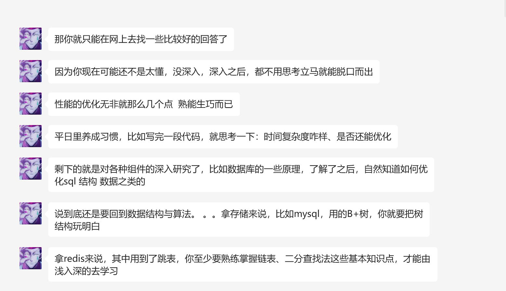
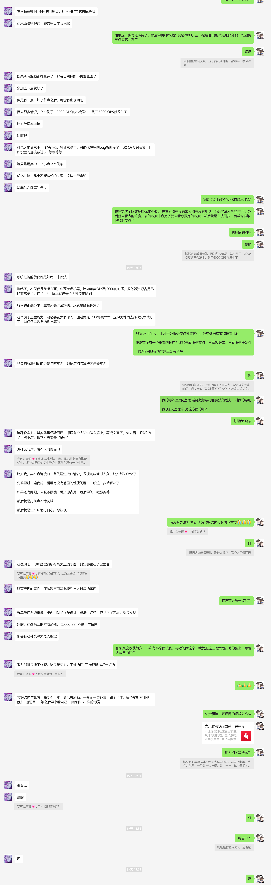
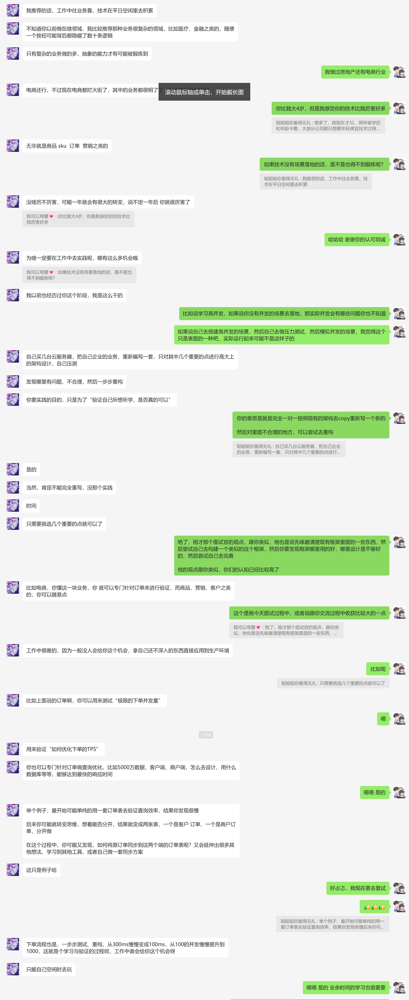
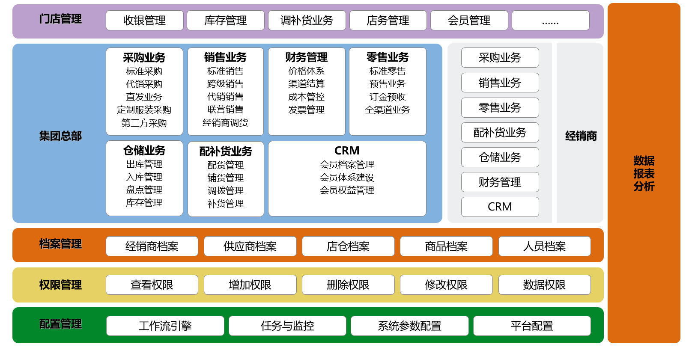
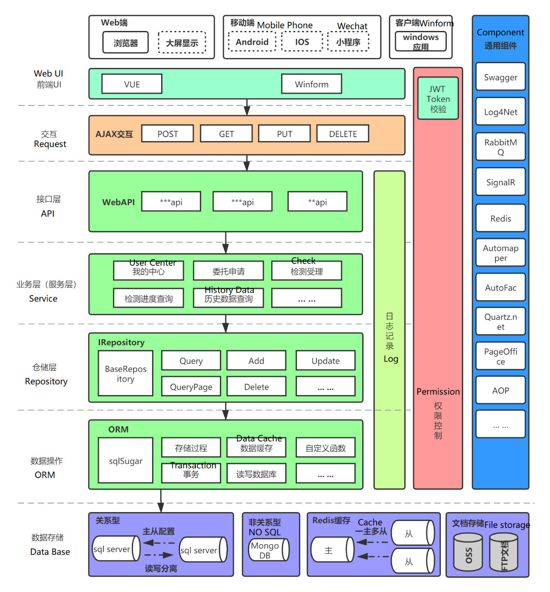
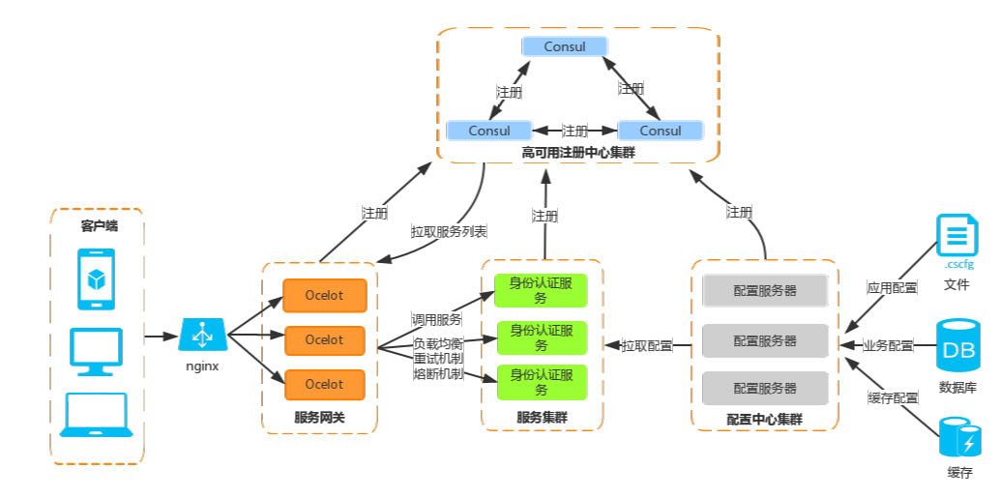
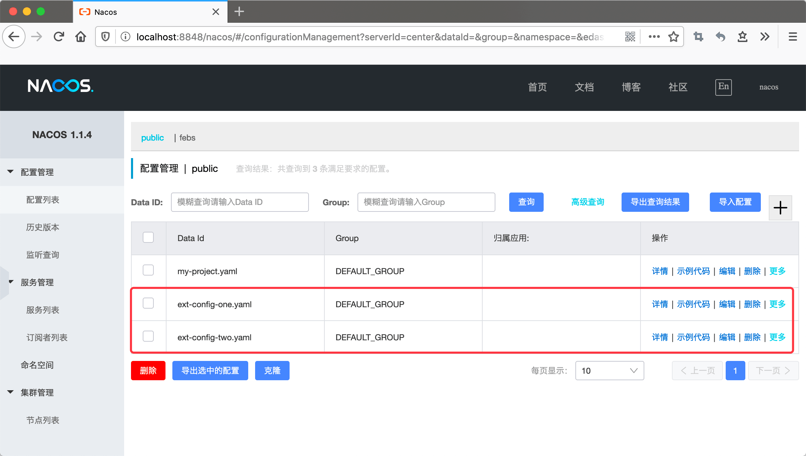

# 再厉害的代码也是为了更好的帮助我们解决问题

碰到难的技术点的时候不应该被它吓住，用问题去代入它，这个技术点是用来解决什么问题的?我要怎么重现它，使用这个技术点去解决它？

# 框架读音

- 
- Monitor: [发音](https://www.bilibili.com/video/BV1FD4y1P7DC/?p=119&vd_source=2784fc6f010453d9e0bb14a36852e3dd) ，提供在多线程环境下同步访问对象的方法
- MobaXterm ： [发音](https://www.bilibili.com/video/BV1ze41157SP/?spm_id_from=333.337.search-card.all.click&vd_source=2784fc6f010453d9e0bb14a36852e3dd)
- Dapper :  （呆(二声) pei（一声）） [发音](https://www.bilibili.com/video/BV12A411N7Ng/?spm_id_from=333.337.search-card.all.click&vd_source=2784fc6f010453d9e0bb14a36852e3dd)
- Coravel ：（ke(一声) rui （二声）wo(三声)）
- Furion: (fu（二声） lian（一声）)先知，[发音](https://www.bilibili.com/video/BV1mZ4y1Y7nm/?vd_source=2784fc6f010453d9e0bb14a36852e3dd)
- Nacos：(娜(二声)cos (play不要念这个))分布式配置中心 [发音](https://www.bilibili.com/video/BV1q3411Z79z/?p=1&vd_source=2784fc6f010453d9e0bb14a36852e3dd)
- SkyWalking（丝(一声)gai(二声)woking）：链路追踪 [发音](https://www.bilibili.com/video/BV1UY41197Py/?p=6&vd_source=2784fc6f010453d9e0bb14a36852e3dd)
- Polly:珀(琥珀的珀)莉（李） [发音](https://www.bilibili.com/video/BV1pK411Z72M/?spm_id_from=333.788&vd_source=2784fc6f010453d9e0bb14a36852e3dd)
- Harbor: ha（一声）bei(一声) 容器管理  [发音](https://www.bilibili.com/video/BV1pe4y127eG/?spm_id_from=333.337.search-card.all.click&vd_source=2784fc6f010453d9e0bb14a36852e3dd)
- Devops：得哇普丝 [发音](https://www.bilibili.com/video/BV1mX4y1z73y/?p=8&vd_source=2784fc6f010453d9e0bb14a36852e3dd)
- Controller：ken（三声）chou（四声）  lei（一声）
- Increment (in ke（二声）rui（四声） ment)
- Interlocked (in ter 落ke（一声） 丝)
- Concurrent （啃 kuo（二声）run（三声）t）
- webpack:web 帕(一声)克
- parallel:pei（二声）rua(一声)lou(一声)
- Route:肉t
- Parse:破丝
- Thread ：丝越的
- Sourcetree （so(四声) 丝 three）
- explain :(衣 ke（二声） 丝 pu(一声) 累 in）
- Configure：（configure）：就是配置的读音
- MyISAM（埋(二声)S A M）：支持表级锁定，全文索引，不支持事务
- Memory(Man 摸 rui（一声）)：内存数据库，快速读写临时数据很快，重启后数据丢失
- **Compact**（坑 pei（四声）ke(一声) te (一声)）: **InnoDB引擎默认的行格式**，可变字节长度
- **Redundant**(rui(一声) down 等 te(一声))：行级压缩和存储外键
- **Compressed** （啃 p ruai(四声) 丝 te(一声)）: 压缩行格式，但读取写入的时候需要额外解压缩
- **Dynamic** (待 na（二声） 米 ke（一声）) :行级压缩和外键信息
- Newtonsoft（妞吨涩府t）.Json**：[发音](https://www.bilibili.com/video/BV1eT411t7wq/?spm_id_from=333.337.search-card.all.click&vd_source=2784fc6f010453d9e0bb14a36852e3dd) 处理Json的类库，比如可以用来转换Json为对象，序列化反序列化Json
- **RabbitMQ（rua(二声) B MQ）：**消息队列
- IServiceProvider（泼(浒厂) 歪（二声） 的）：通过它在控制器中直接进行注入
- Invoke （inwo(三声)k）：使用窗体的Invoke方法，执行指定的委托
- **Redis（曰diss）**：数据库名称，一般用于用户缓存
- **ServiceStack（丝der(二声)k）**.Redis：Redis官方推荐的NET访问Redis数据库的类库；
- **bootstrap（布特丝拽普）**:前端开源工具包，用来开发响应式网站，不用担心网站的兼容性，它可以帮助我们很好的兼容手机端与网页端的样式
- **Nuget（妞get）**：VS开发工具下面的开源包管理工具，可以用它来引用第三方的工具包（Jquery，bootSharp）或类库（比如ServiceSstack.Redis，Newtonsoft）
- Log4Net（log four Net）：绝对不能没有任何监控的项目上线！
- Kestrel（k（二声） s 肿）：NET5执行网站的小型的服务器
- ServiceCollection（磕 l k 藓）：startup.ConfigureService中进行注入
- Inject（in jack t）：通过它在cshtml直接注入
- Autofac（o 凸 f儿（三声） k ）：是一个流行的第三方IOC容器
- Unity：第三方IOC容器
- Consul：kan sou  就是你脑子的这个音， 服务注册，负载均衡，动态伸缩
- Ocelot（阿丝l t）：网关，负责限流，缓存，超时
- Nginx（N 借 k s）：反向代理，负载均衡
- Token（偷 ken（一声） ）：鉴权的钥匙
- identityServer4（i den(二声) tei(一声) 体）：身份鉴权的框架
- Castle：AOP注入框架
- Sugar: su(二声)哥

# 前进目标

## 移动开发者-架构师

- 架构师是负责一个程序的架构，他必须方方面面都需要考虑到，比如设计模式，适合项目的快速开发框架，网站安全方面，数据库性能，网站缓存，服务器集群,微服务模块之间的分割。
- 普通的搬砖工程师，工资相对于架构师是低的，他们日常工作中事情多而且比较杂。而架构师专注于系统的架构与系统底层代码，系统关键难点的突破，他们在软件开发的道路上是成长最快，待遇相对于更好的一个选择。
- 目前的趋势移动开发是主流，用技术影响身边的人
- 分布式缓存
- 分布式配置
- 分布式系统

# 让我进步的问题

## 怎么解决脏读与脏写的问题？

我觉得这个是高并发的场景下面会真实出现的问题，有多个线程对同一条数据进行了操作，怎么在既保证性能的情况下又能保证正确的结果，MySql用设置事务隔离级别设置为串行化来解决这个问题，但是这种事务隔离级别，同一时间不允许两个事务执行，完全杜绝了并发，对性能的损耗太大，实际场景中不会有人进行设置。


**简单的读写操作，碰到多线程高并发的场景就会有问题！**搜索关键字：怎么解决脏读 脏写 处理 解决方案 解决思路 解决办法

**解决方案：加锁（加锁也不能完全解决，只要并发的密度够大（可能超过150的并发），存在极低的可能有多个线程同时抢到了锁，解决防范：用 redis 原生支持的 setnx 来保证只有一个线程抢到了锁，扩展链接：[如何使用Redis实现悲观锁解决高并发情况下读写带来的脏读问题](https://blog.keyboardman.fun/php/1053.html)）**
举例：
a线程修改内存数据，修改到一半，b线程读了数据，a撤销修改了，那么造成b读的数据是脏的，无效的。
因此解决办法，a线程先锁定内存数据块，等完全修改好了再放开锁，这样在A改的过程中b都不了。
windows平台的加锁技术基本就是一些线程同步的技术，比如临界区、事件、互斥等等，都是采用信号通知的模式。一个线程放一个信号表示这块东西我用了。其他线程要用这个东西就必须等待，等我用完了再把信号撤掉，其他线程可以用了。

# 【面试高频问题】

## 通用面试题

### 面试总结：总结面试

物品准备：笔，纸

面试官问题：

自己提问：1.请问我有机会录取吗？

公司介绍：看公司的小红书，抖音，公众号，视频号，互联网检索，看准信息

历史成果：代码，笔记

### 专业系统名

MES:制造执行系统，工业信息化，自动化采集

ERP:管理企业业务的系统，比如盛为的自建ERP系统

### 什么是微服务？

#### 微服务简介

单体架构下的系统，如果系统的规模比较小的情况下（比如功能比较少，代码量不大），但是随着系统功能的增加，代码会越来越复杂，暴露出来的问题也会越来越多

2024年3月28日之前，我认为微服务是为了解决复杂的系统问题，比如上万人使用，并发有上千，系统模块非常复杂，不过现在我有了新的认知，**基本系统需要新增功能，业务是正在快速增加，迭代的都需要使用微服务架构，持续使用的项目都需要使用微服务架构**，因为有很多好处，只要系统一直在迭代，代码就会越臃肿，代码之间的耦合就会越来越严重，业务逻辑越多（业务体系非常庞大，业务体量在快速增长），模块越多，测试就会越来越复杂，部署升级的风险，时间就会越来越大（[扩展阅读](https://www.ruanyifeng.com/blog/2021/05/scaling-problem.html)）， 微服务里面就不会有这种情况，每个服务都是独立的，单独部署升级，尽量减少各个模块之间的耦合性，并且如果有新的功能版本（NET,或者新技术）我可以马上使用新的技术

简单来说微服务就是很小的服务，小到一个服务只对应一个单一的功能，只做一件事。这个服务可以单独部署运行，服务之间可以通过WebApi来相互交互，每个微服务都是由独立的小团队开发，测试，部署，上线，负责它的整个生命周期。

#### **微服务架构又是啥？**

比如我们拿到架构设计的需求，评估的业务体系的复杂度，用户的使用数量，并发数，业务模块的复杂度等因素后，

- 判断各个模块是不是需要拆分子模块同步进行开发？
- 客户是不是要求快速部署迭代？
- 模块之间是不是需要解耦合？
- 后续会不会长期迭代版本 ？会出现V1.0,V2.0版本？
- 对新技术的升级重不重视？（如果是单体架构，所有的东西都在一起，要升级一个十几年的项目几乎是不可能的，微服务的话可以单个模块，单个模块的进行升级）
- 要不要考虑多团队，多小组开发交流沟通，管理代码，理解代码，开发的的成本？（单体架构所有的代码逻辑都在一起，揉在一起，很难对全局进行把控，导致新人对代码的掌控程度不高，改动起来容易出现问题，并且如果拆分成微服务，单个小组，或者单个人，单个团队对这个服务的整个生命周期进行管理，部署，维护，测试，迭代，更明确各自的职责）

如果上面的答案都是yes，那么就需要微服务架构

#### 适合用微服务的场景**

 1.业务体系复杂：模块很多，并且不稳定，比如电商的板块，供应商管理，库存管理，产品管理，刊登管理，运维管理，每一个模块的业务逻辑都复杂，这个时候可以把每个模块都单独拆离成一个微服务，独立安排给不同的人开发部署

 2.用户量大：访问人数很大，说明对系统的要求很高

 3.业务迭代快：比如电商的项目，可能会跟随公司的业务动荡很大，如果数据量大，访问人数多，业务可能会越来越细致化，比如可能会出现单独的分布式配置管理，秒杀子系统等

微服务架构适合用于多种场景，尤其是在需要高度灵活性、可扩展性和独立部署能力的复杂应用程序中。以下是一些具体适合使用微服务架构的场景：

1. **大型、复杂的应用程序**：对于大型系统，尤其是当它们拥有许多独立功能模块时，微服务架构可以帮助分解复杂度，每个服务可以独立开发、测试和部署，从而提高整个应用程序的可维护性和可扩展性。
2. **快速迭代和频繁部署**：微服务允许团队独立地开发和部署服务，这意味着可以在不影响其他服务的情况下更新单个服务。这对于需要快速迭代和持续部署新功能的项目来说非常有用。
3. **技术多样性**：如果一个项目需要利用不同的技术栈或编程语言，微服务架构提供了这样的灵活性。不同服务可以使用最适合它们的技术进行构建，从而允许团队选择最合适的工具来满足特定需求。
4. **可扩展性需求**：对于需要能够根据需求独立扩展不同组件的应用程序，微服务架构提供了一个理想的解决方案。服务可以根据负载变化独立地扩展或缩减，从而提高资源利用效率。
5. **复杂的集成需求**：在需要与多个外部系统集成的情况下，微服务架构可以简化集成过程。每个微服务可以专注于与特定外部服务的通信，从而简化整体集成架构。
6. **团队分散**：对于分布在不同地理位置的开发团队，微服务架构允许每个团队专注于特定的服务。这种方式有助于提高团队的自治性和效率，因为团队可以独立地做出决策，而不需要频繁与其他团队协调。
7. **遗留系统的逐步改造**：对于需要从单体架构向更现代、灵活架构过渡的遗留系统，微服务提供了一个逐步迁移的路径。可以逐渐将单体应用的不同部分拆分为独立的服务，从而逐步降低风险和复杂性。

虽然微服务架构适用于上述多种场景，但是它也引入了诸如服务治理、分布式数据管理和网络复杂性等新的挑战。因此，在决定采用微服务架构之前，重要的是仔细评估项目需求、团队能力和组织结构，确保这种架构选择与项目目标相匹配。

#### **不适用微服务的场景：**

 1.**业务体系简单**：可能只有简单的几个模块，比如OA系统，整个审批流程是固定的，没有很大的改动

 2.**用户体量小**：可能只有几百个人用，每个项目都是单独独立部署，没必要搞成微服务，提高部署，运维难度，随便派一个运维人员就可以搞定了

 3.**业务稳定**： 比如基本的业务流程就是这样子了，后续可能新增一些小的子模块，但是基本整个业务模块不会发生很大的改变，比如房地产登记的业务，整个业务模块就是这么多了，可能会根据实际的业务需求新增一些日志，统计的内容

微服务架构虽然提供了许多优点，但并不适合所有情况。以下是一些可能不适合采用微服务的场景：

1. **小型或简单的应用程序**：对于简单或规模较小的应用程序，引入微服务可能会导致不必要的复杂性和开销。单体架构在这种情况下通常更简单、更有效率。
2. **快速原型开发**：如果目标是快速开发原型或MVP（最小可行产品），微服务可能会延缓开发过程，因为它需要设置和管理更多的部署和服务之间的交互。
3. **资源有限的团队**：如果团队规模小或缺乏处理微服务复杂性的经验和资源，管理微服务的开销可能会超出团队的能力。
4. **一致性要求高的应用**：对于需要强一致性保证的应用程序，微服务可能会增加维护分布式系统一致性的难度，特别是在分布式事务管理方面。
5. **高度耦合的应用程序**：如果应用程序的不同部分之间有高度耦合，那么拆分成微服务可能会很困难，而且可能导致服务间通信过于复杂。
6. **技术与工具的成熟度**：如果所在的环境缺乏支持微服务的成熟技术和工具，如容器编排、服务发现、持续集成/持续部署（CI/CD）等，那么实施微服务架构将会非常困难。
7. **单一责任团队**：如果所有的开发和维护工作都由一个小团队负责，那么微服务可能会带来不必要的管理负担，因为每个服务都需要单独维护和部署。
8. **预算限制**：由于微服务可能需要更多的基础设施和工具支持，因此在预算有限的情况下，维护和运营成本可能成为一大障碍。
9. **治理和监控的挑战**：微服务需要强大的服务治理和监控机制，如果组织缺乏实施这些机制的能力，可能会导致系统运行不稳定。

在这些情况下，继续使用更传统的单体架构或者探索其他架构选项可能更加合理。关键在于评估微服务带来的潜在价值是否超过了它所增加的复杂性和成本。对于初创企业和小型项目，通常建议先从单体架构开始，随着系统的发展和需求的变化，再逐步迁移到微服务架构。

#### 为什么要用微服务？

1. **快速更新：**传统的架构中，10万行代码里面动了其中一行代码，那么也需要整个引用程序重新部署，风险非常大
2. **在线更新：**传统的架构中，如果更新很小的一个功能，比如只改动了一行代码，那么也需要将整个应用程序停机后进行更新。
3. **缩短升级周期(更新频繁)与风险**：传统架构中，升级周期长，风险大，因为每次更新必须是全站式的更新，导致风险大，时间长，但是微服务架构可以按需要进行局部的更新，我们可以按照需要按天，按周,按小时进行更新，快速解决问题，迭代版本，提高用户满意度
4. **快速扩容：**传统的架构中，如果服务器内存，硬盘资源不够用，需要停机扩容，但是微服务架构可以不停机，不暂停业务进行扩容。（用k8s实现）
5. **高内聚，低耦合：**每个单元变得很小，那么各个单元契合的紧密度就很紧，就是高内聚
6. **提高技术创新：**旧的项目使用的旧的技术会在创新的时候给人带来限制，微服务每个服务之间都是单独单元，没有这个限制，或者限制很小，因为我们可以升级单独的一个微服务，也可以在新的模块出现的时候拆分出新的微服务使用最新的技术进行实现。
7. **减少技术债务：**公司内部进行人员流动是很正常的，部分员工离职的一段时间会一定程度上疏于对代码的管理，会产生一定的问题，人员流动越大可能坑越多，这些坑加上平时的程序BUG，积累在庞大的单体项目中，就像是一个个定时炸弹，很难被人发现解决，这就是技术债务
8. **避免单点故障**： 微服务里面每个模块都是独立的，单个模块故障不会影响其他的模块
9. **不同语言项目**： 微服务之间通过Http请求进行调用，我不需要管各个服务之间是使用什么开发语言进行实现的，有利于利用不同语言的特性解决不同的问题，比如golang并发性能很好，如果是对并发特别敏感的项目是不是可以用go做为一个微服务进行部署，通过HTTP进行请求调用就可以

####  分布式事务的数据一致性问题如何解决？

多个系统通过网络协同去完成一个操作，多个系统之间的数据通信要保证原子性，隔离性（事务与事务之间隔离），一致性，持久性，这种操作可以称为分布式事务。**不过分布式事务与本地事务（数据库的begin tran）不同，不能够简单的使用本地事务进行处理，它有三种表现形式**：

- **不同站点，不同库**：这种存在的很多，现在流行微服务架构，很多子系统是有自己的库的
- **不同站点，同库**：这种形式，比上面的会少一些
- **同站点，不同库**：这种形式不是很多，比较少

**数据一致性问题解决方案：**

- **两阶段提交协议(2PC)**：引用程序中声明一个**事务协调者**，对**订单数据库**与**库存数据库**进行一个数据操作，如果两者都返回yes，则事务协调器提交事务，否则回滚事务，这种方式**优点**：是实现了强一致性，关系型数据库（Oracle，Mysql）可以应用，**缺点**是协调器需要在多个节点进行协调，性能不好。
- **事务补偿（TCC）**：每种操作的实现声明try（预处理数据），Cofrom(提交),Concel（回滚），三个方法，开始通过try进行预处理订单，如果执行过程中出现问题，则通过Concel进行回滚，还原数据到改动前的样子，比如A给B转100块钱，那么先给A的银行账户减去100块，成功后，再开启新的操作给B的银行账户加100块如果这个时候给B加100块出现问题，那么通过Rollback回滚的方法，把100块钱还给A，实现事务回滚，这种方式的优点是可以保证数据的一致性，缺点是开发成本高，而且要实现幂(mi四声)等性。
- **`消息队列方式实现最终一致（这种方式用的最多）`：**通过消息队列进行异步完成，通过订单数据库的事务（插入订单表，插入订单日志表）进行操作，操作完成后，MQ消息队列扫描订单日志表中没有减去库存的订单，进行异步轮训库存数据库，库存数据库接收到请求减去库存的操作（插入库存表，插入库存日志表），返回插入结果，进行异步方法到订单事务中，根据订单ID主键（关联到库存的外键），对原有的订单日志进行清理，表示事务结束。

#### 微服务之间如何通信调用？

服务需要注册和发现其他服务，这需要一个可靠的服务发现机制。

#### 微服务的配置如何管理？

随着服务数量的增加，配置管理变得更加复杂，需要跨服务管理配置的方法。

#### 微服务的监控和日志记录怎么做？

监控和跟踪多个服务及其相互作用需要更精细的监控系统和强大的日志记录能力。

### 什么是AOP?


#### AOP的6种实现方式

##### 静态代理

**静态代理模式**：继承接口需要重新实现，一对一的实现（静态实现），如果修改的类过多，代理模式时很鸡肋，不可能把所有的类全部重新代理，所以可以用特性进行切入，标记了特性方法的类，就可以切入，借助Castle框架

**功能是交给另外第三方的类进行实现的称为静态代理**，

代理模式实现：继承接口包一层

装饰器模式实现 ：新建类引用对象方法包一层，

##### 动态代理

现在靠反射代理，以前RealProxy-还有Castle(靠emit进行实现，emit技术可以在运行期间动态生成代码) 

**动态代理模式：**通过代理的通用类中的Create<IDBHelper>方法创建代理的类，加入泛型T，返回所有的对象，可以解决大部分问题

##### 静态植入

代表PostSharp (收费);Aspect 。编译的环节进行静态植入就像语法糖一样，平时看不到，一编译就自动新增了，如果要改动的话需要重新编译程序，发布版本，测试后再上线


`下面是常用的AOP切入方法，上面是AOP切入的技术实现`

##### 委托嵌套

ASP.NET Core管道中间件，老师好像也演示过

##### 特性+反射

ASP.NET Core的Filter ，ActionFilter，ResultFilter，ExceptionFilter等

##### IOC容器

autofac-Unity等，autofac是基于Castle实现的，Castle是使用emit完成，**一般工作中使用的可以用现有的容器的AOP加AOP扩展使用**，一般不会自己实现。

### 什么是中间件？

我理解的中间件就是第三方的类库，第三方的框架

查看百度百科后我的理解：中间件是用来负责分布式系统之间网络通信，资源管理，数据传输的桥梁

### Http中Get Post方法调用有什么区别？

HTTP（超文本传输协议）的GET和POST都是用于客户端和服务器之间传输数据的方法，但它们在使用及功能上有一些主要的区别：

1. **作用**：一般我们通过POST把数据从客户端传输到服务器，通过GET从服务器请求数据到客户端
2. **数据传输位置**：
   - GET将数据附加到URL中，在URL中可以看到传输的数据。例如，`http://example.com/api?param1=value1&param2=value2`。
   - POST将数据放在HTTP请求的主体（Body）中，不会在URL中显示。
3. **安全性**：
   - GET较不安全，因为发送的数据是URL的一部分，容易被人看到，也可能被缓存或保留在浏览器历史中。
   - POST较安全，因为数据不会显示在URL中，对于传送敏感数据更加合适。
4. **数据大小**：
   - GET请求受URL长度限制，因此能够发送的数据量有限。
   - POST请求没有限制，可以发送大量数据，适用于文件上传等场合。
5. **幂等性**：
   - GET是幂等的，意味着多次执行相同的GET请求，资源的状态不会改变。POST不是幂等的，每次请求都可能导致服务器上的状态改变。
6. **用于CRUD操作**：
   - GET通常用于读取（Retrieve）操作。
   - POST通常用于创建（Create）操作，但也可以用于更新（Update）和删除（Delete）操作，尤其当使用RESTful API时。

### RabbitMq一共有哪几种工作队列?你用得是哪种工作队列？

1. **简单队列（Simple Queue）：**一对一关系，一个生产者一个消费者 （显式没有用到交换机，隐式用到了默认的直连交换机）

   

2. **工作队列（Work Queues）：** 一对多关系，一个生产者，多个消费者 （显式没有用到交换机，隐式用到了默认的直连交换机）

   

3. **发布/订阅（Publish/Subscribe）：**一对多多关系，一个生产者，多个消费者，多个队列 （用到扇形交换机）

   - **描述：**:把消息发送到交换机，然后多个队列可以绑定到这个交换机，消息发送后所有绑定得队列都可以接受到这个消息
   - **应用场景**：更新商品库存后需要通知多个缓存和多个数据库。

4. **路由模式（Routing Exchange）：** 消息和路由键一起发送到交换机，队列根据绑定得路由值进行匹配是否接收消息(使用直接交换机，根据路由键匹配绑定对应name的队列进行发送消息，是根据发送时候的路由键完全匹配队列的路由键才可以，使用同一个交换机)

   - 生产者将消息和一个路由键（Routing Key）一起发送到交换机。队列根据绑定时指定的路由键来决定是否接收消息。
   - **应用场景**：可以根据日志的严重级别（如“info”(基本信息)，“warning”(警告信息)，“error”(错误信息)）作为路由键，将不同类型的日志消息发送到不同的队列中

5. **主题模式（Topic Exchange）：** （使用主题交换机，可以使用通配符,*星号,#号更加灵活）

   - 类似于路由模式，但是这里交换机允许队列通过模式匹配来绑定路由键，比如*（星号）可以代替一个词。#（井号）可以代替零个或多个词。这意味着可以根据多个标准灵活地路由消息到不同的队列。
   - **应用场景**：比如说店铺打折，美国得店铺全部打折，那么只需要发送前缀是USD的店铺就可以了

6. **RPC（远程过程调用）：**

   - 在RPC模式中，客户端发送请求消息，服务器回复响应消息。这种模式通常涉及到两个队列：一个用于请求，一个用于响应。
   - **应用场景**：需要等待接口返回数据，如订单支付。

这些模式可以根据场景的不同需求进行组合和扩展，以适应复杂的消息传递和任务分配场景。例如，工作队列模式可以与发布/订阅模式结合，允许任务在多个工作者之间进行共享，同时也支持广播更新等。


### 数据库优化

1 .先从最基础的SQL语句优化，Select *，避免使用函数计算，使用合适的索引条件，语句是否编写合理等
2 .然后是索引优化，索引建立的是否合理，是否可以使用覆合索引
3 .打开慢日志开关，结合实际情况，看慢日志sql看执行计划，比如是否没有用到索引？索引建立的是否合理？
4 .最后设计层面的，做了读写分离
5.做了历史数据归档
6.结合现有的NoSQL，ES，解决首页查询过慢的问题，

### 多线程

多线程的话一共有三点。一种是并行。一种是并发，一种是异步编程 

- 并行编程：并行编程指得是在系统的cpu上面同时处理多个任务，我们可以用parallel.For,parallel.foreach方法去做，适合计算，渲染类的方法，可以利用cpu的性能，不过缺点是会阻塞主线程 

- 异步编程：使用异步编程的时候，不会阻塞窗体线程或着主线程 ，适合窗体页面，http响应，读取文件的时候使用，一般用await，async异步编程模型实现，可以用task对象，task.run方法，task.startNew方法实现，

- 并发：多个任务同个并发执行，适合并发请求网络应用，加快数据处理等需求， task.run,task.startNew，thread线程或者线程池，线程池适合短小精悍的一些处理方法，比如日志的插入，这样的话可以避免线程的频繁创建和销毁，不过在多核得处理器上面可能才是真正得并行处理，不然都是通过线程调度得方式快速切换上下文实现得  

  **锁的话你是怎么用的？**

   比如说我在多线程里面，我要计算业务的处理数量，那么我用i++肯定是不能的，因为多线程里面执行顺序是无序的，所以这样可能统计不了正常的这一个数值，但我们可以用lock对象，去锁住我们需要操作的这样一个作用域，可以让这个作用域里面的逻辑成为单线程方法，进行i++操作，或者这种情况我们也可以用线程安全的对象，比如线程安全的值类型对象，集合对象  不过多线程的调试可能会比单线程会复杂一些，可能要用打印线程编号，时间戳日志，调整线程数量的方式进行调试，加锁的场景会影响线程的并发性能，我一般会使用Net下线程安全的集合或者Net支持的原子操作类以此来提高性能 [调试多线程](https://mp.weixin.qq.com/s/SDIMvugLjJvtUgSI2X8Z6Q)

### 高并发

高并发里面一个代表现象就是秒杀场景，秒杀场景的特点有：

- 节假日活动，非日常业务
- 短时间连接数加大，活动过后连接恢复正常
- 用户会在活动开始前反复刷新
- 活动开始反复点击购买按钮

1.**服务隔离**：针对这些特点首先我会把秒杀的业务放到单独一个服务器部署，做好与主业务服务的隔离，防止最坏的情况出现--主业务系统在秒杀的流量冲击崩溃

2.**数据库隔离**：后台数据库的设计我们可以用redis系统独立保存秒杀系统的订单，库存信息，与业务系统隔离开来，防止巨大的并发读，并发写流量把业务系统拖垮

3.**静态页面/缓存**：然后针对于用户在秒杀业务开始前会反复刷新购买按钮我会把这个商品购买页面设置成nginx配置的静态页面，这样可以减少后端服务器的压力，一些特定的数据（css,js，图片）可以用浏览器缓存进行保存，防止重复加载，只有关键的用户登陆，身份信息才可以请求到后端接口

4.**js倒计时/安全**:然后用户怎么开始购买呢？就是前端肯定是有一个js做一个倒数的计时，但是最后请及后端购买的这个链接呢，肯定不能提前暴露到页面上去，我们需要在后台做一个定时任务，然后到了指定的时间，再把这个链接通过一个js文件的方式，更新到页面去，做成这样的目的主要是为了别人如果通过一些技术手段拿到了这个请求链接，在秒杀还没开始的时候就购买了，那损失就很大了。

5.**网关限流/熔断**:网关那里做限流的操作，比如秒杀的场景有100个人进来， 同时可以使用 Redis 分布式锁解决并发过大的超卖问题，其实100人进来后我可以在Nginx里面直接返回一个秒杀已经结束的页面，防止后端的接口并发量过大，还可以视情况而言加入熔断，降级的服务，增强服务的可用性

6.**验证码消息队列削峰**：如果正是请求购买的时候，我们可以加一些策略，然后减少一下流量的峰值，比如说如果说你不做这些措施的话，流量可能一秒进来，我们可以在一些的图片验证，答题策略，可以把这个一秒的流量变成2秒~10秒的这个流量，然后把消息放到消息队列RabbitMQ异步返回用户的结果，这些都是可以的

7.**后端自动扩容**：后端服务可以利用k8s自动扩容的功能，达到动态的负载均衡，流量太大，可以自动新增新的consul新的容器节点

8.**压力测试**：压力测试工具做性能测试，比如ApacheBench工具


我假设并发最大在50w，nginx单机并发在5w，linux的配置在8核，32g内存，那么部署十台nginx做内部流量的转发，用三台服务器Ocelot做网关，内部配置Consul的服务发现，配置Ocelot.Polly的熔断组件，内部加入负载均衡 ，限流功能


**Hangfire的和Coravel分别在什么场景下使用？**

不可重复读

读已提交

读未提交

脏读

幻读

以下是使用Markdown语法重新组织的缓存雪崩、缓存穿透和缓存击穿问题描述以及解决方案：


### 熔断

熔断机制的灵感来自于家用电路的熔断器，它的目的是防止过载。在分布式系统中，**熔断器模式可以防止一个服务（或服务调用）的连锁故障影响到整个系统**。**当一个服务失败率超过一定阈值时**，熔断器会“跳闸”（即开启状态），后续对该服务的调用会被立即中断，通常会返回一个预定义的错误响应或者调用一个备用的服务（降级的服务）。熔断器会在一段时间后自动进入“半开”状态，试探性地允许一些或全部流量通过，如果服务恢复正常，则熔断器关闭；如果问题依旧，则再次打开熔断器。这样可以防止系统在服务不稳定时频繁地尝试调用，进而减少资源的浪费，并允许下游服务有时间恢复。


比如A,B,C三个节点的服务，A服务请求B服务的时候出现了异常，请求了10次后，为了保证整个链路的可用性，进行熔断服务，返回特定的无法访问的提示，或者对无法访问的节点方法进行降级，比如购买商品的时候，如果B节点是优惠券的服务，那么备用服务可以是默认9折，或者请用户5分钟再试，熔断后会有断路器，断路器可能10秒后自动进入半开状态，允许一部分流量进入，如果正常了，那么服务正常，如果还是错误，那么重复整个步骤

### 限流

限流是控制服务接收和处理请求的速率的一种手段，以防止服务被过多的请求压垮。限流可以按照不同的粒度进行，例如每秒允许的请求数、每用户的请求数等。限流既可以在服务的入口处进行，以避免过多的请求进入系统，又可以在服务的出口处进行，以控制服务向外部发送的请求频率。限流可以通过各种算法实现，如令牌桶、漏桶等。使用限流可以保证系统资源的合理使用，防止服务因过载而崩溃。


对用户的请求速率进行一种限制，防止服务被过多的请求压垮，比如单个用户一分钟只能请求10次，超过10次就限流了，可以在网关里面或者中间件里面去进行限制。

### 降级

当系统遇到不稳定状态或者性能瓶颈时，通过降级可以主动关闭或者降低一些非核心业务的功能，以确保核心业务的正常运行。例如，电商平台在大促期间可能会暂时关闭商品推荐功能，以保证用户的搜索和结算服务能够正常使用。降级策略通常与业务密切相关，它需要业务层面对功能的重要性进行排序，以决定在资源紧张时哪些功能可以被牺牲。

这些机制的目标都是为了提高系统的弹性和可靠性。在面对高流量、错误率增加或下游服务不稳定的情况下，系统仍然能够以一种受控和有限的方式继续工作。通过这些手段，即使在部分服务不可用或者资源受限的情况下，系统也能够保持最大程度的运行时间和响应性。


比如系统运行不稳定或者有特殊活动，场景的时候可以关闭一些非核心的业务，比如双11的时候，可能会关闭商品推荐的功能，芭芭农场的功能等，保证商品购买，支付的链路是正常的

### 超卖

### 缓存雪崩（Cache Avalanche）

**扩展阅读**：https://xiaolincoding.com/redis/cluster/cache_problem.html

**问题描述**： 缓存雪崩是指在某个时间点，大量缓存数据同时失效或者被清除，导致数据库或后端系统承受突然的大量请求压力。

**原因**： 通常是由于缓存中的多个数据项具有相同的过期时间，或者同时失效，导致大量的请求直接访问数据库或后端服务。

**解决方案**：

- 设置不同的缓存过期时间，避免同时失效,设置过期时间时，**给这些数据的过期时间加上一个随机数**，这样就保证数据不会在同一时间过期

- 设置缓存永久有效，通过后台任务通过间隔时间进行更新缓存，或者剔除无效的缓存

  

### 缓存穿透（Cache Penetration）

**问题描述**： 缓存穿透是指**恶意**或者**不存在的数据**请求不断地击穿缓存，直接访问数据库，导致数据库负载过大。

**原因**： 通常是由于恶意请求、无效请求或者无法命中缓存的请求不断发起。

**解决方案**：

- 使用布隆过滤器快速判断数据是否存在，避免通过查询数据库来判断数据是否存在

  我们可以在写入数据库数据时，使用布隆过滤器做个标记，然后在用户请求到来时，业务线程确认缓存失效后，可以通过查询布隆过滤器快速判断数据是否存在，如果不存在，就不用通过查询数据库来判断数据是否存在。	

  **查询布隆过滤器说数据存在，并不一定证明数据库中存在这个数据，但是查询到数据不存在，数据库中一定就不存在这个数据**。

- 缓存空值或者默认值

  当我们线上业务发现缓存穿透的现象时，可以针对查询的数据，在缓存中设置一个空值或者默认值，这样后续请求就可以从缓存中读取到空值或者默认值，返回给应用，而不会继续查询数据库。

  

### 缓存击穿（Cache Breakdown）

**问题描述**： 缓存击穿是指某个**热点数据**在缓存失效时，大量的请求同时访问该数据，这个是由于并发太高了导致。

**原因**： 通常是由于某个热点数据的缓存过期或失效，此时大量请求同时访问该数据。

**解决方案**：

- **使用互斥锁**对于同一个key，如果缓存未命中，那么不是所有请求都去数据库加载数据，而是使用分布式锁（或其他互斥机制）确保只有一个请求去查询数据库并加载数据到缓存。其他的请求则等待或者重试，直到缓存中有值

- **设置热点缓存永久有效**，通过后台任务通过间隔时间进行更新缓存，或者剔除无效的缓存

- **双层缓存机制**：设置两个缓存层，第一层缓存正常设置过期时间，第二层缓存设置长一些的过期时间。当第一层缓存失效而第二层缓存有效时，可以先返回第二层的旧数据，然后异步更新第一层缓存数据

- **缓存降级** ：保存一个静态的默认值，或者上一次的缓存值到系统中，最后作为保险进行使用

  

### Mysql死锁

数据库的死锁是指两个或多个事务在执行过程中，因争夺资源而造成一种互相等待的现象

调用事务的时候可以做超时的逻辑，后台操作大批量数据数据分批次更新，千万级大表不做在线DDL

### 事务

### MVC

什么是MVC?

首先MVC是一种设计模式，是一种分层的设计思想，比如ASP NET MVC,ASP NET CORE MVC,SpringMVC，都是利用这种思想设计的编程框架，比如Asp net MVC,将软件架构分为:

- **Model**：数据库实体，DTO,数据访问层，业务逻辑层Service
- **View**: 视图层，展示层,用户操作的界面
- **Controller** ：接受视图层用户的请求，通过路由跳转到对应的方法，控制页面的跳转与交互逻辑

一般前后端分离项目中前端项目就是MVC中的V层了，一般这个时候后端是用Model,与Controller层，常规的Asp Net MVC与Asp Net Core Mvc层都是用的Razor页面开发cshtml代表View视图层

### MVCC

多版本并发控制（MVCC），允许并发读，并发写，不会进行锁表，提高系统的并发性能，不过有个问题如果同时对同一行数据发起写操作，数据库可能会产生写冲突，回滚后面发起的事务操作

### 网络通信协议

- **传输控制协议 (TCP)**：TCP是一种面向连接的协议，意味着在数据包交换之前，必须在两个网络设备之间建立连接。TCP通过三次握手过程建立连接，并确保数据的顺序和可靠性。如果数据在传输过程中丢失或损坏，TCP会要求重传。**TCP适用于需要高可靠性的应用场景，如网页浏览、文件传输和电子邮件,HTTP是发一次数据传一下数据，TCP可以连接一次传递多次**。
- **用户数据报协议 (UDP)**：UDP是一种无连接协议，它发送数据之前不需要建立连接，因此它的开销和延迟比TCP更低。但UDP不保证数据的到达、顺序或完整性。如果需要更快的传输且可以容忍一定的数据丢失，例如在线游戏或语音/视频会议，UDP是一个好选择。
- **超文本传输协议 (HTTP)**：HTTP是一个基于客户端-服务器模型的协议，主要用于网页数据的传送。用户的浏览器（客户端）发送HTTP请求到服务器，然后服务器响应请求并发送回网页内容。HTTP是无状态的，意味着服务器不保留任何两个请求之间的状态信息。
- HTTPS (HTTP Secure)：HTTPS是HTTP的安全版本，它通过SSL/TLS协议为客户端和服务器之间的通信提供了端到端加密。这意味着所有传输的数据（如表单输入、登录信息）都是加密的，从而提供了保密性和数据完整性，防止中间人攻击。
- 文件传输协议 (FTP)：FTP是用于在网络中传输文件的一种协议，允许用户执行文件的上传和下载操作。FTP需要通过用户名和密码进行登录，也有一个匿名的FTP，用户可以不登录服务器或使用通用账户登录。
- 简单邮件传输协议 (SMTP)：SMTP是一个用于发送电子邮件的协议。它被用来在邮件服务器之间传输邮件，或者由客户端向邮件服务器发送邮件以便发送。通常，SMTP只负责发送邮件，而接收邮件则由POP3或IMAP协议处理。
- **WebSocket**：WebSocket是一种网络通信协议，提供了在单个TCP连接上进行全双工通信的能力。这意味着客户端和服务器可以在任何时候发送数据，不必像传统的HTTP请求那样一个接一个。WebSocket特别适合需要实时数据交换的应用，如在线游戏、实时交易平台和聊天应用。
- **MQTT (Message Queuing Telemetry Transport)**：MQTT是一个轻量级的消息协议，使用发布/订阅模式，非常适合低带宽、高延迟或不可靠的网络环境。它被广泛应用于物联网（IoT）场景中，设备可以作为发布者或订阅者，通过主题发布消息或订阅消息。MQTT设计简单易用，但同时提供了可靠性和某些级别的服务质量（QoS）。


### 筛选器/过滤器

**ASP.NET Core Filter的注册方式有哪些？**

- 方法注册：只对方法生效，只需要在方法的名字那里加入过滤器的特性，比如[MyActionFilter]，就可以了

  ```c#
      [MyActionFilter]
      public IActionResult Index()
      {
          return View();
      }
  ```

  

- 控制器注册：对控制器下面的所有的方法生效，也是加入过滤器的标志就可以了

  ```c#
  [MyActionFilter]
  public class HomeController : Controller
  {
      public IActionResult Index()
      {
      ...
  ```

  

- 全局注册：对整个项目的控制器生效,一般日志，授权鉴权，错误处理使用

  ```c#
  public void ConfigureServices(IServiceCollection services)
  {
      services.AddControllersWithViews(options =>
      {
          options.Filters.Add(new MyActionFilter()); // 添加全局过滤器
      });
  
  ```

  扩展TypeFilterAttribute 和 ServiceFilterAttribute 过滤器可以用来在过滤器中加入额外服务的场景

[筛选器](https://learn.microsoft.com/zh-cn/aspnet/core/mvc/controllers/filters?view=aspnetcore-7.0)

筛选器与中间件都是一种面向切面的方式，**一共有五种过滤器：**

- **Authorization Filters**： 授权鉴权过滤器，判断用户是否有访问接口的权限，比如根据HttpContext对象，验证Token是否合法，判断合法再让用户继续访问，否则不让用户继续访问，判断权限通过后，也可以继续判断用户的角色是管理员还是某个部门的普通员工等。（盛为现有系统的授权鉴权就是通过特性的方式做到的，但是我看到他是用Action Fiter过滤器进行实现的，询问了一下同学就是经过过滤管道的顺序不同（性能的损耗几乎不计，不知道对流量有没有影响，还有就是有些第三方的鉴权框架可能有功能鉴权功能在Authorization Filters里面不是在Action Filters），不过我们现在是针对于特定方法的特性，我们也可以把特性放到这个控制器中，或者放到整个应用程序中）
- **Resource  Fileters**：资源过滤器 ，这一步用来判断用户的请求是否可以命中缓存，是否是从官网进来的，还是从第三方进来的（防盗链检查）
- **Action Filters（常用）**: 方法过滤器 ，监控方法执行前，方法执行后的动态，可以用来记录调用的日志，比如调动时间，调用人，请求的参数 ，或者改动请求的参数日期格式（比如Elment的日期控件的年月日是不需要的，就可以过滤），大小写   -> Action Execution 行动的执行,Action Result Conversion 动作结果的转换
- **Exception Filters（常用）**: 异常过滤器，捕获全局没有处理的异常，获取易仓的调用堆栈，按照固定的实体规范进行记录错误日志，返回统一的错误结果，返回特定的错误页面
- **Result Filters**: 结果过滤器，可以对方法返回结果进行大小写转换，日期转换等通用的操作，也可以用做多语言的环境（中/英/法语言结果返回切换）


**Model Binding ：模型绑定，过程无实际过滤作用**

**Result Execution: 结果执行，过程无实际过滤作用**，

### Http管道

[管道](https://kb.cnblogs.com/page/559675/)

####  介绍

在 .NET Core 中，管道是由一系列中间件组成的，用于处理 HTTP 请求和响应。每个中间件执行特定的任务，如身份验证、路由、HTTP日志等。当浏览器发送请求时，用户请求的信息通过 HttpContext 对象传递，包含了请求的详细信息和用户需要的结果信息。用户的请求首先通过在 Startup 类中配置的中间件列表。每个中间件会处理请求，处理好后，会将处理结果传递给管道中的下一个中间件。除了这些中间件，请求还可能通过一系列过滤器，例如授权过滤器、异常过滤器和方法过滤器。最后，经过了这个过程的响应结果会返回给客户

 


HttpContext对象在网页开发中是很重要的，因为它带着用户请求的所有的信息，它会穿过所有的管道与中间件，然后到达我们请求的接口中

Server<--IServer:服务

Hosting environment <-- IWebhost :  托管环境

Middleware:中间件,注册到IApplicationBuilder中的中间件

Application **Pipeline (管道)**<-- IApplicationBuilder ：应用程序的管道

IApplicationBuilder：把它看做整个应用程序的一个容器，装了很多中间件

**HttpRequest**：在 ASP.NET Core 中HttpRequest 是一个抽象类（默认实现叫 DefaultHttpRequest），HttpRequest是封装浏览器对服务器的请求的各种数据， 看下面的表单可以知道，封装了请求的表单，请求的Headers,请求的Post参数与Get中的QuerString参数

**HttpResponse**：HttpResponse 也是一个抽象类（默认实现叫 DefaultHttpResponse），主要是是服务器接收到浏览器的请求后，处理返回结果常用的一个对象，比如用来重定向请求页面，将文件流刷新到Http返回结果中


#### 管道如何处理Http请求

[精彩绝伦](https://www.cnblogs.com/artech/p/asp-net-core-pipeline.html)

[这个讲述.net core 3.1的启动流程。。写得真好阿](https://blog.csdn.net/kalvin_y_liu/article/details/122796793)

[朝夕好友推荐，管道](https://zhuanlan.zhihu.com/p/306501502)

## 创型建筑：请求的时候怎么做安全方面的验证？


## 奇宏电子：ES倒排索引是怎么实现的？

倒排索引是ES查询速度提升的重要原因，相对于MySQL关系型数据库的索引，是正排索引，是一对一的匹配，倒排索引可以看作部分词汇的匹配。比如有两个词汇：1.诸葛亮 2.诸葛孔明。正排索引搜索诸葛亮，就得到诸葛亮，不会得到诸葛孔明。如果是倒排索引，你搜索诸葛亮，它会把诸葛亮拆分成，诸葛+亮这两个词汇，如果再加入一个诸葛孔明词组，那么你搜索诸葛亮的时候，可能根据算法会匹配出诸葛亮与诸葛孔明这两个词汇。

正排索引，比如MySQL是使用B+树去实现的，拿上面那个例子来说，诸葛亮与诸葛孔明，会保存在B+树的叶子节点上面,当我们检索的时候，会直接扫描到诸葛亮，诸葛孔明的值，然后直接等值返回。

倒排索引，Es数据库保存的时候，会把诸葛亮，诸葛孔明，拆分成诸葛，亮，孔明，比如说这三个词汇保存成键，然后每个键对应的文档属于哪个文档（文档1：诸葛亮  文档2：诸葛孔明）（可以简单看作为字典表**Dictionary**）

| 键   | 文档ID      |
| ---- | ----------- |
| 诸葛 | 文档1,文档2 |
| 孔明 | 文档2       |
| 亮   | 文档1       |

如果我搜索诸葛，拿到诸葛 键，找到文档1，文档2，可能直接返回这个结果，如果查询诸葛孔明，对诸葛孔明进行分词，那么先找到键诸葛中的文档1，文档2，然后再找到键孔明中的文档2，文档ID取交集，得到：文档2：诸葛孔明

[扩展阅读：ES之倒排索引详解](https://blog.csdn.net/qq_31960623/article/details/118860928)


## 奇宏电子：Mvc生命周期是哪两个？

MVC有两个生命周期，一为应用程序生命周期，二为请求生命周期。

### 应用程序生命周期


应用程序生命周期是指在请求生命周期开始，IIS开始运行，请求生命周期将结果返回后，IIS停止的时间。

### HTTP请求生命周期

用户发起Http请求，用户请求的信息通过 HttpContext 对象传递，包含了请求的详细信息和用户需要的结果信息，然后根据用户请求的URL进行匹配相应的路由配置，获取到对应的路由规则后，通过反射创建对应的控制器（创建控制器前先执行鉴权filter,异常filter），实例化控制器成功后，再进行调用对应的方法，处理好结果后，然后再把结果通过视图引擎进行返回给客户端进行展示。


[原图地址](https://learn.microsoft.com/zh-cn/aspnet/mvc/overview/getting-started/lifecycle-of-an-aspnet-mvc-5-application/_static/lifecycle-of-an-aspnet-mvc-5-application1.pdf)

abp框架的内容

## 奇宏电子：vue的响应式布局是怎么实现的？

 1.**加入get,set标记**：比如当Vue对象创建的时候，vue会去遍历data中的所有的属性，给他们加上get,set监听标记

 2.**监听改动**：当data中的响应式的属性被更改后，触发监听改动的事件，一改动，那么更新引用到这个属性的所有组件。

3.**虚拟Dom**：而且data数据发生变动的时候，vue会创建一个虚拟的DOM与当前的DOM进行比较，通过比较，VUE会去局部更新不同的地方，而不会用新的虚拟的DOM替换原有的DOM

 [深入响应式原理](https://v2.cn.vuejs.org/v2/guide/reactivity.html)

## 奇宏电子：net frameword迁移到 net5的经验有吗？


## 奇宏电子：ABP框架你们用到了哪些功能？

Abp框架提供了很多基础功能，如DDD基础设施、审计日志、缓存、认证与授权、数据过滤等，做到了开箱即用而开发者无需关注具体细节问题，让我们更加专注业务的实现！


## 道途旅行：接口和抽象类的区别？

接口：

1.一组抽象的行为,也可以有具体的实现在c#8中，当没有实现接口的方法的时候，那么默认就是用接口的实现

2.接口可以继承多个，代表同一类型的抽象的行为

3.无法创造接口的实例

抽象类：

1.可以是抽象的行为，也可以是具体的实现，没有重写抽象类实现方法的时候，那么默认就是用抽象类的实现

2. 父类只可以继承一个，代表的是一种关系，通常是一种密切相关的类的关系
3. 无法创建抽象类的实例

## 卓帆公司：委托和事件的区别是什么


## 卓帆公司：请问Net Core微服务架构中，怎么保证服务数据的一致性呢

比如提交订单操作有A,B,C三个服务，A是优惠券服务，B是订单服务，C是库存服务，A服务优惠券减成功了，但是下订单的时候服务失败了，请问怎么保持数据一致性呢

1.**补偿策略**： 比如B服务订单服务调用失败后，给A方法设置一个补偿回滚的方法，以便恢复数据状态

2.**最终一致性（一般用这个）**： 比如可以通过RabbitMQ即使消息消费失败了，也可以在后续重新处理进行重试

3.**重试策略**： 失败后进行重试策略，比如重试3次，十秒后继续重试，对方法的设计要具有幂等性

## 卓帆公司：线程遇到Lock锁的时候，怎么让它等待20秒，20秒没有等待锁，然后走呢？

在.NET中，如果你想要在尝试获取锁时设置超时，可以使用`Monitor.TryEnter`方法而不是简单地使用`lock`（实际上是`Monitor.Enter`的语法糖）。`Monitor.TryEnter`允许你指定一个超时时间，如果在这段时间内没有获取到锁，就会返回false，这样你就可以决定接下来的操作了。下面是如何实现等待20秒尝试获取锁的示例：

```
object lockObject = new object();
bool lockTaken = false;

try
{
    // 尝试获取锁，等待最多20秒
    Monitor.TryEnter(lockObject, TimeSpan.FromSeconds(20), ref lockTaken);
    
    if (lockTaken)
    {
        // 成功获取到锁
        // 在这里处理线程安全的代码
    }
    else
    {
        // 在20秒内没有获取到锁
        // 在这里处理未能获取锁的情况，比如记录日志、尝试其他操作等
    }
}
finally
{
    // 如果获取了锁，最后确保释放
    if (lockTaken)
    {
        Monitor.Exit(lockObject);
    }
}
```

这段代码尝试使用`Monitor.TryEnter`获取一个锁，最多等待20秒。`lockTaken`变量用来跟踪是否成功获取了锁。如果在规定时间内获得了锁，`lockTaken`会被设置为true，并且可以安全地进入临界区。如果20秒内未能获得锁，则`lockTaken`保持false，可以在`else`分支中处理这种情况。

请记得，无论是否获得了锁，最终都需要检查`lockTaken`的值，并在获取锁的情况下释放它，这是通过`finally`块来确保的。使用`Monitor.Exit`来释放锁应该非常谨慎，确保只在确实获取了锁时调用，避免引发异常。这也是为什么在调用`Monitor.Exit`之前要检查`lockTaken`的原因。

## 喂车科技：线程安全有哪几种？

lock，原子操作类，线程安全集合

[在.NET](http://xn--3ds.net/) Core中，线程安全是指能够在多线程环境中安全使用，不会引起竞态条件或不一致状态的代码。为了实现线程安全，有几种常见的策略和机制：

1. **锁定（Locking）**:
   - `Monitor`（通常使用`lock`关键字）
   - `Mutex`
   - `Semaphore` 和 `SemaphoreSlim`
   - `ReaderWriterLockSlim`
   - 这些都是用来保证在同一时间只有一个线程可以访问代码块或资源。
2. **不可变性（Immutability）**:
   - 使用不可变的数据结构，这样数据一旦创建就不会改变，自然是线程安全的。
   - 例如，在.NET中，`System.String` 是不可变的。
3. **线程局部存储（Thread-Local Storage）**:
   - `ThreadLocal<T>` 类可以为每个线程提供单独的数据副本。
   - 这意味着每个线程都使用自己的数据，因此不会发生并发访问的问题。
4. **并发集合（Concurrent Collections）**:
   - .NET Core提供了一些线程安全的集合类，如：
     - `ConcurrentBag<T>`
     - `ConcurrentDictionary<TKey, TValue>`
     - `ConcurrentQueue<T>`
     - `ConcurrentStack<T>`
   - 这些集合内部管理访问，以确保线程安全。
5. **原子操作（Atomic Operations）**:
   - 使用`Interlocked`类来执行原子操作，比如增加或比较并交换值。
   - 这是在多线程环境中避免使用锁的一种方式。
6. **异步编程（Asynchronous Programming）**:
   - 使用`async` 和 `await` 关键字可以写出易于理解和维护的异步代码，而不必担心线程管理。
   - [异步编程模型在.NET](http://xn--3dsviu8rnnmjqb408bg8h.net/) Core中被广泛应用，它有利于减少死锁和竞态条件。
7. **Volatile**:
   - `volatile` 关键字确保字段的读/写操作是直接针对内存的，这可以在某些特殊情况下保证线程安全。
8. **内存屏障（Memory Barriers）**:
   - 通过`Thread`类中的`MemoryBarrier`方法来创建内存屏障，它可以防止特定的内存操作重排序，从而维持多线程程序的正确性。

实现线程安全的最佳策略取决于具体的应用场景和性能要求。每种方法都有其适用的场景，开发人员需要根据自己的需求选择合适的线程安全机制。在使用这些机制时，需权衡性能与安全性，确保既不会过度同步导致性能下降，也不会由于不足的同步导致数据不一致。

## 喂车科技：Dispose和Close有什么不同

Dispose和Close基本是相同的,都是用来释放对象的资源，Close内部是调用的Dispose释放资源，不过Dispose可能在释放非托管资源的时候会用到，比如会通过实现IDisposable接口，增加类的析构函数，在析构函数中释放非托管资源

[Dispose](https://www.bilibili.com/video/BV1g3411p7SA/?spm_id_from=333.337.search-card.all.click&vd_source=2784fc6f010453d9e0bb14a36852e3dd) ：一般实现`IDisposable` 接口，需要手动释放非托管资源，并且可能会实现析构函数，过了using的作用域会手动释放Dispose，有Dispose方法的最佳实践就是用Using进行释放，即使出现了异常也可以自动释放对象

**Close**: 这个方法通常是特定于某些类的，如 `Stream`、`File`、`数据库连接` 等，用于关闭流或连接。`Close` 方法内部通常会调用 `Dispose`，确保所有资源都释放掉。其目的主要是使得代码**可读性更强**，因为对于流或连接来说，"关闭" 的动作更直观	

如果你的对象同时提供了 `Dispose` 和 `Close`，使用 `Dispose` 是更通用的做法，因为它是 `IDisposable` 接口的一部分，也是.NET框架中用于**资源释放的标准做法**。但如果你使用的对象代表的是一种可以“关闭”的资源，例如文件或数据库链接，那么调用 `Close` 方法会让你的代码意图更加明确，同时也会触发资源的释放。


- 为什么需要析构函数呢？不是可以手动调用Dispose方法吗？
   一般情况下推荐手动调用Dispose方法清理非托管资源，析构函数是为了防止对象并没有被使用，但是又没有手动调用Dispose方法，这个时候GC回收这个对象的时候就会自动调用对象的析构函数，清理对象的非托管资源


  总结：
  1.托管资源：List<int>,在托管堆上分配的内存（例如，使用new关键字创建的对象实例）。由.NET环境完全管理的资源，对象不会依赖外部的资源
  2.非托管资源：文件句柄（FileStream ）、网络连接（HttpClient ）、数据库连接（SqlConnection ）、图形界面句柄，不是.NET垃圾回收器的管理范围,因为网络链接与文件操作，数据库操作，打开了外部的资源，比如网络链接请求的是服务器上面的资源，数据库操作打开的是数据库的资源，文件请求打开的是文件的资源这个是GC无法去控制的，需要程序员显式管理。通过在析构函数中调用 Dispose(false)，即使忘记显式调用 Dispose 方法，非托管资源也能得到释放
 3.什么时候需要手动实现IDisposable接口呢？
    类里面存在非托管资源的时候需要手动释放非托管资源，比如HTTP链接，调用文件，链接数据库等
 4.为什么需要析构函数呢？不是可以手动调用Dispose方法吗？
     一般情况下推荐手动调用Dispose方法清理非托管资源，析构函数是为了防止对象并没有被使用，但是又没有手动调用Dispose方法，这个时候GC回收这个对象的时候就会自动调用对象的析构函数，清理对象的非托管资源
 5.使用Using的话，对象离开了Using的作用域就会自动释放对象（自动调用对象的Dispose方法），如果要用    Using就需要手动实现IDisposable接口

## 喂车科技：Redis使用什么协议？

## 喂车科技：Redis的内存淘汰策略

## 喂车科技：Redis的持久化机制

## 喂车科技：Linux下面并发场景Tcp链接不释放的问题

## 喂车科技：Net Core为什么可以跨平台，Winform为什么不能跨平台

**总结**： Winform里面有一些api还有GDI绘图类型的类都是依赖windows操作系统的库，Net Core能够跨平台是由于使用了跨平台的中间语言，CIL这是一种与平台没有关系的低级语言，运行时可以将CIL代码转换为目标平台的本地代码。

 .Net Core  之所以能够跨平台，是因为它采用了一种称为“**跨平台中间语言**”（Common Intermediate Language，CIL）的技术。CIL 是一种与平台无关的低级语言，可以在不同的操作系统和处理器上运行。

 

 .Net Core  的编译器将 C#、F# 或 Visual Basic 等高级语言编写的代码转换为 CIL 代码。然后，在运行时， .Net Core  的运行时环境（CLR）将 CIL 代码转换为目标平台的本地代码，以便在该平台上执行。

 

为了实现跨平台， .Net Core  还提供了一个称为“平台适配器”的层，它负责处理与目标平台相关的细节，如文件系统、网络、线程等。 .Net Core  支持多种平台，包括 Windows、MacOS、Linux、iOS 和 Android 等。

 

通过使用跨平台中间语言和平台适配器， .Net Core  可以在不同的操作系统和处理器上运行，而无需重新编译代码。这使得开发人员可以使用相同的代码库和工具来构建适用于不同平台的应用程序，从而提高了开发效率和代码的可维护性。
————————————————

                            版权声明：本文为博主原创文章，遵循 CC 4.0 BY-SA 版权协议，转载请附上原文出处链接和本声明。

原文链接：https://blog.csdn.net/csdn1994wc/article/details/135005834


.NET Core 是设计为跨平台框架的，这意味着它可以在多种操作系统上运行，包括 Windows、Linux 和 macOS。这主要得益于以下几点设计决策和技术实现：

1. **核心库的跨平台设计**：.NET Core 的基础类库（Base Class Library，BCL）是跨平台的，它为不同操作系统提供了一致的 API。这意味着开发者可以编写一次代码，在多个平台上运行，而不需要修改代码以适应特定的操作系统。
2. **运行时环境的抽象**：.NET Core 提供了一个抽象层，允许它与底层操作系统进行交互，而无需开发者直接处理操作系统特有的细节。[这通过在不同平台上实现.NET](http://xn--fhqf536bgdw6o58h6jf3s5c522cefap2a.net/) Core 运行时（CoreCLR）以及其他组件（如 CoreFX）来实现。
3. **开放源代码和社区贡献**：.NET Core 是开源的，这意味着全球的开发者都可以为其代码库贡献代码，帮助解决跨平台兼容性问题，提升框架的稳定性和性能。

相比之下，WinForms（Windows Forms）是一个针对 Windows 平台设计的图形用户界面（GUI）框架。它深度依赖于 Windows 操作系统的核心库和 API，例如 GDI+ 和 User32 等，这些都是特定于 Windows 的技术。这意味着 WinForms 应用程序本质上与 Windows 操作系统紧密绑定，难以在没有相应 Windows API 支持的其他平台上运行。虽然存在一些尝试将 WinForms 应用转移至其他平台的项目，如 Mono 提供的一定程度上的 WinForms 支持，但这些通常都有限制，不能完全实现 WinForms 应用在非 Windows 平台上的原生体验。

因此，.NET Core 的跨平台能力是通过从一开始就采取跨平台设计和实现，以及社区的支持和贡献实现的，而 WinForms 的设计初衷和实现则局限于 Windows 平台，这就造成了它们在跨平台性能上的根本差异。

## 喂车科技：RabbitMQ消息出错后，怎么保证消息的可靠性

try catch然后还是一直出错，然后一直重复发送到MQ

## 喂车科技：Task和Thread的区别是什么

Task性能更好，线程执行后可以接着下一个线程，可以很方便的停止线程，很好的用异步编程模型

Thread呢？我好像并不了解他们的底层实现

## 和智物联：测试用例怎么用呢？

我发现我平时没有用到过测试用例，很少的场景有使用到测试用例

## 艾普阳：你是通过什么方法成为架构师呢？

**就是实操，没有其他**

我回答这个问题的时候我是从三个方面去回答的：

1.DDD:领域服务拆分，需求分析这一块内容，学好这个更好的去拆分微服务

2.微服务的组件： Nginx,Ocelot,Consul,Redis,RabbitMQ这些组件的深入分析，为什么性能这么高，为什么可以这么厉害？底层是怎么实现的（比如用到的通讯协议，用到的数据结构）

3.**Net生态**： Net生态的东西，MVC,IOC容器，授权鉴权,GC深入的了解，语言与框架的特性

4.**数据结构与算法，协议，计算机操作系统原理**：很多框架底层都是用这些东西，**你学习了这个很多抽象的东西搞懂了我看vue的文档看了一天就可以搭建vue的架构了**，比如Redis的跳表，与二分查找，Mysql的b+树，你搞懂了b+树，你就知道怎么做mysql的优化了





5.**自己搭建小的框架**： 看公司自有的框架，仿照他进行实现，比如授权这一块做的好，缓存这一块做的好，仓储这一块做的好，或者其他的设计思想非常不错，自己仿照着去实现，**慢慢的你发现哪一块做的比较好，哪一块做的不好**，有这种基础的鉴赏能力的时候，你就基本上路了。



## 汇勤国际：Mysql数据库的索引下推是讲的什么？

索引下推要和回表和联合索引去讲，索引下推是在Mysql5.6中出现的，目的是为了减少回表的次数

比如查询select * from student where name like '王%' and age=10 ,name 和age有建立联合索引，Mysql5.6之前会根据name筛选到的数据去进行回表查询，然后将返回的结果与age等于10对比，这个时候name like '王%' 查询多少条数据，mysql就会回表查询多少次，如果我们启用了索引下推，那么Mysql在查询到前缀是王的姓名后，会进一步拿索引中的age进行比对，只有匹配了等于10的结果，才会回表查询

原则上这种情况会用到索引下推，也就是执行计划里面，extra列：USING INDEX CONDITION 说明用到了索引下推，实际上以执行计划的结果为准

[扩展阅读](https://zhuanlan.zhihu.com/p/408570713)

## 汇勤国际：Asp Net Core怎么在ActionFilter中怎么做特性取反？

就是虽然全局注册了，但是我指定的控制器，过滤器可以不作用这个filter

## 汇勤国际：Asp Net Core怎么在ActionFilter中保存方法性能日志？

## 汇勤国际(2024年3月18日)：RabbitMQ怎么保证消息不会重复发送？

通过Redis锁进行锁定，发送的时候分页发送，比如定时任务5分钟发送一次，一次发送5000条消费，锁住6小时

## 汇勤国际：RabbitMQ怎么保证消息不会重复消费？

1.方法的幂等性设计：通过业务编号关联业务状态判断是否已经消费了，消费了后是不会再进行消费的

2.分布式锁设计：消费的时候会锁住，你进去也进去不了

## 汇勤国际：RabbitMQ消息发送怎么确认发送了

RabbitMQ实例化得时候启用发布确认得模式（有同步和异步两种），提高消息发送得可靠性

## 汇勤国际：RabbitMQ消息发送后怎么确认消费者消费了呢？

RabbitMQ实例化得时候打开手动确认得模式，否则就是自动确认消费

## 云智衣橱：CAP相关得概念有了解过吗？

**总结：** 一致性，微服务节点更新了数据那么其他得节点也会马上看到这部分数据，可用性：服务必须稳定响应系统得请求，不管请求是否成功 ，容忍性：出现了网络故障，系统也要是正常得

CAP定理，也被称作布鲁尔定理（Brewer's Theorem），是由加州大学伯克利分校的Eric Brewer教授在2000年提出的。CAP是一种计算机科学中的概念，它描述了分布式系统在面对网络分区（Partition tolerance）、数据一致性（Consistency）和系统可用性（Availability）三个方面所面临的权衡。

### CAP三要素解释：

- **一致性(Consistency)**：一致性指的是所有节点在同一时间看到的数据是相同的。换句话说，如果一个节点更新了数据，所有的访问都应该立即看到这个更新（这与数据库事务的ACID属性中的一致性不同）。
- **可用性(Availability)**：可用性指的是系统提供的服务必须始终如一、稳定地响应客户端的请求，不管请求是否成功。
- **分区容忍性(Partition tolerance)**：分区容忍性意味着系统即使出现了任何网络分区的故障，也能保证系统的稳定运行。分区容忍性是分布式系统中必须要满足的，因为网络问题是不可避免的。

### CAP定理主要内容：

CAP定理断言：在分布式系统中，Consistency、Availability和Partition tolerance这三个特性不可能同时被完全满足。最多只能同时满足其中的两个。

- **CP** - **一致性/分区容忍性**: 系统在遇到网络分区时，可以牺牲部分的可用性来保证数据的一致性。即使这导致一部分节点暂时不可用，系统也确保数据不会出现不一致。
- **AP** - **可用性/分区容忍性**: 系统在遇到网络分区时，保证所有节点都是可用的。但是，这可能导致某些节点看到的数据是过时的，即数据一致性可能会暂时受到影响。
- **CA** - **一致性/可用性**: 如果系统设计不考虑分区容忍性，那么它可以在不出现网络分割时保证数据的一致性和系统的可用性。然而，在现实世界的分布式系统中，网络问题几乎是不可避免的，因此CA组合并不适用于真实的分布式场景。

### 实际应用：

在设计分布式系统时，理解CAP定理有助于开发人员和系统架构师做出恰当的权衡。例如，某些数据库系统可能选择在网络分区发生时保持一致性，牺牲部分可用性（如HBase），而另一些系统可能在网络分区时保持可用性，牺牲一致性（如Cassandra）。

重要的是要认识到CAP定理并不是一个刚性规则，而是描述了设计分布式系统时需要面对的权衡。在实际的系统设计和操作中，根据具体的业务需求和场景来调整和优化这三个属性之间的平衡。

## 云智衣厨：怎么优化指定的微服务让它可以承受QPS达到1W?

首先我们要确定场景和对应的问题，比如一个微服务里面有20个控制器，有100个接口，可能只有10个或者20个接口在某个时间段QPS达到1w，那么可以针对性的对这里面并发场景的接口做优化，比如我们拿电商的下订单的场景来说明，这一个步骤可能有获取**优惠券，用户，商品**，这几个动作，然后插入订单，减去库存，我们可以逐步去优化这里面的这些操作，看是不是性能足够的好了，有没有达到我们想要的性能，瓶颈在哪个地方。

如果发现商品服务损耗性能很大，比如100到200ms，那么我们就去商品服务看看，是代码实现有问题，还是数据库瓶颈的问题，还是服务器的问题，不管是通过记录日志还是压力测试，应该都可以找到影响性能的瓶颈在哪里，那我们找到对应的瓶颈那就做对应的优化，服务优化到底了，后面只能堆服务器节点解决。

数据库方面的优化也是这样，我们可能开始去看对应并发比较高的表里面有没有加索引，索引加了那么实际有用到吗？表的建立是不是完善？能不能做水平或者垂直方向的拆分，数据库能不能做水平方向，垂直方向的拆分？能不能做读写分离，双主复制？ 如果这个还不行那能不能更换数据库比如Redis,MongoDB,TiDB

## 云智衣厨：微服务里面高并发的负载均衡可以怎么做呢？

比如在高并发场景中，我已经把对应的微服务，对应的接口已经优化的足够的好了，然后数据库层面也已经做了拆分，已经足够优化了，那么微服务的负载均衡与数据库的负载均衡要怎么做的？我目前的负载思路：

1.**微服务的负载均衡**： 直接通过Nginx来做，不过Nginx有个弊端就是不能动态伸缩，要手动更新配置，所以要配合Ocelot网关加Consul服务注册发现来做，然后Nginx里面配置的是网关的地址，网关里面再对Consul的地址做负载均衡

2.**数据库的负载均衡**： 主从同步，一主多从(主库IO比较大)，双主复制（可能数据冲突情况,也可以三主复制，四主复制，不过可能会有数据冲突的问题）

## 云智衣橱：SqlSugar不同数据库的事务管理是怎么做到的？

这个我真的很好奇，比如说一个提交订单的方法中触发一个事务，更新了sql server 的dbA数据库，然后接下来又更新了Mysql 的dbB数据库，这个时候出现了异常，我需要回滚dbA做的更新改动，请问怎么做到？这种不同服务器不同数据库的跨事务（我感觉同一个Mysql数据库，但是在不同的db里面，或者不同的微服务里面都不好弄）

## 云智衣橱：SqlSugar多租户是怎么实现的？

**总结：**简单来说多租户就是数据层面的隔离，比如多个租户，使用数据库进行隔离数据，或者使用不同的表进行隔离数据，或者使用相同的表只是用一个列进行区分不同租户的数据

多租户技术是一种软件架构的方法，允许单个实例的软件服务多个客户（称为“租户”）。在数据库管理和操作的上下文中，多租户架构使得一个数据库应用或数据库服务器能够为多个租户服务，同时保持数据的隔离性、安全性和独立性。每个租户的数据对于其他租户来说是不可见和不可访问的，尽管它们可能被存储在同一数据库服务器上。

SqlSugar 是一个简单而强大的 .NET ORM（对象关系映射）工具，它支持多种数据库，如 SQL Server、MySQL、SQLite 等。SqlSugar 提供了多租户支持，这意味着你可以使用 SqlSugar 来开发那些需要隔离不同客户数据的应用程序，比如云服务、SaaS（Software as a Service）应用等。

在 SqlSugar 中实现多租户的方法可能包括但不限于：

1. **数据库级多租户**：为每个租户提供单独的数据库实例。这种方式的好处是数据隔离性很高，但可能会增加数据库的管理复杂性和成本。
2. **表级多租户**：在同一个数据库中为每个租户使用单独的表集合。这种方法减少了数据库数量，但仍然提供了一定程度的数据隔离。
3. **行级多租户**：在同一个表中存储多个租户的数据，并通过一个专门的列（如 `TenantId`）来区分不同租户的数据。这种方法数据库管理简单，但数据隔离性较低，需要在应用层面仔细设计数据访问策略来确保数据安全。

SqlSugar 在多租户实现上提供了灵活的选项，让开发者可以根据具体需求选择最适合的实现方式。通过在应用程序中实现多租户架构，可以更有效地利用资源，降低成本，同时向终端用户提供更加个性化和安全的服务。


## 展业电子：讲一下你对多线程的理解

## 展业电子：锁的话你是怎么用的

## 展业电子：微服务里面出现了问题，你们怎么找问题

## 展业电子：链路追踪有了解过吗？

## 展业电子：按钮的权限你是怎么做的？

## 展业电子：Vue里面的路由你是怎么做的？模块的展示控制你怎么做的？

## 展业电子：有没有用过VU3,ElmentUI Plus

## 展业电子：序列化的工具你会用什么？

## 展业电子：你是怎么设计微服务的架构的？

## 展业电子：前端怎么序列化一个Json

## 展业电子：你是怎么做代码检查的？

## 展业电子：有搭建过架构，前后端开发的项目吗？

## 展业电子：用什么打包前端项目的？

## 展业电子：网关里面你是怎么做授权鉴权的，每个微服务自己做吗？

## 展业电子：数据库优化你是怎么做的？

## 速递管家：Docker常用的命令有哪些？

## 速递管家：Docker怎么进入到一个容器里面？

## 速递管家：什么是IOC控制反转，什么是DI依赖注入

## 速递管家：Linux版本你是用什么？用过哪些常用的命令？

centos7,top,ifconfig,ping ,curl,telnet端口

## 速递管家：怎么检查Linux服务器的异常登录？

## 速递管家：你是怎么上传文件到Linux服务器的？

## 速递管家：Nginx有哪些作用？

## 速递管家：Nginx怎么配置负载均衡

配置里面怎么写

## 速递管家：除了Ocelot还接触过什么网关？

haor网关

## 速递管家：你是怎么优化千万级别的表的？

## 速递管家：ASP NET CORE MVC的请求路径是怎么样的？

## 速递管家：ASP NET CORE中间件要怎么去写呢？

## 速递管家：Redis有哪些数据结构

## 速递管家：Redis有哪些持久化方式？

## 速递管家：RabbitMQ的队列模式？

## 速递管家：Mysql有哪些索引？

## 速递管家：Mysql有哪些索引结构？

## 速递管家：Redis淘汰策略有哪些？

我记得有8种策略，默认是一种如果内存满了再进行写入就会提示异常，不允许写入，还有几种是淘汰剩余时间最短的数据，或者淘汰使用次数比较少的数据，或者随机移除一些键，建议使用设置了过期时间中，使用频率最低的键，对业务的影响比较小

**注意**：如果数据被淘汰了的话，RDB与AOF中的持久化信息也会一起删除（RDB与AOF中的文件信息是为了Redis重启的时候加载数据到内存中的，日常使用Redis还是直接从内存中读取数据出来，并不会去读取磁盘IO读取数据）

## 用ES数据库设置宽表，为什么不用Redis数据库？

1.**资源有限**：因为我们redis数据库是16g内存，我们迁移的数据有4000多万，我粗略估计过（假设15列(750字节)，每列50字节byte->kb->mb->G），那么要消耗大概37G内存，这个和我们的资源的现状是不符合的,不过ES数据是保存在磁盘上面的，磁盘比内存便宜。

2.**持久化需求** ： 因为Redis有内存淘汰策略，但是我们的业务数据要求是要和业务系统的数据行数吻合的，如果数据被淘汰了，那么数据的准确性会有损失

## 金蝶：数据库设计范式你还记得哪些吗？

我只记得不要数据列不要重复不要冗余，不过这一点也要结合实际情况去看，我可以讲一下我设置数据库表的规范是怎么样的

1.**表命名**: 命名规范，比如t_开头,命名要复合业务的含义

2.**属性设计**：比如根据原型设置对应的属性类型，能用整型的就用整型，根据对业务的理解，后续的扩展选择合适的属性大小

3.**索引建立**： 对涉及到首页面查询，表关联，排序的列进行建立索引


## 莱达四维：是先写数据库再更新缓存，还是先更新缓存再写数据库？

## 莱达四维：为什么要写存储过程,优点缺点在哪里？

## 莱达四维：RabbitMQ消息累积怎么办？

## 莱达四维：如果MQ重复发送数据，或者重复消费怎么解决？

## 莱达四维：Redis分布式锁有用过吗？


## 莱达四维：业务数据有变化Redis缓存怎么第一时间更新？

## 金蝶：你常用的设计模式有哪些？

工厂模式，单例模式，构造器模式

## 金蝶：之前做过的项目的难点在哪里？

有两块一个是RabbitMQ的消息积压

Mysql千万表的优化


## 金蝶：Net本身的应用程序优化的方式你知道哪些？

1.**异步编程**： 比如在网络请求，下载上传文件的请求的操作中，我们可以使用await,async关键字进行异步编程，防止线程阻塞

2.**多线程并发**： 使用Thread,Task，并行编程利用服务器的资源提高程序的处理效率

3.**编码层细节** : 1.避免在循环中做一些重复复杂的请求，比如请求数据库 2. 使用性能更高的集合，比如Dictionary的性能就比List集合更好（因为Dictionary是基于hash表实现） 3.使用Using语句进行对象的创建与释放


## 金蝶：负载均衡的意义有哪些？

1.**分摊流量压力**:

2.**提高可用性，避免单点故障**

3.**动态伸缩，根据线上的流量动态伸缩服务节点**

## 金蝶：你觉得软件架构和设计模式之间的关系

软件架构是基础设置，就好像做房子的底层地基一样，设计模式这个房子里面更加细粒度的一些东西，使用设计模式可以降低代码之间的耦合性，提高代码的可重用性，提高代码的扩展性

比如工厂模式，我把对象的创建逻辑封装在工厂方法中让其他的类进行调用创建，如果后续迭代的版本中，对象的创建逻辑有改动，我不需要去改动所有引用到这个对象的地方，我只需要更新工厂方法中的逻辑就可以，这就是利用到了设计模式，让我们的程序的健壮性，可扩展性更加强大。

## 金蝶：Mysql数据库中用INT和varchar做属性有什么区别？

1.**存储性能**:一个是存储方面,utf8 一个数字占用1个字节，一个字符占用3个字节 ，存储空间比较小，相对于性能会比较好

2.**索引性能**：索引树相对于在一页比如16kb的叶子节点上，数字的存储比字符占用的大小更小，相对于可以保存更多的数据，那么读取的时候扫描的页数更少，提高了性能

3.**检索性能**： 比如给int与varchar都加上索引，int可以更方便的实现范围查找，大小比较，排序操作，字符的话还要转换为对应的字符集编码进行比较，查看对应的排序规则，性能没有这么好

**扩展信息**

假设mysql8.0 utf8mb4字符集 中文字符占用3字节，英文字符，数字，特殊字符占用一个字节

```
select  LENGTH('王锐锐') as `9`  ,CHAR_LENGTH('王锐锐') as `3`;
select  LENGTH('123') as `3`  ,CHAR_LENGTH('123') as `3`;
select  LENGTH('abc') as `3`  ,CHAR_LENGTH('abc') as `3`;
select  LENGTH('~!@') as `3`  ,CHAR_LENGTH('~!@') as `3`;
```

**字节长度：**length() 函数查询，实际占用的字节长度

**字符长度：**CHAR_LENGTH()，返回实际的字符长度， varchar(100) ，代表可以保存一百个中文字符，英文字符，数字和特殊符号


## 莱达四维：怎么设计一个软件架构？架构设计？


首先要确定一些基础问题，比如：
技术是围绕着业务场景去实现的，肯定是由业务去驱动技术去进步去成长的，而不是比如说微服务架构，某某技术现在很流行，然后也要跟风用最新的技术，一定是用这个技术对业务需求来说是有帮助的，是可以提高业务方实实在在的利益的。
**需求**

1.**需求调研/业务场景**： 比如我用电商行业做一个例子，电商行业里面有哪些业务场景？比如整个流程的闭环是什么？有现有对标的成熟产品可以参考吗？用户访问量有多大？QPS并发数有多大？
 这一步需要弄一个大概的业务场景，然后场景里面有哪些动作，再拆分出系统的模块，单个业务模块有哪些流程，业务是怎么样的

2.**业务流程**： 新品开发-》产品资料-》商品刊登-》商品运营，然后子的系统的（新品开发）的子菜单是什么（菜单里面有哪些功能？里面的流程又是什么？）

3.**模块拆解**:一定要是分析清楚了业务场景与业务流程 分解成哪个大的业务模块或子系统（产品开发，产品资料管理，商品刊登），这一步通过业务架构图，业务模块思维导图，单个模块流程图，原型图进行梳理
**业务架构图：模块与模块子菜单**


4.**底层框架：**弄清楚业务需求后，设计软件架构图技术栈，比如用asp net core➕Vue前后端开发，用到redis，rabbitmq中间件，数据库用mysql，服务发现用consul，网关用ocelot，文件存储用七牛云，定时调度用coravel

**技术架构图**

**架构走向图**


5.数据库设计：根据模块去设计数据库，根据原型与业务知识进行设计数据库，设计数据表与表之间的关系，公共属性冗余，判断主键的设立，根据业务量的增长判断要不要拆分数据库

6.组件封装:前端需要封装哪些公共的业务组件，达到公用（比如店铺，站点，组织机构，商品类目），封装哪些公共方法到单独的服务中（翻译接口，类目接口，侵权接口），公共的中间件有哪些？（Redis缓存，RabbitMQ消息队列，Log4Net日志，IdentityServer4（授权鉴权））

7.**通用类库**: 比如文件上传下载类，RabbitMQ发送类，RabbitMQ消费服务，定时任务服务，网关服务，授权鉴权服务，缓存接口（Redis实现类，本地内存实现类），数据仓储接口（数据库仓储实现类，分页返回类），HTTP(1.HTTP网络请求类 2.Http状态码枚举 3.HTTPRESTful风格返回值)，日志接口（写入文件日志，写入数据库日志），配置操作类（1.静态文件类 2.强类型配置），

## 莱达四维：项目延期怎么办？

**重新排列优先级**：整理目前项目各模块，里程碑的进度，重新排列各个节点的完成度，以及优先级，把不重要的那些模块靠后处理，尤其处理客户需要，目前重要的模块。

**敏捷管理**：按照模块话，分批次给用户上线使用，接收到用户的反馈，事实调整项目的实现

**团队内部沟通**：比如利用飞书在线文档的方式管理项目有关的需求，原型，跟踪项目的进度，团队定期周会让大家对目前的进度与问题有一个清晰的了解

**客户的交流**： 与客户保持良好的沟通，及时汇报相关的进度，利用在线文档或者周报的方式让客户知道目前项目的进度

**技术难度**： 项目的技术难点的提前勘察与对应解决方案的提供，还有框架适用性，通用工具类的提供（比如RabbitMQ,Redis，Http请求，文件上传下载，数据库仓储，授权鉴权），硬件设施是否到位，还有堡垒机，远程工具，防火墙，网络连通性，对应联调公司的配合这些资源的协调。


做到这些后，还是延期，最后就是加班，调人，向用户解释了

## 莱达四维：你是怎么学习的？


我有以下学习途径，
**官网**：比如说通过观看框架或者说某个架构的这样一个官网去学习啊，然后加入他们的一些社区啊，社群呢，就是官方的一些信息，一般都是比较权威比较正确的。
**开源社区**：Github上面就是有很多开源的一些框架啊，比如说abp框架q比如说sqlsugar就是我可以很容易去去学习到他的一些实践或者说优秀的一些代码，并且一般get up上面都有官方给出的一些代码案例，或者说优秀的实践，或者相关的学习文档，官网，社群呢，就是它会有更一步的描述都有。
**书籍**：然后就是购买对应的书籍了，比如说动物书，或者说对这一块有深入研究的有实际成果的很有名的作者，或者是再版次数比较多的一些书。比如说Net方面的Net CLR，蒋金楠的Net Core核心深入分析
**教程**：然后就是观看一些著名的一些教程了，比如说我会跟随一个微软mvp elven老师的这样一些课程，它有一些高级班的课程，有一些前端课程呢一些架构师的课程，我都是有了解去学习的，**一般教程的话都是会选择付费的教程去看，要么也是经过筛选的就是质量比较高的教程**，是因为教程的话要看是谁去开发的，就是像有些互联网上的一些教程，可能随便找一个老师他的理解，可能对技术的理解也是有误的，这样也是不太好。
**ChatGPT**：还有一点就是通过ai对话的方式去学习，因为现在ai的话都很出名的，我在工作中也会用的ai去辅助我的编程去加查我的生产效率，然后可能有一些问题，或者说一些没有思路的一些东西，我可能会通过ai去辅助我去解决问题。

**社群交流**： 比如与对应的技术好友，社群中，对架构设计进行讨论或者对某个技术点进行讨论，获得新的启发


你的学习方法已经相当全面和高效了。这里有一些建议，可以作为补充，可能会对你的学习和职业发展有所帮助：

**项目实践**：尝试将所学知识应用到实际项目中。无论是个人项目还是参与更大的开源项目，实践是检验学习成果的最佳方式。通过实践，你不仅可以加深对技术的理解，还能学会如何解决实际问题。

**技术论坛和博客**：在技术论坛和博客上积极参与讨论也是一个很好的学习途径。你可以在这些平台上分享你的学习经验、技术难题，或者解答别人的疑问。这种交流可以帮助你从不同的视角理解问题，拓宽知识面。

**参加技术会议和线下聚会**：参加行业会议、技术交流会等活动可以让你接触到行业的最新技术动态和趋势。同时，这也是建立行业联系、扩大人脉的好机会。

**定期回顾和总结**：在学习的过程中，定期对所学知识进行回顾和总结非常重要。这不仅可以巩固记忆，还可以帮助你更清晰地认识到自己的学习进步和不足，进而调整学习策略。

**跨领域学习**：不要局限于当前的技术栈，尝试学习其他相关的技术，如如果你是.NET开发者，可以尝试了解一下前端技术、容器化技术等。跨领域的学习可以帮助你更全面地理解整个技术生态，提高解决复杂问题的能力。

总之，保持好奇心和持续学习的态度是技术人员持续成长的关键。随着技术的不断发展和更新，不断寻找适合自己的学习方法和途径，对个人职业发展有着不可估量的价值。

## 速递管家：如何让中间件短路？

1.通过不调用 `next` 参数使管道短路

```c#
    public async Task InvokeAsync(HttpContext context)
    {
        // 你的短路逻辑
        if (ShouldShortCircuit(context))
        {
            // 这里可以设置响应代码，添加响应头等操作
            context.Response.StatusCode = 403; // 例如：设置状态码为403 Forbidden
            // 不调用下一个中间件
            return;
        }

        // 如果不满足短路条件，则调用下一个中间件
        await _next(context);
    }
```


## 速递管家：Redis有哪几种持久化方式？

AOF:  AOF通过日志的方式记录用户每一行的写操作，这种方法优点是稳定性高，不会丢数据，缺点是耗费性能，每次都会写入操作到文件中，还有就是如果需要还原数据库数据很慢

RDB: 通过设置指定的间隔对数据的写操作进行保存数据，比如15秒内有一次写操作保存，300秒内，10次写操作，可以配置多个操作。优点是性能高，不会每次写的时候都会触发保存到磁盘，恢复数据的时候还原很快，缺点是如果指定的间隔发生故障可能会丢数据

混合持久化：实际生产环境我们可以配置AOF与RDB两种持久化方式，保障生产系统的稳定性

## 智联盛亚：什么是链路追踪 链路追踪能解决什么问题

Skywalking

链路追踪（Distributed Tracing）是在微服务架构下，追踪和监控请求在多个微服务之间传递的过程。由于现代应用通常包括多个小型、松耦合的服务，一个用户请求可能需要经过多个服务来协同处理，这使得理解请求的整个生命周期变得复杂。链路追踪技术通过给每个请求分配一个唯一的标识（通常称为Trace ID），并在服务调用链中传递这个标识，可以帮助开发者和运维人员理解请求的流转过程。

链路追踪能解决以下问题：

1. **性能瓶颈分析**：通过链路追踪，可以了解请求在不同服务间的响应时间，识别出引起性能瓶颈的服务。
2. **故障诊断**：当系统发生错误或异常时，链路追踪可以帮助快速定位问题发生的服务和位置。
3. **系统优化**：追踪数据可以指导系统的优化，比如发现没有必要的服务调用，或者是某些服务可以合并。
4. **监控和告警**：可以设置监控指标和阈值，对异常链路进行告警，及时发现系统潜在风险。
5. **服务依赖分析**：通过链路追踪，可以得到服务之间的依赖关系图，理解系统的架构。

Apache SkyWalking是一个开源的应用性能监控系统，它提供了自动化的分布式追踪、服务性能分析、问题诊断等功能。SkyWalking可以收集多语言应用产生的追踪数据，通过UI展示服务之间的调用链路和服务的性能指标，帮助用户监控和诊断分布式系统的状态和问题。


## 智联盛亚：什么是分布式配置中心?能解决什么问题？

Nacos分布式配置中心

分布式配置中心是一种管理应用程序在分布式系统中所有环境配置的工具。在传统部署方式中，配置通常和应用打包在一起，这会导致在不同环境（开发、测试、生产等）之间迁移时必须修改配置文件，不利于自动化部署。分布式配置中心将配置和应用程序代码分离，配置存储在配置中心，应用程序在启动时从配置中心获取配置。这种方式有几个好处：

1. **环境一致性**：确保所有环境中应用程序的配置可以保持一致，避免了因配置不同步导致的问题。
2. **动态配置和实时更新**：允许在不重启服务的情况下动态更改配置，并且可以立即生效。
3. **集中管理**：配置的集中式管理简化了对大型分布式系统中众多配置的维护和跟踪。
4. **版本控制和回滚**：配置的变更可以被版本控制，如果新的配置导致问题，可以快速回滚到之前的版本。
5. **安全性**：敏感配置信息如数据库密码等可以加密存储，提高安全性。

Nacos是阿里巴巴开源的一个项目，提供了服务发现和服务配置管理功能，可以作为分布式配置中心使用。Nacos支持管理配置的版本，支持动态刷新配置等功能。这意味着当配置发生改变时，服务无需重启即可使用新的配置，使得配置管理更加灵活和高效。



# 搭建开发环境

## MYSQL安装

- MYSQL配置环境变量后，需要关闭cmd窗口，重新打开一个cmd窗口进行校验
- 保存配置到新建的my.ini文件当中，记得修改里面的路径信息
- 更改my.ini配置文件中的安装包路径与数据保存路径

```
//配置基本设置，更改路径到正确的配置地址
mysqld --defaults-file=D:\mysql8.0.26\my.ini --initialize –-console 
```

```c#
//成功提示
2021-11-14T15:22:54.691584Z 6 [Note] [MY-010454] [Server] A temporary password is generated for root@localhost: zSs29Brl_eG!
```

- 创建mysql的服务要用管理员权限启动cmd命令窗口

  mysqld --install 

  

  net start mysql


- 服务启动失败，修改注册服务的启动地址HKEY_LOCAL_MACHINE\SYSTEM\CurrentControlSet\Services\MySql，**ImagePath**：

旧地址："C:\Program Files\MySQL\MySQL Server 8.0\mysqld" MySQL

新地址（启动文件地址）：D:\mysql8.0.26\bin\mysqld.exe mysql

登录测试：mysql  -u root -p

mysqld --defaults-file=/data/mysql8/my.ini --initialize –-console

## Consul安装

**在线地址：** [Consul的下载安装启动]( https://blog.csdn.net/lss1351396825/article/details/104409821)

## Redis安装

**在线地址**：[Windows环境下安装Redis](https://www.cnblogs.com/skmobi/p/11696620.html) 按照地址配置

**配置环境变量：**在系统环境变量中的系统变量的path中添加：D:\redis --redis下载路径，

**验证访问**：运行cmd命令行工具

```
 //访问redis环境，后面的-h 127.0.0.1 -p 6379省略不写的话，默认访问本地环境，比如redis-cli
redis-cli.exe -h 127.0.0.1 -p 6379  
  //接着设置一个简单的值试试：
 set myKey firstKey 
 //获取值
 get myKey 
```

**访问：**


## Git的安装

官网下载：[git](https://git-scm.com/)

**复制链接：**需要先找李伦辉经理开通git的内部账号登录后可以下载，登录后后面下载就不用登录

**下载代码**：输入地址后，回车就可以

辅助插件：[sourcetree](https://www.sourcetreeapp.com/)

## Node的安装

Node.js安装及环境配置之Windows篇 https://www.cnblogs.com/liuqiyun/p/8133904.html

cmd命令行下面执行：**node -v**  查看Node的版本 当前下载的是：**v14.17.3**

cmd命令行下面执行：**npm -v**   查看npm版本  当前下载的是：6.14.13


## VSCode的安装

VSCode搭建Vue项目 https://www.cnblogs.com/zyskr/p/10609288.html

# 专业名词

## POD

在容器化和微服务架构中，特别是在Kubernetes环境中，POD是Kubernetes中的最小部署单位，它是一个或多个容器的集合，这些容器共享存储、网络资源，并且可以定义如何运行这些容器。每个POD都有自己的IP地址，POD内的容器之间可以使用`localhost`进行通信。在这个上下文中，POD不是一个缩写，而是作为“豌豆荚”（Pod）的概念，意味着这些容器如同豌豆荚中的豌豆一样紧密地结合在一起。

## QPS

QPS代表每秒查询数（Queries Per Second），是一个衡量网络服务处理能力的指标，通常用来描述搜索引擎、数据库或者网页服务器每秒可以处理的查询（请求）数量。例如，一个网页服务器的QPS是100，意味着它每秒可以处理100个请求。


# NET的多线程


线程是程序执行的个数，拿挖煤做个比方，有10吨煤，一个成年人人用三天可以挖完，用三个成年人的用一天可以挖完，这个时候我们就可以把一个成年人人比作一个线程，三个成年人比作三个线程。大家想想看同样的活用三个人干是不是快很多呢，这个是多线程其中一项的好处：提高程序运行效率

##  1.多线程占用文件

不过说起来好像简单，其实执行起来还是有很多未知的点要搞清楚。比如多个线程同时更改一个文件，可以用排它锁进行解决，这个时候我们的程序就会产生冲突，可能是A线程修改的东西被B线程后续的改动进行覆盖，也有可能是B线程在操作的时候直接抛出：对象正被线程占用的异常。

 这种情况就想，挖煤哥A在用铁锹挖一个山头的煤，这个时候挖煤哥B也拿着铁锹要挖同样一个山头的煤，这个时候他们铁锹挨着铁锹，轻轻框框挖煤哥B与挖煤哥A就会产生冲突,不利于旷工们开展工作。解决争用共享资源是个难点，重要点


## 2.线程池

还有就是老板又新开了一片矿山，这个时候三个人手不够用了，我们需要三十个人手，而且是上三班倒的，这个时候我们可以创建30个对象，这个对象会随着进度的推进，产生销毁，创建，销毁，创建...这样一个循环，这种操作方式是对性能的影响比较大的，有没有办法提高性能呢，有的，答案就是用线程池,不过这种情况也有麻烦的时候，就是调试的时候，我们的线程不是单步执行的，如何保证断点在我想要的位置也是一个学问。


## 3.异步线程

还有我们在程序执行的时候一般是单线程，如果我们做比如对硬件设备做读取，对网络状态做读取，做高消耗的查询操作的时候，这个时候一般主线程是出于卡顿的一个状态，我们怎么去解决呢。我觉得有两个办法：1.使用多线程的技术 2.使用异步的线程(task,await,async关键字)


## `多线程案例：商品超卖活动`


`静态变量锁与非静态锁的区别：`

锁从语法上来只要是引用类型都可以锁，不过有些情况很容易出错：
**静态变量可以独占**：锁静态对象，是因为锁本身是占用，独占，表示我锁着了，别人就不能用了，等我用完，才能用；

如果是静态的，那么全局就只有这么一个，我锁着了，我就独占了这块，必须让我用完，因为**静态的在内存就这一个**；

如果不是静态的，那么会随着实例的不同就会有问题；比方说：同一个类，但是实例不一样， 类型Student，有一个实例s1 ,有一个实例s2，那么锁s1，和锁s2是不一样的；反观静态的，则不会有这个问题

 PS:非静态方法中也可以直接引用静态锁对象，而不用特意将方法更改成为静态对象


- 


# 微服务

## 第一课：微服务介绍

- 日志管理组件


- 配置管理组件


- 链路追踪组件


- docker容器化部署


- k8s管理容器化部署：灰度发布，流量伸缩


微服务关键要处理：

- **高可用：** **可以用Nginx，Consual搭建负载均衡解决**。服务与服务之间存在链路关系，中间有任何一个服务出现问题，整个操作就会崩溃。比如有个应用程序有十个微服务是串行的，如果第八个微服务出现问题，那么整个操作环节就不能形成一个闭环，不能够完整的完成一个操作，就不能说它的可用性很高。（高可用性就是说我其中的某个服务崩溃了，也有其他的服务可以代替它完成它的工作，）
- **伸缩性：** **可以用Consual搭建可伸缩的负载均衡解决。**可以加其中某个服务**增加**（伸）服务器资源，然后把服务部署上去，降低线上的高并发压力，然后线上的高并发环节过去后，我们可以把这些**服务器资源放下来**（缩）。比如说商城的秒杀场景，秒杀时候的并发对于交易的微服务来说是具有挑战性质的，如果负责**交易微服务的平时有5台服务器**，那么我们可以在**秒杀场景的时候新增到15台**（可能服务器是临时购买的云服务器，秒杀的场景是7天，那么我们购买时间是7天），处理秒杀时候的高并发，**等到7天的秒杀场景过去后，我们再把这些租的服务器放下来**。高并发的例子还有双11，春运。

## 第二课：搭建集群（Nginx+Consul）


**Nginx:**搭建集群，支持负载均衡，**缺点是不能动态伸缩**，需要人工手动的新增，减少配置文件中的配置，而且需要重启Nginx，对于需要24小时支撑的电商场景，可能会存在问题

多个网站的访问配置在Nginx中的config配置中，然后请求网站的时候直接访问Nginx的访问IP，Nginx会负责将请求分发到config配置中的站点，里面的访问权重是写死在Nginx中，所以自定义的话很麻烦（好像要写lua脚本）

**Consul:**支持负载均衡，支持动态伸缩，可以自定义访问策略，可以根据配置的权重访问，随机访问，轮训访问（按照1,2,3...）顺序访问一遍。

 		**权重访问** ：这个使用的比较频繁，可能服务器的配置是不一样的，有些配置好可以承担多的并发，那么就让它的权重高一些

​		**随机访问**：由程序使用Random生成随机数（范围是1至服务数）， 然后使用随机数的索引访问服务

​		**轮训访问** ：按照顺序依次循环访问，比如从1,2,3...，循环完毕后然后再从1,2,3...

**Consul动态伸缩是怎么做到的？**

**（伸）WebApi在启动的时候在statup里面新增注册到Consul的代码**，加入访问IP，端口号，Key（分组的意思，比如是交易API，还是库存API）,配置权重，**（缩）配置心跳检查(时间间隔，心跳检查路径，等待时间，失效后去除时间)**，检查到失效后，默认最少是120秒后才能从列表中剔除，Consul官方控制的，我们可以写多一些比如240秒，但是最少是120秒，是为了防止出现网络延迟，网络故障导致的错误剔除。（碰到访问异常后，可以在代码层面进行控制，获取到站点的状态，不进行调用访问）

## 第三课：Ocelot+Consul+WebApi集群

**Oclelot：**Net开源项目，可以很方便的进行扩展，微软，腾讯都在用的网关服务，可以做限流，超时，缓存，聚合请求。在config配置里面配置超时，缓存，限流的信息，可以配置Consul的访问链接由它进行转发到具体的WebApi，配合应用程序实现**动态伸缩服务器资源的功能**；

- **限流：**单位时间只允许多少次访问，当超过次数限制后，提示配置中配置的提示信息与HTTP状态码，比如配置5分钟访问10次，当到达这个频率后，再次访问就会出现配置中的提示信息与HTTP状态码
- **超时（降级）：**由于微服务架构是多个拼在一起的串联的，如果有其中的发生错误，为了不影响其他的服务产生雪崩问题，那么需要单个服务在指定时间（比如5秒）返回结果，不然就标记为超时标记，可能15秒后继续访问重试，如果还是不行，那么15秒后再次访问重试
- **网关：** **负责分发访问信息到下面的微服务中，可以配合Consul进行动态伸缩服务器资源功能。**
- **聚合请求：**可以将多个微服务的请求打包成一个请求，由Ocelot查询所有的结果后，聚合返回给调用端进行调用
- **缓存：**通过配置后WebApi请求返回的数据，可以在指定的时间内不过期，比如10分钟，在这个时间内如果有新的请求访问同一个API，Ocelot会将缓存的结果进行返回，而且Ocelot的缓存缓存是可以通过开发接口继承重写的。


## 第四课：Token+identityServer4

将identityServer4鉴权功能结合Ocelot一起，进行鉴权，授权，拦截无效请求，Ocelot可以进行基本的权限认证比如token过期，token无效，identityServer4负责在程序内部进行深层次的鉴权工作，比如访问具体某个方法的权限，角色权限的控制。

视频的讲述过程中使用postMan进行token的获取，与请求token的鉴权工作，是因为postMan可以使用post的方式传递参数


**Token： **私钥加密，公钥解密。用户发送用户名与密码提交到授权服务器得到唯一的token通行证，随后的调用过程中使用token，调用WebAPI,API内部鉴权接收到传送的token信息，通过调用内部的API获取公开的公钥进行解密，如果可以解密就说明身份正确，可以让访问者访问API。token中的第一段是token的加密方式，第二段是token用户信息，比如用户名，邮箱，token生效时间，token编号等信息，第三段是真实token的信息。

**identityServer4：**缩写ids4，是开源的鉴权授权框架。

**HTTP无状态：**第一次请求与第二次请求是没有关联的，是独立的，比如登录后需要知道用户已经登录（可以通过Cookie（Cookie有过期时间，关闭浏览器后还存在）和Session（会话级别，关了浏览器就消失，会在浏览器端加密）变成有状态），才可以授权访问功能模块

**有状态：**

A：你今天中午吃的啥？

B：吃的大盘鸡。

A：味道怎么样呀？

B：还不错，挺好吃的。

**无状态：**

A：你今天中午吃的啥？

B：吃的大盘鸡。

A：味道怎么样呀？

B：？？？啊？啥？啥味道怎么样？

**所以需要cookie这种东西：**

A：你今天中午吃的啥？

B：吃的大盘鸡。

A：你今天中午吃的大盘鸡味道怎么样呀？

B：还不错，挺好吃的。

 

**JWT：**Json Web Token，是 token一种展示的格式，Ids是个框架，里面用了JWT

# 高级班：IOC容器注入

## 第一节课：IOC容器Unity＋手写IOC容器 

**工厂方法**：IPhone phone=ObjectFactory.CreatePhone() ，建立工厂方法配合配置，使用反射进行对象的创建，根据需要进行配置方法的对象，比如往服务器写入日志，往本地写入日志，也是比较灵活。

**IOC：**IOC就像是创建对象的工厂，我们可以把所有对象的创建交给第三方的容器进行创建，在容器里面保存抽象与抽象实现的关系。


**Unity**   ：IOC容器，使用的时候创建一个容器对象，然后往容器里面注册**抽象（接口，父类，抽象类）**与抽象实现的映射关系，下面就可以通过抽象获取对象的实现的。 通过Unity框架创建的IOC容器，**根据抽象创建对象的实例时，如果创建的对象实现有子类的话，那么创建的实例是最小的哪个子类（也需要这个最小的子类在容器中已经注册了）**，我猜测可能是子类拥有上层所有的继承方法与属性，这些注入的对象的作用可能比较大，不过缺点是如果子类把上面的父类方法重写了，那会不会使用起来会有一些风险  。

- **构造函数依赖的参数对象：**根据抽象获取实例的时候，如果创建对象的构造函数中有依赖的参数对象，需要先创建参数对象的实例后，才能执行对象的构造函数，创建抽象的实例（而且这个过程是递归的，因为创建参数对象的实例时，可能参数对象的构造函数也有依赖的参数对象）
- **选择参数最多的构造函数（可以加特性指定使用哪个构造函数）：**根据抽象获取实例的时候，Unity容器默认选择参数最多的那个构造函数，我们可以通过特性标记选择执行哪个构造函数
- **Unity不支持注册抽象的多个实现：**Unity容器中不支持注册抽象类的多个实现，第二次注册会出现异常，强制中断注册，这个是与Autofac框架不同的一面，Autofac可以注册抽象类的多个实现，会以最后一次注册的为准
- **三种方式进行依赖注入：1.构造函数注入 2.属性注入 3.  方法注入**。 执行顺序从构造函数开始注入，第二步执行属性注入，第三步执行方法注入（需要主动调用）。

### **手写IOC容器：注册抽象与获取实例**

定义两个方法：1.注册实例与抽象关系的方法 2.获取抽象实现实例的方法

1.注册实例与抽象关系的方法：定义一个键值对的对象，保存抽象完整带有命名空间的名称与抽象实现实例对象的类型

2.根据传入的抽象类型获取在映射关系字典中保存的抽象实现的实例，通过实例的类型名称，用反射拿到实例进行返回。难点在于如果实现类型构造函数参数中具有依赖对象，需要创建依赖对象的实例后进行入参，而且依赖对象的构造函数中可能也会存在依赖对象，会产生一个递归的关系，这个是难点需要处理的。

## 第二节课：Unity通过配置注入+手写IOC生命周期

**DI：**注入的意思，三种注入方式，通过构造函数注入，通过属性注入，通过方法注入

### Unity生命周期

- 默认瞬时生命周期：通过容器创建的每个对象的实例都是新的实例。

- 单例生命周期：通过容器创建的相同的对象都是相同的实例。

- 容器生命周期（分级作用域）：通过实例创建的同一个子容器

  创建的实例是相同的实例，IOC容器实例(UnityContainer)是有一个，但是通过实例可以创建多个子容器（就是多个Builder）

- 线程生命周期：在相同线程中通过IOC容器创建的对象都是相同的，注意这个**是新的线程中（new Thread）**


**Unity中获取单抽象多实例** ：可以依靠key标记获取多实例的内容，Autofak有两种方法，第一种通过多注册抽象的实现对象，通过控制器构造函数声明实例对象的属性进行注入，第二种方法与Unity是一样的，通过依赖注入将容器对象注入到控制器中，然后通过key进行获取需要的实现对象（这个key是写死在调用的方法里面的）

**Unity中单例模式获取容器：**IOC容器可以降低耦合，断开依赖，只依赖于抽象而不是细节，容器一般是整个进程中唯一的，可以创建一个IOC容器帮助类，进行获取单例的容器类，放到Common通用层项目中。创建私有的IOC容器属性，创建**静态构造函数（整个进程执行且只执行一次）**，在静态构造函数中获取抽象与实现的映射关系，老师在获取，静态获取单例对象的方法，可以直接return IOC容器实例,也可以加lock锁防止多线程引用，我们程序使用的时候直接调用静态方法获取容器实例。


**Unity容器Config配置：**容器配置做到的事情与在程序中可以实现的功能是一致的。Unity容器中的config中还可以对构造函数的参数进行配置，也可以对泛型类进行配置，通过Unity容器配置泛型类型的对象 **对象名称＋~1**

**IOC物理剔除依赖关系：**IOC层可以去除DAL层,BLL层的项目引用，只引用接口层的引用，物理上剔除依赖关系，只需要将DAL层生成的DLL文件放到IOC容器层（这种方式可以随时替换符合要求接口层要求的DAL层）


### **手写IOC容器：生命周期**

创建一个枚举，新增三种类型的判断：瞬时声明周期，线程生命周期，单例生命周期

创建保存抽象与实体关系映射的集合，由string,string，修改为类型string，加实体对象model进行保存，因为需要保存实体关系的映射与生命周期类型。

- 瞬时生命周期

  通过switch进行判断，如果枚举参数是瞬时声明周期，那么直接创建新的对象进行返回

- 线程生命周期

  通过witch进行判断，如果是线程的生命周期，那么从**线程槽**里面进行读取对象的值。

- 单例生命周期

  新增一个字典值保存类型名称，与对象的实例，传进来一个新的对象，通过对象的名称判断字典中有没有对象的实例，如果有的话那么直接进行返回。

## 第三课：Unity＋EF6注入断开耦合

**分层架构：**把代码全部放到一层进行开发的设计师糟糕的，依赖具体的实现对于扩展性是很难的，每次的修改都会修改到底层的内容，这里有一个分层约定接触耦合的约定：

- 不能跨层调用
- 单依职责原则
- 每层都有抽象层：BLL，DAL层都有一层抽象层，UI层依赖于IBLL与IDAL这两层抽象层，而不是依赖于BLL,DAL这两层具体层

代码中分为六层结构：UI层，数据访问层，业务逻辑层，抽象数据访问层，抽象业务逻辑层，通用方法Common层

**EF数据操作：**将基本的增删改查代码封装到操作数据库的接口中，然后由父类继承接口全部实现，子类接口继承父类的增删改查接口（**继承中，接口也可以继承其他的接口**），子类再继承父类的类。如果有新的需求，在子类接口中新增新的需求内容，通过子类再进行实现，与父类的接口与实现实现分割，真的很完美!

**EF6多表inner查询** :可以把多个表的查询封装到一个方法中，进行两次查询，比如先查询出来公司，再查询出来公司下面的员工，再把值进行拼接	

**windows事务支持：**使用windows系统支持的事务TransactionScope ，把分开执行的操作，但是又想他们支持事务。可以把操作封装成一个委托，比如：（=>{需要事务执行分开的操作}），传入到TransactionScope 当中进行执行，就可以获取事务操作的原子性。


**使用IOC注入Content** ：演示了构造函数注入，属性注入，方法注入。构造函数注入是主流的注入，一般属性注入在MVC的控制器中用到的比较多，方法注入可以使用。发现Unity容器框架与Autofac容器框架对于方法注入的调用不同，Unity框架中用方法注入的特性对注入方法进行标记后，通过容器在获取抽象实例的时候，不需要传入方法的名称就会自动调用，但是Autofac容器里面需要传入方法的名称进行调用（可以Autofac也支持特性标记方法进行调用，只是我不知道。。。）

## 第四课：AOP

**POP：**面向过程编程，第一步，第二步按照顺序执行，这种方式复用性与扩展性不强

**OOP：**面向对象编程，不再按照步骤，而是先确认对象，通过对象交互依赖形成功能模块，对象的代码都可以重用，比如使用OOP盖房子： 

砖块----墙面----房间----大楼 

 ↑            ↑           ↑            ↑

类   ----类库----模块----系统

上层的稳定，需要依赖于下层要稳定，不过由于系统使用过程中，需求是不断变化的，那么我们的类也需要跟着变化，下层一变化，我们的系统上层就不稳定，矛盾在于希望系统绝对的稳定，但是现实中其实无法绝对的稳定，AOP就是来减少产生这个矛盾机会的。

**AOP:**是OO的一种延续，也可以说是一种补充。在OO模型（面向对象）中我们可以定义好核心业务的业务，对于核心业务表层的一些功能可能是动态的，比如给方法添加缓存，访问方法前的权限验证，方法访问日志，这些可变的业务内容，我们可以放到AOP里面进行实现，让这部分逻辑可以放在外部进行实现，方便后续的扩展更改，内部的核心业务逻辑放在OO模型中进行实现。

AOP可以在方法前与方法后新增内容，这种切入是表面的切入，在上边，下边切入，如果是类的行为内部逻辑发生改变，还是需要修改OO中的逻辑。从这样来看AOP的应用场景可以有以下几种：

- 给方法添加缓存

- 给方法添加权限，看看是不是IP黑名单，有没有访问权限

- 给方法添加日志

- 给方法添加异常处理

- 对方法的入参进行逻辑效验

- 性能统计：方法入参，出参时间

- 对方法的出参进行记录，做日志

  比如MVC的Filter过滤器就是使用的AOP切入功能。


### 静态代理实现AOP

有三种静态代理的方式可以实现AOP：

- **包一层（装饰器模式）：** 新建一个类，新建三个方法：1.包含核心方法的方法 2.切入前的方法 3.切入后的方法 。核心方法中调用切入前与切入后的方法进行实现
- **继承接口（代理模式）：** 继承切入的类的接口，重新实现需要切入的方法（内部包括当前现有的方法），并且新建切入前与切入后这两个方法进行实现。
- **委托实现：**通过委托执行需要切入的方法，遍历方法上面的切入的特性，执行特性上绑定的切入方法（核心方法执行前，核心执行后的方法）

AOP的静态实现指的是需要通过第二个类进行实现切入功能,我们还是需要新增静态的文件才能实现切入， 切入功能由新建的类进行实现，这种静态代理方式进行实现AOP,不能算最完美的AOP，推荐使用动态代理实现AOP更为完美。


### 动态代理实现AOP

通过动态代理类实例，调用返回代理对象，通过代理对象（通过动态代理类获取的实例化对象就是代理的类）执行方法，这时候执行的方法已经会先执行切入的逻辑方法

 

**Emit技术** ：动态代理实现AOP技术的底层实现，老师之前有视频实现了,我们可以依赖这个技术自己写AOP切入方法，相当于在内存里动态修改代码。

**Castle框架实现AOP**  ：Interceptor 接口,Castle框架,Autofac里面就是Castle实现的，推荐大家使用，因为

Asp.Net Core里面也可以使用Castle使用，使用Castle切入的方法要是虚方法。

`上面是核心的内容在1小时20分钟之前的内容，实际应用是很实用的。`

### Unity中的AOP

**Unity配置支持AOP**

Unity配置总配置节点属性支持AOP切入，执行切入的顺序按照配置文件配置的顺序执行，比如配置记录日志，参数检查，权限认证，缓存切入，异常处理等AOP切入方法

第一步，新建一个切入类，继承接口（注意不需要继承特性），有三个方法，第一个直接返回True，有一个方法是调用的切入方法。

调用的时候通过容器读取配置的映射关系，与AOP切入内容，然后直接通过容器获取注入切入的实例，然后直接通过实例的对象调用方法，会自动进入到切入的方法中执行，按照配置文件切入方法的顺序，当前方法执行完毕后，调用GetNext()方法进入下一个切入方法当中。

**Unity写代码实现**

新建一个类，继承特性与接口并进行实现，标记特性到接口方法上进行注入，如果有多个通过特性注入的方法，通过特性上面的Order=1,2,3进行控制注入方法执行的顺序。

### MVC中的AOP

**通过过滤器进行实现AOP**：通过特性标记方法，通过反射调用方法，在调用方法之间检查方法中的特性标记，如果有就实例化特性的实例进行执行Filter中的内容。

**AOP怎么在实际的应用案例中使用？**

## 第一课 E神：IOC

### 名词解释

 

**依赖倒置DIP**(Dependence Inversion Principle)：设计模式中的依赖倒置原则，IOC容器的底层逻辑。面向对象语言程序设计时，高层模块不要依赖于低层模块， 二者应该通过抽象来依赖 ，要依赖抽象，而不是依赖细节。一般架构中高层会依赖低层，依赖倒置指的是高层不再直接依赖底层，而是依赖于抽象。其中高层指的是靠近用户近的层级，比如三层中UI层就是最高层，BLL层相对于UI层是低层，相对于DAL层就是高层。

**控制反转IOC**(Inversion of Control)：：高层以前是直接依赖低层，现在依赖于抽象，把决定对象的控制权交给第三方IOC容器。

**依赖注入DI**(Dependency Injection)：**自动注入所有依赖的细节**。 上端不需要知道细节就可以创建对象（我不想知道这个对象依赖哪些对象，我只需要这个对象的实例），我们在创建A对象的时候，A对象如果依赖B对象，B对象又依赖于C对象。。。这些依赖的层级关系，如果是手动实现会把人搞疯掉，但是DI会自动帮我们把这些依赖对象创建好，再创建我需要的对象实例。IOC是设计模式，是程序设计追求的目标，而DI是IOC的实现手段与编程技术。

举个例子，我去饭馆吃韭菜猪肉饺子，我不管饺子皮，韭菜，猪肉从哪里去买，要花多少钱，是哪个厨师负责做的，我只要一盘韭菜猪肉饺子！

**抽象：**接口&抽象类

**细节：**普通类


### IOC的其他思考

普通的new实际对象就是高层依赖细节，高层应该依赖于抽象，这样高层UI层要改动不同的引用类型，高层不需要改变，只需要改变抽象的是就可以，不然低层的一变化，那么业务逻辑层的引用类名要更改，高层引用的业务逻辑层的类名要修改，程序要重新编辑，代码重新代码后才能发布版本，如果通过IOC配置可以不停止程序，不改动代码，不重新编译，改变程序的行为

**高层与低层是一对多关系：** 一套业务逻辑层(BLL)对应多套数据访问层(DAL)，业务逻辑层要依赖于抽象。

 **IOC工厂：** 无限极依赖＋生命周期

 

**工厂方法返回实例：** **简单的DIP依赖抽象**，可以使用类的工厂方法进行返回类的实例，这样低层改动的时候高层不需要做改动，工厂方法还是需要改代码才能作用到新的内容，重新编译，重新测试，重新发布版本，然后上线更新，超级麻烦。

**配置加反射返回实例：** 在工厂方法的基础之上，优化原来依赖到实例的编码，将对象的创建交给配置，结合反射创建对象的实际对象，可以做热插拔，动态扩展DLL ，新增的BLL直接覆盖到程序的根目录，然后在配置中进行引用。**（DAL对象的获取与BLL对象的获取也可以根据这个进行返回）**

**配置加反射加泛型返回实例** ： 工厂方法每个对象都要根据工厂配置，太累了吧。在配置加反射加工厂方法的实例上面，新增泛型T通用办法，可以解决很多问题。如果创建的对下你给里面构造函数有实例对象的参数呢？层级多，依赖多，写不赢！（我觉得也可以使用递归创建通用的工厂方法）


## 第二课 E神：手写IOC

### IOC容器图解


**手写IOC容器：**构造函数判断，特性判断，无限依赖解决


**构造函数环形依赖注册**：A构造函数依赖B，B构造函数依赖C,C构造函数依赖A，这种情况就是循环依赖。可以依靠属性注入解决，因为可以放弃注册属性，但是不能放弃注册构造函数。（其实本质上还是没有解决）

创建属性注入的时候碰到构造函数依赖的时候我们可以取消这个属性的注入，放弃注入这个属性的注入那就解决了，可以成功注册其他正常的属性，如果这个问题是出现在构造函数注入里面那么如果没有对象的实例进行入参，对象的实例都无法被创建，等于对象注入失败。

 **手写IOC容器碰到的一些问题：**

1.构造参数中有int，string等参数，怎么通过容器创建对象

2.构造参数中多单抽象多实例的入参，怎么办？

3.构造参数中有泛型注入怎么办？

这些问题都是IOC容器需要考虑的，写一个简单的IOC容器容易，写一个考虑全面的IOC容器比较麻烦。

**IOC容器工厂优点**

- **集中管理对象细节：**使用的地方不用关心细节，要用直接给你用就可以

- **方便维护：**如果需要改动实现，更改注册的映射关系就可以。

- **容易升级扩展：**Asp.Net Core中一堆的IOC注入，有个很常见的扩展方式，就是替换IOC的注册，比如Service.Replace替换IOC的注册关系。
- **动态改变：**IOC容器可以通过配置文件进行动态改变程序的行为，可以不更改代码，不重新编辑，不重新发布版本，不测试，不升级直接达到改动程序行为的目的。


