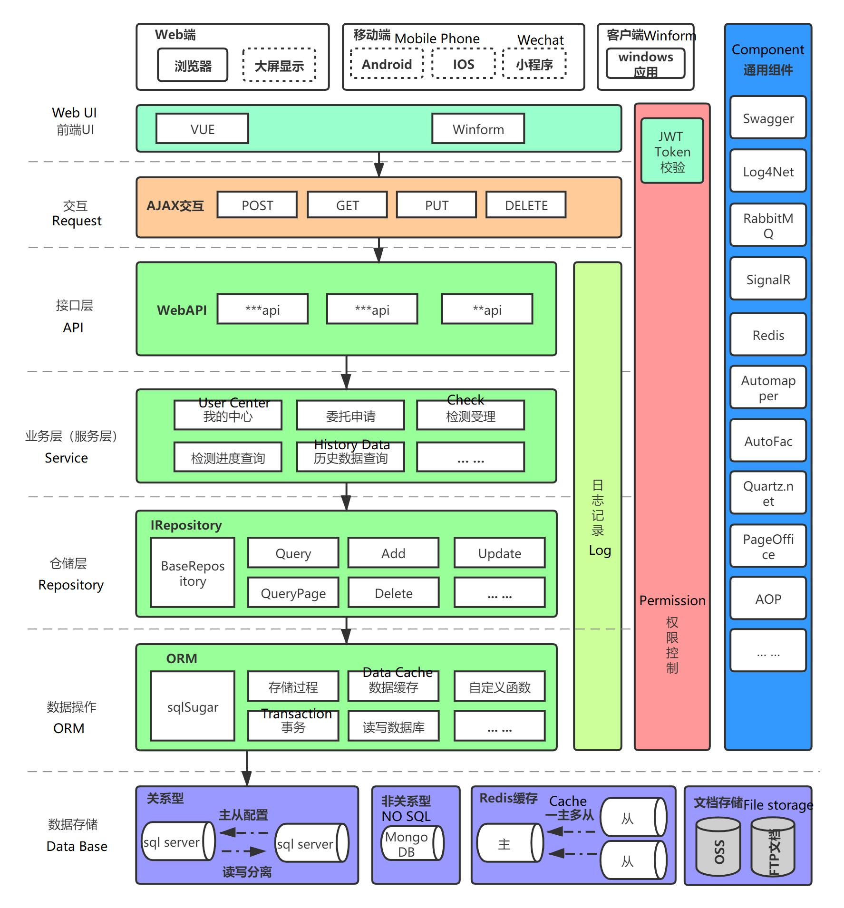

# 如何制作自己的一个开源作品

**先把devops搞定再来**

**多多与同学交流，分享心得**

作品集，帮助新手，总结经验，长期发展，吸引人切磋武艺

参考框架：

- https://github.com/anjoy8/Blog.Core Blog.Core
- https://gitee.com/ccnetcore/Yi 橙子框架

GPT讨论：https://chat.openai.com/share/4d1e2133-6d3c-404a-b43c-f6d348ffc5c4 ，开发开源框架

为什么你想要做这个开源项目？

第一点是想提高自己的编程实力，然后把碎片化学习的一些东西加入到框架当中，可以恒实知识

第二点是希望我开发的东西可以给一些新手的开发者一些帮助，虽然我想到这里我是很忐忑的

第三点是我想有一个自己的作品集，这样不论我与其他人交流，或者新的工作机会的时候我整个人是比较自信的

你希望从中得到什么？

我希望我能够更加的自信，能够更加得心应手的解决工作上面的问题，获得更高的薪水

# 如何看已有的开源项目？

从一个点进行切入去看，比如我现在要新建这个开源项目，那么我可以从一个模块进行切入去做，比如这个框架的项目有多少个？项目下面的文件布局是怎么样的？模块业务是如何拆分的？

**看到下面的图片紧张吗？**

不用紧张，吃蛋糕一样，一块一块切，先吃目前最想吃的，最好吃的，慢慢来，把她看做是一个小姑娘，慢慢的把玩就可以

虽然作者有成套的教材，视频，文档，不过跟着这样学习别人咀嚼过了一遍的内容，真的是万分枯燥的，我可以自己先新建项目，然后自己通过与ChatGPT对话的方式进行完善这个项目，然后拿我实现的东西，某个功能块，去看其他的人是怎么实现的，然后对比进行学习

