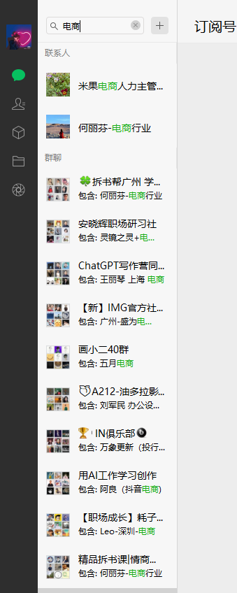
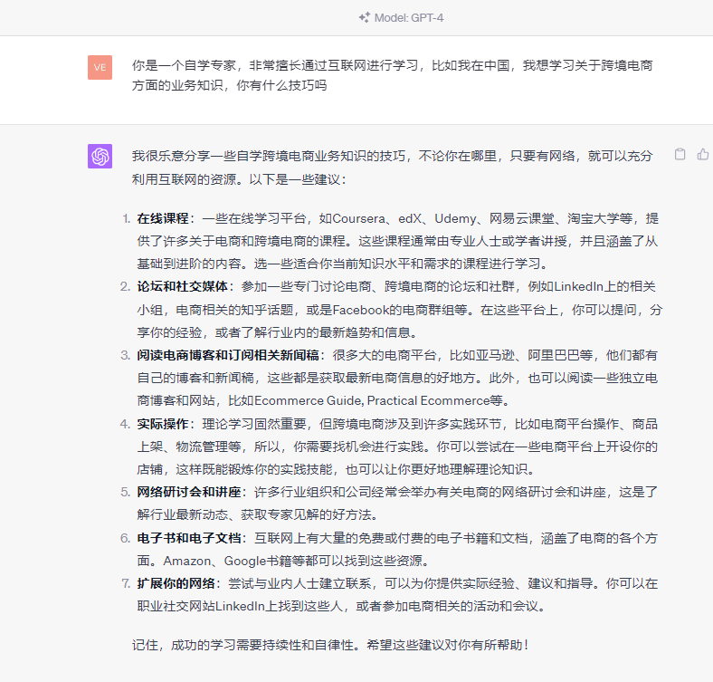
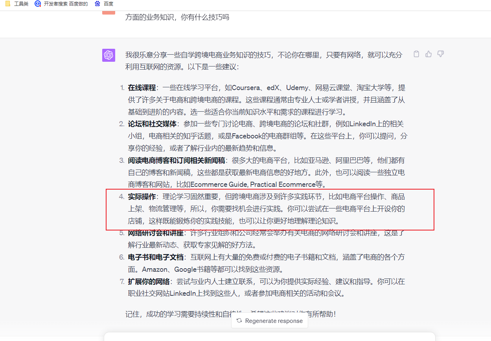
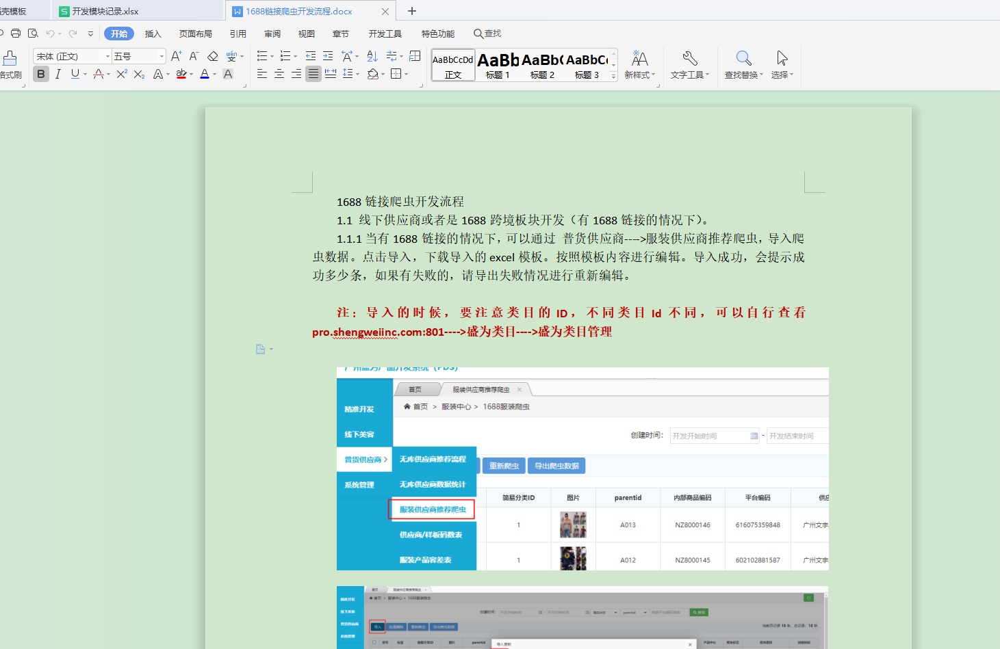
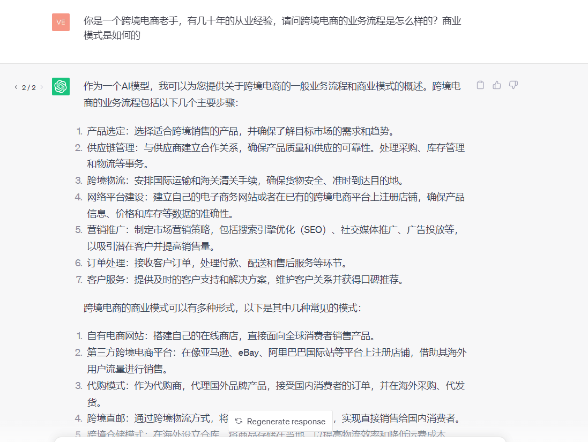
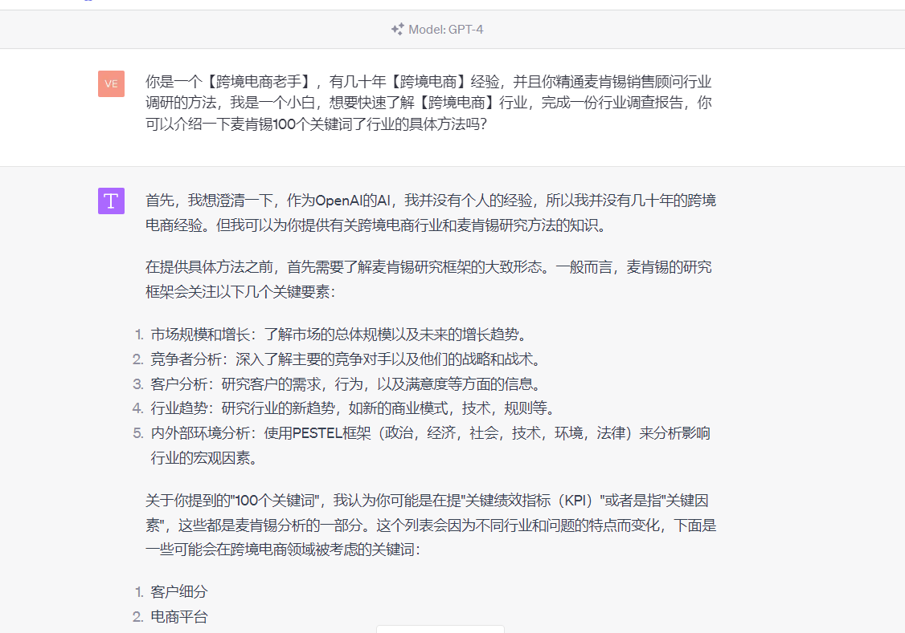

# 如何学习一门新的业务

与天斗，其乐无穷

与地斗，其乐无穷

与己斗，其乐无穷

妙哉

妙哉

​              -- 老子

**业务是学习技术方向的眼睛，茫茫大海上面的灯塔**

- 今天突发奇想，技术是学习的一方面，但是业务更为重要，技术是砌墙的工具，业务就是房子的施工图，是船在茫茫大海，前进的灯塔。

- 只有了解了业务，从业务为角度作为出发点，就知道技术的重点在哪里，技术的瓶颈在哪里，哪里是最不重要的，哪里是可以模糊一些的。

- 只有以业务为本的精进自己的技术能力，才是可以落地的技术。

- 比如跨境电商，业务点在哪里，需要定时拉取平台的订单数据，需要刊登，需要同步库存，这些业务点就是需要精进的技术点，同步库存是吧，代表数据的一致性在哪里呢

# 方法总结

**学习下面的内容很枯燥，有没有办法让它有趣一些？**
学习新的知识确实可能会感到枯燥，但是有很多方法可以使这个过程变得更有趣，下面是一些建议：

1. **寻找实际应用**：理论学习可能会让人感到枯燥，但如果你能看到这些知识如何在实际工作中应用，可能会让你更感兴趣。**刻意思考这个知识可以用到哪里？刻意思考这个知识还可以用到哪里？**
2. **设定目标和挑战**：给自己设定一些具体的学习目标和挑战，例如掌握某个新的技能，或者理解某个复杂的概念。这会给你带来动力和成就感。
3. **变换学习方式**：试着使用不同的学习方式，比如看书感觉不适合，可以试试听听音频，看看视频，或者看看其他人的文章，参加在线课程，做实践项目，或者和同事一起学习。这可以使学习过程更有趣，也可以帮助你从不同的角度理解同一个概念。
4. **自我测试**：定期进行自我测试，例如做一些练习题，或者尝试解释你所学的知识。这不仅可以帮助你检查自己的理解，也可以让学习过程更具挑战性。
5. **奖励自己**：当你达到一个学习目标时，给自己一些奖励，例如短暂的休息，看一集你喜欢的电视剧，或者吃一份你喜欢的零食。这会给你带来积极的反馈，让你更有动力去学习。
6. **利用游戏化学习**：如果可能，试试看能不能将学习过程游戏化。例如，你可以设立一些等级或者成就，每当你达到一个新的水平或者完成一个任务时，就可以解锁新的奖励或者挑战。也可以加入竞争关系，参与某种竞赛，看看谁能更快掌握知识。这不仅可以让学习过程更有趣，也可以让你更有动力去学习。

**快速学习和适应新环境中的业务知识可以按照以下步骤进行：**

1. **理解业务目标**：首先要了解公司的业务目标是什么，目标市场是什么，你的工作是如何支持这些目标的。这会帮助你确定要优先学习哪些业务知识。
2. **公司的业务模型**：公司的商业模型是什么，也就是公司如何赚钱。它的客户是谁？它的产品或服务是什么？竞争对手是谁？公司的长期战略和短期目标是什么？这些问题的答案将帮助你理解公司的目标和它在市场中的位置。
3. **学习公司的产品或服务**：使用公司的产品或服务，阅读产品手册，了解它们的功能、优点、缺点以及用户体验，**学习这个业务的业务流程是怎么样的，对全局有一个把控，最上游，最下游分别在哪里**。理解产品的价值和用途可以帮助你更好地理解公司的业务。并且以后如果开发想类似的功能的时候你可以有一个参考，看到功能的时候自己可以在脑海里面想一想如果是我开发的话，我会怎么设计这个项目的架构图
4. **学习竞争公司的产品**： 看看竞争对手的产品是怎么样的，同样的功能，他们是怎么实现的，有哪些相同点哪些不同点。
5. **收集信息**：查阅公司提供的任何相关文档，包括公司手册、流程图、产品说明、项目计划等。这些资料通常包含了很多关于业务的重要信息。
6. **与同事交流**：你的同事是了解业务的重要资源。尽可能多地与他们交谈，询问他们对业务的理解，以及他们在日常工作中使用哪些工具和技术。他们可以帮助你理解公司的业务运作方式，以及他们如何与客户、供应商和其他利益相关者进行交流
7. **ChatGPT**: 一些业务名词，专业的流程操作，可以通过询问ChatGPT获得，也可以在与同事交流后，将讨论的内容或者结论，与ChatGPT再进行更加深入一轮的探讨。
8. **寻找导师**： 找到你需要的高质量的导师，可以是在小组，非小组，在公司或者公司之外，尝试找到一个或多个导师，他们可以指导你并回答你的问题
9. **实践**：通过实际参与工作，你可以更好地理解业务流程和业务需求。不要害怕犯错误，反而要把错误视为学习的机会。
10. **学习公司的业务流程**：学习公司的业务流程可以帮助你了解公司如何运营，这包括了解公司如何从客户、供应商和其他资源中获取价值。
11. **反馈和调整**：在你开始熟悉业务之后，要定期回顾你的进步，查看你是否遗漏了某些重要的业务知识。你也可以寻求同事的反馈，看看他们是否认为你需要在某些方面进行改进。
12. **建立计划持续学习**：业务知识是不断变化的，所以你需要保持持续学习。这可能意味着定期阅读新的业务文档，参加行业研讨会，或者接受新的培训。`这一点你可以看下面的内容`

**针对于跨境电商的内容我对学习业务场景做一些总结：**

- **设定学习目标**：首先确定你想从跨境电商业务中获取哪些知识，是电商平台运营、亚马逊卖家策略，还是跨境支付和物流？确定你的具体目标可以帮助你更有效地寻找和筛选学习资源。在明确了目标后，制定一个具体的学习计划。记住，不同的学习目标可能需要不同的学习资源和时间。

- **在线课程**： 寻找你想要的业务的课程，最好是第一手的课程知识，比如跨境电商第一手的业务知识，就是平台的新生大学，平台的博客信息，这是第一手的知识，再用我之前做过的房地产行业举出个例子，第一手的知识就是住建部官网上面下发的文件，也可以在国内的网易云课程，腾讯课堂，知乎等上面找课程，或者国际版本的Coursera，Udemy也可以尝试

- **论坛**：不论学习的是什么，肯定都会有对应的论坛进行交流

- **电子书**： 电子书籍，可以自己在网络上去找，或者找公司有经验的主管进行推荐书籍也是很有帮助的

- **社交网络** :学会从博客，论坛，微信公众号中链接我想要链接的人，找到这个行业目前最需要解决的问题

- **用** ：刻意思考我学习到的这些知识可以用到哪里？刻意思考我学习到的这些知识还可以用到哪里？

- **内部资料** ：公司内部的学习资料，或者知识库，这个内部的资料，可能质量不高，但是实用性是最强的

- **行业报告和数据**：行业的报告和数据可以告诉我们目前这个行业在发生什么，有什么难以解决的问题，行业的头部公司的水平怎么样，自己的公司处于行业什么位置。 比如跨境电商行业阅读像Statista, eMarketer这样的网站发布的跨境电商报告，可以帮你了解最新的市场趋势和消费者行为。中国的电商巨头，如阿里巴巴和京东，也会定期发布他们的用户行为报告，这也是了解市场的好资源。

- **跟进行业新闻**： 跟进这个行业里面主流的发布媒体，公众号，抖音，定期去看一看。比如房地产有地产相关的公众号，主流媒体报告，可以关注

- **行业调研报告**：  快速深入的了解一个行业，比如eCommerceBytes, Alibaba的博客等都有大量的行业分析文章和成功案例分享，你可以通过阅读这些内容来学习，也可以在微信小程序看：报告查一查

- **与人交谈**：与人交谈很重要，学会利用自己手上的资源，比如微信群，微信好友，也可以在论坛，知乎，在行主动求索对应的大佬进行交流，你看我搜索电商，就有对应的人，可以先从高质量的社群找：1.拆书帮 2.职场研习社 3.末末星球 4.李笑来老师社群  5.粉笔老师社群 然后在微信好友里面找，可以事半功倍

  

  

## 如何奖励自己

**奖励自己**：当你达到一个学习目标时，给自己一些奖励，例如短暂的休息，看一集你喜欢的电视剧，或者吃一份你喜欢的零食。这会给你带来积极的反馈，让你更有动力去学习。  比如说奖励自己看电视，但是现在电子产品的吸引力都很大，一看的话 可能就一直会看下去了

你提到的这个问题是非常实际的，许多人都在与电子设备的诱惑中挣扎。以下是一些策略， 刻意帮助你

1. **选择正确的内容**：选择一些你知道可以在预定时间内完成的内容，例如一集20分钟的电视剧，而不是一个连续剧，或者单独下载下来，放到一个不联网的设备中进行看
2. **控制环境**：尽量在一个你不会过于舒适的环境中看电视，比如坐在办公桌前，而不是躺在床上或者沙发上。
3. **自我提醒**：记住，看电视只是一种短暂的奖励，而不是你的主要目标。完成工作或学习才是你真正要做的事情。
4. **⭐选择其他形式的奖励**：如果你发现自己很难控制看电视的时间，那么你也可以选择其他形式的奖励，例如阅读一章你喜欢的书，散步，冥想，做一些运动，或者享受一些你喜欢的零食。
5. **进行户外活动**：完成一项任务或学习目标后，可以选择下楼进行一次短暂的散步，跑步，或者骑车等，也可以在房间做一做伸展运动，走动一会儿。这样不仅可以帮助你放松，也有助于保持健康。
6. **阅读非学习相关的书籍**：选择一本你非常喜欢的书作为奖励。可以是一本小说，或者是关于你感兴趣的其他主题的书籍。
7. **艺术或手工活动**：如果你喜欢画画，做手工，或者是其他艺术活动，你可以在完成学习任务后，花一些时间进行这些活动。
8. **用抹布打扫家里** ：用抹布打扫家里，刻意让自己放松满足
9. **做一顿喜欢的饭菜**：如果你喜欢烹饪，你可以奖励自己做一顿特别的饭菜。
10. **进行冥想或者瑜伽**：如果你觉得压力较大，可以选择在完成任务后进行一些放松的活动，比如冥想或者瑜伽。

总的来说，关键是要找到一个既能让你感到满足，又不会分散你注意力的奖励方式。

## 如何自我测试

**自我测试**：定期进行自我测试，例如做一些练习题，或者尝试解释你所学的知识。这不仅可以帮助你检查自己的理解，也可以让学习过程更具挑战性。 如果我学习的是跨境电商方面的知识，我要怎么测试自己的知识水平

跨境电商的知识涵盖了许多方面，如市场调研、产品选择、供应链管理、国际支付、物流、客户服务、文化差异理解、外语能力、营销策略、税务和关税规定等。要测试自己的知识水平，你可以从以下几个方面进行：

1. **案例分析**：选择一些跨境电商的案例进行分析，例如，你可以分析一个成功的跨境电商公司的业务模式、市场策略、产品选择等。试图用你所学的知识解释他们的成功之处，并思考如何应用到自己的工作或项目中。
2. **模拟业务情境**：根据你所学的知识，设想一些具体的业务情境，并尝试找出解决问题的策略。比如处理一个国际订单，解决跨境支付问题，设计一项面向海外市场的营销策略等，然后尝试找出解决方案。
3. **解决实际问题**：如果你正在运营一个跨境电商业务，你可以通过解决实际遇到的问题来测试你的知识。例如，你可能需要处理一些与供应链、客户服务或税务相关的问题。
4. **在线测验和课程**：许多在线教育平台都提供了跨境电商相关的课程和测验，你可以通过完成这些课程和测验来检查自己的理解。比如LinkedIn Learning，Coursera等，这些平台有关于跨境电商的课程，同时提供相关的测试和认证。
5. **阅读和总结**：阅读一些关于跨境电商的最新文章或者案例，然后尝试总结你从中学到的新知识和理念。或者，你也可以尝试写一篇关于你所学的知识的文章或博客。
6. **讨论和解释**：找一个朋友或同事，向他们解释你所学的知识，看他们是否能理解。如果你能成功地向他们解释，那就说明你已经掌握了这个知识。
7. **讨论和问答**：参与相关的论坛或社区的讨论，回答别人的问题，或者提出你自己的问题，这也是一种很好的测试你自己知识水平的方式。
8. **写作与呈现**：尝试写一篇关于你所学的文章，或者做一个主题的演讲或者报告。这样可以帮助你梳理和整理你的知识，并检查你对主题的理解程度。
9. **参加模拟面试**：找一个可以进行模拟面试的朋友或同事，让他们提出一些与跨境电商相关的问题。这可以帮助你准备可能会在实际工作中遇到的问题。

通过这些方式，你不仅可以检查自己的理解，还可以将所学的知识应用到实践中，从而更深入地理解和掌握这些知识。

## 如何游戏化学习

**利用游戏化学习**：如果可能，试试看能不能将学习过程游戏化。例如，你可以设立一些等级或者成就，每当你达到一个新的水平或者完成一个任务时，就可以解锁新的奖励或者挑战。也可以加入竞争关系，参与某种竞赛，看看谁能更快掌握知识。这不仅可以让学习过程更有趣，也可以让你更有动力去学习。
**有什么办法定制游戏化的学习呢**

定制游戏化的学习需要创造性地将游戏元素和动机融入学习过程。以下是一些具体的方法：

1. **设置目标**：为你的学习过程设定具体、可度量的目标，类似于游戏中的任务或挑战。这些目标可以是长期的，例如学习一个新的技能，或者短期的看完一页书
2. **使用积分系统**：为完成的目标或者任务设定积分。例如，你可以给阅读一章书赋予10分，然后用关羽20分，张飞30分，刘备40分，诸葛亮90分，马超60分，赵云 80分这些角色来设置每天的积分情况，完成一次自我测试赋予50分等。积分可以用来追踪你的进度，并且兑换奖励，比如十个诸葛亮可以买一个学习课程。
3. **奖励与惩罚**：达到某个积分阈值后，给自己一些奖励。奖励可以是物质的，如小零食或者小礼品，也可以是象征性的，**如一枚勋章或者一个成就徽章,或者是诸葛亮的贴纸**，这些帖子徽章可以用MJ生成，或者直接淘宝买三国的贴纸。
4. **等级系统**：你可以设立几个等级，每当积分达到某个阈值，某一个里程碑，你就升级，比如真*关羽。每个等级可以有不同的挑战和奖励，这样可以给你提供持续前进的动力。
5. **设计挑战和谜题**：你可以为自己设计一些与学习内容相关的挑战和谜题，比如今天如果偷懒的话，那么就做完这10道题那么就可以看一部电影，或者阶段性主动挑战的难题，设计一个MVP最小可执行的框架，那么奖励两杯烤冰。
6. **反馈和进步可见**：设计一种可视化方式来记录和显示你的进步，例如一个进度条或者一个成就墙，把得到的徽章都放到墙上面。这可以让你看到自己的学习成果，并激励你继续前进。
7. **竞赛与合作**：如果可能，和朋友、同事一起学习，设置一些友好的竞赛，看谁先达到目标，或者一起达成一项挑战。
8. **反馈**：定期检查你的积分和等级，看看你的学习进度如何，是否需要调整你的目标或策略。
9. **使用工具和应用程序**：有许多在线工具和应用程序可以帮助你实现学习的游戏化。例如，Duolingo（语言学习），[Kahoot](https://kahoot.com/academy/study/)（创建自己的学习游戏）等。
10. **互动竞赛**：如果可能的话，你可以和同事、朋友或者同学一起参与一些学习竞赛。比如谁能在一周内看完更多的书籍，或者谁能首先完成一项挑战任务。

记住，游戏化学习的目的是为了使学习过程更有趣和激励人，而不是让学习变成一场竞赛。你应该以你自己的进步为主，而不是和别人比较。

**扩展**：游戏化的应用程序

确实有一些其他的在线工具和应用，也支持创建自己的学习游戏，它们与Kahoot类似，但具有自己独特的特性和功能。以下是其中一些：

1. **Quizlet**：Quizlet是一个允许用户创建和搜索卡片、小测验和游戏的学习工具。它是一个强大的自我测试工具，适用于各种学科的学习。**学习英语单词，心理学，编程很不错：https://quizlet.com/zh-cn**
2. **Quizziz**：Quizziz允许你创建和玩自定义的测验游戏，它有多种游戏模式，包括实时竞赛和自我学习模式。，官网：https://quizizz.com/?lng=en 网站打开非常慢
3. **Gimkit**：Gimkit允许用户创建游戏化的测验，参与者在答题过程中可以获得虚拟货币，然后用货币升级自己的游戏状态，提高得分。**自定义创建学习游戏，非常给力：https://www.gimkit.com/creative/tutorial**

请注意，使用这些工具时，请先确保它们符合你所在的学习或工作环境的隐私和数据安全政策。

## 怎么判断行业赚钱

**提问**：我要到哪个网站上面可以找到最赚钱的几个行业，比如不知道该去哪个行业工作的话，看看上市公司的市值排名，再看看福布斯排行榜，哪个行业出镜率最高就去哪，大佬们吃肉还是会给小老弟们留点汤的。

查找最赚钱的行业，通常可以参考以下几个公认的**经济和财经网站**：

1. 福布斯（Forbes）： 福布斯每年都会发布全球最大的公司，最赚钱的行业等排行榜。[https://www.forbes.com](https://www.forbes.com/) ,[全球2000强公司](https://www.forbes.com/lists/global2000/?sh=54e82e2b5ac0)点击公司进去可以看指定公司的详细信息，结合前程无忧行业发展报告进行选择
2. 财富（Fortune）： 该网站提供了世界上最大的公司的排名，以及行业的收入和利润报告。[https://fortune.com](https://fortune.com/)
3. 彭博社（Bloomberg）： 这个网站提供了全球的金融新闻和数据，可以了解到哪些行业正在增长和赚钱。 [https://www.bloomberg.com](https://www.bloomberg.com/)
4. 经济学人（The Economist）： 这个出版物经常发表有关全球经济趋势和最热门行业的深度分析。 [https://www.economist.com](https://www.economist.com/)

需要注意的是，这些网站上提供的信息都是大体的行业趋势，并不意味着每个人在这些行业都能赚钱。个人的经验，技能，知识，和网络等都会影响到你在特定行业的成功。

**上市公司市值排名**

关于上市公司的市值排名，你可以在以下的一些网站查找：

1. Yahoo Finance：[https://finance.yahoo.com](https://finance.yahoo.com/) Yahoo Finance 是一个提供全球股票市场，包括市值，新闻，数据和其它相关金融信息的网站。
2. Google Finance：https://www.google.com/finance Google Finance 也提供全球股票市场信息，包括市值，新闻，数据等。
3. Bloomberg：[https://www.bloomberg.com](https://www.bloomberg.com/) Bloomberg 提供全球股票，债券，期货，指数等金融产品的数据，新闻和分析。
4. Reuters：[https://www.reuters.com](https://www.reuters.com/) Reuters 提供全球金融市场的新闻和数据，包括市值信息。

以上网站的具体内容可能会因地域差异而异，一些数据可能需要付费才能获取。

## 如何快速了解一个行业

通过麦肯锡行业调研的方法快速了解一个行业

**工具**： ChatGPT+Xmind

**提示词：**

1. 你是一个【跨境电商老手】，有几十年【跨境电商】经验，并且你精通麦肯锡销售顾问行业调研的方法，我是一个小白，想要快速了解【跨境电商】行业，请帮我整理出这个行业最重要的100个关键词，请注意：这些关键词尽可能涵盖行业的不同方面。

2. 请将上面的100个关键词，按照关系就近原则，分成几个大类目，并以表格形式呈现给我。

3. 请结合上面的分类，进一步帮我细化这些关键词之间的「从属关系」，并按照优先级从高到底的顺序进行罗列。请注意，如果有需要可以罗列出二三级类目，以表格形式呈现给我。

4. 请在请基于上面的表格，在最后增加一列，用一句话分别概括描述每一个关键词。

5. 请结合上面的关键词、逻辑关系，帮我整理出【跨境电商行业】对应的关键性产品和公司。

6. 请给我推荐中国国内，5个【跨境电商】行业的顶级公司，公司描述，官网地址，还有5个顶级专家，每个专家给一个百度百科链接或者维基百科链接或者博客链接，5本跨境电商行业的专业书籍，包含作者，发布时间，书籍详情链接  。 注意：请确保链接的有效性，请你自己验证一下

   
     

扩展阅读：干货分享丨5个Prompt，教你如何用ChatGPT快速了解一个新行业！ https://zhuanlan.zhihu.com/p/638954384

# 跨境电商尝试

第一步我想到的是先找ChatGPT聊聊：你是一个自学专家，非常擅长通过互联网进行学习，比如我在中国，我想学习关于跨境电商方面的业务知识，你有什么技巧吗

我很乐意分享一些自学跨境电商业务知识的技巧，不论你在哪里，只要有网络，就可以充分利用互联网的资源。以下是一些建议：

1. **在线课程**：一些在线学习平台，如Coursera、edX、Udemy、网易云课堂、淘宝大学等，提供了许多关于电商和跨境电商的课程，尤其根据你所在公司的业务，对应的平台都有新生大学，你可以去看平台相关的内容。这些课程通常由专业人士或学者讲授，并且涵盖了从基础到进阶的内容。选一些适合你当前知识水平和需求的课程进行学习。
2. **论坛和社交媒体**：参加一些专门讨论电商、跨境电商的论坛和社群，例如LinkedIn上的相关小组，电商相关的知乎话题，或是Facebook的电商群组等。在这些平台上，你可以提问，分享你的经验，或者了解行业内的最新趋势和信息。
3. **阅读电商博客和订阅相关新闻稿**：很多大的电商平台，比如亚马逊、阿里巴巴等，他们都有自己的博客和新闻稿，这些都是获取最新电商信息的好地方。此外，也可以阅读一些独立电商博客和网站，比如Ecommerce Guide, Practical Ecommerce等。
4. **实际操作**：理论学习固然重要，但跨境电商涉及到许多实践环节，比如电商平台操作、商品上架、物流管理等，所以，你需要找机会进行实践。你可以尝试在一些电商平台上开设你的店铺，这样既能锻炼你的实践技能，也可以让你更好地理解理论知识， 一些大型电商平台（如亚马逊、淘宝）通常会提供所谓的“沙箱”或者“测试环境”，供商家在开店之前进行试运行。你可以在这样的环境中模拟创建一个店铺、添加商品、设置价格等操作。但是，这种环境可能并不涵盖所有的店铺运作环节，比如支付和物流等
5. **网络研讨会和讲座**：许多行业组织和公司经常会举办有关电商的网络研讨会和讲座，这是了解行业最新动态、获取专家见解的好方法。
6. **电子书和电子文档**：互联网上有大量的免费或付费的电子书籍和文档，涵盖了电商的各个方面。Amazon、Google书籍等都可以找到这些资源。
7. **扩展你的网络**：尝试与业内人士建立联系，可以为你提供实际经验、建议和指导。你可以在职业社交网站LinkedIn上找到这些人，或者参加电商相关的活动和会议。

记住，成功的学习需要持续性和自律性。希望这些建议对你有所帮助！

我看到里面有一个，比如说实际的开一个店铺的操作，这个可是耗费时间，精力的过程，如果拿最小可执行单位为目标，那么就是以卖出一件商品为基础，也是很有帮助的，如果打算持续的在这一行打磨下去，是可以做的

我又想到实际的业务场景，网络上学习的内容，不一定与实际的操作有关，所以如果学习课程，加入论坛，看书籍的时候我们可以让公司内部的人推荐，或者有经验的人进行推荐是比较好的

## 公司内部文档

今天我拿盛为公司的文档看一下跨境电商的内部业务，发现两点可以改进：1.文件的及时性 2.手动操作系统

**文件的及时性：**说的是下面的文档是旧系统的文档，里面的操作是旧系统的操作，可能业务流程方面可以借鉴，不过不是很建议，这部分可以在实际操作系统导入与同事，导师交流解决

**手动操作系统**：文档是僵硬的，没有体验的，如果能够手动操作一下系统，收获到的东西更加深刻

**文档质量**： 有些是随手写的，有些是产品写的，有些是同事写的，最好就是专门的人写的，比如产品经理，部门主管等内容。像我下面的内容可能就是随手写的，排版什么的都很随意。

## 与ChatGPT交流

在看过上面的文档后，我对电商行业整个的业务流程产生了浓厚的兴趣，对电商整体的业务模式，业务流程，还有供应商板块有一些疑问，于是我想找ChatGPT交流交流，并且过程中我想到我可以利用ChatGPT PLUS版本的插件功能直接给我绘出一份思维导图出来。

总的来说ChatGPT是很不错的，针对于某一个知识点进行切入，比如物流运输方式，可以很好的熟悉这里面的细节，也可以配合挖掘一个行业的知识内容提示词，快速的学习业务知识

行业业务流程：https://chat.openai.com/share/a206b8fc-5afc-4059-9b40-1190db1d672b

也有其他的麦肯锡行业调研方法也挺不错的，我发现里面的市场规模，竞争对手，供应链，我从来都没有想过整个问题，所以我的视角很窄，只看到了自己门前的一亩三分地，没有站在全局进行考虑。

麦肯锡行业调研方法：https://chat.openai.com/share/4fa38476-5f5e-415b-a751-b07ddd2ca6df

**提示词：**

1. 你是一个【跨境电商老手】，有几十年【跨境电商】经验，并且你精通麦肯锡销售顾问行业调研的方法，我是一个小白，想要快速了解【跨境电商】行业，完成一份行业调查报告，你可以介绍一下麦肯锡100个关键词了行业的具体方法吗？

2. 请帮我整理出这个行业最重要的100个关键词，请注意：这些关键词尽可能涵盖行业的不同方面。

3. 请将上面的100个关键词，按照关系就近原则，分成几个大类目，并以表格形式呈现给我。

4. 请结合上面的分类，进一步帮我细化这些关键词之间的「从属关系」，并按照优先级从高到底的顺序进行罗列。请注意，如果有需要可以罗列出二三级类目，以表格形式呈现给我。

5. 请在请基于上面的表格，在最后增加一列，用一句话分别概括描述每一个关键词。

6. 请结合上面的关键词、逻辑关系，帮我整理出AI行业对应的关键性产品和公司。

7. 请给我推荐中国国内，5个【跨境电商】行业的顶级公司，公司描述，官网地址，还有5个顶级专家，每个专家给一个百度百科链接或者维基百科链接或者博客链接，5本跨境电商行业的专业书籍，包含作者，发布时间，书籍详情链接  。 注意：请确保链接的有效性，请你自己验证一下

   
     

**扩展阅读**：干货分享丨5个Prompt，教你如何用ChatGPT快速了解一个新行业！ https://zhuanlan.zhihu.com/p/638954384

**扩展思考模型**：在进行行业调研时，麦肯锡通常会使用一些经典的框架，如PESTEL分析（政治、经济、社会、技术、环境、法律）、波特五力模型（行业竞争态势）、SWOT分析（优势、劣势、机会、威胁）等，这些都是非常有效的工具，能够帮助你更好地理解行业状况。