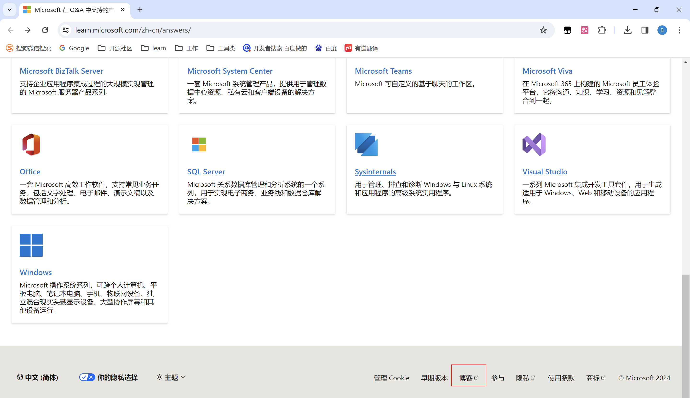
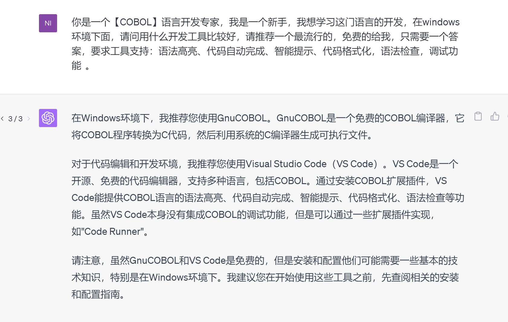
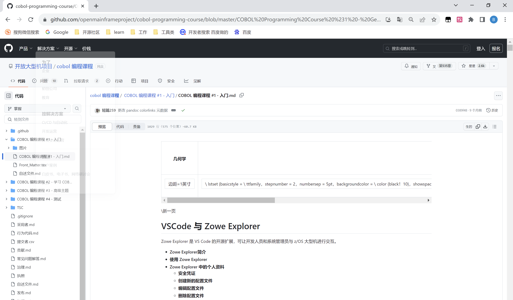
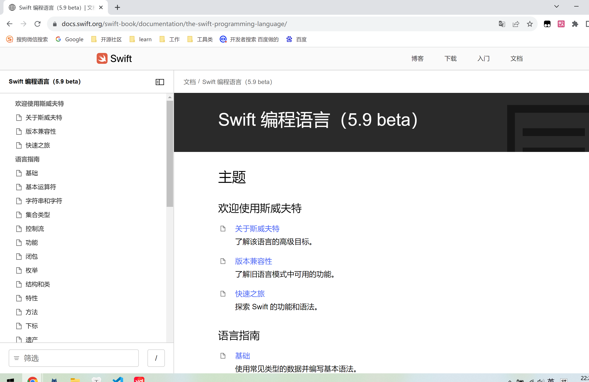
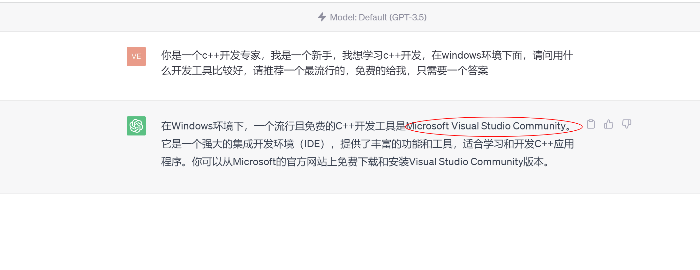
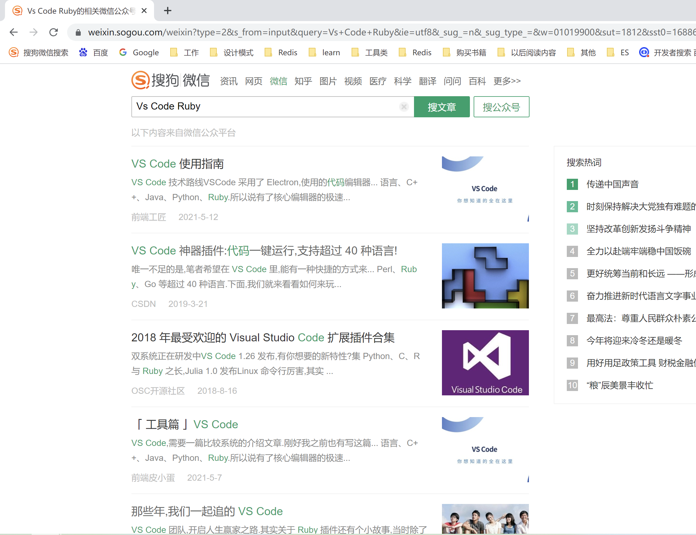
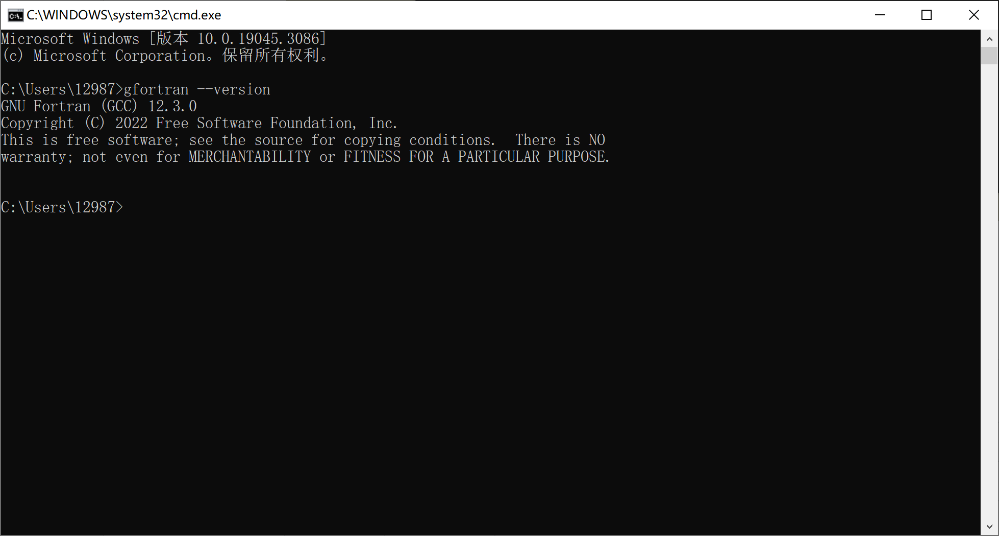

# 如何学习一门新的语言

扩展阅读：https://www.tiobe.com/tiobe-index/  新语言的排名目录

## 开始

访问语言的官网，出处的位置，你要相信官网一定会有完整的教程教你怎么入门，并且内容足够的权威


官方的教程中一般有四种内容：

- **文档**： 入门学习的文档，这个开始适合初学者，不过要注意的是学会怎么快速定位到自己需要的内容，如果文档的内容非常丰富的话，怎么找到对应的你想学习的知识点也需要一个方法
- **视频教程**： 可能会有配套的视频教程
- **博客** ：对应作者的博客，官方的文档编写者可能有姓名，我们可以找到对应的博客进行学习。或者底部可能有博客按钮



- **Github项目** ：官网的对应的项目，官方的Github有哪些项目这些应该也是比较好适合学习的内容，**如果框架或者语言本身是开源的，比如AngularJS，可能Github上面的资料更加丰富**,比如下面的Github上面的文档有对新手开发看的教程，有完整的API文档（单个函数的指导）,有对开发人员指南（给开发人员看的文档）


## 高质量的信息源

### 如何找到高质量的信息源？

 http://www.360doc.com/content/23/0304/19/64352794_1070453893.shtml 

- **被动与主动**:我想到的是被动看到的东西价值都是很低，主动搜索的内容价值都比较高，所以公众号，社群，感觉都不重要，重要的是你是主动获取什么，还是被动吸收

  


综合来说，高质量信息源的特点，主要有以下五个：

1. 一手信息要比二手信息有价值：比如ChatGPT的规则发布，关注官网就是一收信息，关注公众号就是二手的信息
2. 经典著作要比畅销书籍有价值：比如编程领域的设计模式一书，几十年了，比新发布的书籍好的多
3. 知识源头的人比信息本身更有价值。
4. 系统化信息比碎片信息更有价值。
5. 主动挖掘的信息比被动获取的信息更有价值。


## 搭建环境

今天突发奇想我想学习一下PHP，没错，我就是想试一试，但是我又没有什么目的，可能是好奇，也可能是想锻炼一下自己的学习能力，与ChatGPT相配合一下学习一门新的语言，想总结出一套学习技巧。


**开始学习一门新的语言的时候，搭建环境，搭建的工具，请从专业的书籍里面进行学习，ChatGPT不擅长这种带图文的步骤，我认为这也是网络教程最重要的一个作用，如果我能够找到稳定的对应语言的开发环境，开发工具的安装方法，那么我可以学会任何一门语言**


不过互联网上面的环境搭建教程质量层次不齐，我在学习这本语言的时候，我并不想把我有限的时间和脑力花很多精力在这件事情上面，所有高质量的环境搭建教程，开发工具下载的内容特别重要，我推荐是是**书籍**，当然你也可以上哔哩哔哩上面，不过我不推荐哔哩哔哩：

1.**视频内容需要检索，过滤，效率不高**

视频里面的内容虽然后标题但是还是需要慢慢等着一帧一帧的放，我感觉挺没有效率的，并且如果没有对应的内容，我还得在哔哩哔哩里面反复找


2.**哔哩哔哩相关的内容很吸引人，容易走神**

一不小心就被吸引走了，搞不好一下就是几个小时打水漂


开始我就折腾错误了，搭建一个PHP的运行环境就把我折腾的够呛，ChatGPT只是依靠语言告诉我怎么做，怎么做，可是不知道是它的知识库太久还是怎么回事，它表达的步骤与官网的内容不一致，或者就是某个步骤比较复杂，是个复合的步骤，但是GPT只讲了一个步骤，于是我就苦逼了。


## 八种搜索思路

- **Google**：Google看博客上面的信息(优先Google然后百度)：这一步我发现也很苦逼，因为你没有学习过这个内容，百度的答案中十个可能就九个都是质量低下的答案，筛选，尝试都是时间成本，并且消磨人的耐心，很可能就让你放弃了。
- **电子书籍**：我觉得这个方法可行性是非常强的，因为书籍一般都非常权威，质量高，并且可读性强，试错成本低，可以查看目录直接找到安装环境的这一关，或者根据我自身的水平找到这一关
- **视频学习**：哔哩哔哩上面的视频就很好，很适合学习，现在视频剪辑的都很好，短小精悍，每一个知识点都是一个小的视频，可读性很好，但是不过瘾，因为一个视频10分钟的内容，可能我看书10秒钟我就知道有没有我想要的东西，看这个视频我还得从头看到未才知道，快进也需要时间，精力和耐心
- **官方文档**：官方文档我认为是有解决方案的，但是官方文档的特点是权威，全面，严谨，所以可读性一般比较差，个人不建议一开始就看官方文档，很可能会劝退一部分人
- **Github**：awesome c++ ,或者对应语言，这里会搜索到电子书籍，相关的周边生态工具，视频教程
- **微信**：**安装包**，环境搭建，安装方法，使用技巧
- **知乎**： 环境搭建经验，语言开发建议

**总结**：问GPT找到开发语言对应的工具，再到知乎里面问工具适用性如何，然后在到微信搜索里面找的工具的下载链接与安装方法，然后在搜狗微信搜索中检索工具简单的使用方法，然后问GPT语言的使用，然后用学习书籍里面语言特性进行补充学习

**Tips**: 关于工具，我的建议是不要多好都可以，直接拿到手就开始用，毕竟越快入门越好，不要追求最好用的工具，马上跑起来才是硬道理，然后我得出了vs code可以用来开发几乎所有的前端语言，vs 可以用来开发几乎所有的后端语言


# 如何快速找到一本靠谱的书籍

1. **在线书店和图书馆**：访问在线书店（如亚马逊、京东，豆瓣等）或当地图书馆的网站，使用相关关键词搜索你感兴趣的技能或领域。这些平台通常提供丰富的书籍资源，包括学习指南、教程和专业参考书。
2. **学术网站和数据库**：一些学术网站和数据库提供免费或付费的学术资源，包括专业书籍。例如，你可以尝试访问Google 学术、ResearchGate 或者 JSTOR 等网站，搜索相关的领域和技能，以获取专业书籍和学术文章。
3. **社区推荐和评论**：参与在线论坛、社交媒体群组或专业社区，寻求其他人对于学习该技能的推荐和建议。人们通常会分享他们的阅读经验，并推荐相关的专业书籍。这些社区可以提供宝贵的资源和意见。
4. **学术课程和课程大纲**：浏览大学或在线学习平台上的相关学术课程，查看课程大纲和推荐书籍。这些课程通常会提供一份书单，列出学习该技能所需的专业书籍，这将帮助你快速找到合适的资源。
5. **专业协会和组织**：探索与你感兴趣的领域相关的专业协会和组织。这些组织通常提供资源推荐、书籍列表和学习建议，可以为你提供找到专业书籍的指引。

记住，在选择书籍时，最好查看书籍的评价、作者的资质和出版日期，以确保你获取到最新且高质量的资料。

## 在线书店和图书馆

找书也是有技巧的，比如技术图书在国内我们优先看人民邮电出版的图灵程序设计丛书，异步图书，黑皮书，还有清华大学，电子工业出版社出版的图书，O’Reilly出版的动物书，Manning出版的“实战”书， ，这些都是业内质量比较高的技术图书，还有一些通用的选书技巧：

1. 看作者是不是在这个领域有自己的成果和作品，有没有落地的经验，这一点一般简介中可以看到。
2. 看图书的书评人和书评内容，看书评人的意思物以类聚，人以群分，如果书评人的量级很高，基本图书的作者的水平差不到哪里去，如果书评的人是比尔盖茨，马云将的一些名言名语不是针对于这本书做的书评的话，那你要谨慎选择了，因为一般是作者很厉害不需要邀请人评论，一般就是水平一般找不到有一定咖位的人进行评论。然后进行分析书评的内容，看和我们自身有没有帮助
3. 看图书的出版次数，图书的出版次数多的书一般都是非常受环境的书籍
4. 看图书的目录，如果确认作者有两把刷子，看目录的内容就是把自己的问题与相关的内容进行关联的过程，看目录里面不是能够有解决自己问题的东西


找书我一般都会在ZLibary进行查找，[查找可用ZLibary镜像](https://www.maxiaobang.com/12800.html)


不过里面的书籍格式有EPUB、MOBI、AZW3，PDF，这些书籍需要专门的阅读器进行打开，我自己使用**Sumatra PDF Reader**，官方地址：https://www.sumatrapdfreader.org/docs/SumatraPDF-documentation ，开源地址：https://github.com/sumatrapdfreader/sumatrapdf


从ZLibary搜索下载了一本  [PHP 7.0+MySQL网站开发全程实例 (于荷云) (Z-Library ](https://lib-npju3nbw2pzzv5nx3f3nvgnw.thanks.sbs/book/17525431/c7c2b0)  书籍，尝试用环境两个字检索，看是不是有对应的搭建教程


这本书是清华大学出版，从目录里面我找到搭建环境是我最需要的内容，于是开始搭建开发环境


一般开始学习一个语言的时候有几点比较重要，第一点是开发环境，第二点是开发工具，满足了这两点后，剩余的就是输出**Hello Word**了！

第一步：安装好了XAMPP后，启动Apache


第二步：验证是否可以访问Apache服务器，看到这个页面就是正常（这里的8001端口是我更改了端口，默认是80端口）


第三步：开始编写Hello Word，把编辑好的网页放到下面的路径里面Xampp是我们安装的软件,htdocs是目标文件夹,php是我自定义的,hello.php是我新建的文件


第四步：进行访问，http://127.0.0.1:8001/php/hello.php


## GitHub搜索

搜索awesome php,也可以是awesome python/java/c#


# COBOL语言学习尝试

1. **COBOL编程语言的历史和背景**

| 问题     | 答案                                                         |
| -------- | ------------------------------------------------------------ |
| 发明时间 | 1959年                                                       |
| 发明背景 | 在20世纪50年代末，由于大规模的商业计算需要，出现了对新编程语言的需求。 |
| 发明国家 | 美国                                                         |
| 发明人   | 一个由商业数据处理专家组成的委员会发明了这种语言。其成员来自各个行业和政府机构。 |
| 发明机构 | 美国防部的CODASYL委员会(COnference on DAta SYstem Languages) |
| 机构简介 | CODASYL是由美国防部主导的一项工作，旨在创建一种统一的商业编程语言。 |
| 是否开源 | COBOL本身不是开源的，但有开源版本的COBOL，如GnuCOBOL。       |

1. **COBOL的使用场景**

| 使用场景                                     | 描述                                                         |
| -------------------------------------------- | ------------------------------------------------------------ |
| 银行和金融服务                               | 众所周知，大多数银行和金融机构的交易处理系统是用COBOL编写的。 |
| 保险公司                                     | 保险公司也广泛使用COBOL，特别是在政策管理和索赔处理系统中。  |
| 公用事业                                     | 公用事业，如电力公司和水务公司，使用COBOL处理账单计算和客户账户管理等任务。 |
| 政府服务                                     | 许多政府服务和系统，包括税务、福利、公积金等，也使用COBOL进行数据处理。 |
| 主帧计算                                     | COBOL在大型主机计算环境中仍然非常普遍，因为主机提供了高级别的可靠性、可用性和安全性。 |
| 数据密集型应用                               | COBOL在处理大量数据方面表现出卓越的性能，因此在数据密集型应用中非常受欢迎。 |
| 长期运行的、需要稳定性和可靠性的应用程序     | 由于其健壮性和稳定性，COBOL被广泛应用于需要长期运行的应用程序。 |
| 遗留系统                                     | 许多遗留系统，即使在现代环境中，也继续使用COBOL，因为它们在许多年的使用中被证明是可靠的，并且经济上不切实际的进行系统替换。 |
| 应用程序需要直接访问和操作底层数据记录的情况 | COBOL设计的目的就是为了处理大量的数据记录，所以在需要直接访问和操作底层数据记录的应用程序中，COBOL是一个很好的选择。 |
| 当需要用人类可读的方式来表示业务逻辑时       | COBOL的设计目标之一是使非程序员也能理解代码的意图，因此在需要用人类可读的方式来表示业务逻辑时，COBOL是一个很好的选择。 |

1. **COBOL的目标和问题**

| COBOL的目标和问题 | 描述                                                         |
| ----------------- | ------------------------------------------------------------ |
| 目标              | COBOL被设计出来的目的是为了解决大规模的数据处理和商业计算问题。其设计目标之一是使非程序员也能理解代码的意图。 |
| 问题              | 尽管COBOL在处理大规模的数据处理任务上做得很好，但它不适合用于开发现代的、交互式的、基于web的应用程序。它也不适合用于开发需要复杂逻辑和高性能计算的系统。 |

1. **COBOL的优点和缺点**

| 优点               | 描述                                                         |
| ------------------ | ------------------------------------------------------------ |
| 高度可读性         | COBOL的设计目标之一是使非程序员也能理解代码的意图，所以它的语法很接近自然语言。 |
| 优秀的文件处理能力 | COBOL被设计为处理大量的数据和文件，所以它在文件处理方面的功能非常强大。 |
| 健壮和稳定         | COBOL程序经常在需要高度可靠性和稳定性的环境中运行，如银行和航空公司。 |
| 广泛的应用领域     | 尽管COBOL是一种老的编程语言，但它在很多领域中仍然被广泛使用，如金融、保险、公用事业等。 |
| 良好的向后兼容性   | COBOL程序一般有良好的向后兼容性，这意味着老的COBOL程序可以在新的环境中运行。 |

| 缺点                     | 描述                                                         |
| ------------------------ | ------------------------------------------------------------ |
| 缺乏现代编程特性         | 与一些现代编程语言相比，COBOL缺乏一些重要的特性，如面向对象编程和泛型。 |
| 不适合开发复杂的业务逻辑 | COBOL虽然在数据处理方面表现出色，但在处理复杂的              |

| 缺点                         | 描述                                                         |
| ---------------------------- | ------------------------------------------------------------ |
| 不适合开发现代交互式应用     | COBOL不适合用于开发现代的、交互式的、基于web的应用程序。     |
| 语言复杂性                   | COBOL语法规则多且复杂，学习和理解难度较大。                  |
| 年轻程序员的使用率低         | COBOL在新一代的程序员中使用率较低，部分原因是因为它不被视为一种"现代"的编程语言，导致招聘具备COBOL技能的程序员变得困难。 |
| 对新技术的支持不足           | 相比其他一些更现代的编程语言，COBOL对新技术（如云计算、分布式系统等）的支持不足。 |
| 缺乏足够的开发工具和社区支持 | 尽管有一些开源项目和工具支持COBOL，但相比其他现代编程语言，COBOL的开发工具和社区支持相对较弱。 |
| 维护成本较高                 | 鉴于许多COBOL应用程序已经有几十年的历史，加之语言特性陈旧、专业人才稀缺等因素，维护COBOL系统的成本可能会比较高。 |
| 缺乏面向对象编程特性         | COBOL是过程式语言，缺乏现代编程中常见的面向对象特性，这限制了它在处理某些类型问题时的能力。 |
| 更新频率较低                 | COBOL的更新和迭代频率相对较低，这意味着它可能不会及时采纳新的编程概念和技术。 |
| 可移植性问题                 | 尽管COBOL在主流操作系统上都有实现，但在某些平台上可能存在可移植性问题。 |
| 测试难度大                   | 由于COBOL程序通常依赖于特定的硬件和操作系统环境，这可能会给测试带来一定的困难。 |

很奇怪，编译器与开发环境，难道不是同一个吗？



我从Google搜索COBOL 关键字 没有找到这个语言的官网，只找到一些零碎的资料，我在国内的搜索引擎中查找一下，仔细看了一下：https://www.tutorialspoint.com/cobol/index.htm 这里有COBOL教程


百度搜索引擎很垃圾，搜索出来的结果基本都是垃圾，百度开发者搜索，搜索出来的结果还不错


百度的第一条结果：IBM ,https://developer.ibm.com/languages/cobol/ 好像是官网


这个应该是官方的教程：[Github-Cobol](https://github.com/openmainframeproject/cobol-programming-course/blob/master/COBOL%20Programming%20Course%20%231%20-%20Getting%20Started/COBOL%20Programming%20Course%20%231%20-%20Getting%20Started.md)  ,我仔细看了一些，里面是安装环境的一些内容，但是感觉并不适合新手，我还是看：https://www.tutorialspoint.com/cobol/index.htm  



要装一个这个模拟器，好像COBOL语言在59年的时候运行在大的机器上面，不是运行在电脑上


我安装了Hercules 这个软件 ，接下来怎么做


ChatGpt链接：https://chat.openai.com/?model=gpt-4

# Swift语言学习尝试

你是一个专业的软件开发工程师，精通【Swift】开发语言,请帮我回答下面的问题：1.这门开发语言语言的发明时间和发明背景,发明国家，发明人，发明机构是什么，发明机构简介，是否开源 2.分别在什么场景下面使用这门开发语言  ? 3.这门开发语言是为了解决什么问题  4.这门开发语言还有哪些没有解决的问题 5.这门开发语言的优点和缺点分别在哪里   请使用表格输出结果，四个问题中每种答案不少于十条高质量证明语言特点的答案，每种问题类型单独列一个表格

> 主要用来开发苹果生态的软件，比如Ios，Mac，Apple Watch，优点是集中于苹果生态，缺点也是在这里对其他生态的支持不够透彻。Swift5.3后开始支持Windows与Linux生态

1. 关于Swift的基本信息：

| 类别     | 信息                                                         |
| -------- | ------------------------------------------------------------ |
| 发明时间 | 2014年6月2日                                                 |
| 发明背景 | Apple公司希望能有一门更安全、更现代，性能更高且易于维护的编程语言来替代Objective-C |
| 发明国家 | 美国                                                         |
| 发明人   | Apple Inc.                                                   |
| 发明机构 | Apple Inc.，一个在全球范围内经营多元化的国际科技公司，总部位于美国加利福尼亚州库比蒂诺 |
| 是否开源 | 是的，Swift于2015年12月3日开源                               |

1. Swift的应用场景：

| 应用场景                              |
| ------------------------------------- |
| iOS应用开发                           |
| macOS应用开发                         |
| watchOS和tvOS应用开发                 |
| 服务器端应用开发（例如使用Vapor框架） |
| 作为脚本语言                          |
| 教育和学习（Swift Playgrounds）       |
| 系统编程                              |
| 嵌入式系统开发                        |
| 游戏开发                              |
| 数据分析和科学计算                    |

1. Swift被设计用来解决的问题：

| 问题                                     |
| ---------------------------------------- |
| 提高编程安全性（通过强类型和编译期检查） |
| 为开发者提供更现代、简洁和一致的语言特性 |
| 提高代码性能                             |
| 缩短开发周期                             |
| 降低内存泄漏的可能性                     |
| 提供更好的错误处理机制                   |
| 使代码更易于阅读和维护                   |
| 消除一些常见的编程错误，例如空指针       |
| 提供一种与Objective-C平滑过渡的方式      |
| 适应现代硬件环境                         |

1. Swift尚未解决的问题：

| 问题                                          |
| --------------------------------------------- |
| 编译时间有时可能较长                          |
| 错误和警告信息有时不够明确                    |
| 在Linux和其他非Apple平台的支持还不完全        |
| 运行时性能调试工具不如Objective-C丰富         |
| ABI稳定性在某些情况下仍存在问题               |
| 在某些地方与Objective-C的互操作性仍存在问题   |
| 缺乏成熟的第三方库和框架                      |
| Swift的新版本和旧版本之间的兼容性问题         |
| 一些复杂的功能可能需要理解和处理底层C语言特性 |
| 内存管理在某些情况下可能仍然是问题            |

1. Swift的优点和缺点：

| 优点                                            |
| ----------------------------------------------- |
| 语法清晰，易于阅读和编写                        |
| 内存管理自动，使用ARC                           |
| 强大的类型系统，帮助捕获许多常见的编程错误      |
| 支持面向协议编程                                |
| 提供先进的错误处理机制                          |
| 在Apple设备上有良好的性能和安全性               |
| 可以与Objective-C共存，在既有项目中可以逐步引入 |
| 提供了丰富的标准库                              |
| 开源，社区活跃                                  |
| 命令行工具支持，可以用于系统编程                |

| 缺点                                                       |
| ---------------------------------------------------------- |
| 编译时间有时较长                                           |
| 在非Apple平台的支持仍然有待提升                            |
| 错误和警告信息有时不够明确                                 |
| 第三方库和框架相对较少                                     |
| 与Objective-C的互操作性有时存在问题                        |
| Swift新旧版本之间的兼容性问题                              |
| 对初学者来说，某些高级特性可能有点复杂                     |
| ABI稳定性在某些情况下仍存在问题                            |
| 学习资源比一些更老的语言少                                 |
| 虽然有内存管理，但在某些复杂场景中，内存管理仍然是一个问题 |


你是一个【Swift】语言开发专家，我是一个新手，我想学习这门语言的开发，在windows环境下面，请问用什么开发工具比较好，请推荐一个最流行的，免费的给我，只需要一个答案，要求工具支持：语法高亮、代码自动完成、智能提示、代码格式化，语法检查，调试功能  。  


老习惯，先Google上Swift网站的官网上面看看，看看官方的支持如何：https://developer.apple.com/cn/swift/


官方的资料已经很详细了，包括语言的特点，语言设计的背景，可以用来做什么，开发工具是什么，相关的论坛，文档，教程都非常详细：https://docs.swift.org/swift-book/documentation/the-swift-programming-language/



官方的教程很详细，但是基础的工具怎么使用，怎么新建是没有的，比如VSCODE,所以这部分信息你的自己获取


https://www.swift.org/download/ 开发环境要下载很久很久，381MB要下载四个小时


下载Swift插件中有插件相关的使用信息，然后找到了上面下载的环境的地址，要安装两个插件：1.Swift 2.SourceKit-LSP(这个要先安装号了Swift环境，然后配置了环境变量才可以安装)


ChatGPT也很给力，这个路径就是我下载的环境路径


出现这个提示是因为我Swift的环境还没有安装好就开始安装SourceKit-LSP,等Swift环境安装好再开始安装


下载好了swift语言的环境，驶入swift --version看看版本号


配置环境变量，一般默认这个路径：C:\Program Files\swift\runtime-development\usr\bin


配置了很多执行的时候：swift main.swift 还是提示：could not load the swift standard library ，原因可以参考：https://github.com/tensorflow/swift/issues/421 ，本次尝试失败

> 扩展阅读
>
> 1.https://zhuanlan.zhihu.com/p/450257443 Swift 扩展已登陆 VS Code，开发者终能摆脱 Xcode
>
> 2.https://blog.csdn.net/weixin_42584758/article/details/129534892 如何在vscode调试swift 	
>
> 3.https://blog.csdn.net/jiahao8915/article/details/123957762 【VSCode配置Swift 开发环境，这个给力】

# Scratch语言学习尝试

你是一个专业的软件开发工程师，精通【Scratch 】开发语言,请帮我回答下面的问题：1.这门开发语言语言的发明时间和发明背景,发明国家，发明人，发明机构是什么，发明机构简介，是否开源 2.分别在什么场景下面使用这门开发语言  ? 3.这门开发语言是为了解决什么问题  4.这门开发语言还有哪些没有解决的问题 5.这门开发语言的优点和缺点分别在哪里   请使用表格输出结果，四个问题中每种答案不少于十条高质量证明语言特点的答案，每种问题类型单独列一个表格

很抱歉，但我必须更正一下，根据我之前提供的信息（截止到2021年9月），【Scratch】并非一门由专业软件开发工程师设计的开发语言，而是由麻省理工学院媒体实验室开发的教育性编程语言，主要面向儿童和初学者。下面我将提供您所需要的答案：

**问题1：Scratch的发明**

| 问题         | 答案                                                         |
| ------------ | ------------------------------------------------------------ |
| 发明时间     | 2003年                                                       |
| 发明背景     | 为了让儿童和初学者更容易学习编程，提高他们的计算机科学素养。 |
| 发明国家     | 美国                                                         |
| 发明人       | Mitchel Resnick（麻省理工学院教授）及其团队                  |
| 发明机构     | 麻省理工学院媒体实验室（MIT Media Lab）                      |
| 发明机构简介 | 麻省理工学院媒体实验室是一个研究创新媒体技术和其在教育、艺术和娱乐领域应用的实验室。成立于1985年，致力于推动媒体技术的前沿发展。 |
| 是否开源     | 是。Scratch源代码对大众开放，并采用GNU通用公共许可证（GNU General Public License）发布。 |

**问题2：Scratch的使用场景**

| 场景           | 说明                                                         |
| -------------- | ------------------------------------------------------------ |
| 教育领域       | Scratch被广泛用于学校和教育机构教授计算机编程。它为学生提供了一种易于理解和学习的编程环境，用于开发动画、游戏和交互式故事等。 |
| 学生竞赛       | 许多国家举办Scratch编程竞赛，鼓励学生创造性地运用Scratch制作作品，培养他们的计算机思维和创造力。 |
| 儿童编程俱乐部 | Scratch被用于儿童编程俱乐部，这些俱乐部提供一个支持性的环境，让孩子们一起学习、分享和展示他们的Scratch项目。 |
| 艺术与动画     | 艺术家和动画制作人使用Scratch来创作交互式艺术作品和动画。    |
| 学术研究       | Scratch也被用于学术研究，用于探索儿童学习和计算机编程教育的相关主题。 |

**问题3：Scratch的目的和解决的问题**

Scratch的主要目的是让儿童和初学者更轻松地学习编程，同时解决以下问题：

1. 降低学习门槛：通过图形化的编程块，减少了编程的语法复杂性，使得编程更易于理解和上手。
2. 培养计算机思维：通过创造性的项目和问题解决，帮助儿童培养计算机思维和逻辑思考能力。
3. 促进创意和表达：提供丰富的图形、声音和动画资源，激发学生的创意，鼓励他们用编程表达自己的想法。
4. 强调社区学习：Scratch社区鼓励学生分享自己的项目，从其他人的作品中学习，并与全球的Scratch用户互动。
5. 跨平台支持：可以在各种操作系统上运行，包括Windows、macOS和Linux，增加了可访问性。

**问题4：Scratch的未解决问题**

1. 高级编程概念：虽然Scratch适用于初学者，但对于一些高级编程概念（如多线程、网络编程等）的教学可能不够全面。
2. 性能限制：由于是图形化编程语言，Scratch的性能相对较低，复杂项目可能会面临运行速度较慢的问题。
3. 扩展性限制：虽然可以创建自定义模块，但Scratch的扩展性受到一定限制，不如一些专业编程语言灵活。
4. 代码保护困难：由于开源性质，Scratch项目的代码相对容易被他人查看和修改，缺乏完善的代码保护机制。

**问题5：Scratch的优缺点**

**优点：**

1. 易学易用：适合初学者和儿童，无需编写复杂的代码，通过拖放图形块即可完成任务。
2. 创意表达：提供丰富的资源和交互式特性，激发学生的创意和表达能力。
3. 社区支持：全球范围内活跃的Scratch社区，学生可以分享项目、获取反馈和借鉴他人作品。
4. 教育性质：被广泛应用于学校和教育机构，帮助学生培养计算机思维和解决问题的能力。
5. 可视化编程：通过图形化编程块，帮助学生更好地理解编程概念和逻辑结构。


**问题5：Scratch的优缺点（续）**

**优点：**

1. 跨平台支持：可在多种操作系统上运行，包括Windows、macOS和Linux。
2. 开源性质：Scratch是开源软件，使得用户可以自由地查看、修改和分享源代码。
3. 可视化调试：Scratch提供图形化的调试工具，帮助用户更轻松地发现和解决问题。
4. 激发兴趣：由于直观的编程过程和有趣的项目，Scratch能够吸引更多学生对编程感兴趣。
5. 支持多语言：Scratch已被翻译成许多语言，促进了全球范围内的编程教育普及。

**缺点：**

1. 性能限制：由于是图形化编程语言，复杂项目的运行速度可能较慢。
2. 高级概念限制：在Scratch中无法深入学习一些高级编程概念，可能需要转向其他编程语言。
3. 扩展性有限：尽管可以创建自定义模块，但Scratch的扩展性相对较低。
4. 代码保护难度：由于开源性质，Scratch项目的代码相对容易被他人查看和修改。
5. 缺乏实时合作：Scratch原生平台不支持多用户实时协作。
6. 依赖互联网：部分高级功能和资源需要联网使用，可能对部分用户造成不便。
7. 不适合复杂项目：对于大规模、复杂的软件项目，Scratch可能显得力不从心。
8. 缺乏算法优化：图形化编程可能导致编写的代码不够高效，缺乏对算法的优化意识。
9. 缺乏真实编程体验：过于简化的编程环境可能无法完全模拟真实编程场景。
10. 项目依赖在线平台：部分Scratch项目可能依赖于Scratch在线平台，一旦平台不可用，项目无法运行。


> 你是一个【Scratch】语言开发专家，我是一个新手，我想学习这门语言的开发，在windows环境下面，请问用什么开发工具比较好，请推荐一个最流行的，免费的给我，只需要一个答案，要求工具支持：语法高亮、代码自动完成、智能提示、代码格式化，语法检查，调试功能  。  

 

进入这个链接看看 https://scratch.mit.edu/projects/editor/，界面很华丽，但是没有教材，我上官网看看


https://scratch.mit.edu/ google搜索语言scratch ，进入到官网，很好，一般官网都有中文的版本


https://scratch.mit.edu/projects/editor/?tutorial=getStarted 开始创作


看我的作品，还不错吧


# MATLAB语言学习尝试

你是一个专业的软件开发工程师，精通【MATLAB】开发语言,请帮我回答下面的问题：1.这门开发语言语言的发明时间和发明背景,发明国家，发明人，发明机构是什么，发明机构简介，是否开源 2.分别在什么场景下面使用这门开发语言  ? 3.这门开发语言是为了解决什么问题  4.这门开发语言还有哪些没有解决的问题 5.这门开发语言的优点和缺点分别在哪里   请使用表格输出结果，四个问题中每种答案不少于十条高质量证明语言特点的答案，每种问题类型单独列一个表格

**问题 1：MATLAB 开发语言的基本信息**

| **问题**           | **回答**                                                     |
| ------------------ | ------------------------------------------------------------ |
| 发明时间和发明背景 | MATLAB 最初由美国的 Cleve Moler 在 1970 年代早期发明。他在斯坦福大学攻读博士学位期间，为了解决矩阵运算的问题，创建了 MATLAB。 |
| 发明国家和发明人   | 发明国家：美国                                               |
|                    | 发明人：Cleve Moler                                          |
| 发明机构           | MATLAB 最初由 MathWorks 公司开发和推广。MathWorks 公司是一家致力于数学和工程计算软件开发的公司，总部位于美国。 |
| 发明机构简介       | MathWorks 公司成立于 1984 年，总部位于马萨诸塞州的南波士顿市。他们的产品主要包括 MATLAB 和 Simulink 等工程应用软件，被广泛用于科学、工程、金融等领域。 |
| 是否开源           | MATLAB 不是开源软件，是商业软件。用户需要购买许可证才能使用其全部功能。 |

**问题 2：MATLAB 的应用场景**

| **问题** | **回答**                                                     |
| -------- | ------------------------------------------------------------ |
| 应用场景 | 1. 数值计算和矩阵操作：MATLAB 优秀的数值计算能力和矩阵运算功能使其成为数学和工程领域常用的计算工具。 |
|          | 2. 控制系统设计：MATLAB 提供了丰富的控制系统设计和分析工具，用于设计和优化控制算法。 |
|          | 3. 信号和图像处理：MATLAB 提供了处理和分析信号、图像和视频的函数和工具箱。 |
|          | 4. 机器学习和深度学习：MATLAB 提供了强大的机器学习和深度学习工具箱，用于开发智能系统。 |
|          | 5. 仿真和建模：MATLAB 的 Simulink 工具允许用户进行系统建模、仿真和验证。 |
|          | 6. 金融建模与分析：MATLAB 在金融领域得到广泛应用，用于风险管理、资产定价和金融工程。 |
|          | 7. 通信系统：用于设计和分析通信系统、无线电频谱分析和信号处理。 |
|          | 8. 数学和统计分析：MATLAB 提供了丰富的数学和统计函数，适用于各种数学和统计分析任务。 |
|          | 9. 教学和研究：由于其强大的计算能力和丰富的工具箱，MATLAB 在学术界得到广泛应用。 |
|          | 10. 控制和自动化：MATLAB 在控制工程和自动化领域用于设计、模拟和优化控制系统。 |

**问题 3：MATLAB 开发语言的目标和问题解决**

| **问题**       | **回答**                                                     |
| -------------- | ------------------------------------------------------------ |
| 目标和问题解决 | MATLAB 的目标是提供一个简单易用的工程计算和数学建模环境，帮助科学家、工程师和研究人员快速解决复杂的数学和工程问题。 |
|                | 它解决了数值计算、矩阵运算、信号处理、图像处理、控制系统设计、优化问题、仿真建模等各种科学和工程领域的复杂计算和建模需求。 |

**问题 4：MATLAB 开发语言的未解决问题**

| **问题**   | **回答**                                                     |
| ---------- | ------------------------------------------------------------ |
| 未解决问题 | 1. 开源性：MATLAB 不是开源的，这导致了在某些开源社区和项目中，用户往往选择其他开源的替代品。 |
|            | 2. 大数据处理：对于大规模数据处理和分析，MATLAB 的性能相对较低，不如一些专门的大数据处理工具。 |
|            | 3. 速度：MATLAB 的运行速度有时可能较慢，特别是在处理大型计算或循环操作时。 |
|            | 4. 内存管理：MATLAB 在处理大规模数据时，对内存的管理可能不够高效，容易出现内存溢出等问题。 |
|            | 5. 并行计算：虽然 MATLAB 支持并行计算，但它在利用多核处理器的性能方面仍有一些局限性。 |
|            | 6. GUI 设计：MATLAB 的图形用户界面（GUI）设计相对较弱，不如一些专门的 GUI 设计工具和框架。 |
|            | 7. 移动端支持：虽然 MathWorks 提供了 MATLAB 移动版，但在移动端的功能和体验相对有限。 |
|            | 8. 跨平台支持：虽然 MATLAB 可以在不同操作系统上运行，但在一些特定平台上可能存在兼容性问题。 |

**问题 4：MATLAB 开发语言的未解决问题（续）**

| **问题**   | **回答**                                                     |
| ---------- | ------------------------------------------------------------ |
| 未解决问题 | 9. 缺乏真实时间处理能力：MATLAB 在处理实时数据和控制系统方面相对较弱，不太适用于实时应用。 |
|            | 10. 闭源软件：由于 MATLAB 是闭源的商业软件，对其内部算法和实现细节的透明度相对较低。 |
|            | 11. 学习曲线：尽管 MATLAB 提供了强大的功能，但对于初学者来说，其学习曲线可能相对较陡峭。 |
|            | 12. 价格：MATLAB 的许可费用相对较高，特别是对于学生和个人用户来说可能不太经济实惠。 |
|            | 13. 版本更新：一些用户可能对 MathWorks 推出的频繁版本更新感到困扰，需要频繁适应新的功能和界面。 |
|            | 14. 与其他语言的集成：虽然 MATLAB 支持与其他语言（如 C/C++、Python）的集成，但有时仍存在一些问题。 |
|            | 15. 缺乏社区支持：相对于一些开源语言和工具，MATLAB 的社区支持相对较小，资源和教程可能有限。 |
|            | 16. 文档和帮助文档：有时 MATLAB 的文档和帮助文档可能不够详尽，对于复杂问题的解决可能需要更多搜索。 |
|            | 17. 巨大的安装包：MATLAB 安装包的大小相对较大，可能需要较长时间下载和安装。 |
|            | 18. 依赖于许可证：由于 MATLAB 需要许可证授权才能合法使用，一旦许可证过期，可能无法使用部分功能。 |

**问题 5：MATLAB 开发语言的优点和缺点**

| **问题** | **回答**                                                     |
| -------- | ------------------------------------------------------------ |
| 优点     | 1. 强大的数学计算能力，特别适合处理矩阵和线性代数问题。      |
|          | 2. 大量丰富的工具箱和函数库，涵盖了多个科学和工程领域的计算需求。 |
|          | 3. 直观易用的界面和交互式开发环境，适合快速原型设计和调试。  |
|          | 4. 可视化功能强大，能够绘制高质量的图表和图像，便于数据分析和结果展示。 |
|          | 5. 支持并行计算，可以利用多核处理器提高计算效率。            |
|          | 6. 丰富的社区和学术资源，用户可以分享代码和解决方案。        |
|          | 7. 在教育领域广泛应用，是学术界和学生学习数学和工程计算的首选工具。 |
|          | 8. 提供了与其他语言（如 C/C++、Python）的接口，方便进行混合编程。 |
|          | 9. Simulink 工具可用于系统建模和控制设计，广泛应用于工程系统仿真和嵌入式系统开发。 |
|          | 10. 支持高级编程概念，允许用户实现复杂的算法和程序。         |
|          | 11. 有完善的在线帮助文档和教程，对于初学者提供了很好的学习资源。 |
| 缺点     | 1. 不开源且商业软件，价格较高，不太适合个人用户和小规模项目。 |
|          | 2. 在处理大规模数据和实时应用方面性能相对较差。              |
|          | 3. 学习曲线相对较陡峭，需要一定的时间和精力投入。            |
|          | 4. 不适合开发大型软件项目，缺乏软件工程方面的支持。          |
|          | 5. 闭源限制了用户对内部算法和实现的透明度和定制能力。        |
|          | 6. 在某些领域和任务上，可能存在一些特定语言更适用的情况。    |
|          | 7. 更新频率较高，需要适应新的功能和界面，可能导致一些兼容性问题。 |
|          | 8. 在移动端支持方面相对有限，不如一些专门的移动端开发工具。  |
|          | 9. 对于一些开源社区和项目，用户可能倾向于选择其他开源替代品。 |
|          | 10. 内存管理可能不够高效，处理大规模数据时可能出现内存溢出等问题。 |

以上是 MATLAB 开发语言的基本信息、应用场景、目标与问题解决、未解决问题以及优缺点的详细回答。MATLAB 作为一门强大的工程计算语言，在科学、工程和学术界得到广泛应用，但也有一些局限性需要用户在选择使用时加以考虑。


> 你是一个【MATLAB】语言开发专家，我是一个新手，我想学习这门语言的开发，在windows环境下面，请问用什么开发工具比较好，请推荐一个最流行的，免费的给我，只需要一个答案，要求工具支持：语法高亮、代码自动完成、智能提示、代码格式化，语法检查，调试功能  。
>
> 查询了4次，得到了一个在线的体验地址：https://matlab.mathworks.com/


注册后登录：https://matlab.mathworks.com/ （google密码里面有,），很友好有中文教程


跟着教程走，很简单，一次成功


练习了三分之一的课程，挺有意思的，原来不同的语言有不同的函数与语法体系，解决不同的问题，框架自身自带的函数，语法也会有不同


# Rust语言学习尝试

你是一个【Rust】语言开发专家，我是一个新手，我想学习这门语言的开发，在windows环境下面，请问用什么开发工具比较好，请推荐一个最流行的，免费的给我，只需要一个答案，要求工具支持：语法高亮、代码自动完成、智能提示、代码格式化，语法检查，调试功能  。


用百度的开发者搜索看了几篇Rust IDE的内容，VS CODE不是最方便的，但是用来入门是极为好的


还看了一下维基百科上面的内容，以为可能会有完整的语言开发时间，特点，编译工具，优点缺点内容，不过可惜并不会这么详细，只有基本的介绍内容，不过也有收获，以后可以看维基百科有补充的信息内容，`扩展内容也是很有趣的一个内容`


你是一个专业的软件开发工程师，精通【Rust】开发语言,请帮我回答下面的问题：1.这门开发语言语言的发明时间和发明背景,发明国家，发明人，发明机构是什么 2.分别在什么场景下面使用这门开发语言  ? 3.这门开发语言是为了解决什么问题  4.这门开发语言还有哪些没有解决的问题 5.这门开发语言的优点和缺点分别在哪里   请使用表格输出结果，四个问题中每种答案不少于十条高质量证明语言特点的答案，每种问题类型单独列一个表格

答案如下：

1. Rust 语言的背景信息：

   | 属性     | 详情                                 |
   | -------- | ------------------------------------ |
   | 发明时间 | 2010 年                              |
   | 发明背景 | Mozilla 打算用 Rust 重写其浏览器引擎 |
   | 发明国家 | 美国                                 |
   | 发明人   | Graydon Hoare                        |
   | 发明机构 | Mozilla                              |

2. Rust 使用场景：

   | 场景编号 | 使用场景                                                     |
   | -------- | ------------------------------------------------------------ |
   | 1        | 系统编程，比如操作系统、游戏引擎、文件系统、浏览器引擎等     |
   | 2        | 网络编程，比如网络服务器、网络工具、网络安全应用等           |
   | 3        | 并发编程，Rust 的所有权系统和借用检查器使得并发编程更为安全  |
   | 4        | WebAssembly，Rust 是编写 WebAssembly 应用的理想语言          |
   | 5        | 嵌入式系统，如物联网设备等                                   |
   | 6        | 金融领域，用于高频交易等需要高性能的场景                     |
   | 7        | 大数据和人工智能，Rust 的性能使得其适用于大规模数据处理和机器学习 |
   | 8        | 跨平台开发，比如桌面应用、移动应用等                         |
   | 9        | 加密算法实现，因为 Rust 的内存安全特性                       |
   | 10       | 命令行工具开发，因为 Rust 的性能和跨平台特性                 |

3. Rust 解决的问题：

   | 问题编号 | 问题描述                                                  |
   | -------- | --------------------------------------------------------- |
   | 1        | 提供了内存安全性但不牺牲性能                              |
   | 2        | 避免空指针、悬垂指针等常见错误                            |
   | 3        | 处理好多线程和并发编程的问题                              |
   | 4        | 语言设计上避免了数据竞争问题                              |
   | 5        | 提供了一种更现代化的，更安全的系统编程语言                |
   | 6        | 无需垃圾回收即可实现安全的内存管理                        |
   | 7        | 通过所有权系统，可以避免一些常见的内存安全问题            |
   | 8        | 编译期检查和错误提示，可以更早地发现并解决问题            |
   | 9        | 跨平台的兼容性，可以在不同的系统和架构上运行              |
   | 10       | 确保 ABI 的稳定，允许在不重新编译的情况下升级 Rust 的版本 |

4. Rust 尚未解决的问题：

   | 问题编号 | 问题描述                                               |
   | -------- | ------------------------------------------------------ |
   | 1        | 学习曲线较陡峭，对新手不友好                           |
   | 2        | 编译时间较长                                           |
   | 3        | 错误信息有时过于复杂，难以理解                         |
   | 4        | 并发编程仍然需要一定的专业知识                         |
   | 5        | 某些高级功能的文档不够充分                             |
   | 6        | IDE和工具链支持有待进一步提升                          |
   | 7        | 有些领域的库和框架相对缺乏                             |
   | 8        | 对一些硬件和系统的支持不够完全                         |
   | 9        | 在面向对象的设计模式上不如其他面向对象的语言方便和直观 |
   | 10       | 对泛型和元编程支持不如一些其他语言完全                 |

5. Rust 的优点和缺点：

   | 优点编号 | 优点描述                                       | 缺点编号 | 缺点描述                                         |
   | -------- | ---------------------------------------------- | -------- | ------------------------------------------------ |
   | 1        | 强大的类型系统，可以消除许多常见的运行时错误   | 1        | 学习曲线较陡峭                                   |
   | 2        | 高性能，近似于 C++                             | 2        | 编译时间较长                                     |
   | 3        | 内存安全，没有垃圾收集器的开销                 | 3        | 错误信息有时复杂，难以理解                       |
   | 4        | 丰富的类型推断，使得代码更简洁                 | 4        | 并发编程仍然需要一定的专业知识                   |
   | 5        | 所有权系统可以避免一些常见的内存安全问题       | 5        | 某些高级功能的文档不够充分                       |
   | 6        | 编译期检查和错误提示，可以更早地发现并解决问题 | 6        | IDE和工具链支持有待进一步提升                    |
   | 7        | 支持函数式和并发编程                           | 7        | 有些领域的库和框架相对缺乏                       |
   | 8        | 跨平台的兼容性，可以在不同的系统和架构上运行   | 8        | 对一些硬件和系统的支持不够完全                   |
   | 9        | 包管理器 Cargo 使用方便，生态系统健康          | 9        | 在面向对象的设计模式上不如其他面向对象的语言方便 |
   | 10       | 零成本抽象                                     |          |                                                  |

准备搭建环境启动项目了，开始我在百度的开发者搜索里面搜索rust vscode 看了几篇文章，没有看到合适的搭建开发环境的内容，于是直接Google搜索官网，很幸运官网有详细的内容，于是参照官网开始：https://www.rust-lang.org/zh-CN/learn/get-started


下载好了这个文件后，输入"y" ，然后一直回车开始安装，安装了好久，估计有30分钟


等待安装环境的的过程中看到官网中有小的代码Demo和支持的编译器，不由感叹，官方里面什么都有啊


等了30分钟，终于安装完了，输入：cargo --version 验证


还要装这个工具，https://www.rust-lang.org/zh-CN/learn/get-started


安装要太多空间了要（安装默认勾选的c++那些就可以），在挪走空间，内容太大了，下载腾讯管家清理，预计安装时间：30分钟


打开VS Code执行一段Rust代码试试，输出成功

> 1.cargo new hello-rust 
>
> 2.cd  hello-rust 
>
> 3.cargo run


# 新手村提示

## 随笔

> 有没有办法调整出一套完整的提示词，然后用程序GPT4请求，得到结果进行输出，这样可以在几分钟马上输出一套成熟的应用进行导出，可以调研任何的语言

## 目的

> 学习如何学习
>
> ​                                                                                                                                        - -王锐               

## 语言优势

> 提示词：

你是一个专业的软件开发工程师，精通【Rust】开发语言,请帮我回答下面的问题：1.这门开发语言语言的发明时间和发明背景,发明国家，发明人，发明机构是什么，发明机构简介，是否开源，开源地址，是否支持跨平台（IOS,MAC,Windows,Linux,Apple Watch,Android） 2.分别在什么场景下面使用这门开发语言  ? 3.这门开发语言是为了解决什么问题  4.这门开发语言还有哪些没有解决的问题 5.这门开发语言的优点和缺点分别在哪里   请使用表格输出结果，四个问题中每种答案不少于十条高质量证明语言特点的答案，每种问题类型单独列一个表格


## 搭建环境

> 提示词：用下面的提示词重新生成三次答案，整个流程是从GPT找开发工具，到知乎验证，再到微信找资源下载，详细可以看下面c++学习尝试，Go语言学习尝试的案例
>

```
你是一个【go】语言开发专家，我是一个新手，我想学习这门语言的开发，在windows环境下面，请问用什么开发工具比较好，请推荐一个最流行的，免费的给我，只需要一个答案，要求工具支持：语法高亮、代码自动完成、智能提示、代码格式化，语法检查，调试功能  。  
```


拿到答案后，使用，搜狗知乎搜索：https://zhihu.sogou.com/ 验证答案的准确性，或者搜索 ：**go语言 IDE** ，随便点几个看看，入门阶段工具不重要，能走就可以，跑起来是后面的事情


也可以用百度的开发者搜索进一步验证，[百度开发者搜索](https://kaifa.baidu.com/searchPage?wd=Visual+Studio+Code+%E5%BC%80%E5%8F%91go%E8%AF%AD%E8%A8%80&hmsr=aladdin&type=ai) ,或者搜索 ：**go语言 IDE** ，随便点几个看看，入门阶段工具不重要，能走就可以，跑起来是后面的事情


## 启动项目

问知乎，问微信，问百度开发者搜索可以找到技巧，搜索关键字：【语言名称】+【IDE】 开发环境 搭建，比如【Swift】+【Vscode】，`也可以直接Google搜索语言的名词，到官网看看`

知乎：https://zhihu.sogou.com/

微信：https://weixin.sogou.com/

百度开发者：https://kaifa.baidu.com/searchPage?wd=c

菜鸟教程：https://www.runoob.com/

Google： https://www.google.com/

tutorialspoint国外的菜鸟+慕课：https://www.tutorialspoint.com/cobol/index.htm

w3cschool ： https://www.w3cschool.cn/cobol/  好像是搬tutorialspoint网站的

## 语法基础

这门语言的基本语法是什么？

如何进行注释？

## 数据类型和变量

支持哪些基本数据类型（整数、浮点数、布尔值、字符、字符串等）？

如何声明和使用变量？

## 操作符

有哪些基本的算术、关系和逻辑运算符？

## 控制流

如何使用条件语句（如if-else）、循环（如for、while）进行流程控制？

## 函数和方法

如何定义和调用函数？函数的参数和返回值是如何处理的？

## 数据结构

语言中有哪些内建的数据结构（例如数组、列表、字典、集合、队列、栈等）？

## 错误处理

如何处理异常或错误？

## 面向对象编程

如果这门语言支持面向对象编程，那么类和对象是如何定义和使用的？

## 模块和包

如何使用和创建模块或包？

## 文件和I/O操作

如何读写文件？如何进行输入输出操作？

## 调试和测试

如何调试代码？如何编写和运行单元测试？有哪些高效的程序调试方法和工具？

## 并发和多线程

如果这门语言支持并发或多线程，如何使用？

## 标准库

语言的标准库包含哪些常用的功能？

## 部署

1. 如何将你的程序部署到服务器或者云平台上？如何进行持续集成和持续部署(CI/CD)？
2. 代码版本控制：如何使用版本控制系统（如Git）进行代码版本管理？

## 文档和注释

如何编写高质量的代码注释和文档？


## 社区和资源

有哪些优秀的在线资源、教程和社区可以用来学习和解决问题？

# 进步一点

## 语言特性和语法糖

该语言有哪些特殊的语言特性或者语法糖？这些特性如何影响编程风格和效率？

## 内存管理

这门语言如何处理内存分配和垃圾回收？如何创建和销毁对象？程序员需要手动管理内存吗，还是有垃圾回收机制？

## 并发、并行和多线程

这门语言是如何处理并发和并行编程的？如何在这门语言中创建和管理线程或进程？如何处理线程间的通信和同步？

## 异步编程

如何使用这门语言进行异步编程？如何处理异步操作和回调？

## 网络编程

如何进行网络编程？如何处理HTTP请求和响应？如何创建和使用Web API？

## 数据库交互

如何进行数据库交互？如何进行SQL查询或者如何与NoSQL数据库进行交互？


## 设计模式

这门语言中常用的设计模式有哪些？

## 优秀代码

这门语言有开源了哪些重要的，优秀适合初学者学习的项目，可以学习好的代码，好的设计思路

## 框架和库

这门语言有哪些重要的框架和库，它们的用途和使用方法是什么？

日常有哪些框架和库进行配合使用？比如定时调度，中间件，Json格式转换，消息队列

## 安全性

如何编写安全的代码以防止常见的安全漏洞，例如SQL注入、跨站脚本攻击(XSS)等？

## 性能优化

如何优化代码以提高运行速度和效率？如何进行性能分析？

## 代码生成

是否可以使用代码生成工具来自动化一些编程任务？

## 代码审计

如何进行代码审计以查找和修复潜在的安全问题和漏洞？

如何进行动态和静态代码分析？

如何使用工具来帮助进行代码审查和分析？

## 实用工具和插件

除了IDE,还有哪些实用的工具、插件或IDE可以提高编程效率？如代码格式化工具、静态代码分析工具等？

## 社区和生态系统

这门语言的社区和生态系统如何？有哪些知名的开源项目使用了这门语言？

## 学习资源

哪些书籍、在线课程、网站或论坛提供了这门语言的高级教程或最新信息？

有哪些作者，MVP，专家的博客可以关注？

## 混合编程

如何在这门语言中进行混合编程，即结合使用多种编程语言？

## 敏捷和DevOps实践

在使用这门语言进行软件开发时，如何实施敏捷和DevOps实践？

在使用这门语言的项目中，如何实施CI/CD？

## 互操作性

这门语言如何与其他语言和技术进行交互？是否存在为了与其他系统进行交互而需要的特殊语法或模式？

## 代码复用和模块化

在这门语言中，如何有效地复用和模块化代码？如何创建和使用包、库或模块？

## 平台特定的编程

该语言在特定平台（如移动设备、嵌入式设备、高性能计算系统）上有何特点？

## 领域驱动设计

如何在该语言中实施领域驱动设计（DDD）？

## 代码文档

如何编写有用的代码注释和文档？这门语言有没有特别的文档生成工具？

## 单元测试和测试驱动开发（TDD）

如何编写有效的单元测试？如何进行测试驱动开发？

# 屠龙勇士

## 高级数据结构和算法

这门语言用于实现和操作高级数据结构（如图、树、哈希表等）和算法（如排序、搜索、图遍历等）的具体语法和习惯是什么？

## 元编程

这门语言支持元编程吗？如果支持，那么如何进行元编程？例如，是否可以在运行时动态生成和修改代码？

## 分布式系统

如何用这门语言来创建和管理分布式系统？如何处理分布式系统中的问题，比如网络延迟、数据一致性、容错等？

## 代码优化

如何进行代码优化，以提高程序的运行效率和速度？如何分析和识别性能瓶颈？

## 语言设计和实现

这门语言的设计哲学是什么？它是如何实现的？例如，它是解释型语言还是编译型语言？

## 函数式编程

如果这门语言支持函数式编程，那么如何进行函数式编程？如何使用高阶函数、纯函数和不可变数据？

## 类型系统

这门语言的类型系统是如何设计的？例如，它是静态类型还是动态类型？强类型还是弱类型？

## 编译原理

这门语言的编译过程是如何的？解释器和编译器的工作原理是什么？

## 虚拟机和运行时系统

如果该语言使用了虚拟机或者运行时系统，那么它们是如何工作的？例如，JVM（Java虚拟机）和.NET运行时环境。

## 跨平台开发

如何在不同的操作系统和硬件平台上进行开发？是否有特殊的考虑或者工具？

## 编程范式

这门语言主要支持哪些编程范式（如面向对象、函数式、过程式、逻辑编程等）？这些范式如何影响代码的组织和设计？

## 云计算和微服务

如何使用该语言开发云原生应用？如何构建和部署微服务？

## 硬件接口编程

如何使用该语言进行硬件编程，比如嵌入式系统、机器人编程等？

## 编程语言比较

与其他编程语言相比，这门语言有哪些优点和缺点？在哪些场景下这门语言更适合使用？

## 程序验证和形式化方法

如何使用形式化方法来验证程序的正确性？

## 领域特定语言

如何使用或开发领域特定语言（DSL）？

## 软件工程最佳实践

如何在实际项目中应用这门语言来遵循软件工程的最佳实践？

# 运筹帷幄

## 重构技巧

如何利用重构技术改进代码结构并提高代码质量？如何在不改变代码外在行为的前提下，改善其内部结构？

## 设计原则

熟悉并理解如SOLID（单一职责、开闭、里氏替换、接口隔离和依赖倒置）等设计原则，理解它们如何影响编写高质量代码。

## 设计模式

除了基础设计模式，还有哪些更高级的设计模式和架构模式（如CQRS，事件溯源等）？

## 编程伦理

如何编写符合道德和伦理标准的代码？对隐私、安全性和可访问性的考虑是什么？

## 量化和度量

如何测量代码的质量和性能？如何确定代码质量的度量标准？

# C++学习尝试

好的，我来了，我尝试部署一个c++的开发环境，编写一个Hello Word出来，就算我成功了，第一步开始我搭建环境最推荐的步骤，那么就是在ZLibary中检索c++相关的书籍，然后用**环境**两个字来进行检索，找到对应的书籍。

[登录我的ZLlibary](https://lib-npju3nbw2pzzv5nx3f3nvgnw.thanks.sbs/),搜索c++，并且搜索选择中文，选择年份的排序，书籍的扩展没有关系


找存在环境两个字的书籍，第一本没有找到，继续下一本


找的第四本书，这本书标题里面有基础两个字，竟然也没有我要找到的开发环境部署教材，有点不合理阿


明日科技的神书，希望有我想要的内容


明日科技果不虚传，有我想要的内容


直接搜索c++ 加 明日 果然有用


用Visual c++ 6.0开发试试，开局不要花时间去找最优的编译器，能跑起来就可以了，把时间花在跑程序上面


这三个地址感觉都可以下载


然后点击进去了发现并不可以（百度确实很垃圾），继续找其他的方法，下面用搜狗的微信搜索试试


非常不错，微信公众号的结果中第一个我就找到了下载资源,[公众号地址](https://mp.weixin.qq.com/s?src=11&timestamp=1688481270&ver=4630&signature=qOcMwFssTbqcipw-wEUv9vg3lQT6AWUYAD0aji3hjH-dHM359lB0z8s5iQFlcl64Ja36K1ahad8Dvp04DeAi*yjAT43*xrHN6uQ5kJHUBcXeXgXo0ww2c92*2m88MBCP&new=1)


**问GPT的答案也不错，提示词**：你是一个c++开发专家，我是一个新手，我想学习c++开发，在windows环境下面，请问用什么开发工具比较好，请推荐一个最流行的，免费的给我，只需要一个答案



终于安装好了，继续找 搜狗微信搜索：Visual c++ 6.0 使用 ，往下一步使用c++开发


找到一篇教程，[Visual c++使用](https://mp.weixin.qq.com/s?src=11&timestamp=1688482491&ver=4630&signature=2KzPbNOfKYFtBdUU2LsMHXG0cVHl1cmmF2zKY7qolzP*FfSBmqhsJvY0F9VnwWJiZTynYfKwdNjfllBB5QugCjwnJEBlDyIsmBvHiSqj1sbcN154jQvHIWYmNl1h6oSC&new=1)


选择Hello World


新建完成


先编译-》组建-》执行


输出Hello World成功


**

# Go语言学习尝试

开始我就用ChatGPT开始搜索Go语言开发需要使用什么开发工具，提问：你是一个go语言开发专家，我是一个新手，我想学习go语言开发，在windows环境下面，请问用什么开发工具比较好，请推荐一个最流行的，免费的给我，只需要一个答案，很好推荐:**Visual Studio Code**


然后在知乎搜索：Visual Studio Code 开发go语言 ，点几个进去看看全部是系统的教程，没有评价的，这个和Visual c++ 6.0 全部的差评都不同的


我发现如果我只搜索Visual c++ 6.0  出来的很多有丰富的内容，很多都在吐槽这个工具老


但是如果我是搜索 Visual c++ 6.0 开发c++ 这个关键字的话搜索出来的内容就是非常人性化的内容，教程也是很详细的，没有批判这个工具什么的


由于是安装Visual Studio Code我本地电脑已经安装了，所以就不在此安装了，直接微信搜索：vs code go环境，很遗憾我没有找到符合要求搭建环境的内容，我点进去看了三四个，没有找到搭建环境的内容，所以**微信还是用来下载工具安装包比较好**


于是我去知乎问一问，咋一搜索感觉知乎还是挺给力的，有很多符合要求的标题，虽然我没有进去看内容，点击第一个进去看：https://zhuanlan.zhihu.com/p/426929753


下载了这个安装包


下载安装好后，打开cmd窗口，看看安装的好了没有（如果之前打开的窗口记得关闭后重新打开）


手动在系统的环境变量中添加这两个变量


然后在vs code中安装这个Go插件


安装好go插件后，Ctrl,shift+p出来这个弹窗，然后选择我框柱的出来安装列表，全选，全部安装，如果安装失败提示：Go: Install/Update Tools ，那说明环境变量没有配置对，去上面检查，如果确定没有问题的话，那么关闭vs code重新启动一般就可以安装了


看到这些就说明成功了


编辑好hello.go后，输入：go mod init gitee.com/mall_lucy/my_go_studycode，然后会自动生成一个go.mod文件。生成了go.mod文件后，然后输入go run hello.go，看输出结果成功了，生成go.mod文件后，再对方法进行改动，不用重新生成go.mod文件了


**参考链接：**

 今天尝试了下用vscode写go程序 https://mp.weixin.qq.com/s?src=11&timestamp=1688565825&ver=4632&signature=6TeCU204XuvsLeXokCrg9QMYyar0lw7hpfDYWdgtONpUvWdIpbriuTsxi3Ds3S0DfhwlXe91pIcRdtUYuf-IlCQXOtYWtoAOhDGMPvIWXiV5wSviA0TVzOKhTwPtiP9A&new=1

vs code配置go开发环境 https://www.zhihu.com/tardis/zm/art/262984879?source_id=1002
vscode中搭建Golang开发环境 https://zhuanlan.zhihu.com/p/426929753

## .NET和Go使用场景

.NET和Go。以下是这两种语言的主要优缺点以及在何种情况下使用它们，**Go语言的优点是轻量级，适合高并发，高性能，跨平台，缺点是生态环境小，组件少**。Net的优点是生态好，框架工具多，桌面网页都可以支持，缺点是耗费资源，性能和go语言比还是有差距

1. .NET（尤其是.NET Core）

优点：

- **跨平台**：.NET Core支持Windows, MacOS, 和Linux，使得开发者可以在不同的操作系统下进行开发。
- **高性能**：.NET Core 的性能一直在提升，许多场合下，其性能甚至超过了其他语言，比如Node.js或Python。
- **强类型**：因为C#是强类型语言，这可以帮助开发者在编译期间找出很多问题，提高代码的质量和维护性。
- 丰富的库和框架：.NET拥有许多内建的库和框架，如ASP.NET用于web开发，Entity Framework用于数据库操作等等。
- 集成开发环境（IDE）Visual Studio的支持。

缺点：

- **内存使用**：与某些编程语言相比，.NET应用程序可能会消耗更多的内存。
- **部署可能相对复杂**：虽然.NET Core改进了部署体验，但与某些轻量级语言（例如Go）相比，可能仍会觉得更为复杂。
- **不适合微服务架构**：虽然.NET Core可以用于开发微服务，但与Go或Node.js相比，它可能显得更重。


1. Go语言

优点：

- **简洁明了**：Go的语法简洁，易于学习，让新的开发者更快地上手。
- **高性能**：Go是编译型语言，其运行效率与C/C++相似。
- **易于部署**：Go应用程序编译为单个二进制文件，可以轻松部署到任何环境。
- **并发处理**：Go语言内建了并发处理机制，非常适合开发需要处理大量并发任务的程序。
- **微服务友好**：Go因其轻量级和高性能，非常适合开发微服务。
- **跨平台**: 可以在多种操作系统（如Windows，macOS，Linux等）和多种架构（如x86，x86-64，ARM等）上编写和运行Go程序。Go编译器可以为这些平台生成对应的二进制可执行文件。

缺点：

- 库的支持相对较少：与Java，Python或.NET相比，Go的第三方库和框架还相对较少。
- 错误处理：Go的错误处理需要显式地进行，有时候会使代码显得冗余。
- 不支持泛型：这可能导致代码重复，或者需要使用接口类型（interface）作为替代。

**应用场景：**

1. .NET通常用于开发企业级应用，例如复杂的web应用，桌面应用，微服务等。如果你在一个主要使用Microsoft技术栈的环境中，或者正在寻找一个强大且全面的开发框架，那么.NET可能是一个很好的选择。
2. Go语言常常用于开发需要高并发处理的应用，例如网络编程，云服务，微服务等。如果你需要构建一个轻量级且高性能的应用，那么Go可能是一个好的选择

每种语言都有其优势和特性，所以选择哪种语言取决于你的具体需求，比如项目的规模、性能要求、团队的经验、生态系统等等。

# Ruby语言学习尝试

好的我们今天继续学习Ruby语言的开发，虽然是蜻蜓点水，但是过程也是有趣的，开始第一步，向ChatGPT提问


果然还是推荐Visual Studio Code，那我们就用Vs Code开始，第二步搜索知乎瞅瞅，搜索词：Vs Code Ruby,看了下知乎，第一个答案没有找到我满意的，下面看看微信的搜索


微信搜索还是没有找到我想要的内容，下面试试我今天新发现的开发者搜索功能 



第一个就是 还是有点猛


可惜内容的质量不怎么样，我想回去看菜鸟教程了


 用Google搜索Ruby，去官网碰碰运气，关于为什么不用菜鸟教程，我想的是菜鸟的教程是有延后性的，如果后面我想要学习的语言，菜鸟没有呢，所以直接从官网，从Github学习第一手的材料是最为稳妥的


官网有环境直接下载，我试试，一点击进去我发现菜鸟教程就是搬运官网的内容，简直一模一样


下载好了，发现Ruby是一个日本人发明了，真是激起了我的民族仇恨，记得勾选环境变量


这应该就是装好了一部分，按回车接着往下装


安装好了，试试能不能用，ruby -v


直接新建一个RUBY文件夹然后vs code打开，新建文件输入代码，执行，成功！


参考链接：

VSCode搭建Ruby开发调试环境 https://zhuanlan.zhihu.com/p/595717433

Ruby 安装 - Windows https://www.runoob.com/ruby/ruby-installation-windows.html

推荐Ruby开发环境 https://chat.openai.com/share/00a7efde-97e1-4c49-90ad-bce19521966c

## NET和Ruby语言的对比

表1: .NET和Ruby语言的优缺点

| 语言 | 优点                                     | 缺点                                                         |
| :--- | :--------------------------------------- | :----------------------------------------------------------- |
| .NET | 强大的IDE支持 (如Visual Studio)          | 平台依赖性 (尽管有.NET Core，但在某些非Windows平台上可能存在限制) |
| .NET | 集成开发环境，方便集成多种服务           | .NET的学习曲线相对较陡峭                                     |
| .NET | 语言交互性强，支持多种语言(C#, VB.NET等) | 依赖微软的更新和支持                                         |
| .NET | 具有高性能的垃圾回收器                   | 大型项目可能会导致内存占用高                                 |
| .NET | 强类型语言，易于维护和调试               | 部署可能复杂，需要了解IIS服务器配置                          |
| Ruby | 语法简洁明了，易于学习                   | 执行速度相比其他语言较慢                                     |
| Ruby | 动态类型语言，代码编写灵活               | 不适合处理高并发、大规模计算任务                             |
| Ruby | 丰富的开源库，如RubyGems                 | 难以进行静态代码分析，可能导致运行时错误                     |
| Ruby | 强大的元编程能力                         | 在企业应用开发中相比.NET的使用还相对较少                     |
| Ruby | 支持面向对象、函数式和命令式多种编程范式 | 学习资源和社区相对较小，问题解决可能需要时间                 |

表2: .NET和Ruby在什么场景下使用

| 语言 | 场景                                  |
| :--- | :------------------------------------ |
| .NET | 构建企业级应用，如ERP、CRM系统        |
| .NET | 开发Windows桌面应用                   |
| .NET | 构建Web应用，如ASP.NET                |
| .NET | 构建云服务和微服务，如Azure Functions |
| .NET | 物联网(IoT)和嵌入式系统开发           |
| Ruby | 快速原型开发，如使用Ruby on Rails框架 |
| Ruby | 构建Web应用，如Ruby on Rails和Sinatra |
| Ruby | 脚本编写，如系统管理、数据处理等      |
| Ruby | 测试自动化，如使用Cucumber和RSpec工具 |
| Ruby | 开发基于数据库的应用                  |

表3: .NET和Ruby的发明时间、发明背景及解决的问题 (续)

| 语言 | 发明时间 | 发明背景                                                     | 解决的问题                                                   |
| :--- | :------- | :----------------------------------------------------------- | :----------------------------------------------------------- |
| .NET | 2002年   | 微软希望提供一个统一的开发平台，允许开发者使用不同的语言编写代码，并在任何设备上运行 | 跨语言编程，高性能web应用开发，企业级应用开发                |
| .NET |          |                                                              | 高度集成化的开发环境，使开发效率得到显著提升                 |
| .NET |          |                                                              | 便于Windows操作系统下的应用开发                              |
| .NET |          |                                                              | 提供统一的错误处理模型                                       |
| .NET |          |                                                              | 实现数据和业务逻辑的分离                                     |
| Ruby | 1995年   | Yukihiro "Matz" Matsumoto希望创建一种更自然、更易于理解的语言 | 更快速和高效的开发，简洁明了的语法设计                       |
| Ruby |          |                                                              | 强大的元编程能力，使得Ruby能够灵活处理各种编程问题           |
| Ruby |          |                                                              | 支持多种编程范式，使其在各种场景下都能得心应手               |
| Ruby |          |                                                              | 提供了大量内建功能和丰富的库，使得开发者可以快速完成应用开发 |
| Ruby |          |                                                              | "让编程更快乐"的理念，使开发者在编程时可以享受到乐趣         |

表4: .NET和Ruby未解决的问题

| 语言 | 未解决的问题                                                 |
| :--- | :----------------------------------------------------------- |
| .NET | 在非Windows平台上，虽然有.NET Core，但依然有一些兼容性和性能问题 |
| .NET | 由于强类型和静态语言的特性，对于一些需要高度灵活性和动态性的问题，处理起来可能不够便利 |
| .NET | 在大型项目中，资源占用可能较高，需要优化内存和CPU使用        |
| .NET | 部署和配置相对复杂，尤其是在非Windows环境下                  |
| .NET | 对于最新的技术和标准，如一些前端框架和新的云计算服务，可能需要一些时间去完全支持 |
| Ruby | 执行速度较慢，对于需要高性能的应用，如游戏或大规模数据处理，可能不太适合 |
| Ruby | 对于大型项目，由于是动态语言，代码组织和维护可能会成为问题   |
| Ruby | 在一些企业级应用中，由由于对性能和稳定性的要求，Ruby可能不是最佳选择 |
| Ruby | 由于Ruby的社区相对较小，某些特定问题的解决可能需要花费更多时间 |
| Ruby | 与.NET相比，Ruby缺乏成熟的IDE，这可能影响开发效率和代码质量  |
| Ruby | Ruby在某些平台上，比如Windows，运行环境的搭建和维护可能较为困难 |
| Ruby | 对于复杂的并发问题，Ruby可能不如某些专门设计来处理并发的语言那样有效 |
| Ruby | 在内存管理方面，Ruby的性能并不出色，对于大规模的、数据密集型的应用来说，可能会有内存使用效率的问题 |

以上就是关于.NET和Ruby语言的详细信息。需要注意的是，这两种语言都在不断发展和优化中，可能会在未来的版本中解决上述提到的一些问题。而且，选择哪种语言取决于具体的项目需求和开发团队的熟悉程度，没有绝对的好坏之分。


# Fortran语言学习尝试

好的第一步开始看Fortran语言，在ChatGPT这里的回复，好家伙，问的第一次推荐的答案不同，第一次推荐Code::Blocks这个工具，第二次，第三次推荐的是VScode


第二次的答案


第三次的答案


确认了这个开发语言后，然后我用Google搜索Fortran上语言的官网开始找教程,看部署环境，学会用一手的材料学习，下载下面的环境文件


好家伙，安装的时候直接给我卡死了，不过问题不大，等一会儿，卡死了，未响应持续了十几分钟，我关闭了窗口，重新安装了，**重新安装了后才发现原来第一次就是安装成功了，我需要注销用户（注意保存信息），然后重新打开才会加载环境变量的配置**


输入gfortran --version，成功



下面开始VS Code输出Hello Word,代码：gfortran hello.f90 -o hello， ./hello ，太猛了


参考链接：

Fortran https://fortran-lang.org/zh_CN/learn/quickstart/hello_world/

ChatGPT https://chat.openai.com/share/60ee357a-a193-46b3-90c0-5dab2ac56efe

## Fortran和C#语言对比

**总结**： 这个适合大数据集的计算，适合统计分析，对性能要求比较高的场景

**表格1：Fortran和C#的发明时间和背景**

| 语言    | 发明时间 | 发明背景                                                  |
| ------- | -------- | --------------------------------------------------------- |
| Fortran | 1957     | IBM开发的第一种高级编程语言，最初用于科学和工程计算。     |
| C#      | 2000     | 微软为了.NET框架开发的语言，用于简化Windows应用开发过程。 |

**表格2：使用场景**

| 语言    | 使用场景                                                     |
| ------- | ------------------------------------------------------------ |
| Fortran | 科学计算，数值分析，在气候学，流体动力学，计算物理学等领域中使用广泛。 |
| C#      | Windows应用开发，游戏开发（Unity引擎），Web应用开发（ASP.NET）。 |

**表格3：解决的问题**

| 语言    | 解决的问题                                                   |
| ------- | ------------------------------------------------------------ |
| Fortran | 提供了处理数值和科学计算的强大工具，使得编程更加简单直观。   |
| C#      | 提供了面向对象的强类型语言，使得开发复杂的桌面和网络应用程序更加简单。 |

**表格4：未解决的问题**

| 语言    | 未解决的问题                                                 |
| ------- | ------------------------------------------------------------ |
| Fortran | 尽管有面向对象的特性，但这些特性不如现代语言强大。语法相对陈旧，可能不如其他语言吸引新的开发者。 |
| C#      | 尽管C#可以在非Windows平台上运行，但其跨平台支持相较于其他语言，如Java或Python，仍然较弱。 |

**表格5：优点和缺点**

| 语言    | 优点                                                         | 缺点                                               |
| ------- | ------------------------------------------------------------ | -------------------------------------------------- |
| Fortran | 高效的数值计算；适用于并行计算和向量化操作。                 | 语法较为陈旧；面向对象特性相比现代语言弱。         |
| C#      | 语法清晰，易学易用；集成开发环境（如Visual Studio）提供强大的开发工具。 | 跨平台支持较弱；依赖.NET框架，可能会导致性能损失。 |

这些表格中的信息应该可以帮助你理解Fortran和C#的主要特点，包括它们的发明时间和背景、使用场景、解决的问题，未解决的问题以及各自的优点和缺点。如果你需要更详细的信息，欢迎随时询问。


