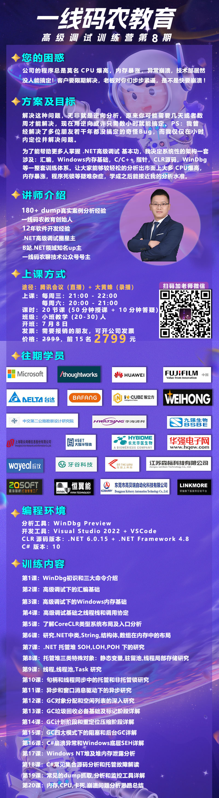

# 如何寻找优质信息源

我在想我想的是什么：

1.最新的趋势：技术到底要学习哪些方面，业务和技术都需要

2.最好是直播唠嗑的方式，可以学习的，非常好

3.付费的都没有关系

4.单纯文字我不太喜欢

**推荐两个网站：**

Google的fact check explorer可以通过搜索引擎的形式搜索事件关键词。

对信息源和网站进行事实核查可以用Media bias/fact check这个网站(https://mediabiasfactcheck.com/)上面对低质量的网站进行了分类。

 https://www.zhihu.com/question/23431485 这里面很多优质的内容

获取信息，就是个拼图的过程，反复核对，才能严丝合缝地还原真相。

------

微软官方博客：https://devblogs.microsoft.com/dotnet/category/csharp/

蒋金楠 https://www.cnblogs.com/artech/p/inside-asp-net-core-6-42.html 为什么看这个内容我会感觉非常厌恶，蒋金楠就是喜欢把简单的东西搞的非常复杂，条理清楚，让人看的昏昏欲睡

一线码农聊技术 https://www.cnblogs.com/huangxincheng/gallery/image/457903.html 

天才卧龙 https://www.cnblogs.com/chenwolong/ 我喜欢这个人的博客

博客园的计分排名榜单 https://www.cnblogs.com/AllBloggers.aspx

