# 如何查看最新的论文？

万方数据知识平台：https://s.wanfangdata.com.cn/

万方数据知识平台食用指南：https://zhuanlan.zhihu.com/p/128915143

异常胎心监护、脐带血pH值，对临床有什么意义？，参考信息挺多的 ，不错，可以看看：http://www.cogonline.com/info/133216964509567485  


搜索的时候注意 不要加特殊字符，最好就是标题，或者作者的名字


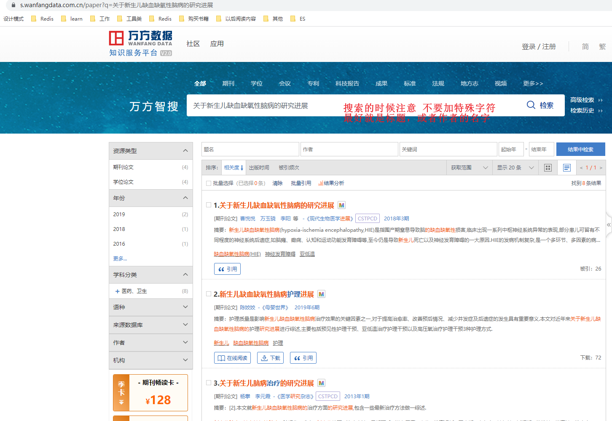

没办法下载的话，要到淘宝搜索万方下载，可以看到很多的店铺，几块钱就可以用半个月，或者一个月的下载账号


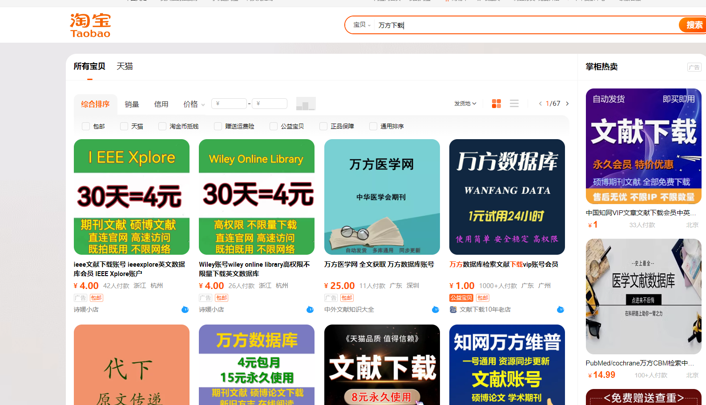


可以筛选一家店铺下单，如果下载的是万方的可以直接淘宝搜索：文献部落，这家是我买过的

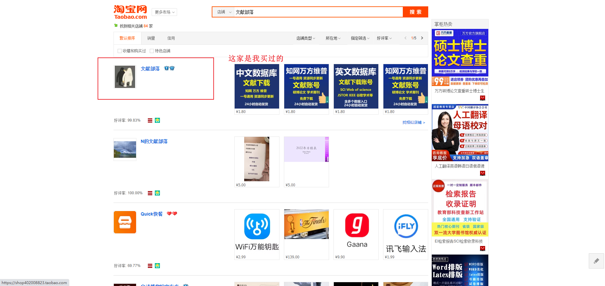

买了账号了，拿到了账号信息，准备下载这个文章,[**关于新生儿缺血缺氧性脑病的研究进展**](https://d.wanfangdata.com.cn/periodical/ChlQZXJpb2RpY2FsQ0hJTmV3UzIwMjMwNDI2Eg1zd2N4MjAxODAzMDQyGgg1cGsyNGhpcg%3D%3D)

```
==

您好！订单1921793703977087880
账号：669621534416密码：424553
登录网站：http://www.90tsg.com
点开资源列表，选择【中文数据库】里入口使用
使用前一定要看：
如遇到入口下载异常等情况，暂时换个入口，
推荐360/谷歌/火狐浏览器打开，不要用ie/weixin直接进去。
使用时间15天
===
附优惠查重系统：
https://xueshuying.paper880.com
https://xueshuying.cnki.paper880.com

==
```

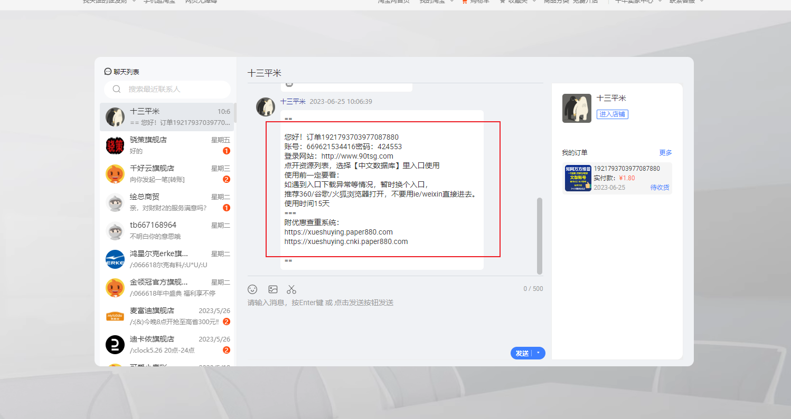

开始搜索下载

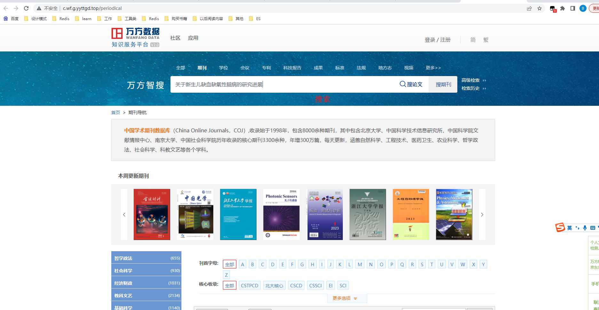

找到了这个文献，点击进去下载

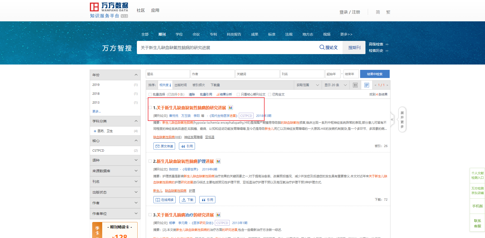

进去发现只有原文传递这个提示

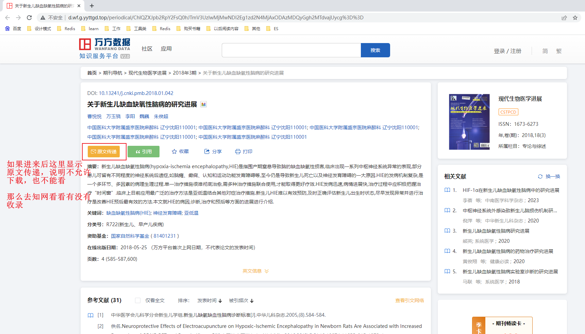

换一个入口，进入知网的入口，这里碰到一个问题

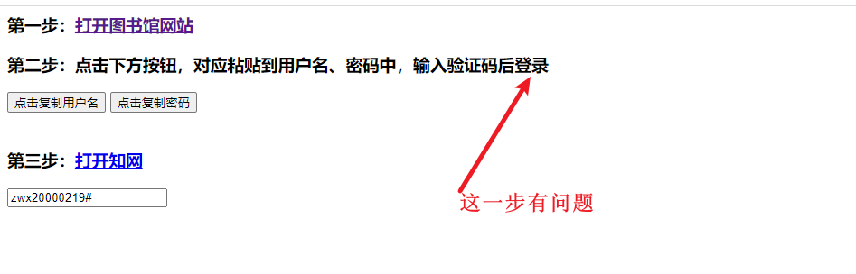

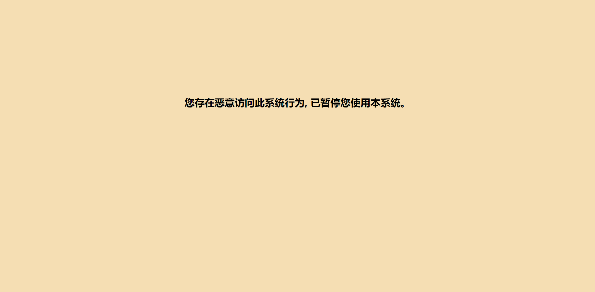


不知道是我VPN的问题，还是入口有问题，换一个入口就可以了，而且感觉知网的还没有这么卡顿，可以直接下载


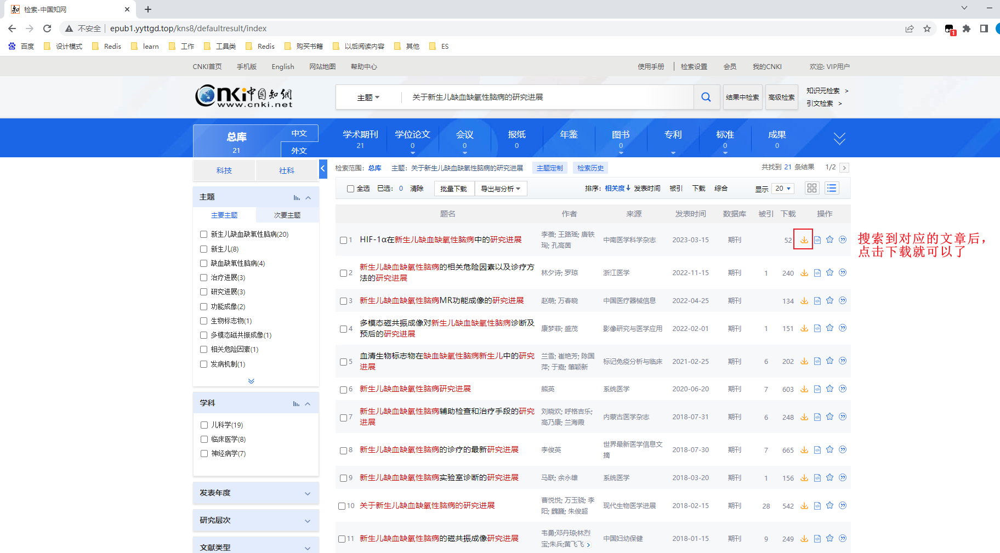

下载好后查看,内容可以

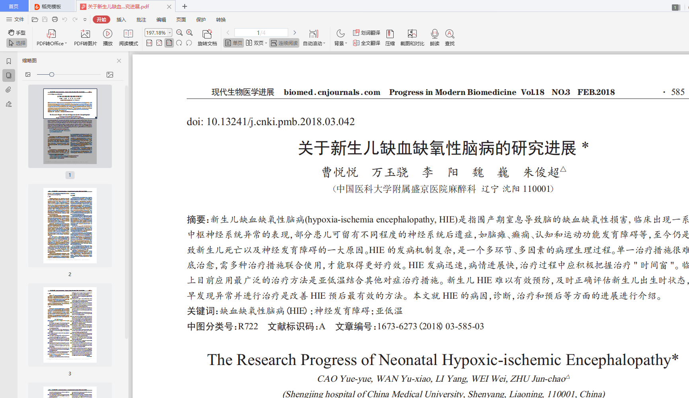

论文里面还会有作者的联系方式，邮箱，真的太赞了，我看了几篇论文，都有作者的联系方式，可能有些没有电话，但是有邮箱

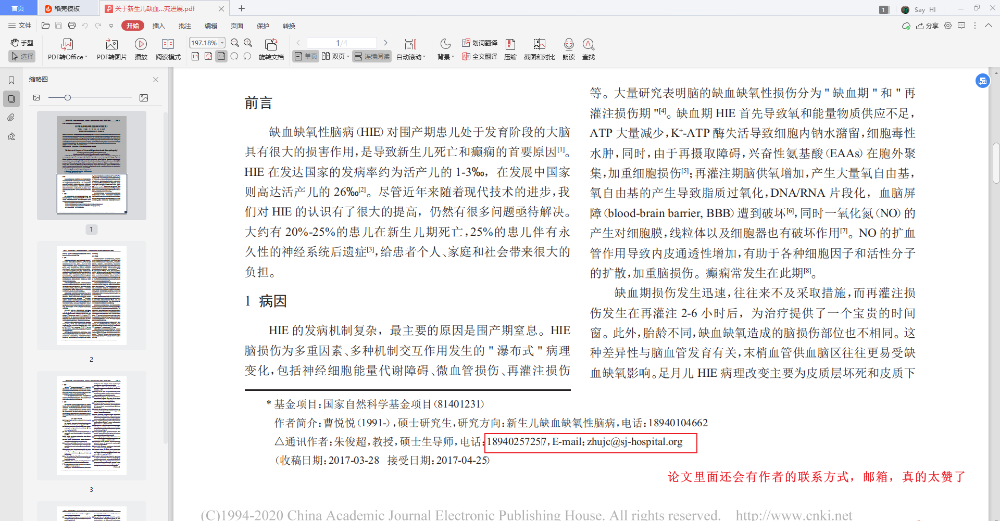

