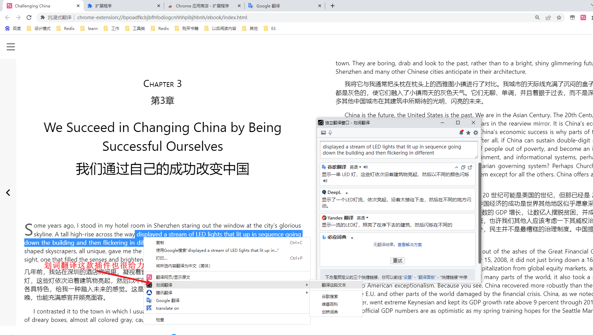

# 如何阅读英文论文与书籍？

学习新的语言确实有时会感到有些吃力，特别是当你尝试要平衡不同的学习方法和资源时。这是很正常的，所以别担心。下面是我建议的一些步骤：

1. **确定你的学习目标**：你的目标是提高你的词汇量和理解力，同时**享受阅读和学习新知识**的过程，走长期主义。保持这个目标在心中，可以帮助你确定哪种学习方法对你最有效。

2. **选择合适的阅读材料**：阅读是提高词汇量和理解力的有效方法，但选择什么样的书很重要。如果一本成人的英文原著对你来说太难了，那么可能会让你感到挫败和厌倦。然而，如果绘本太简单，可能你就不能从中学到新的词汐或者知识。所以，我建议你寻找一些适合你当前英语水平的书籍。这些书籍应该具有一定的挑战性，但不会让你感到过于困难。比如一些初级的英文读物，或者一些针对英语学习者的阅读材料。

3. **【合理安排学习时间】**：你可以试着把你的学习时间分成几个部分。比如，你可以每天花10~30分钟阅读英文原版书籍上海生死劫《[Life and Death in Shanghai](https://kdocs.cn/l/chQrK1kT6wDz)》，把期待放低，不用追求所有的单词，每次能够学习1~10个单词就可以了，然后用1~10分钟来复习你在阅读中记录在有道翻译中遇到的新词汇。之后，你可以再花1~10分钟来使用你的学习APP多邻国，来强化你的词汇和语法知识。最后，你可以花一些时间写一些关于你阅读的书的感想和评论。这样，你的学习就会更有组织，而且不会感到压力太大。

4. **练习和复习**：记住，学习是一个持续的过程。你可能需要反复阅读和复习新的词汇和概念，才能真正掌握它们。所以，不要担心你是否可以立即理解和记住所有的新信息。只要你持之以恒，你就会看到进步。

5. **保持积极心态**：最后，别忘了学习应该是一种乐趣，而不仅仅是一项任务。试着享受阅读和学习的过程，庆祝你的每一次进步，无论多小。有时，你可能会感到挫败，但记住，这都是学习的一部分。每一次的挑挑战都是你向前迈进的机会。保持耐心和积极的心态，记住学习是个持久的过程，不是一夜之间就能完成的。

6. **寻找社区支持**：加入一些语言学习的社区或者小组，如Duolingo社区或者一些论坛。在那里你可以找到志同道合的人，大家可以一起分享学习经验，互相激励，甚至可以互相纠正彼此的语法和发音错误。这样，你不仅可以从中学习，还可以找到学习的乐趣和动力。

   在你的学习过程中，可能会遇到一些困难和挫折，这是很正常的。记住，最重要的是要享受学习的过程，保持耐心和决心。你已经有了一个明确的目标和方法，我相信你一定能成功。再次，祝你在学习英语的道路上一切顺利！

让我忍受不了的是，明明我拥有的是全世界的信息，可是我的语言限制了我获取这些前沿信息的能力，所以我就应该要去吸收那些残缺，延后，二手，低质量的信息是吗？

难道根据自身头脑中的想法，去找寻，检索，我想感兴趣领域里面所有的信息去阅读领域里面最前沿的信息，根据自己的内心与阅读我想阅读的书籍，不是令人兴奋的？

## 1.在线网站转换

[这个网站风声雨声](https://fsys.app/translate)，将英文书籍转换为中文进行阅读，比如将Sam Kaplan - Challenging China_ Smart Strategies for Dealing with China in the Xi Jinping Era (2021, Tuttle Publishing) - libgen.li
https://kdocs.cn/l/cuUQD50jT9GW，这个费用好高，不过可能用GPT 3.5翻译的效果好很多，如果想要质量高，双语的版本结果，可以考虑，但是推荐用第三个方法，免费又方便

## 2.有道翻译

有道翻译每月可以免费翻译5本电子书，我已经翻译了一本，所以还有四次机会，优点在于免费，缺点在于没有提供中英文互译的内容

这是翻译的结果，完整内容在这里： [山姆卡普兰-挑战中国聪明的战略与中国打交道](https://fsys.app/translate)

## 3.Google浏览器插件-沉浸式翻译

这个插件的好处在于功能非常强大，并且免费，缺点在于需要配合其他的插件提供翻译指定句子的功能，比如我鼠标选中指定的单词，句子，并没有联动翻译阅读的功能，这个是不太适用的，**并且在浏览器阅读有一个好处，或者说阅读的时候记住我们可以拖动鼠标，改变字体的大小，辅助我们进行阅读**

Google插件地址：https://chrome.google.com/webstore/detail/immersive-translate/bpoadfkcbjbfhfodiogcnhhhpibjhbnh?hl=zh-CN

1.点击阅读本地电子书，翻译服务那里可以选择Google翻译，微软翻译，有道翻译都是可以的，我这里用OpenAi翻译是需要用OpenAi Key，需要自己准备，因为GPT 3.5的翻译效果是比较不错的

2.选择本地的书籍，拖放，主动选择都可以

3.查看翻译的效果，非常惊艳

4.我们可以选择双语，或者仅仅看译文都是可以的

网页浏览器也可以用这款插件辅助查询不明白的单词进行阅读

划词翻译这款插件也很给力

## 4.Google浏览器插件-沉浸式翻译

可以使用epub文件制作双语书籍，免费，真的太给力了

1.第一步，放入需要制作的epub书籍文件

2.点击翻译，如果翻译完成后，会有烟花的动态页面，翻译一本书，预估5~10分钟，翻译完成后点击导出

3.导出的内容，看起来还是非常不错的，查看地址：  [萨姆·卡普兰 - 挑战中国_习近平时代应对中国的明智策略（2021，塔特尔出版） - libgen.li（已翻译）](https://kdocs.cn/l/ccUZU6zWRqaN)

4.有个技巧是，我们可以配合有道词典的屏幕划词的功能更进一步辅助我们阅读，先打开有道词典，没有有道词典的同学可以去官网进行下载，然后设置以下选项

5.有道词典的好处：1.双击指定单词后可以看意思 2.并且可以保存指定的单词到单词集合中 3.可以长句取词

当然也可以用腾讯翻译君，https://fanyi.qq.com/ 也是可以的

腾讯翻译君也是可以用的，就是没有有道的用户体验好，不过优点是翻译速度快

金山词霸的取词也很好用,取词的效果目前是最好的，但是有缺点的是：1.会自动拿中文进行取词

# 如何下载英文的文献

1.通过scholarscope插件下载，参考链接：https://zhuanlan.zhihu.com/p/81017821，参考链接2：https://zhuanlan.zhihu.com/p/344448277

2.通过zlibrary下载，下载链接https://zlibrary-cn.se/s/

# 如何学习阅读英文书籍

使用绘本学习英语是一个非常好的方法，尤其是对于初学者和儿童。绘本中的图像可以帮助你更好地理解和记住新的单词和短语，而且通常也更有趣，更吸引人。以下是一些使用绘本学习英语的建议：

1. **选择适合你水平的绘本**：一开始，你可能想选择语言相对简单，图像丰富的绘本。随着你的英语水平提高，你可以逐渐阅读更复杂的书籍。
2. **不必强求理解每一个单词**：阅读绘本的目的是理解故事，学习新的词汇和表达方式，而不是理解每一个单词。如果你遇到不认识的单词，你可以尝试从上下文和图像中推测其含义，或者使用翻译工具查找。
3. **反复阅读**：通过反复阅读同一本绘本，你可以更好地记住新的单词和短语，并理解故事的各个细节。你也可以尝试大声朗读，以提高你的发音和语音理解能力。
4. **利用配套资源**：许多绘本都有配套的教学资源，如词汇卡片，活动书，在线游戏等。这些资源可以帮助你更深入地学习和理解书中的内容。
5. **尝试写作**：阅读后，你可以尝试写一些简单的句子或段落来描述故事或表达你的想法和感受。这是提高写作技能的一个好方法。
6. **享受阅读**：最重要的是，享受阅读过程。选择你感兴趣的故事和主题，让学习英语变得有趣和愉快。

希望这些建议能对你有所帮助。祝你在学习英语的旅程上一切顺利！

这是我与ChatGPT就这个观点的沟通结果：https://chat.openai.com/share/b05bf11b-6497-4bbf-a928-4b6a87762de4，我认为可以从自身的爱好切入：1.阅读 2.记笔记 

阅读的时候我可以看完一章的内容后，用英语写一段章节的总结，比如说我认为这本书很有意思，大灰狼太可爱了 ，我可以写：i think this book is very interter, this 后面我就不知道了 ，可能我要去查询大灰狼还有可爱的单词的含义  。 我想我开始可以试着用一句话总结一章节的内容，然后再总结这本书的内容的时候再多一些词汇量，降低开始的难度。

慢慢的由一句话，开始写两句话，然后慢慢的发展到我现在使用中文写比较的内容，可能以后用讯飞语记都是用英语去记录了 哈哈，想想就很上头，然后日常的检索渠道，可以由百度切换到Google，由百度百科切换到维基百科，可以在 [Youtube](https://www.youtube.com/)（小红书，微信视频号）,Twitter（微博，实时吃瓜）, [Quora](https://www.quora.com/)（知乎，高质量答案），Reddit](https://www.reddit.com/)（社区讨论，微信群）， [Facebook](https://www.facebook.com/)（社群，同学会）， [Medium](https://medium.com/)（这两个可以检索高质量的博客内容） [LinkedIn](https://www.linkedin.com/)

重要的是我希望我可以用我的好奇心，去检索，去获取到我想要的信息

## **绘本**

**父与子全集（Father and Son）**

《父与子》是德国漫画家E.O. Plauen（原名Erich Ohser）的一部经典作品。该作品在1934年到1937年间连载于德国的一份报纸上。这部作品以其独特的风格、深入人心的主题和对人性的温馨洞察力，让读者深深陶醉。

《父与子》的故事围绕着一个胖乎乎的父亲和他瘦削的儿子之间的日常生活展开。尽管他们的外形和性格截然不同，但是他们之间的亲情和爱，以及他们对生活中各种情况的应对，使得他们的生活充满了温馨和欢笑。

每个故事都是一个简短的插图故事，没有对话，通过生动的视觉描绘讲述故事。这种特殊的叙述方式不仅使故事容易理解，对于任何年龄的人都有吸引力，而且更重要的是，它允许读者自己解释和思考故事的含义。

故事主题涉及了日常生活中的各种情况，包括友谊、冒险、挫折和成功。他们体验的每一件事，无论是在学校的日常生活，还是在户外的冒险，都为我们展示了他们之间深厚的关系，以及他们如何一起面对生活的挑战。

尽管这部作品在许多方面都很有趣，但最令人印象深刻的是它所传达的一种温馨的亲情和对人性的理解。这部作品描绘的父子关系深入人心，使其成为了世界范围内的经典儿童文学作品

这是一本非常受欢迎的儿童读物，由著名的儿童作家Dr. Seuss创作。以下是一些学习建议：

- *重复阅读*：这本书的语言和句子结构非常简单，适合反复阅读。你可以试着自己阅读，然后听原版音频，模仿原版的语音和语调。（如果有配套的音频就太好了）
- *注意韵律*：Dr. Seuss的书有着独特的韵律和节奏，这对于理解和记忆语言结构非常有帮助。当你读的时候，尝试去感受这种韵律。
- *绘画活动*：你可以尝试自己画出书中的一些场景或角色，同时练习相关的英语单词和短语。

**戴帽子的猫（The Cat in the Hat）**

这个故事的主角是一个聪明且狡黠的猫，它身着一件红白相间的圆筒帽和领带。在主人家的两个孩子（一个男孩和一个女孩）无聊的一个下雨天，这只猫出现在他们的家中，并给他们展示了许多新奇的游戏和杂技，但是这也给他们的家带来了混乱。

猫带来的两个奇怪的伙伴，名叫Thing 1和Thing 2，他们的表现更加疯狂和不可控制，家里的一切都变得一片混乱。当母亲要回家的时候，猫用一个机械清洁工具清理了一切，然后消失了，就在母亲走进门的那一刻。

这个故事以幽默和富有节奏的韵文来讲述，给孩子们带来了无穷的乐趣。它教给孩子们几个重要的道理，例如责任感、尊重他人的物品和空间以及如何处理突发的混乱情况。而猫的角色也引发了孩子们对未知的好奇心和探索精神的启发。

这是一本由德国艺术家e.o.plauen创作的经典漫画书。以下是一些学习建议：

- *描述场景*：这本书的故事主要通过图像来讲述，你可以尝试用英语描述每一幅漫画的场景和事件。
- *创作对话*：虽然这本书中的对话很少，但你可以尝试自己创作角色之间的对话，练习使用口语。
- *分享你的理解*：你可以与他人分享你对每一个故事的理解和感受，这可以帮助你练习表达和交流。

无论你选择哪本书，都记住要享受学习过程，不要害怕犯错误，因为错误是学习的一部分。祝你在学习英语的过程中取得进步！

## 连环画

## 音频

**ChatGPT交流链接**:https://chat.openai.com/share/b05bf11b-6497-4bbf-a928-4b6a87762de4