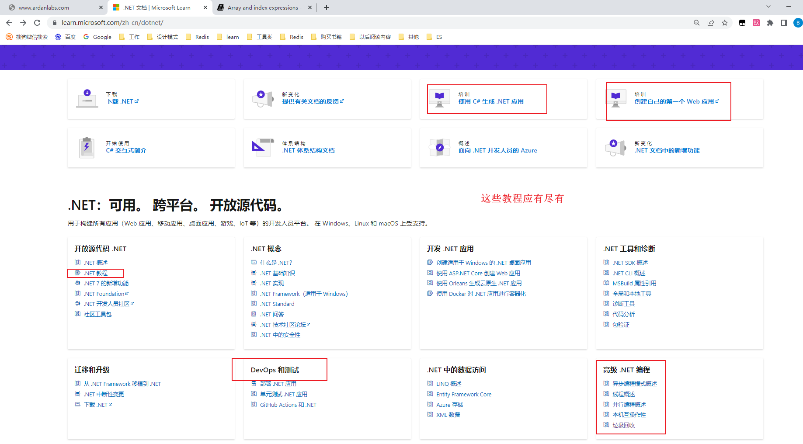

# 如何高效自学

看到有人可以让GPT分析商业论点，直接丢365页的报告进去，那我也可以直接丢一本书进去，然后根据书籍的内容进行学习，这样多人性化

自学总结：

1.**通过ChatGPT+书籍学习如何使用，后续如果有精进的想法，还需要自己在课外进行阅读最新书籍，与人沟通，阅读官方文档**

在zlibrary下载书籍的过程中我发现，很多书籍都是偏老的，比如2018年的书籍，最新的也就是2021年的书籍，两年过去后书籍的效用还在吗，会不会最新的不是这样子了，所以还需要其他的东西相结合一起使用

我是这样想的，我们可以依靠这个书籍的内容，配合ChatGPT进行入门学习，官方的版本，技术即时有迭代，有更新，也不会是大范围的改动，核心的框架，底层的语法不可能有很大的变动，所以还是可以学习的，就好像依靠教程学习到入门，可以有小的作品集出来，后续再看官方的作品集

2.**提前下载书籍的内容后再进行阅读**

我发现我下载了6本书籍，花了我一个小时，其中我需要检索书名，下载下来后检索书籍的目录内容与自身的需求进行匹配（说实话，这个过程我差点睡着了，所以如果要学习的话，建议提前把书籍准备好，多准备两本，以便问题在里面找不到答案），以ChatGPT的内容为引子，为主要东西，遇到不懂的问题去问书籍，去针对性的检索内容

3.**与ChatGPT学习完一个主题后，然后去下载对应主题的书籍，进行查漏补缺**

考虑到自身提示词的局限性与ChatGPT历史信息的局限性，可能会有我考虑不到的问题出现，所以可以用这个补充我的知识点和全面性

4.**学习一个知识点的时候，可以先上网找到这个知识点的思维导图，然后针对于思维导图的知识框架进行针对性的学习，小而全面才是高手的体现**

我现在的学习过程是很随意的，我只把部署好项目上线作为最重要的，看到成果作为最重要的，我很认可在开始学习新的一项技术的时候这种做法，这会让我快速的熟悉，吸收好这个东西，不过如果需要持续精进的话，就需要全面的一个知识架构，所以这个步骤是成为一个高手必须的步骤。

5.**一套流程搞定了后，然后找同学，老师验证一下，实际的应用场景是不是这样的，手上的方案有哪些是可以改进的**

6.**ChatGPT提供的链接，镜像源最好自己去验证一下，任何链接，自己去验证一下是不是正确的，有没有最新的版本，这个很重要，有时候开始的选择就错了，比如我弄Harbor这个项目，折腾了一两个小时，发现是镜像安装包是老版本的，存在问题**

 比如下载安装包，有时候安装包已经老了，不是最新的了，比如这个ChatGPT的给出的版本是v2.0.0 wget https://github.com/goharbor/harbor/releases/download/v2.0.0/harbor-online-installer-v2.0.0.tgz ，实际新的版本到了v2.8.2 wget https://github.com/goharbor/harbor/releases/download/v2.8.2/harbor-online-installer-v2.8.2.tgz 

这个问题目前我有三个解决方法：

1.使用ChatGPT4在线方法尝试获取最新的一些信息，比如告诉ChatGPT如果资源中有提供安装包，镜像源地址，请下载最新的镜像源，提供最新的教程

2.自己根据ChatGPT给出的链接去访问找到最新的版本，比如我访问https://github.com/goharbor/harbor/releases 去看目前最新的版本是多少，然后在界面检索一下，拿到最新的tgz版本信息

3.提供官方文档的在线链接给ChatGPT，减少它胡言乱语的机会或次数：https://goharbor.io/docs/2.8.0/install-config/

4.搜索网络上公开的博客，参考别人的下载链接

但是用最新的安装包又有一个问题，安装包虽然是最新的，但是ChatGPT给出的教程是跟随老的安装包的，这个就是一个麻烦的事情，比如安装Harbor v2.0.0的安装包，里面./prepare是用来更新其他Logs,db,server镜像服务的配置的，但是在Harbor v2.8.2里面，竟然是用来拉取镜像的，所以实际的使用与现实有差异

那我在思考，我写的这些教程，过一两年后，那不是不能用了，重要的不是这个教程，我觉得有几点比较重要

- 我成功搭建了这一套体系，搭建了这个程序给我信心的提升，虽然官方教程会更新，但是十个步骤算更新2~5个，起码整个流程我走通了，我在思维上，认知上知道这玩意是怎么回事，官方有变化，也是在我原来总结的经验上面进行的优化
- 这个过程中我对自己学习能力的总结，比如在使用ChatGPT学习的过程中，我不断去总结我使用ChatGPT的经验，这个是一直可以沉淀下去的，不管未来是学习Harbor，还是其他的知识点，都是可以用到的。

7.比如说部署好了后，弄好了这个东西，然后再主动去看一下博客，官方文档，其他视频教程中是不是也是这样，他们有什么相同点，不同点，不同点为什么不同,这些思考都是可以提高我们已有的解决方案的

# 学习网站

如果哔哩哔哩的内容虽然多，但是并不是专门为软件开发学习者创建的网站，我们可以到专门的网站上进行学习

**随意把玩下面的内容**

**根据需求选择是否使用国外的资源**：是否应该主要使用国外的资源，还是需要根据你的具体需求和目标来确定。如果你主要的目标是理解和掌握某个技术或工具的深度知识，那么国外的资源可能会是更好的选择。如果你的目标是更快地掌握一项技术并开始使用，那么本地的教程可能会更适合你，因为它们往往会更侧重于实践应用，并且更符合本地的使用环境和习惯。

**使用国内的资源入门，使用国外的进阶**：

初期阶段，你可能更需要理解和掌握基础知识，因此本地的教程和教材可能会更适合你，因为它们使用你熟悉的语言，可能还有与你的本地环境和文化更符合的例子和解释。

然后，当你想要深入学习和提高你的技能时，国外的资源可能会提供更广阔的视野，更深入的理解，以及最新的研究和发展。这可能需要你有更高的语言水平，更多的学习时间，以及更大的学习挑战。

**不必觉得如何权威**

有时候把不同的教程，国内也好，国外也好，当作不同的书籍，主题阅读，互为补充

**多渠道的信息源头**

社群，国外的视频分享，大会，技术论坛，线上会议，视频直播，可能都有新的东西出来

GPT扩展 ：https://chat.openai.com/share/0bd6c4b6-4b06-4893-9372-cf6d1f429d8a

比如

我要自学网 https://www.51zxw.net/List.aspx?cid=451 重点免费，课程质量适合入门

慕课网 https://www.imooc.com/ 应有尽有，有免费的内容，也有不免费的，质量高（**适合进阶**）

博客园 https://www.cnblogs.com/ 可以用来淘淘金子

CSDN：https://edu.csdn.net/skill/gml 这个捡到宝了，让我发现，很多专业的开发网站都有专门的学习版块

牛客网 https://www.nowcoder.com/stack/company/134

力扣 https://leetcode.cn/problemset/all/?listId=data-structures&page=2 刷题的，还有自定义面试的内容太猛了

菜鸟教程 https://www.runoob.com/sqlite/sqlite-commands.html 很适合入门，有我需要的工具安装与入门内容

腾讯课堂 https://ke.qq.com/

学堂在线 https://www.xuetangx.com/search?query=&org=1&classify=1&type=&status=&ss=manual_search&page=1 清华大学各大高校的免费学习课程

Coursera https://www.coursera.org/learn/ruhe-xuexi/home/week/ 有全球教育资源,全球最大学习平台，知名大学合作 学会如何学习，有网友推荐

Topniversities https://www.topuniversities.com/signin?nid=%27%27&redirect_path=/university-finder/student/congratulations 找到全世界250多所学校和50000多个课程

蓝桥学习 https://www.lanqiao.cn/courses/?tag=Linux&category=%E5%85%A8%E9%83%A8&fee=all&sort=default&level=all  有很多免费的课程，和慕课网差不多，就是多个选择，里面的老师有学校教授，有工作了的人，主旨是链接高校和企业

九章算法 https://www.jiuzhang.com/course/49  走国内精品路线，可以用来学习二叉树这些数据结构，还有系统设计课，这个确实独树一格

三节课 https://www.sanjieke.cn/course/detail/sjk/8002548 和慕课网，还有学堂在线结合的，走精品路线，对接高校的老师，课程质量过硬

国外的https://teamtreehouse.com/library/dependency-injection-in-aspnet

/*****更多在线的学习*********/

吹爆！十个国外高质量学习网站，学霸都在用
💙 Hello，小狗今天给大家整理了藤校G5学霸都在看的十个国外学习网站，快马起来吧！
.
1.	Tutorialspoint
程序员必备的学习网站。里面有很多免费教程，可以学习各种技术和知识点，内容覆盖很全面。Xiaodemo还可以在线展示结果，很方便。
.
2.	Couresa
全球最大的在线教育平台，互联网上的免费大学。在线学习质量很高。
.
3.	EDX
麻省理工和哈佛大学于2012年4月联手创建的大规模开放在线课堂平台。免费提供大学教育水平的在线课堂。
.
4.	Udacity
在线教育机构，教学语言为英语。Udacity主要提供人工智能、数据科学、自动驾驶、自然语言处理、计算机视觉、AI量化投资、区块链、云计算等方面的教育内容。
.
5.	Udemy
美国教育巨头，教育内容多样，涵盖生活方式、创业、科技、一般技术等等，教程数量已达6000个。用户还可以开设属于自己的在线课程，自由性很高。
.
6.	Codecademy
在线学习编程知识的网站。手把手帮助用户了解JavaScript的一些基本原理，更重要的是，使用Codecademy学习编程充满了趣味性。学的多的同学还会得到一些积分和奖励哦~
.
7.	Lynda
提供制作软件、商业、科技和创意技能等领域的教育视频。注意，不是免费的！每月需要支付25美元。
.
8.	Stanford online
被称为“斯坦福附中”，在该平台学习还可获得官方认证证书，提升背景必备！教育内容包括人工智能、计算机、健康与医药、创新创业等等，覆盖面广。课程由斯坦福教授讲授，含金量高
.
9.	Sparknotes
美国的著名文学网，有很多文学指南学习资料，几乎所有资料都是免费的！建议日常可以多逛逛，总能发现新的学习资源。

1、[Tutorialspoint](https://link.zhihu.com/?target=https%3A//www.tutorialspoint.com/)
这个黑科技网站可谓是全球最大最好的编程网站了，里面所有教程都免费，各个知识点都有视频，可谓是每个程序员都必备的神站。就比如这个教程：https://www.tutorialspoint.com/microservices-net-core-masterclass/index.asp 他的东西肯定是新一点的

3.[EDX](https://link.zhihu.com/?target=https%3A//www.edx.org/)
edX是一个由麻省理工学院和哈佛大学在2012 年联合创办的大规模开放在线课堂平台。它免费提供大学教育水平的在线课堂，而且还是以非营利组织来运营的。学习免费，但是认证需要收费。

这个链接质量非常高：https://zhuanlan.zhihu.com/p/58753480

还有这个链接的内容：https://demo.dandelioncloud.cn/article/details/1631933846218059777 涨姿势！2020最好的 10 大国外编程学习网站

这个链接也不错，都试试：https://cloud.tencent.com/developer/article/1981014

这个国内外优质的技术文章：https://xie.infoq.cn/article/f6cad4e8a99485732a6e869af

优质大佬的技术文章 https://medium.com/?tag=programming

# 快速找到官方文档

**总结:** 

1.**推荐Google搜索**用google搜索的准确率高很多，直接搜索语言的名称就可以搜索到官网，用百度的话要谨慎，最好不用，要用也是Go 官网这样搜索比较靠谱。

2.**语言官网学习资料**，都有成套的学习资料，视频教程，社区提供给我们学习，要学会利用这些材料，并且有些语言的官网会提供在线运行的环境，比如Net,Go语言，并且注意一般都有中文翻译的内容

比如我用google一搜索go语言 就可以看到go语言的官网地址

我点击学习后，发现官网里面有很多高质量的教程，视频，推荐书籍，社区这个不就是最好的学习资料吗

Google翻译有时候会把里面的脚本也一起翻译了，但是沉浸式翻译不会有这种情况

沉浸式翻译很给力

然后我搜索Net找官方文档,我先用百度搜索一下，看看百度搜索出来的是什么东西，流量全部在百度系的内容，百度百科，百度股市，百度贴吧，官网你肯定是找不到的，总结就是没有一个有用的答案

再看看Google开始就是Net的官网，很实在，然后下面还有Net基金会的内容，比较给力，我搜索Go语言的时候也是这种情况，很给力

只有这样搜索go 官网,我们用百度搜索出来的才是正常的答案

但是同样的，用Net官网搜索，真是刷新我的下限

拿Net官网来看看，里面的学习内容从入门到进阶，里面的内容应有尽有

