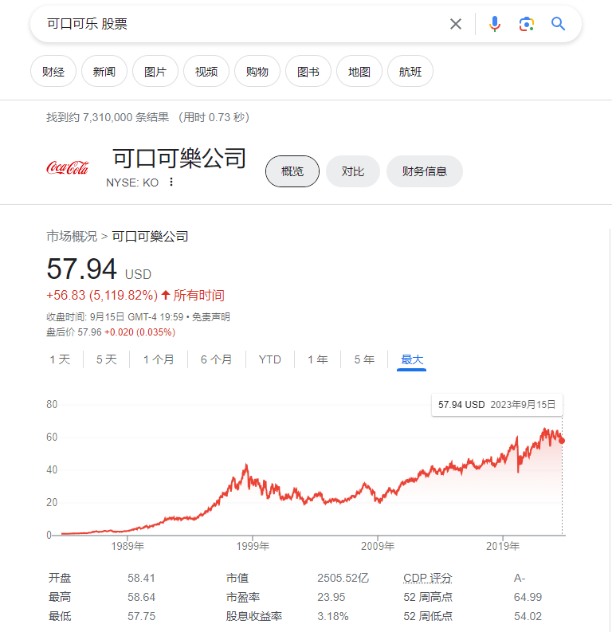

# 怎么研究一家公司？

# 股票分析

[股票分析](https://uz9nza5xjh.feishu.cn/sheets/JL81sOZV0hLBV2tI1pccu5cwnJh)

# 投资有风险

中国人民银行党委书记、银监会主席郭树清：

> 高收益意味着高风险，收益率超过6%的就要打问号，超过8%的就很危险，10%以上就要准备损失全部本金

**郭树清**（1956年8月—），[内蒙古](https://zh.wikipedia.org/wiki/内蒙古自治区)[乌兰察布](https://zh.wikipedia.org/wiki/乌兰察布市)人，[中华人民共和国](https://zh.wikipedia.org/wiki/中华人民共和国)政治人物。1974年8月参加工作，1984年4月加入[中国共产党](https://zh.wikipedia.org/wiki/中国共产党)。[南开大学](https://zh.wikipedia.org/wiki/南开大学)哲学系毕业，[中国社会科学院](https://zh.wikipedia.org/wiki/中国社会科学院)马列所[法学](https://zh.wikipedia.org/wiki/法学)博士，研究员。现任[第十四届全国人民代表大会财政经济委员会](https://zh.wikipedia.org/w/index.php?title=第十四届全国人民代表大会财政经济委员会&action=edit&redlink=1)副主任委员[[1\]](https://zh.wikipedia.org/zh-cn/郭树清#cite_note-1)。曾任[国家外汇管理局](https://zh.wikipedia.org/wiki/国家外汇管理局)局长，[中国建设银行](https://zh.wikipedia.org/wiki/中国建设银行)董事长，[中国证券监督管理委员会](https://zh.wikipedia.org/wiki/中国证券监督管理委员会)主席，[山东省人民政府](https://zh.wikipedia.org/wiki/山东省人民政府)[省长](https://zh.wikipedia.org/wiki/山东行政长官列表)，[中国银行业监督管理委员会](https://zh.wikipedia.org/wiki/中国银行业监督管理委员会)主席，[中国银行保险监督管理委员会](https://zh.wikipedia.org/wiki/中国银行保险监督管理委员会)主席、[中国银行保险改革领导小组](https://zh.wikipedia.org/w/index.php?title=中国银行保险改革领导小组&action=edit&redlink=1)组长[[2\]](https://zh.wikipedia.org/zh-cn/郭树清#cite_note-2)、[中国人民银行](https://zh.wikipedia.org/wiki/中国人民银行)副行长。[中国共产党第十七届中央委员会候补委员](https://zh.wikipedia.org/wiki/中国共产党第十七届中央委员会候补委员列表)，[第十八](https://zh.wikipedia.org/wiki/中国共产党第十八届中央委员会委员列表)、[十九届中央委员会委员](https://zh.wikipedia.org/wiki/中国共产党第十九届中央委员会委员列表)。

`不要投资你不懂业务的企业！`

`不要投资你不懂业务的企业！`

`不要投资你不懂业务的企业！`

> 我不需要打败所有的人，我打败哪些散户就可以了，没有头脑，不用头脑，只被市场牵着走的散户

# 提问

## 看到阿里巴巴的股票2020年10月后暴跌220，那个时间段发生了什么？

`市场监管：`（2021年4月10日发布，2020年12月开始调查） 中国市场监管总局周六（2021年4月10日）指控电子商务巨头阿里巴巴集团违反《反垄断法》，对其罚款182.28亿元人民币 （27.8亿美元），此一金额是中国《反垄断法》历来案件中最高。

原文链接：

阿里巴巴的股票还值得买吗 https://www.zhihu.com/question/436925000

> `政府打压` 在狂罚阿里 182 亿后，虽然国家 “动刀” 的重点变了，阿里的股价却仍在 200 美元左右的低位徘徊，相比于[查理·芒格](https://www.zhihu.com/search?q=查理·芒格&search_source=Entity&hybrid_search_source=Entity&hybrid_search_extra={"sourceType"%3A"answer"%2C"sourceId"%3A1995537209})的预估[买入价](https://www.zhihu.com/search?q=买入价&search_source=Entity&hybrid_search_source=Entity&hybrid_search_extra={"sourceType"%3A"answer"%2C"sourceId"%3A1995537209}) 246 美元，已经跌去 15%。

查理·芒格持股[阿里巴巴](https://www.zhihu.com/search?q=阿里巴巴&search_source=Entity&hybrid_search_source=Entity&hybrid_search_extra={"sourceType"%3A"answer"%2C"sourceId"%3A1995537209})明细，来源：价值大师网

> 价值大师网作者 Steve Booyens 认为大部分投资人可能低估了`中国反垄断措施的影响`。尽管大多数卖方机构仍然上调了阿里的报价目标，他却认为阿里的股价仍将 “挣扎” 一段时间。中国的宏观环境，尤其是管制措施将是未来很长一段时间内，制约阿里股价的主要因素。尽管许多[乐观投资者](https://www.zhihu.com/search?q=乐观投资者&search_source=Entity&hybrid_search_source=Entity&hybrid_search_extra={"sourceType"%3A"answer"%2C"sourceId"%3A1995537209})认为阿里巴巴可能成为下一个[亚马逊](https://www.zhihu.com/search?q=亚马逊&search_source=Entity&hybrid_search_source=Entity&hybrid_search_extra={"sourceType"%3A"answer"%2C"sourceId"%3A1995537209})， 但他并不同意这一观点。 
>
> `股价计算公式`：Steve Booyens 个人对阿里巴巴的估值为：**10.04 每股收益 x 19.91 非[公认会计准则](https://www.zhihu.com/search?q=公认会计准则&search_source=Entity&hybrid_search_source=Entity&hybrid_search_extra={"sourceType"%3A"answer"%2C"sourceId"%3A1995537209})市盈率 = 199.90 美元每股**，该估值基于股票的历史交易模式以及盈利预期。他认为阿里巴巴的股票目前已经被高估了。尽管该股下跌了 20%，[市销率](https://www.zhihu.com/search?q=市销率&search_source=Entity&hybrid_search_source=Entity&hybrid_search_extra={"sourceType"%3A"answer"%2C"sourceId"%3A1995537209})仍然超过基准 4.96 倍，市盈率也超过了 1 的基准线。同时，由于各种监管障碍和低效率的收购，阿里巴巴目前不值得买入。

阿里巴巴的云，支付宝，物流，高德，咸鱼，天猫，淘宝，盒马，优酷这些体系是有价值的，为什么政府监管后股票很低迷?

以下是一些可能导致阿里巴巴股价低迷的原因：

1. **增加的监管压力**：政府可能担心市场垄断、数据隐私、消费者权益等问题，因此加强对这些企业的监管。增加的监管可能导致企业调整商业模式、增加合规成本或限制其进一步的市场扩张。
2. **市场对未来的担忧**：当投资者看到加强的监管措施，他们可能会担心公司的未来增长潜力、盈利能力或商业模式的稳定性，从而导致股价下跌。
3. **公共舆论的变化**：大公司可能受到舆论的批评或质疑，特别是在与政府、监管机构或其他利益相关者发生争议时。这也可能影响投资者的情绪和股价。
4. **内部或业务因素的变化**：除了外部监管，公司内部的决策、策略调整或业务变革也可能影响其股价。

第五点是市场本来就低迷，大家手上的钱都不多，不想担这个风险，如果经济环境好的话，可能会多买点阿里巴巴

## 为什么可口可乐的股票可以卖到几百亿，巴菲特看重的是什么？

自我思考：

> `单位小，紧贴各处`：可口可乐商品小单位，但是像水一样流动，贴近大家的生活，这也保证他的商品的牢固程度
>
> `品牌价值`：可口可乐的品牌价值非常大，几乎全世界的人都知道，这个非常难得，不像我们的白酒，只在国内畅销，所有增长具有局限性，不能全球进行扩张
>
> `毛利率`：不要看他好像是不起眼，但是研究公司财报后，发现可口可乐的毛利率达到了惊人的百分之80%，多么可怕，100亿投入，可以赚80亿
>
> `市场占有率`：可口可乐占有了非常大的市场，品牌下面有15个品牌估值超过10亿美元，包括[可口可乐](https://xueqiu.com/S/KO?from=status_stock_match)，可乐、芬达、雪碧、维他命水、美汁源，**很难找到一个公司能与可口可乐相比较，有十年的记录、销售不变的产品**。可口可乐公司是世界上最大的饮料、速溶咖啡、果汁、果汁饮料提供商，每天售出17亿份
>
> `经营时间`：创立于1886年的可口可乐只卖一种产品，大约130年后的今天，可口可乐仍然卖着同样的饮料

原文链接：

https://xueqiu.com/5208862748/213182792

原文摘录：

> `品牌价值`：股东问：能不能深入解释一下你所谓的消费者的想法以及产品的本质是什么意思，你如何将这些应用到寻找对其产品需求不断增加、投资潜力最好的公司上？
>
> **巴菲特**：**在消费产品方面，你的兴趣应该是找到或者思考：对某一产品，世界上有多少人会在脑子里想着它，他们是怎么想的，10年、20年后，他们对这一产品的想法可能是什么样的。**
>
> 这个世界上几乎每一个人——我们把数量削减到世界上75%的人吧——脑子里多少都会想着可口可乐。
>
> “可口可乐”这个字眼对他们来说意味着一些东西。与此相比，“RC可乐”对地球上几乎任何一个人来说都毫无意义。当然，RC可乐公司的老板以及罐装厂对它肯定有想法，但世界上差不多每一个人对可口可乐都有些想法。
>
> 喜欢可口可乐的人占大多数，可口可乐带给人们的体验是愉悦的。之所以会这样，部分原因是源于可口可乐的设计。另外，可口可乐经常出现在快乐的场合，迪士尼乐园和棒球场等，在每一个充满欢声笑语的场所——可能还包括伯克希尔年度股东大会的会场——都有可口可乐
>
> `毛利率惊人`：巴菲特仔细研究了可口可乐过去80年的年报。他发现这个卖糖水给制瓶公司的可口可乐，**其毛利率高达80%以上**，就好像软件公司一样。这家公司未来的成功取决于它能向全世界卖出多少份可乐，数量越多，赚钱越多。
>
> **他发现在过去80年里面，没有一年其销量不是增加的**！这过去80年的重大灾难性事件包括：一次世界大战，大萧条，二次世界大战，韩战，越战，冷战，无数次的经济衰退，以及70年度在印度被逐出市场等等。在这整个过程中，可口可乐年年都在成长。
>
> 巴菲特和芒格问自己的问题很简单：
>
> 到2000年，2025年，2050年.......可口可乐的销售量会是多少？
>
> 这个结论很可能让人垂涎欲滴。然后，将这所有的未来自由现金流折现到目前的价值
>
> `可复制性`：  听说巴菲特订阅过广告年代杂志。他问自己，如果要在几年内完全复制出可口可乐这个品牌，需要多大的资金投入？最后他和芒格得出的结论是：就算这个地球上最好的营销团队，想要复制可乐的品牌，1000亿美元都办不到！而当时可口可乐的公司市值不超过200亿美元。**一个仅仅品牌就价值远于1000亿公司，用不到200亿就可以买到，这的确是桩好买卖**！
>
> 
>
> `价值`：当巴菲特1988年首次购买[可口可乐](https://xueqiu.com/S/KO?from=status_stock_match)时，人们不禁要问：“可口可乐的价值体现在哪里？”
>
> 当时，PE是15倍，股价是现金流的12倍，分别比市场平均水平高出30%和50%。**巴菲特支付了5倍的市净率，这样只有6.6%的收益率，相对于长期国债9%的收益率，似乎并不具有吸引力**
>
> 
>
> `市场占有率`：  [可口可乐](https://xueqiu.com/S/KO?from=status_stock_match)是世界上最大的饮料公司，在全世界200多个国家销售超过500种充气和不充气饮料
>
>   在这500个品种里，有15个品牌估值超过10亿美元，包括[可口可乐](https://xueqiu.com/S/KO?from=status_stock_match)、健怡可乐、芬达、雪碧、维他命水、动乐、美汁源、简易、乔治亚、[戴尔](https://xueqiu.com/S/04331?from=status_stock_match)山谷
>
> `持续的经营历史`：  没有哪家公司能与[可口可乐](https://xueqiu.com/S/KO?from=status_stock_match)的持续运营历史相提并论，创立于1886年的可口可乐只卖一种产品，大约130年后的今天，可口可乐仍然卖着同样的饮料，辅以少许其他产品
>
> 巴菲特说：“**很难找到一个公司能与可口可乐相比较，有十年的记录、销售不变的产品**。”
>
> 今天，可口可乐公司是世界上最大的饮料、速溶咖啡、果汁、果汁饮料提供商，每天售出17亿份
>
> `旅游选择：`**让我们假设你将外出去一个地方十年，出发之前，你打算安排一笔投资，并且你了解到，一旦做出投资，在你不在的这十年中，不可以更改。你怎么想？**”
>
> 当然，不用多说，这笔生意必须简单、易懂，这笔生意必须被证明具有多年的可持续性，并且必须具有良好的前景。
>
> “如果我能确定，我确定市场会成长，我确定领先者依然会是领先者——我指的是世界范围内，我确定销售会有极大的增长，这样的对象，除了可口可乐之外，我不知道还有其他公司可以做得到。”巴菲特解释道，
>
> “我相对可以肯定，当我回来的时候，他们会干得比今天更好。
>
> 
>
> 
>

奈飞公司的护城河是什么，为什么李笑来要选择奈飞公司的股票？

从长期看股票公司的业务只要活着，那么股票随着经济发展肯定是升值的，找到基石业务，基石公司

# An ATM

2021 年下半年，重要事情之一就是将美股投资组合从 2015 年开始的 GAFATA(`Google,Alibaba,FaceBook,Amazon,腾讯，Apple`)，到 2018 年增加的组合 An ATM，全面转化为 An ATM…… 相当于说，**放弃了 Facebook 和 Google，Alibaba,腾讯**…… An ATM 是 **Apple, Netflix，Amazon, Tesla, Microsoft**。

`不要投资你不懂业务的企业！`

`不要投资你不懂业务的企业！`

`不要投资你不懂业务的企业！`

 

## 可口可乐：非常稳定

## 美团：少了80美金

## 京东：少了60美金

## T: Google：基本持平

## T: Alibaba：暴跌220美金

## 微软：营收顶峰

## T:FaceBook：100美金差距

##  Amazon：差距50美金

## T：腾讯：暴跌60美金

## Apple：基本持平

## Netflix：暴跌300美金

## Tesla：暴跌130美金

## 茅台：暴跌100美金

# 为什么选择Google?

Google公司很牛，全球性质的公司，你知道Google的搜索引擎很牛，不过微信开始的时候，也不知道抖音出来会这么火，降低了微信的活跃率，所以Google会怎么败下来？你必须对它有所了解，全方位了解这家公司有关的信息，比如公司网站，维基百科，图书馆 ，新闻报道， 财经网站和股票经纪提供的公司年度报告 ——有关技术革新和其它方面的发展情况

https://zh.wikipedia.org/zh-cn/Google 维基百科

# 成长性

# 市场份额

比如阿里的云很厉害，阿里的淘宝，天猫很厉害，那么在这个渠道，它分别有多少市场份额？

市场地区与市场范围，比如淘宝在中国有市场，那么国内的政治倾向肯定会影响他的股价，国内的一些行为会影响他，如果他在叙利亚有市场，那么叙利亚打仗后他的股价是不是也有变化，也会有一定的影响。所以也需要关注他的一些行为和地区动向

# 公司生态

> Google的产品线非常多，难道每一个我都要去看，去用吗，获取直观的体感还有去看它的市场份额吗？还是只需要看核心的产品，核心盈利的产品？ 比如Google搜索引擎，Youtube视频网站

Google自创立起开始的快速成长同时也带动了一系列的产品研发、并购事项与合作关系，而不仅仅是公司核心的网络搜索业务。Google公司提供丰富的线上软件服务，如[云硬盘](https://zh.wikipedia.org/wiki/Google_Drive)、[Gmail](https://zh.wikipedia.org/wiki/Gmail)[电子邮件](https://zh.wikipedia.org/wiki/电子邮件)，包括[Orkut](https://zh.wikipedia.org/wiki/Orkut)、[Google Buzz](https://zh.wikipedia.org/wiki/Google_Buzz)以及[Google+](https://zh.wikipedia.org/wiki/Google%2B)在内的[社交网络服务](https://zh.wikipedia.org/wiki/社交网络服务)。Google的产品同时也以[应用软件](https://zh.wikipedia.org/wiki/应用软件)的形式进入用户桌面，例如[Google Chrome](https://zh.wikipedia.org/wiki/Google_Chrome)[网页浏览器](https://zh.wikipedia.org/wiki/网页浏览器)、[Picasa](https://zh.wikipedia.org/wiki/Picasa)图片整理与编辑软件、[Google Hangouts](https://zh.wikipedia.org/wiki/Google_Hangouts)[即时通讯工具](https://zh.wikipedia.org/wiki/即时通讯工具)等。另外，Google还进行了移动设备的[Android](https://zh.wikipedia.org/wiki/Android)[操作系统](https://zh.wikipedia.org/wiki/操作系统)以及[Google Chrome OS](https://zh.wikipedia.org/wiki/Google_Chrome_OS)操作系统的开发。[[21\]](https://zh.wikipedia.org/zh-cn/Google#cite_note-23)其安卓系统至今为止仍是移动端的主要操作系统之一。硬件系列方面，则有[Google Pixel](https://zh.wikipedia.org/wiki/Google_Pixel)[手机](https://zh.wikipedia.org/wiki/手機)及[平板电脑](https://zh.wikipedia.org/wiki/平板電腦)，穿戴设备如[Google Pixel Watch](https://zh.wikipedia.org/wiki/Google_Pixel_Watch)及[Google Pixel Buds](https://zh.wikipedia.org/wiki/Google_Pixel_Buds)等。

# 竞争对手

竞争对手有哪些? 与竞争对手相比，Google有哪些优势？

说到竞争优势，有一点要说明，它跟[护城河](https://www.zhihu.com/search?q=护城河&search_source=Entity&hybrid_search_source=Entity&hybrid_search_extra={"sourceType"%3A"answer"%2C"sourceId"%3A1575939689})不完全一致，护城河是一种防守的概念，而竞争优势则更多的偏向进攻。

**品牌，营销渠道，过硬的质量体系，更低的价格，优良的售后服务，**都是一种竞争优势。

**说完销量，再说说单价。**

提价能力是品牌和产品质量最好的认证。比如奢侈品，比如茅台。

如果提价的同时还能提高销量，那就是资本市场最喜闻乐见的[量价齐升](https://www.zhihu.com/search?q=量价齐升&search_source=Entity&hybrid_search_source=Entity&hybrid_search_extra={"sourceType"%3A"answer"%2C"sourceId"%3A1575939689})。

**最后说说成本。**

不要小看了成本，很多时候它是最大的竞争优势。

**渠道变革，精细化管理，研发关键技术，**都能降低成本。

比如，格力当年与国美的大战，就是因为[国美](https://www.zhihu.com/search?q=国美&search_source=Entity&hybrid_search_source=Entity&hybrid_search_extra={"sourceType"%3A"answer"%2C"sourceId"%3A1575939689})太强势，收取的渠道费太高，格力的定价话语权太低。

[董明珠](https://www.zhihu.com/search?q=董明珠&search_source=Entity&hybrid_search_source=Entity&hybrid_search_extra={"sourceType"%3A"answer"%2C"sourceId"%3A1575939689})一狠心，退出了如日中天的卖场渠道，选择自建渠道和网点。最终，彻底掌控销售成本的格力成为了空调一哥。

而最近，格力又通过打通电商渠道，大大压缩了线下[经销商](https://www.zhihu.com/search?q=经销商&search_source=Entity&hybrid_search_source=Entity&hybrid_search_extra={"sourceType"%3A"answer"%2C"sourceId"%3A1575939689})体系，再次降低了销售成本。

这也是最近格力再次腾飞的原因。

# 行业如何

# 创始人团队如何

而除了企业的生意本身，人的作用可能更重要。一个企业管理层的状态，年龄学历甚家庭和八卦新闻等等都有助于判断这个企业的管理者是不是一个靠谱的合伙人——没错不管买多买少你和这企业的其它股东都是合伙人。

# 实体产业

# 盈利能力如何

# 专家的分析

专家的分析观点可以作为补充

国际性经纪公司的专业分析家会密切关注市场的主要股票，并为客户提供买入、卖出或持有的建议。不过，你也有机会在网站或报纸上得到这些资料。

# 核心技术

上市公司的核心技术，如果一个公司在所处的领域或产业链内具有核心的技术和明显的核心竞争力的话，那么这个企业必然具有长期的投资价值。

# 业务是不是懂

这个业务你是不是懂？这家公司的业务你有没有接触过？产品你有没有使用过？要挑自己懂的生意来投。弄不懂的生意你就看不清好还是不好，那就不是投资而是赌运气了。 一个能看得懂的行业。就要挑选一个能看得懂的企业了。这个企业的经营模式，产品优势，市场地位等等关乎企业未来发展的东西都要尽可能细致的掌握。

> `淘宝业务分析：` 不同渠道看了不少消息，还有江浙搞外贸的同学的看法，至少给用户带来价值这块上，真心不乐观。

# 买入时间

> 如果经过一番判断，证明企业的业务线是稳定的，等到一个价格严重被低估的时候，大笔买进。

比如去年下半年我看上了美团，开始留心美团的事。但是他价格一直稳着不太动，这就是好股票但价格不适合买进的时候，我就等。结果等到10月突然大家都在传王兴的出轨八卦。我知道时机来了：这种八卦一定会导致股价跳水，但其实这种事对团队和业务有什么影响呢？！即便是真的，你会因为王兴出轨不点美团外卖吗？不会的。那就说明股票背后的资产本身没问题，只是价格会非理性跳水，这不就是苦等了的好时候吗？！果然，第二天一开市，股价跳水，一个小时后开始企稳。我一边看着一群人在群里八卦看热闹，一边在73块钱果断买入，**一周内就涨了10%**。不过我不在意这些，该忙我自己事就去忙了，开始了每周扫一眼的日子。**我看好的是整个业务**，八卦只是给了我一个买进的空档。

> 比如苹果公司的发布会是不是发布会后股票都会涨？

那么这个是不是一个契机，不过如果发布会后的新品很爆炸，估计股票会直线拉伸，如果新品发布表现一般的话，估计股票会下降，所以也是很难的，**研究这个是一种乐趣**

# 专业名词

## 道琼斯指数

道琼斯指数（Dow Jones Industrial Average, 简称DJIA或"Dow"）是美国最古老的股票指数之一，由12只初始股票开始，在多次调整后，现在**包含30家大型上市公司的股票。这30家公司代表了美国的各个行业，除了运输和公用事业，因为这两个行业有它们自己的独立指数：道琼斯运输平均指数和道琼斯公用事业平均指数**。

道琼斯指数的成分股会不时调整，以反映美国经济的变化和各大公司的盈利能力。这些公司都是美国的领先企业，如微软、苹果、波音、沃尔玛等。但具体的成分股可能会随着时间而有所改变，所以要知道某一时刻的具体成分，可能需要查阅最新的资料。

## 纳斯达克指数

纳斯达克综合指数（Nasdaq Composite Index）是一个股票市场指数，它包括纳斯达克股票市场上所有上市公司的股票。与道琼斯工业平均指数或标准普尔500指数不同，纳斯达克综合指数涵盖了多个行业，但其中尤其以技术公司为主。

值得注意的是，当人们通常提到“纳斯达克”时，他们可能是指纳斯达克综合指数，但纳斯达克还有其他指数，如纳斯达克100指数（Nasdaq-100 Index），它包括纳斯达克市场上市值最大的100家非金融公司。

**纳斯达克100指数中包括许多知名的技术巨头，如苹果、亚马逊、谷歌的母公司Alphabet、微软和Facebook等。**

与其他主要指数一样，纳斯达克的成分股也会不时进行调整，以反映市场的变化和公司的绩效。

## 标普500指数

标普500指数（S&P 500 Index）是一个美国股票市场指数，由标准普尔（Standard & Poor's）公司编制。它代表了美国大盘股票的市场表现，是投资者衡量美国股市整体表现的重要参照之一。具体来说，**S&P 500包括了美国500家大型上市公司的股票，这些公司在各自的行业中都有着较大的市值和影响力。**

**这个指数覆盖了几乎所有主要的行业，如技术、医疗、金融、消费品、工业等。因此，标普500指数经常被用作美国经济的一个晴雨表，能反映出美国经济的整体健康状况。**

要注意的是，虽然它被称为“500”，但实际上包含的公司数量可能会因为各种原因（比如并购）有所波动，略多于或少于500家。

1. **起源与历史**: 标普500指数最初于1957年被引入。尽管其名字中有“500”，但其实初的构成并不完全是500家公司。但这个指数很快成为投资界的金标准，用于衡量大盘股的整体表现。
2. **构成方法**: 标普500指数是一个市值加权指数，这意味着每家公司在指数中的权重与其市值成正比。具体来说，公司的市值是其股票的总数量乘以每股的价格。因此，市值较大的公司对指数的变动有更大的影响。
3. **公司筛选**: 标普500指数并不仅仅是按市值选择美国最大的500家公司。标普的指数委员会会考虑多种因素，包括：市值、流动性、所在地、行业代表性以及其他财务指标。这些标准确保了被选入的公司在各自的行业中具有代表性。
4. **行业覆盖**: 标普500指数包括了从技术到工业、从健康护理到金融的所有主要行业。这为投资者提供了一个广泛的、跨行业的市场视角。
5. **经济指标**: 由于其广泛的行业覆盖，标普500常被认为是美国经济的一个指标。当该指数上升时，通常意味着投资者对经济有正面的看法；反之亦然。
6. **与其他指数的对比**: 虽然标普500是最受关注的美国股票指数之一，但还有其他重要的指数，例如道琼斯工业平均指数（包括30家大公司）和纳斯达克综合指数（主要关注技术公司）。每个指数都有其独特之处，但标普500由于其广泛性和代表性，通常被视为市场的主要指标。
7. **投资**: 有许多交易所交易基金（ETF）和共同基金跟踪标普500指数。这为投资者提供了一个简单的方法来获得与该指数相匹配的回报。
8. **更新与调整**: 标普500指数并不是静态的。标普指数委员会会定期审查和调整其组成，以确保其持续反映市场的变化和动态。

这只是标普500指数的一个简要概览，但它涵盖了大部分主要的概念和细节。希望对您有所帮助！

## Morning Star 

> Morningstar：一个知名的金融服务公司，其主要提供投资研究、股票和基金评级、以及相关的投资管理工具，对于很多投资者来说，购买这些研究报告和分析工具可以帮助他们更好地理解市场和做出明智的投资决策，尤其是在他们不熟悉或没有足够时间深入研究某一行业时，官网地址：https://www.morningstar.com/

1. **起源和历史**： Morningstar成立于1984年，由Joe Mansueto创办。公司最初专注于为个人投资者提供独立的共同基金研究。随着时间的推移，Morningstar扩展了其业务范围，包括股票研究、债券、其他金融产品和投资管理工具。
2. **核心业务**：
   - **基金评级**：Morningstar为共同基金提供五星级评级，这是基于其过去的风险调整后回报。这个评级系统已经成为了投资者选购基金时的主要参考。
   - **股票研究**：Morningstar也提供股票分析和评级。
   - **工具和软件**：提供各种投资分析工具，帮助金融顾问和投资者做出决策。
   - **资产管理**：Morningstar还提供投资管理和顾问服务。
3. **信誉和影响力**： Morningstar因其独立和深入的研究而在金融领域享有很高的声誉。它的评级和报告被广大投资者和专业人士所信赖。

在您的描述中提到的“**199刀的订阅费**”可能是指Morningstar的某一付费服务或研究报告的价格。对于很多投资者来说，购买这些研究报告和分析工具可以帮助他们更好地理解市场和做出明智的投资决策，尤其是在他们不熟悉或没有足够时间深入研究某一行业时

## 路透终端

路透终端”指的是“Thomson Reuters Eikon”，它是由Thomson Reuters公司提供的一个高级金融数据和分析工具。**Eikon为金融专业人士（如投资者、分析师、交易员等）提供了一个强大的平台，可以访问实时市场数据、新闻、基本面和技术分析工具，以及多种其他功能**。

以下是关于Thomson Reuters Eikon的一些特点：

1. **实时数据和新闻**：用户可以获得全球金融市场的实时数据和新闻更新。
2. **数据深度与广度**：Eikon提供了广泛的数据，涵盖股票、固定收益、外汇、大宗商品等多个市场。
3. **高级分析工具**：包括技术分析、量化分析和基本面分析工具，帮助用户深入研究和做出决策。
4. **直观的用户界面**：Eikon的设计注重用户体验，提供了直观的图形界面和自定义的工作空间。
5. **协作功能**：Eikon还提供了即时消息和协作工具，允许金融专业人士与同事或其他Eikon用户进行即时通信。

路透终端（Eikon）在金融界是非常受欢迎的，与Bloomberg Terminal相提并论，两者都被广大金融专业人士用作主要的研究和交易工具。

## morning star

>  **Morningstar**（晨星） 是一家金融服务公司，专门提供投资研究、股票和基金评级等。他们确实有在线平台和应用程序，可以为投资者提供各种金融产品（如股票、基金、债券等）的详细信息、评级和分析。
>
> Morningstar为其研究、工具和数据提供了订阅服务，同时也为一般用户提供了一定的免费内容。他们的产品和服务对投资者、财务顾问和其他金融专业人士非常有价值，帮助他们做出更明智的投资决策。
>
> 官网：https://www.morningstar.com/

## 萝卜投研

> *萝卜投研*研报中心:提供最新的上市公司研报，券商研报，行业研报，使投资者更早的了解到上市公司基本面变化，方便个股投研和评级。
>
> | [量化深度报告](https://robo.datayes.com/uqer/report)萝卜投研量化频道内深度报告一栏，有专业金工团队为你复现高质量 ... |
> | ------------------------------------------------------------ |
> | [帮助文档](https://robo.datayes.com/uqer/help/)萝卜投研量化频道内帮助文档一栏，提供入门篇、进阶篇、精通篇和 ... |
> | [开始研究](https://robo.datayes.com/uqer/labs)萝卜投研量化频道内量化研究一栏为您提供第一个策略，开始研究。 |
> | [投研](https://robo-mgmt.datayes.com/)萝卜投研是利用人工智能、大数据、移动应用技术，建立的股票基本 .. |
>
> 官网：https://robo.datayes.com/

二级的研报可以看看萝卜投研这个网站，但有些券商的研报没有；

## 股票回购

> 股票回购，也称为股票再购或简称为回购，是指一家公司从公开市场或直接从其股东那里购买其自己的股票的行为。这样做会减少市场上流通的股票数量，从而增加每股的收益（每股盈利，EPS）。
>
> `公司可能出于提高每股收益，利用限制资金分配资产，释放正面信号（表示我有钱）给股民释放积极信号`

假设公司A的年净利润为1,000万元，现有流通股票为1,000万股。

**在回购之前**：

每股收益（EPS） = 年净利润 / 流通股票数量 = 1,000万元 / 1,000万股 = 1元/股

现在，公司A决定用200万元回购200万股股票（假设每股的价格为1元）。

**回购之后**：

流通股票数量 = 1,000万股 - 200万股 = 800万股

`每股收益（EPS） = 年净利润 / 新的流通股票数量 = 1,000万元 / 800万股 = 1.25元/股`

从上面的计算中可以看出，回购股票后，公司A的每股收益从1元增加到了1.25元，尽管其总的净利润并没有变化。这是因为流通在市场上的股票数量减少了，导致每一股需要分摊的利润减少，从而每股收益增加。

## PE：待补充

当巴菲特1988年首次购买[可口可乐](https://xueqiu.com/S/KO?from=status_stock_match)时，人们不禁要问：“可口可乐的价值体现在哪里？”

当时，PE是15倍，股价是现金流的12倍，分别比市场平均水平高出30%和50%。**巴菲特支付了5倍的市净率，这样只有6.6%的收益率，相对于长期国债9%的收益率，似乎并不具有吸引力**

## 市净率

当巴菲特1988年首次购买[可口可乐](https://xueqiu.com/S/KO?from=status_stock_match)时，人们不禁要问：“可口可乐的价值体现在哪里？”

当时，PE是15倍，股价是现金流的12倍，分别比市场平均水平高出30%和50%。**巴菲特支付了5倍的市净率，这样只有6.6%的收益率，相对于长期国债9%的收益率，似乎并不具有吸引力**

## 季度业绩

过去几个季度腾讯的业绩并不出色，但在11月中旬，腾讯公布了2022财年第三**季度业绩**，收入从2021财年第三季度的1424亿元小幅下滑到了2022财年第三季度的1401亿元，同比下降了1.6%。营业利润也同比下降了2.9%，从2021财年第三季度的531.57亿元，下降到了本季度的515.93亿元，摊薄后每股收益从2021财年第三季度的4.074元小幅增至2022财年第三季度的4.104元，同比增长了0.7%。自由现金流同比增长了14.5%。从去年同季的241亿元增长到了本季度的276亿元。

## 每股收益率

过去几个季度腾讯的业绩并不出色，但在11月中旬，腾讯公布了2022财年第三季度业绩，收入从2021财年第三季度的1424亿元小幅下滑到了2022财年第三季度的1401亿元，同比下降了1.6%。营业利润也同比下降了2.9%，从2021财年第三季度的531.57亿元，下降到了本季度的515.93亿元，摊薄后**每股收益**从2021财年第三季度的4.074元小幅增至2022财年第三季度的4.104元，同比增长了0.7%。自由现金流同比增长了14.5%。从去年同季的241亿元增长到了本季度的276亿元。

## 利润

过去几个季度腾讯的业绩并不出色，但在11月中旬，腾讯公布了2022财年第三季度业绩，收入从2021财年第三季度的1424亿元小幅下滑到了2022财年第三季度的1401亿元，同比下降了1.6%。营业**利润**也同比下降了2.9%，从2021财年第三季度的531.57亿元，下降到了本季度的515.93亿元，摊薄后每股收益从2021财年第三季度的4.074元小幅增至2022财年第三季度的4.104元，同比增长了0.7%。自由现金流同比增长了14.5%。从去年同季的241亿元增长到了本季度的276亿元。

## 收益

过去几个季度腾讯的业绩并不出色，但在11月中旬，腾讯公布了2022财年第三季度业绩，收入从2021财年第三季度的1424亿元小幅下滑到了2022财年第三季度的1401亿元，同比下降了1.6%。营业利润也同比下降了2.9%，从2021财年第三季度的531.57亿元，下降到了本季度的515.93亿元，摊薄后每股收益从2021财年第三季度的4.074元小幅增至2022财年第三季度的4.104元，同比增长了0.7%。自由现金流同比增长了14.5%。从去年同季的241亿元增长到了本季度的276亿元。

## 现金流

过去几个季度腾讯的业绩并不出色，但在11月中旬，腾讯公布了2022财年第三季度业绩，收入从2021财年第三季度的1424亿元小幅下滑到了2022财年第三季度的1401亿元，同比下降了1.6%。营业利润也同比下降了2.9%，从2021财年第三季度的531.57亿元，下降到了本季度的515.93亿元，摊薄后每股收益从2021财年第三季度的4.074元小幅增至2022财年第三季度的4.104元，同比增长了0.7%。自由现金流同比增长了14.5%。从去年同季的241亿元增长到了本季度的276亿元。

## 资产负债表

拥有充足的现金储备（可以用于股票回购或投资），对腾讯来说不仅是一条宽阔的经济护城河，而且也会让腾讯在市场不景气时保持巨大的韧性。2022年9月30日，腾讯有1096亿元中期存款以及1602亿元现金及现金等价物，当然，公司还有97亿元的短期借款和1710亿元的长期借款，但与8184亿元的总股本相比，市盈率只有0.22，这当然不是问题。除了流动性较好的资产外，腾讯还拥有3018亿元的"对联营公司的投资"和3772亿元的"以公允价值计量的金融资产"--两者都包括上市和非上市实体和投资

# 经验

## **官网生态**

## 领导人团队

## 财务报告投资信息

## 按照事件节点搜索分析

比如阿里巴巴的股票为什么从2020年10月开始一路降低，可以在Google搜索相关的新闻，查看这个时间段有出现什么事情，然后进一步进行分析

## 机构报告

> 大摩和高盛的评级报告，分析他们的报告，排除基础问题

最近已经回到杭州，开始忙创业的事，对外界信息的关注也少了，但这两天，突然朋友圈里很多人来问我同一个问题：
“舍予，你不是之前在阿里吗？你觉得现在股价已经260了，还能不能买了？”
说实话，这种问题很难回答，因为你也分不清楚来问你的朋友，他到底这次是想投资还是想投机？后者的话，指不定你们友谊的塑料小船遇到一次小调整就说翻就翻了。所以我基本不给别人什么投资建议。
但后来架不住问的人实在太多了，所以单独出一篇稿子探讨一下这个话题，当然，原则上只提供信息和个人思考，不带任何决策建议。
**所以请注意：没有人能对一家公司的股价和市值做出精准的判断，就算是大摩和[高盛](https://www.zhihu.com/search?q=高盛&search_source=Entity&hybrid_search_source=Entity&hybrid_search_extra={"sourceType"%3A"answer"%2C"sourceId"%3A1334875855})的评级也是；我们能做的，仅仅是基于一些方法去分析预测阿里经济体的未来发展前景。**

## 价值投资

> 1.做价值投资首先你要在心里估值这家企业大概多值钱，有一个基本的计算公式，比如《聪明的投资者》中格雷厄姆提出的这个公式：价值 = 当期利润 * （8.5 + 两倍的预期年增长率）

**所谓价值投资，就是基于内在价值来进行投资。**

不关注股票价格的波动，而是关注的是企业的内在价值。

价值投资一般会选择低估值或者基本面良好的股票，并进行长期持有，知道价格高于价值再选择卖出。

简单来说，**价值投资就是用五毛钱来买价值一块钱的东西，然后等市场定价高于一块时卖出。**

只要不断交换高价值的东西，自身的财富就会不断增加。

> 2.我感觉做价值投资挺难的，巴菲特虽然说了很多可口公司的一些指标，比如大家都知道可口可乐，大家都离不开，公司持续开了很多年，但是如果从这个标准去看公司的话，碧桂园为什么会倒闭？

## 经营数据

> 数据来自QuestMobile，下面是中国移动互联网数据库

今年随着新冠的影响，数字化[协同办公](https://www.zhihu.com/search?q=协同办公&search_source=Entity&hybrid_search_source=Entity&hybrid_search_extra={"sourceType"%3A"answer"%2C"sourceId"%3A1334875855})获得了前所未有的加速发展。对互联网行业来说，这一波疫情其实是加速了行业的发展，尤其是“办公场景的延伸”，因为有数亿人在疫情期间选择在家里办公。

数据来自QuestMobile

## 评估价值

> `每个人都知道`：股东问：能不能深入解释一下你所谓的消费者的想法以及产品的本质是什么意思，你如何将这些应用到寻找对其产品需求不断增加、投资潜力最好的公司上？
>
> 巴菲特：在消费产品方面，你的兴趣应该是找到或者思考：对某一产品，世界上有多少人会在脑子里想着它，他们是怎么想的，10年、20年后，他们对这一产品的想法可能是什么样的。
>
> 这个世界上几乎每一个人——我们把数量削减到世界上75%的人吧——脑子里多少都会想着可口可乐。
>
> “可口可乐”这个字眼对他们来说意味着一些东西。与此相比，“RC可乐”对地球上几乎任何一个人来说都毫无意义。当然，RC可乐公司的老板以及罐装厂对它肯定有想法，但世界上差不多每一个人对可口可乐都有些想法
>
> 
>
> 作者：WithEric
> 链接：https://xueqiu.com/5208862748/213182792
> 来源：雪球
> 著作权归作者所有。商业转载请联系作者获得授权，非商业转载请注明出处。
> 风险提示：本文所提到的观点仅代表个人的意见，所涉及标的不作推荐，据此买卖，风险自负。

> `拿走这家公司，会发生什么？`：比如拿走腾讯公司，这个社会会发生什么？这就是侧面的价值点

# 基金类型

## 股票基金

这类基金主要投资于股票市场。基金经理会根据市场研究和分析，选择并购买他们认为有潜力的公开上市公司股票。这类基金的收益主要来自所持股票的股息收入和资本增值，风险和回报潜力通常都较高。

## 债券基金

债券基金主要投资于各种类型的债务证券，例如政府债券、公司债券和地方政府债券等。这些基金的收益来自债券的利息收入和（或）债券价格的波动。相较于股票基金，债券基金通常风险较低，但回报潜力也可能较低。

## 货币市场基金

这类基金投资于短期（通常一年以下）的高信用等级债务证券，如政府短期债券、商业票据和短期定期存款等。货币市场基金追求稳定的收益和本金安全，风险很低，但相应的，收益也较低。

## 混合基金

混合基金同时投资于股票、债券和其他资产类别，兼具多种投资工具的特点。基金经理会根据市场情况和基金的投资策略，调整不同资产的比重，旨在平衡风险和回报。

## 【指数基金】

指数基金是一种被动管理的投资基金，其目标是复制特定股票或债券指数的表现（如标普500指数、沪深300指数等），而不是试图通过主动交易超越市场。这类基金的优点包括费用较低、分散风险和透明度高。

## 交易所交易基金（ETFs）

ETF是一种特殊类型的指数基金，它像股票一样在交易所上市交易。ETF可以复制各种指数，包括股票、债券、商品等的指数。投资者可以像交易股票一样，通过买卖ETF的份额来投资。ETF结合了指数基金的低成本和股票的交易灵活性。

# 资产管理公司

## 华夏

## 嘉实

## 易方达

## 广发

# 指数基金

指数基金是一种特殊类型的共同基金或交易所交易基金（ETF），它的投资策略不是通过主动选择和管理个别股票来试图超越市场，而是通过复制特定股票指数（如标普500指数、纳斯达克指数或上证综合指数等）的表现来“追踪”市场。

这是如何运作的：

1. **选择指数**：指数基金管理公司选择一个市场指数作为基金的基准。这个指数代表了市场的一个特定部分，例如，标普500代表了美国大型股市场。
2. **复制指数**：指数基金尽可能精确地复制其选择的指数，通过购买指数中的所有股票并持有相同比例，以便复制该指数的表现。这种方法被称为被动投资，因为它不涉及对股票的主动选择或市场定时。
3. **表现追踪**：由于指数基金旨在复制其特定指数的表现，因此基金的表现应该非常接近（虽然由于费用和其他因素，通常略低于）其跟踪的指数。
4. **成本效益**：相较于主动管理基金，指数基金通常具有更低的费用比率，因为它们不需要支付分析师和基金经理进行股票研究和选择的成本。这使得投资者能够以更低的成本投资于股票市场。
5. **分散化投资**：通过投资于指数基金，投资者可以轻松地实现投资组合的多样化，因为他们即刻拥有了一个完整市场细分的代表性切片。

指数基金是一种流行的投资选择，因为它们提供了一个低成本、分散风险的方法来投资股票市场，而无需成为股票挑选专家。然而，就像所有投资一样，它们也涉及风险，包括市场波动和潜在的资本损失。在做出任何投资决策之前，了解自己的风险承受能力和投资目标是非常重要的。

## 沪深300ETF

这种ETF跟踪的是沪深300指数，这个指数反映的是中国两大股市——上海证券交易所和深圳证券交易所——中300只规模最大、流动性最好的股票的表现。这些股票通常是在各自行业中的领军企业，所以沪深300指数经常被视为中国大型股市场的一个重要指标。

## 创业板50ETF

这种ETF关联的是创业板50指数，该指数选择深圳证券交易所创业板市场上市值最大、流动性最好的50家公司作为成分股。创业板市场通常包括了许多小型的、成长性的企业，特别是高科技和创新型公司。创业板50 ETF让投资者能够具体投资于这一市场细分的领头羊。

## 恒生ETF

恒生ETF跟踪的是香港的恒生指数，这个指数是由香港证券交易所上市的一些最大公司的股票组成。恒生指数被认为是香港股市整体表现的一个重要指标，涵盖了多个行业，反映了香港市场的广泛表现

## 中证红利指数

这个指数聚焦于中国市场中高股息收益率的股票。它是由在沪深两市交易的、具有较高现金红利分配比率和红利收益率、且红利支付稳定的上市公司股票组成。这个指数通常吸引那些寻求股息收入和长期价值增长的投资者

## 夏普比率

这是一个衡量风险调整后回报的指标。它是由投资的超额回报（超过无风险利率的回报）与投资的总风险（标准差）之比计算得出。夏普比率越高，意味着投资在每承受一单位总风险时产生的超额回报越高

## 卡玛比率

类似于夏普比率，卡玛比率是另一个风险调整后回报的度量，但它使用的是下行风险（如最大回撤）而非总风险。卡玛比率是通过将超额回报率除以最大回撤（通常是过去三年的最大回撤）来计算的。比率越高，表明投资在承受潜在损失方面表现越好。

## 沪深300指数

如前所述，这个指数反映了中国沪深两大股市中300只最大和最活跃的股票的表现。它常被视为中国大型股市场的一个主要基准。

## 被动指数型基金指数

这不是一个特定的指数，而是指那些旨在复制某个基准指数表现的基金的一类，如前面提到的沪深300 ETF就是其中的一种。这些基金通过持有与目标指数相同的股票篮子来尽量匹配该指数的表现

## 偏股混合型基金指数

这种基金通常是指那些主要投资于股票的混合基金，但也可能持有债券、现金或其他资产以分散风险。不同基金会有不同的资产配置策略，可能更加积极或保守。这类基金旨在提供股票投资的增长潜力，同时可能通过其他资产来减轻下行风险

# 补充观点

## 为什么说从长远看，持有股票的收益比增额终身寿高

因为经济永远在上涨，20年以后股票肯定会上涨，相对于而言现在的20块，以后即使它会跌，那么只要他公司的业务在他就会涨，注意我们关注的是公司的业务要在，如果公司都倒掉了，公司都从股票市场退市了，我们手上的股票肯定是废纸了（一定程度上是这样），所以我们观察，考察的业务一定要是长远看，都会一直在的，比如可口可乐公司的业务从1886年到现在已经一百多年都没有变化过。

> 衣食住行这四个业务已经存在了几千年了，以后也会一直存在，军事行业也是几千年也存在，还有科技行业的数据库，云，肯定也是会一直存在的。

   与可口可乐公司相似的场景

1. **食品和饮料**: 除了可口可乐，像百事可乐、雀巢、联合利华等大型食品和饮料公司都存在了很长时间，它们的主要产品线几乎未发生重大变化。这些公司之所以能够维持其市场地位，很大程度上是因为它们的品牌知名度、分销网络以及对消费者口味的深刻了解。
2. **奢侈品**: 如路易威登、香奈儿、爱马仕等品牌已存在了几个世纪，而且仍然是市场的领导者。尽管时尚和趋势不断变化，但这些品牌已经成为了代表高品质和地位的标志。
3. **化妆品**: 像欧莱雅、雅诗兰黛等品牌已经存在了很长时间，即使化妆品和护肤品的市场在不断发展和变化。
4. **银行和金融机构**: 许多世界上的大银行，如花旗银行、摩根大通、汇丰银行等，都有着数百年的历史。尽管金融危机和技术变革对这些机构产生了影响，但许多传统银行仍然稳固地站在市场上。
5. **能源**: 巨头如壳牌、埃克森美孚和BP等在石油和天然气领域维持了长时间的领导地位。尽管可再生能源和技术创新正在改变能源市场的面貌，但这些公司由于其规模、资本和专业知识，仍然占据了重要的市场地位。

相对于这些较为稳定的行业，科技、媒体、时尚、电子游戏等行业则更容易受到创新和技术变革的影响，因此市场领导者的位置也更加不稳定。这也是为什么在这些行业中，我们经常看到新的领导者和品牌崛起，而旧的领导者和品牌则逐渐淡出。

## 怎么全面分析一支股票？

**参考链接**

https://www.zhihu.com/people/yinghedavid  怎么全面的分析一支股票？ （非常棒的一篇文章）

> 看公司的第一步，是看懂护城河。
>
> 这是巴菲特在1993年股东会上首次提出的理念，也是他最看重的指标。
>
> 在解释护城河之前，我先岔开一下，可能很多人不知道，《孙子兵法》是一本在[华尔街](https://www.zhihu.com/search?q=华尔街&search_source=Entity&hybrid_search_source=Entity&hybrid_search_extra={"sourceType"%3A"answer"%2C"sourceId"%3A1575939689})风靡的经典。
>
> 因为它里面的核心思想，跟华尔街的投资理念高度相融。
>
> 其中最主要的一条是：
>
> **昔之善战者，先为不可胜，以待敌之可胜。**
>
> `善于带兵打仗的人，先立于不败之地，而后等待战胜敌人的机会(司马懿就是这样，保险也是这样)。`
>
> **先做好防守，做好分内之事，让自己立于不败，再伺机进攻。**
>
> 这，恰恰也是[巴菲特的护城河](https://www.zhihu.com/search?q=巴菲特的护城河&search_source=Entity&hybrid_search_source=Entity&hybrid_search_extra={"sourceType"%3A"answer"%2C"sourceId"%3A1575939689})理念。
>
> 公司时刻面临残酷的竞争，任何有利润的地方都会受到蚕食。只有宽广的护城河，才能确保公司立足，才能让它长久获取高额利润。

https://www.zhihu.com/question/599985182   如何快速分析一家公司的股票是否值得购买？

> 可以试用一下《祖鲁法则》：先找到符合硬指标的股票，然后再关注那些无形的质量因素。只有当市盈率、每股收益和ROE、营收和净利润增长率、负债率和现金流等财务硬指标达到了我设定的标准之后，我才会开始挖掘造就这些令人鼓舞的数字背后的竞争优势和商业模式，而不是反其道而行之。

这倒是一个好方法，先通过股票进行筛选掉那些近几年数据不好看的公司，达到了一定标准的公司，才值得花时间精力去做，比如看历史收益和去年收益以及近期年报收益，收益和增长率是最能体现一个上市公司是否赚钱的最直接的要素，如果收益和增长率较高，那么自然这个上市公司具有投资价值。看历史分红，一般说来好的公司都会经常性的进行分红和配股，如果一个公司自上市以来就很少分红或者从不分红的话，那么自然就不具备长期投资的价值了。

> **3. 带娃的宝妈！**说真的，不开玩笑。回想一下，这套方法就是在我自己空档期全职当奶爸那一年里磨出来的（嗯，我是男人我亲自全职收拾屎尿屁，我光荣），投资也是我当时唯一能做的事情。所以我是充分理解当宝妈、又想养家的辛苦的，更何况女性还会隐隐有另外一层压力“我花这么多精力带孩子，会不会追不上老公的脚步或者逐渐腰杆不硬了”（我说得比较含蓄，宝妈都懂的）
>
> 启蒙人，非常不错

https://zhuanlan.zhihu.com/p/141992196 「你的时间价值百万，股民最怕的就是太努力 」什么都不管，每年收益照样超过25%

> 怎么分析一家上市公司
>
> https://zhuanlan.zhihu.com/p/129092635

