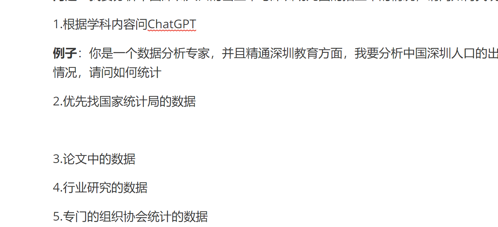

# 如何做数据分析？

ChatGPT思考：https://github.com/stefan-jansen/machine-learning-for-trading

# 怎么找数据分析的数据？

首先确认你要解决什么问题？

**问题：**我要分析中国深圳人口的出生率与深圳幼儿园的招生率的情况，请问如何找统计数据

1.根据学科内容问ChatGPT

**例子**：你是一个数据分析专家，并且精通深圳教育方面，我要分析中国深圳人口的出生率与深圳幼儿园的招生率的情况，请问如何统计

2.优先找国家统计局的数据

3.论文中的数据

4.行业研究的数据

5.专门的组织协会统计的数据

测试图片1

